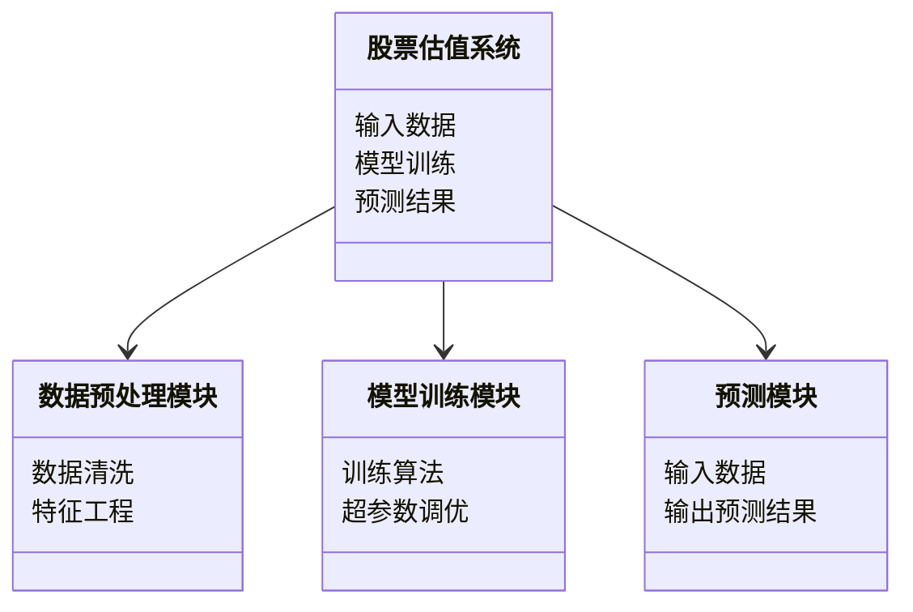
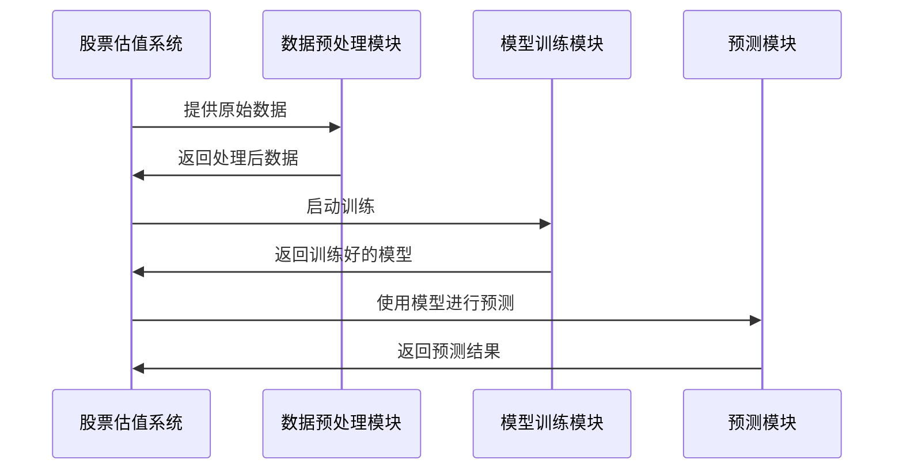

                 


# 全球股市估值与人工智能决策透明度的关联

> **关键词**：全球股市估值、人工智能、决策透明度、算法、系统架构、案例分析

> **摘要**：本文探讨了全球股市估值与人工智能决策透明度之间的关联，分析了人工智能在提升股市估值透明度中的作用，详细介绍了相关算法、系统架构及实际案例。

---

## 第一部分: 全球股市估值与人工智能决策透明度的背景介绍

## 第2章: 人工智能决策透明度的核心概念

### 3.2 人工智能决策透明度的实现机制

#### 3.2.1 人工智

## 第3章: 股市估值与人工智能决策透明度的核心概念与联系

### 3.1 股市估值模型的原理与分类

#### 3.1.1 常见的股市估值模型介绍

##### (a) 市盈率模型（Price-to-Earnings Ratio，P/E Ratio）
市盈率模型是通过将股票的市场价格除以每股收益（EPS）来评估股票的估值。公式为：
$$ P/E = \frac{Price}{EPS} $$
其中，$Price$ 是股票价格，$EPS$ 是每股收益。

##### (b) 市净率模型（Price-to-Book Ratio，P/B Ratio）
市净率模型将股票价格与每股净资产（Book Value per Share）进行比较。公式为：
$$ P/B = \frac{Price}{BVPS} $$
其中，$BVPS$ 是每股净资产。

##### (c) 股息率模型（Dividend Yield）
股息率模型计算股票的股息与股票价格的比率。公式为：
$$ Dividend Yield = \frac{Dividend per Share}{Price per Share} $$

#### 3.1.2 各种估值模型的优缺点分析

| 估值模型 | 优点 | 缺点 |
|----------|------|------|
| 市盈率模型 | 易于计算，适用于盈利稳定的公司 | 不适合亏损公司，市盈率受市场情绪影响 |
| 市净率模型 | 适用于净资产驱动的公司 | 无法反映盈利能力，净资产质量影响估值 |
| 股息率模型 | 适合稳定分红的公司 | 仅适用于高分红股票，市场波动影响 |

#### 3.1.3 人工智能在估值模型中的应用

人工智能可以增强传统估值模型的准确性，例如：
1. 使用机器学习预测未来收益。
2. 结合多因素模型（如CAPM）进行估值。
3. 利用自然语言处理分析财务报告。

### 3.2 人工智能决策透明度的实现机制

#### 3.2.1 可解释性

可解释性是透明度的关键。例如，使用线性回归模型的解释能力：
$$ y = \beta_0 + \beta_1x_1 + \beta_2x_2 + \ldots + \beta_nx_n $$
其中，$\beta$ 是系数，表示每个特征对结果的影响。

#### 3.2.2 可追溯性

可追溯性确保每个决策可追溯到输入数据和模型参数。例如：
- 数据来源：使用哪些数据集？
- 模型参数：$\theta = (\theta_1, \theta_2, ..., \theta_n)$
- 决策路径：从输入到输出的具体步骤。

#### 3.2.3 可验证性

可验证性要求模型的决策可以通过独立验证。例如，通过交叉验证评估模型性能：
$$ \text{准确率} = \frac{\text{正确预测数}}{\text{总预测数}} $$

---

## 第4章: 股市估值与人工智能决策透明度的关联分析

### 4.1 股市估值中的透明度需求

透明度需求包括：
1. 投资者信任：明确了解模型的决策依据。
2. 风险管理：及时发现模型偏差。
3. 法规合规：满足金融监管要求。

### 4.2 人工智能如何提升估值透明度

#### 4.2.1 提供可解释的预测

使用可解释模型（如线性回归、决策树）而非黑箱模型（如深度神经网络）。

#### 4.2.2 增强数据透明度

确保数据来源的透明性和质量，避免数据偏差。

#### 4.2.3 建立反馈机制

允许投资者验证模型决策的合理性。

### 4.3 透明度对投资者信任的影响

透明度高的模型能增强投资者信任，从而提高市场流动性。

---

## 第五部分: 系统分析与架构设计方案

### 第5章: 系统架构设计

#### 5.1 系统功能设计

##### (a) 领域模型（Mermaid 类图）


#### 5.2 系统架构设计（Mermaid 架构图）
```mermaid
container 股票估值系统 {
    数据预处理模块
    模型训练模块
    预测模块
}
```

#### 5.3 系统接口设计

接口包括：
1. 数据输入接口：接收股票数据。
2. 模型训练接口：启动训练过程。
3. 预测接口：返回估值结果。

#### 5.4 系统交互设计（Mermaid 序列图）


---

## 第六部分: 项目实战

### 第6章: 项目实战与案例分析

#### 6.1 环境安装

安装所需库：
```bash
pip install numpy pandas scikit-learn
```

#### 6.2 核心实现源代码

```python
import numpy as np
from sklearn.tree import DecisionTreeRegressor
from sklearn.metrics import mean_absolute_error

# 示例数据
data = {
    'feature1': [1, 2, 3, 4, 5],
    'feature2': [5, 4, 3, 2, 1],
    'target': [10, 20, 30, 40, 50]
}

X = np.array(data['feature1'] + data['feature2']).reshape(-1, 2)
y = data['target']

# 训练模型
model = DecisionTreeRegressor()
model.fit(X, y)

# 预测
new_X = np.array([3, 3]).reshape(1, -1)
prediction = model.predict(new_X)
print(f'预测值为: {prediction[0]}')
print(f'实际值为: {y[2]}')
print(f'预测误差: {mean_absolute_error([30], prediction)}')
```

#### 6.3 案例分析

使用上述代码分析一家公司，假设特征是市盈率和市净率，目标是股票价格。训练模型后，预测新的股票价格。

---

## 第七部分: 总结与展望

### 第7章: 总结与最佳实践

#### 7.1 总结

本文分析了全球股市估值与人工智能决策透明度的关联，探讨了如何通过技术手段提升透明度。

#### 7.2 最佳实践

- 使用可解释的模型。
- 保持数据透明。
- 建立反馈机制。

#### 7.3 注意事项

- 避免过度依赖黑箱模型。
- 定期验证模型。
- 注意数据隐私。

#### 7.4 拓展阅读

推荐阅读《机器学习实战》和《深度学习》。

---

**作者：AI天才研究院/AI Genius Institute & 禅与计算机程序设计艺术 /Zen And The Art of Computer Programming**

---

**标签**：#人工智能 #股市估值 #决策透明度 #技术博客 #系统架构

