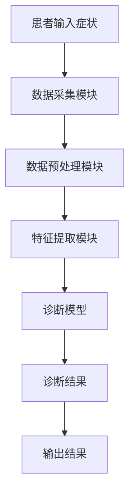
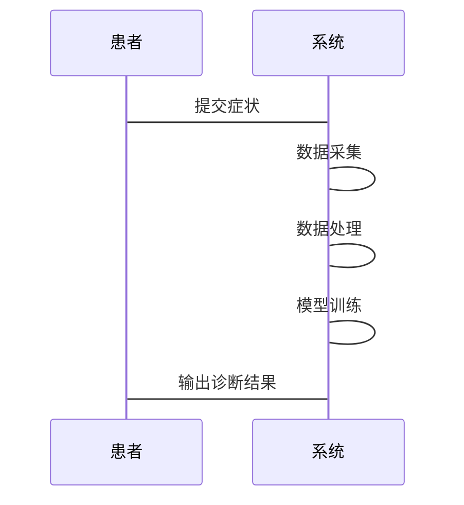

                 


# 全球股市估值与人工智能在医疗诊断中的应用

## 关键词：全球股市估值，人工智能，医疗诊断，机器学习，深度学习，股票预测，医疗影像分析

## 摘要：  
本文探讨了人工智能在全球股市估值和医疗诊断中的应用，分析了机器学习算法在股票预测中的优势，以及深度学习在医疗影像分析中的突破。文章从基础概念到实际应用，详细阐述了人工智能如何改变金融和医疗行业的未来。

---

# 第一部分: 全球股市估值与人工智能应用基础

## 第1章: 全球股市估值基础

### 1.1 股市估值的基本概念

#### 1.1.1 股市估值的定义与作用  
股市估值是指通过对公司财务数据、市场环境和行业趋势的分析，估算公司股票的合理价格区间。其作用在于帮助投资者做出理性的投资决策，避免盲目跟风。

#### 1.1.2 股市估值的核心指标  
- **市盈率（P/E）**：市盈率 = 股票价格 / 每股净利润。  
- **市净率（P/B）**：市净率 = 股票价格 / 每股净资产。  
- **股息率**：股息率 = 每股股息 / 股票价格。  

#### 1.1.3 股市估值的常见方法  
1. **相对估值法**：基于可比公司的估值指标（如P/E、P/B）进行比较。  
2. **绝对估值法**：通过现金流折现模型（DCF）计算公司内在价值。  

### 1.2 全球股市的结构与特点

#### 1.2.1 全球主要股市的分布  
全球主要股市包括纽约证券交易所（NYSE）、纳斯达克（NASDAQ）、伦敦证券交易所（LSE）、东京证券交易所（TSE）等。  

#### 1.2.2 不同市场的估值差异  
不同市场的估值差异主要受经济体制、市场流动性、政策环境等因素影响。例如，新兴市场的估值通常较高，而成熟市场的估值更为稳定。  

#### 1.2.3 股市波动的驱动因素  
1. **宏观经济因素**：GDP增长率、利率、通货膨胀率等。  
2. **行业因素**：行业周期性、政策支持等。  
3. **公司基本面**：盈利能力、财务状况等。  

### 1.3 股市估值的技术分析与基本面分析

#### 1.3.1 技术分析的基本原理  
技术分析通过分析历史价格和成交量数据，预测未来的价格走势。常用的技术指标包括：  
- **移动平均线（MA）**：用于判断价格趋势。  
- **相对强弱指数（RSI）**：用于判断超买超卖状态。  

#### 1.3.2 基本面分析的关键指标  
基本面分析关注公司的财务数据，包括：  
- **净利润**：衡量公司盈利能力的核心指标。  
- **营业收入**：反映公司销售收入的情况。  
- **资产负债率**：衡量公司财务风险。  

#### 1.3.3 技术分析与基本面分析的结合  
技术分析适用于短期价格预测，而基本面分析适用于长期投资决策。两者的结合可以帮助投资者做出更全面的投资决策。

## 第2章: 人工智能在股市估值中的应用基础

### 2.1 人工智能的基本概念

#### 2.1.1 人工智能的定义与特点  
人工智能（AI）是模拟人类智能的计算机系统，具有学习、推理和自适应能力。

#### 2.1.2 机器学习的核心原理  
机器学习通过训练数据模型，使其能够从数据中自动学习规律。常用算法包括：  
- **线性回归**：用于预测连续变量。  
- **支持向量机（SVM）**：用于分类问题。  
- **随机森林**：用于分类和回归问题。  

#### 2.1.3 深度学习的基本框架  
深度学习通过多层神经网络模拟人类大脑的处理方式，适用于复杂数据的特征提取。

### 2.2 人工智能在金融领域的应用现状

#### 2.2.1 人工智能在金融领域的应用范围  
- **股票预测**：利用历史数据预测股票价格。  
- **风险控制**：通过分析交易数据识别潜在风险。  

#### 2.2.2 人工智能在股市分析中的优势  
- **高效性**：能够快速处理海量数据。  
- **准确性**：通过大数据分析提高预测精度。  

#### 2.2.3 人工智能在金融领域的挑战  
- **数据质量**：依赖高质量的历史数据。  
- **模型过拟合**：可能导致预测结果偏差。  

### 2.3 人工智能在股市估值中的核心算法

#### 2.3.1 回归分析与时间序列预测  
回归分析用于预测股票价格，时间序列预测用于分析价格波动趋势。

#### 2.3.2 支持向量机在股票分类中的应用  
支持向量机（SVM）通过构建超平面将数据点分类，常用于股票涨跌预测。

#### 2.3.3 神经网络在股市预测中的应用  
神经网络通过多层网络结构学习复杂数据特征，适用于股票价格预测。

---

# 第二部分: 人工智能在医疗诊断中的应用

## 第3章: 医疗诊断的基本原理

### 3.1 医疗诊断的核心流程

#### 3.1.1 病症识别的基本步骤  
1. **症状采集**：收集患者的症状信息。  
2. **影像分析**：通过X光、MRI等影像数据辅助诊断。  
3. **实验室检测**：通过血液、尿液等检测结果辅助诊断。  

#### 3.1.2 医疗数据的采集与处理  
医疗数据包括患者的病历、检查报告、影像数据等，需要进行标准化处理。

#### 3.1.3 诊断标准与指南  
医疗诊断需要遵循行业标准和指南，确保诊断结果的准确性。

### 3.2 医疗诊断的常见方法

#### 3.2.1 影像分析  
影像分析是医疗诊断的重要手段，常用技术包括：  
- **X射线**：用于检查骨折、肺部疾病。  
- **MRI**：用于检查软组织病变。  

#### 3.2.2 病理分析  
病理分析通过显微镜观察组织样本，用于疾病的确诊。

#### 3.2.3 实验室检测  
实验室检测包括血液检测、尿液检测等，用于诊断各种疾病。

---

## 第4章: 人工智能在医疗诊断中的应用

### 4.1 人工智能在医疗影像分析中的应用

#### 4.1.1 医疗影像分析的基本原理  
医疗影像分析通过图像识别技术自动识别病变区域，辅助医生诊断。

#### 4.1.2 常见的医疗影像分析技术  
- **卷积神经网络（CNN）**：用于图像分类和目标检测。  
- **区域卷积神经网络（RCNN）**：用于图像分割和目标检测。  

#### 4.1.3 医疗影像分析的案例  
例如，使用深度学习模型检测肺部结节，辅助诊断肺癌。

### 4.2 人工智能在医疗症状分析中的应用

#### 4.2.1 症状分析的基本原理  
通过自然语言处理技术分析患者的症状描述，辅助诊断。

#### 4.2.2 常见的症状分析技术  
- **循环神经网络（RNN）**：用于处理序列数据，如症状描述。  
- **变换器（Transformer）**：用于处理长文本数据。  

#### 4.2.3 医疗症状分析的案例  
例如，使用自然语言处理技术分析患者的症状，辅助诊断感冒和流感。

---

## 第5章: 人工智能在医疗诊断中的系统架构与实现

### 5.1 医疗诊断系统的功能设计

#### 5.1.1 系统功能模块  
- **数据采集**：收集患者的医疗数据。  
- **数据处理**：对数据进行预处理和特征提取。  
- **模型训练**：训练医疗诊断模型。  
- **诊断结果输出**：输出诊断结果并提供解释。  

#### 5.1.2 系统功能流程图  


### 5.2 医疗诊断系统的架构设计

#### 5.2.1 系统架构图  


#### 5.2.2 系统接口设计  
- **输入接口**：接收患者的医疗数据。  
- **输出接口**：输出诊断结果。  

#### 5.2.3 系统交互流程图  


---

## 第6章: 人工智能在医疗诊断中的项目实战

### 6.1 项目环境安装

#### 6.1.1 安装Python环境  
```bash
python --version
pip install numpy
pip install pandas
pip install scikit-learn
pip install keras
pip install tensorflow
```

#### 6.1.2 安装医疗数据集  
下载医疗数据集（如Kaggle上的公开数据集）。

### 6.2 系统核心实现源代码

#### 6.2.1 医疗影像分析代码  
```python
import tensorflow as tf
from tensorflow.keras import layers

# 定义模型
model = tf.keras.Sequential()
model.add(layers.Conv2D(32, (3,3), activation='relu', input_shape=(224, 224, 3)))
model.add(layers.MaxPooling2D((2,2)))
model.add(layers.Conv2D(64, (3,3), activation='relu'))
model.add(layers.MaxPooling2D((2,2)))
model.add(layers.Flatten())
model.add(layers.Dense(128, activation='relu'))
model.add(layers.Dense(2, activation='sigmoid'))

# 编译模型
model.compile(optimizer='adam', loss='binary_crossentropy', metrics=['accuracy'])

# 训练模型
model.fit(x_train, y_train, epochs=10, batch_size=32)
```

#### 6.2.2 症状分析代码  
```python
import numpy as np
from sklearn.feature_extraction.text import TfidfVectorizer
from sklearn.svm import SVC

# 数据预处理
vectorizer = TfidfVectorizer()
X = vectorizer.fit_transform(text_data)

# 训练模型
model = SVC()
model.fit(X.toarray(), labels)

# 预测
test_text = ["咳嗽", "发热"]
test_X = vectorizer.transform(test_text)
predicted_labels = model.predict(test_X.toarray())
```

### 6.3 代码应用解读与分析

#### 6.3.1 医疗影像分析代码解读  
上述代码定义了一个卷积神经网络模型，用于医疗影像分类。模型通过卷积层和池化层提取图像特征，最后通过全连接层进行分类。

#### 6.3.2 症状分析代码解读  
上述代码使用TF-IDF特征提取和SVM分类器，对患者的症状描述进行分类，输出诊断结果。

### 6.4 实际案例分析

#### 6.4.1 医疗影像分析案例  
使用上述代码对肺部X光片进行分类，判断是否存在结节。

#### 6.4.2 症状分析案例  
使用上述代码分析患者的症状描述，诊断是否患有感冒。

### 6.5 项目小结  
通过项目实战，我们可以看到人工智能在医疗诊断中的巨大潜力，但需要结合实际场景不断优化模型。

---

## 第7章: 人工智能在医疗诊断中的最佳实践

### 7.1 小结  
人工智能在医疗诊断中的应用前景广阔，但需要结合实际需求不断优化。

### 7.2 注意事项  
- **数据隐私**：确保患者数据的安全性。  
- **模型解释性**：确保诊断结果可解释。  
- **模型更新**：定期更新模型以适应新数据。  

### 7.3 拓展阅读  
- 《Deep Learning for Medical Imaging》  
- 《Machine Learning in Healthcare》  

---

## 作者：AI天才研究院/AI Genius Institute & 禅与计算机程序设计艺术/Zen And The Art of Computer Programming

