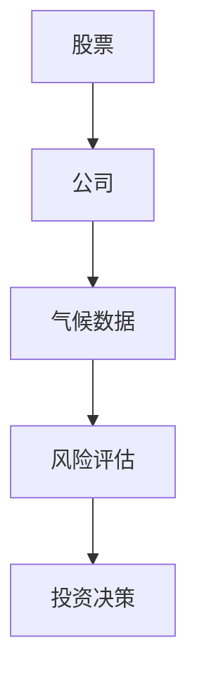
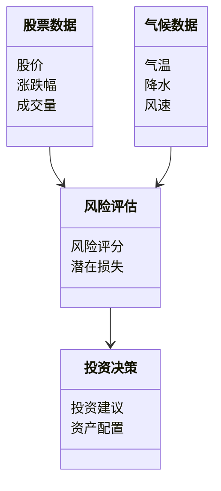
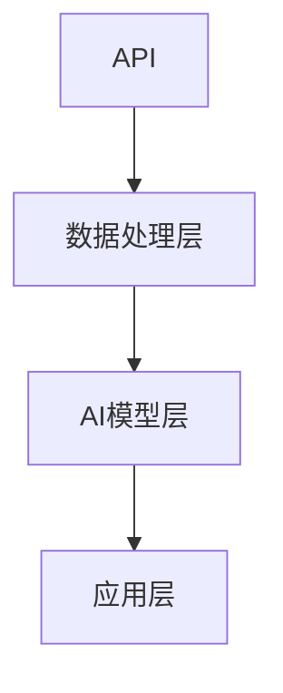

                 

# 《全球股市估值与人工智能在气候变化适应中的应用》

## 关键词：全球股市估值、人工智能、气候变化、风险管理、系统架构设计

## 摘要：本文探讨全球股市估值与人工智能在气候变化适应中的应用，分析气候变化对全球经济的影响，介绍人工智能技术在股市分析与气候风险管理中的应用，构建结合AI的气候变化适应投资系统，提供系统架构设计与项目实战案例。

---

# 第一部分：背景与核心概念

## 第1章：全球股市估值与气候变化适应的背景

### 1.1 全球股市估值的基本概念

#### 1.1.1 股市估值的定义与重要性
股市估值是评估企业内在价值的过程，旨在确定其股票的合理价格。主要方法包括市盈率（P/E）和市净率（P/B），这些指标帮助投资者评估企业的盈利能力与资产价值。

#### 1.1.2 气候变化对全球经济的影响
气候变化导致极端天气事件频发，影响农业、能源、水资源和城市基础设施，进而影响企业运营和财务表现。投资者需考虑气候风险对资产价值的影响。

#### 1.1.3 人工智能在金融领域的潜力
AI在金融领域的应用包括算法交易、风险管理、欺诈检测和客户行为分析。AI技术的进步使得复杂数据的处理和预测更加高效准确。

### 1.2 气候变化的科学基础

#### 1.2.1 气候变化的定义与主要驱动因素
气候变化指长期天气模式的显著变化，主要由温室气体排放、森林砍伐和工业活动引起。这些变化影响全球温度、降水模式和极端天气事件频率。

#### 1.2.2 气候变化对全球经济和金融市场的潜在影响
气候变化可能导致农作物减产、自然灾害增加和企业运营成本上升。这些因素影响企业的盈利能力和股价波动。

#### 1.2.3 企业如何适应气候变化
企业需制定可持续发展战略，采用绿色技术，优化供应链，并评估气候变化相关风险，以提升抗风险能力。

### 1.3 人工智能在气候变化与金融中的应用背景

#### 1.3.1 人工智能的基本概念与技术进展
AI涉及机器学习、深度学习和自然语言处理等技术，能够处理大量数据，识别模式，进行预测和决策支持。

#### 1.3.2 AI在气候变化预测中的作用
AI技术用于分析气候数据，预测极端天气事件，评估气候变化的影响，并提供应对策略建议。

#### 1.3.3 AI在金融分析中的应用现状
AI广泛应用于股票预测、风险评估、投资组合管理和市场情绪分析，帮助投资者做出更明智的决策。

## 第2章：核心概念与联系

### 2.1 核心概念的原理

#### 2.1.1 股市估值的核心指标
市盈率（P/E）= 股价 / 每股净利润  
市净率（P/B）= 股价 / 每股净资产  

#### 2.1.2 气候风险评估的模型
气候风险模型考虑温度变化、降水模式和极端天气事件对资产的影响，评估其经济价值和风险敞口。

#### 2.1.3 人工智能算法的基本原理
监督学习：基于标记数据训练模型，预测股票价格和气候事件。  
无监督学习：识别数据中的隐藏模式，发现异常交易和气候信号。  
强化学习：优化投资策略，动态调整资产配置。

### 2.2 核心概念对比表

| 比较维度 | 股市估值 | 气候变化适应 |
|----------|----------|--------------|
| 目标     | 确定股票价值 | 减少气候变化影响 |
| 方法     | 市盈率、市净率 | 减排、适应措施 |
| 工具     | 金融模型   | 气候模型       |

### 2.3 ER实体关系图

---

# 第二部分：全球股市估值分析

## 第3章：传统股市估值方法

### 3.1 市盈率（P/E）分析

#### 3.1.1 定义与计算公式
市盈率 = 股票价格 / 每股净利润  
例如，某公司股价为$50，每股净利润为$5，市盈率为10。

#### 3.1.2 行业基准与估值差异
不同行业的合理市盈率不同，科技行业通常高于传统制造业。例如，科技行业的市盈率可能为20，而制造业可能为15。

#### 3.1.3 案例分析：科技行业
以苹果公司为例，假设其股价为$100，每股净利润为$10，市盈率为10。如果行业平均市盈率为20，则苹果的股价可能被低估。

### 3.2 市净率（P/B）分析

#### 3.2.1 定义与计算
市净率 = 股票价格 / 每股净资产  
例如，某公司股价为$20，每股净资产为$5，市净率为4。

#### 3.2.2 行业适用性分析
市净率适用于净资产驱动的行业，如银行和房地产。例如，银行行业的平均市净率可能为1.5，而高科技行业可能市净率较高。

#### 3.2.3 案例分析：银行业
假设某银行股价为$25，每股净资产为$10，市净率为2.5。如果行业平均市净率为1.8，该银行可能被高估。

## 第4章：AI驱动的股市估值分析

### 4.1 机器学习模型在股市预测中的应用

#### 4.1.1 算法原理
使用回归分析预测股票价格，利用历史数据训练模型，识别影响股价的关键因素。

#### 4.1.2 案例分析：线性回归模型
建立线性回归模型，以市盈率为因变量，净利润和营业收入为自变量，评估模型的拟合优度和预测能力。

### 4.2 深度学习模型的股市分析

#### 4.2.1 算法原理
使用LSTM网络分析时间序列数据，捕捉股价波动的模式和趋势。

#### 4.2.2 案例分析：LSTM网络预测股价
训练LSTM模型，预测未来股价走势，评估模型的准确性和鲁棒性。

### 4.3 气候变化对股市估值的影响

#### 4.3.1 气候相关风险的量化
评估气候变化对行业和企业的影响，调整估值模型中的关键参数。

#### 4.3.2 案例分析：可再生能源行业的估值调整
考虑政策支持和技术进步，调整可再生能源行业的市盈率和市净率基准。

---

# 第三部分：人工智能技术基础

## 第5章：机器学习与深度学习

### 5.1 机器学习算法的分类与应用

#### 5.1.1 监督学习
用于股票价格预测和气候事件分类，例如使用随机森林算法预测极端天气事件。

#### 5.1.2 无监督学习
用于异常检测，识别市场波动和气候异常事件。

### 5.2 深度学习模型的气候预测

#### 5.2.1 算法原理
使用卷积神经网络（CNN）处理气候数据，捕捉空间特征和时间序列模式。

#### 5.2.2 案例分析：CNN预测降水量
训练CNN模型，输入卫星数据和历史降水量，预测未来降水量。

## 第6章：自然语言处理与时间序列分析

### 6.1 自然语言处理在金融新闻分析中的应用

#### 6.1.1 情感分析
使用NLP技术分析新闻和社交媒体，评估市场情绪对股价的影响。

#### 6.1.2 实体识别
识别公司名称和事件，提取关键信息影响股价走势。

### 6.2 时间序列分析的气候应用

#### 6.2.1 算法原理
使用ARIMA模型预测气候变量，如温度和降水。

#### 6.2.2 案例分析：ARIMA预测气温变化
训练ARIMA模型，预测未来气温趋势，评估模型的准确性。

---

# 第四部分：气候变化适应中的AI应用

## 第7章：气候风险评估与管理

### 7.1 AI驱动的气候风险评估

#### 7.1.1 模型构建
结合气候变化数据和企业运营数据，评估企业的气候风险敞口。

#### 7.1.2 案例分析：企业气候风险评估
评估某企业受气候变化影响的资产价值，调整财务模型。

### 7.2 智能投资组合管理

#### 7.2.1 AI优化投资组合
根据气候风险和市场趋势，动态调整投资组合，降低整体风险。

#### 7.2.2 案例分析：投资组合优化
使用AI优化模型，调整投资比例，平衡风险与收益。

## 第8章：AI驱动的气候适应技术

### 8.1 智能农业与能源管理

#### 8.1.1 AI优化农业种植
预测气候变化对农业的影响，优化作物选择和种植时间。

#### 8.1.2 智能能源管理
预测能源需求，优化能源生产和分配，减少碳排放。

### 8.2 智慧城市建设

#### 8.2.1 智能城市规划
利用AI模拟气候变化影响，优化城市设计和基础设施建设。

#### 8.2.2 案例分析：智能城市交通系统
优化交通流量，减少碳排放，提升城市韧性。

---

# 第五部分：系统架构设计

## 第9章：系统功能设计

### 9.1 领域模型设计

### 9.2 系统架构设计

---

# 第六部分：项目实战

## 第10章：AI驱动的气候变化适应投资系统

### 10.1 环境搭建与数据收集

#### 10.1.1 安装必要的库
安装Python、Pandas、Scikit-learn、TensorFlow和Mermaid工具。

#### 10.1.2 数据源
从Yahoo Finance获取股票数据，从 NOAA 获取气候数据。

### 10.2 系统核心实现

#### 10.2.1 数据预处理
清洗和归一化数据，处理缺失值和异常值。

#### 10.2.2 模型训练
使用LSTM网络训练时间序列模型，预测股票价格和气候变量。

#### 10.2.3 气候风险评估
结合模型预测结果，评估气候变化对股票估值的影响，生成投资建议。

### 10.3 案例分析与代码实现

#### 10.3.1 案例分析
分析可再生能源行业，评估气候变化对其的影响，优化投资组合。

#### 10.3.2 代码实现
编写数据处理、模型训练和风险评估的代码，详细解释每一步骤。

---

# 结论与展望

通过结合全球股市估值和人工智能技术，我们能够更有效地评估和管理气候变化带来的风险。AI技术的应用不仅提升了股市分析的准确性，也为应对气候变化提供了新的工具和方法。未来，随着技术的进步，AI在气候变化适应中的应用将更加广泛和深入，推动全球经济向可持续方向发展。

---

# 作者：AI天才研究院 & 禅与计算机程序设计艺术

