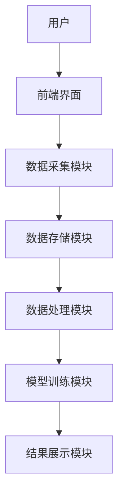

                 


# 全球股市估值与人工智能在海洋资源管理中的应用

---

## 关键词：
全球股市估值、人工智能、海洋资源管理、时间序列分析、机器学习、深度学习、自然语言处理

---

## 摘要：
本文探讨了人工智能在全球股市估值和海洋资源管理中的应用。首先，我们分析了股市估值的核心理论与方法，包括统计套利、时间序列分析和机器学习技术。随后，我们深入探讨了人工智能在海洋资源管理中的潜力，重点分析了深度学习、自然语言处理和系统架构设计。通过结合股市估值和海洋资源管理的实际案例，本文展示了如何利用人工智能技术实现高效的数据分析与决策支持，为金融和海洋科学领域提供了新的思路与解决方案。

---

# 第一部分: 全球股市估值与人工智能的背景

## 第1章: 全球股市估值与人工智能的背景

### 1.1 全球股市估值的定义与重要性
#### 1.1.1 股市估值的基本概念
股市估值是通过对公司财务数据、市场趋势和宏观经济指标的分析，确定股票的内在价值。其核心目标是帮助投资者做出科学的决策。

#### 1.1.2 股市估值的核心作用
- **风险控制**：通过估值模型识别高风险投资。
- **投资决策**：为投资者提供参考依据。
- **市场趋势分析**：帮助预测市场波动。

#### 1.1.3 全球化视角下的股市估值挑战
- **全球化市场的复杂性**：不同市场的波动性差异。
- **数据量的爆炸式增长**：需要高效的数据处理技术。
- **算法的实时性要求**：需要快速响应市场变化。

### 1.2 人工智能在金融领域的潜力
#### 1.2.1 人工智能的基本概念
人工智能（AI）是指通过模拟人类智能的计算机系统，能够执行学习、推理和自适应任务。

#### 1.2.2 人工智能在金融领域的应用现状
- **量化交易**：利用算法进行高频交易。
- **风险管理**：通过AI模型预测市场风险。
- **客户行为分析**：基于AI的客户画像。

#### 1.2.3 人工智能与股市估值的结合点
- **预测模型**：利用机器学习算法预测股票价格。
- **数据挖掘**：从海量数据中提取有价值的信息。
- **自然语言处理**：分析新闻和社交媒体情绪对股价的影响。

### 1.3 海洋资源管理与人工智能的关联
#### 1.3.1 海洋资源管理的核心问题
- **资源监测**：监测海洋生物和环境数据。
- **资源保护**：保护濒危物种和生态环境。
- **资源利用**：优化海洋资源的开发和利用。

#### 1.3.2 人工智能在海洋资源管理中的应用前景
- **图像识别**：识别海洋生物和污染源。
- **数据建模**：预测海洋生态系统的演变。
- **智能决策**：优化资源管理策略。

#### 1.3.3 本书的研究目标与意义
本书旨在探讨如何利用人工智能技术优化全球股市估值和海洋资源管理，为金融和海洋科学领域提供创新的解决方案。

---

# 第二部分: 股市估值的核心理论与方法

## 第2章: 股市估值的理论基础

### 2.1 股市估值的基本原理
#### 2.1.1 股票价值的计算方法
股票价值可以通过市盈率（P/E）、市净率（P/B）等指标进行评估。

#### 2.1.2 市盈率与市净率的定义与应用
- **市盈率**：股票价格与每股收益的比率。
- **市净率**：股票价格与每股净资产的比率。

#### 2.1.3 股票估值的多维度分析
- **财务指标分析**：收入、利润、负债等。
- **行业对比分析**：与同行业公司的估值进行对比。
- **宏观经济因素**：GDP、利率、通货膨胀等。

### 2.2 统计套利与量化投资
#### 2.2.1 统计套利的基本概念
统计套利是通过发现资产价格偏离均值的机会，进行无风险或低风险套利。

#### 2.2.2 量化投资的核心方法
- **因子模型**：基于多个因子构建投资组合。
- **算法交易**：利用算法自动执行交易指令。

#### 2.2.3 统计套利在股市估值中的应用
- **均值回归策略**：寻找价格偏离均值的股票。
- **动量策略**：基于价格趋势进行投资。

### 2.3 时间序列分析与股票预测
#### 2.3.1 时间序列分析的基本概念
时间序列分析是通过对历史数据的分析，预测未来的趋势。

#### 2.3.2 股票价格预测的常用方法
- **ARIMA模型**：自回归积分滑动模型。
- **GARCH模型**：广义自回归条件异方差模型。

#### 2.3.3 时间序列模型在股市估值中的应用
- **短期预测**：预测未来几天或几周的股价走势。
- **长期趋势分析**：预测未来几年的市场趋势。

### 2.4 本章小结
本章介绍了股市估值的核心理论与方法，包括统计套利和时间序列分析。这些方法为后续的人工智能应用奠定了基础。

---

# 第三部分: 人工智能的核心技术与算法

## 第3章: 人工智能的基本原理

### 3.1 机器学习的核心概念
#### 3.1.1 机器学习的定义与分类
- **监督学习**：基于标记数据进行学习。
- **无监督学习**：基于未标记数据进行学习。
- **强化学习**：通过奖励机制优化决策。

#### 3.1.2 机器学习在金融中的应用
- **股票预测**：利用回归和分类算法预测股价。
- **风险评估**：通过聚类分析识别高风险客户。

#### 3.1.3 机器学习与股市估值的结合点
- **特征提取**：从海量数据中提取有价值特征。
- **模型训练**：基于历史数据训练预测模型。
- **实时监控**：实时监控市场波动并发出预警。

### 3.2 深度学习的基本原理
#### 3.2.1 神经网络的定义与结构
- **输入层**：接收原始数据。
- **隐藏层**：提取数据特征。
- **输出层**：生成预测结果。

#### 3.2.2 卷积神经网络与循环神经网络
- **CNN**：用于图像识别和时间序列分析。
- **RNN**：用于序列数据的建模。

#### 3.2.3 深度学习在股市预测中的应用
- **多层感知机**：用于股票价格分类。
- **LSTM网络**：用于时间序列预测。

### 3.3 自然语言处理与金融文本分析
#### 3.3.1 自然语言处理的基本概念
自然语言处理（NLP）是研究如何让计算机理解和生成人类语言的技术。

#### 3.3.2 金融文本分析的核心任务
- **情感分析**：分析新闻和社交媒体对股价的影响。
- **实体识别**：识别公司名称、人物等实体。

#### 3.3.3 NLP在股市估值中的应用
- **情绪分析**：预测市场情绪对股价的影响。
- **事件驱动交易**：基于新闻事件进行交易决策。

---

## 第四部分: 人工智能在海洋资源管理中的应用

## 第4章: 人工智能在海洋资源管理中的应用

### 4.1 海洋资源监测与保护
#### 4.1.1 海洋生物监测
- **图像识别**：识别海洋生物种类和数量。
- **实时监测**：通过卫星和传感器实时监测海洋环境。

#### 4.1.2 海洋污染检测
- **图像分割**：识别污染区域。
- **数据挖掘**：分析污染趋势。

### 4.2 海洋资源利用与优化
#### 4.2.1 渔业资源管理
- **渔获量预测**：预测鱼类资源的丰度。
- **捕捞区域优化**：基于AI模型推荐最佳捕捞区域。

#### 4.2.2 海洋能源开发
- **风能预测**：预测风能资源的分布和强度。
- **潮汐能预测**：预测潮汐的变化规律。

### 4.3 海洋生态系统的建模与预测
#### 4.3.1 生态系统模型
- **食物链模型**：模拟海洋生态系统的能量流动。
- **物种分布模型**：预测物种的分布区域。

#### 4.3.2 多因素分析
- **气候变化**：预测气候变化对海洋生态系统的影响。
- **人类活动**：分析人类活动对海洋生态系统的影响。

---

## 第五部分: 系统架构与项目实战

## 第5章: 系统架构与项目实战

### 5.1 系统架构设计
#### 5.1.1 系统功能模块
- **数据采集模块**：采集股市数据和海洋监测数据。
- **数据处理模块**：清洗和预处理数据。
- **模型训练模块**：训练机器学习模型。
- **结果展示模块**：可视化分析结果。

#### 5.1.2 系统架构图


### 5.2 项目实战
#### 5.2.1 环境安装
- **Python**：安装Anaconda或Miniconda。
- **深度学习框架**：安装TensorFlow或PyTorch。
- **数据处理库**：安装Pandas、NumPy、Matplotlib。

#### 5.2.2 核心实现代码
```python
import numpy as np
import pandas as pd
from sklearn.model_selection import train_test_split
from sklearn.linear_model import LinearRegression

# 加载数据
data = pd.read_csv('stock_data.csv')

# 数据预处理
X = data[['open', 'high', 'low', 'volume']]
y = data['close']

# 划分训练集和测试集
X_train, X_test, y_train, y_test = train_test_split(X, y, test_size=0.2, random_state=42)

# 训练模型
model = LinearRegression()
model.fit(X_train, y_train)

# 预测结果
y_pred = model.predict(X_test)

# 计算准确率
score = model.score(X_test, y_test)
print(f"模型准确率：{score}")
```

#### 5.2.3 案例分析
- **股票价格预测**：基于历史数据预测未来股价。
- **海洋生态监测**：基于卫星数据监测海洋污染。

---

## 第六部分: 结论与展望

## 第6章: 结论与展望

### 6.1 本章总结
本文探讨了人工智能在全球股市估值和海洋资源管理中的应用，展示了如何利用AI技术优化数据处理和决策支持。

### 6.2 未来展望
- **技术优化**：进一步优化算法，提高预测精度。
- **多领域结合**：探索AI在更多领域的应用潜力。
- **数据共享**：推动数据开放，促进跨领域合作。

---

## 附录

### 附录A: 数据来源与处理工具
- 数据来源：公开股票数据、海洋监测数据。
- 工具：Python、Pandas、NumPy、TensorFlow。

### 附录B: 代码实现细节
- 代码示例：详细解释代码实现步骤。
- 错误处理：常见问题及解决方案。

---

## 作者信息

作者：AI天才研究院/AI Genius Institute & 禅与计算机程序设计艺术 /Zen And The Art of Computer Programming

---

**摘要**：本文系统地探讨了人工智能在全球股市估值和海洋资源管理中的应用，通过理论分析和实际案例展示了如何利用AI技术优化金融和海洋科学领域的数据分析与决策支持。

