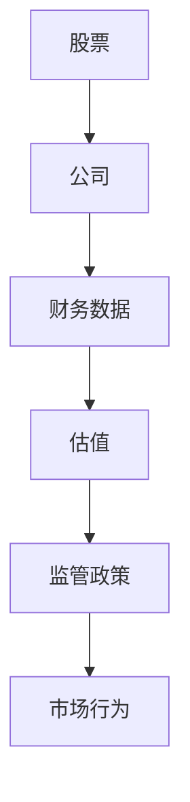
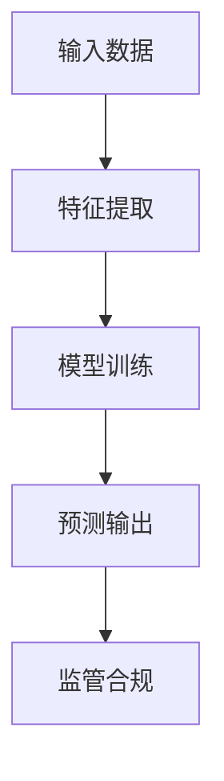
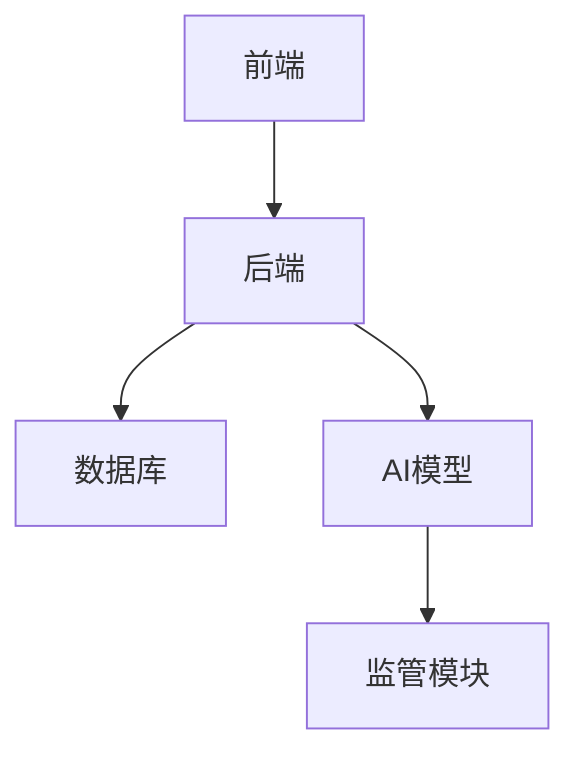
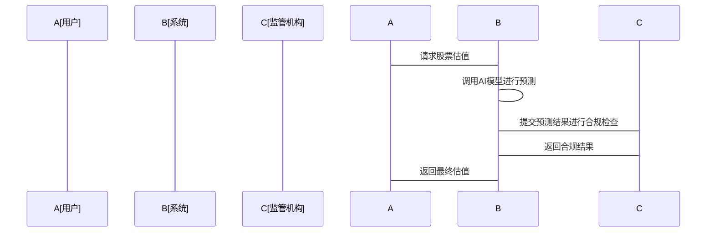

                 


# 全球股市估值与人工智能监管的关系

> 关键词：全球股市估值，人工智能监管，金融市场，算法模型，监管合规

> 摘要：本文探讨了全球股市估值与人工智能监管之间的关系，分析了人工智能技术在股市估值中的应用及其对监管的影响，提出了结合两者的核心概念框架，并通过数学模型和实际案例展示了其相互作用。

---

## 第1章：背景介绍

### 1.1 问题背景

#### 1.1.1 全球股市估值的重要性
股市估值是金融市场中的一项核心活动，用于评估一家公司的内在价值。准确的估值有助于投资者做出明智的投资决策，同时也是企业融资和并购的重要参考。然而，传统的估值方法依赖于经验和主观判断，存在一定的局限性。

#### 1.1.2 人工智能在金融领域的应用现状
人工智能（AI）技术的快速发展，使其在金融领域的应用日益广泛。从高频交易到风险评估，AI正在改变金融行业的运作方式。特别是在股市估值方面，AI通过分析海量数据，提供了更精准和高效的解决方案。

#### 1.1.3 人工智能监管的必要性
随着AI在金融领域的深入应用，监管机构需要确保其合规性和透明性。AI算法的复杂性和潜在的滥用风险，要求监管机构采取相应的措施，以维护市场秩序和投资者利益。

### 1.2 问题描述

#### 1.2.1 股市估值的核心要素
股市估值的核心要素包括公司财务数据（收入、利润、现金流）、市场环境（宏观经济指标、行业趋势）、公司基本面（资产、负债、盈利能力）等。

#### 1.2.2 人工智能在股市估值中的作用
人工智能通过自然语言处理（NLP）、机器学习（ML）等技术，可以从非结构化数据（如新闻、社交媒体）中提取情感指标，并结合结构化数据进行预测和估值。

#### 1.2.3 人工智能监管如何影响股市估值
监管政策的出台可能会影响市场的流动性、投资者行为以及公司的估值模型。例如，加强对高频交易的监管可能会降低市场的波动性。

### 1.3 问题解决

#### 1.3.1 人工智能如何优化股市估值
通过实时数据分析和预测模型，人工智能可以提高估值的准确性和及时性。例如，使用时间序列模型预测股票价格走势。

#### 1.3.2 监管如何影响人工智能的应用
监管政策的制定可能会影响AI算法的设计和应用。例如，数据隐私法规可能限制某些数据的使用。

#### 1.3.3 两者的协同效应
通过结合人工智能和监管政策，可以实现更高效和透明的股市估值。例如，监管机构可以利用AI技术实时监控市场异常，提高监管效率。

### 1.4 边界与外延

#### 1.4.1 股市估值的边界条件
股市估值的边界条件包括数据的可用性、模型的假设、市场的波动性等。例如，模型假设可能受到数据偏差的影响。

#### 1.4.2 人工智能监管的适用范围
人工智能监管的适用范围包括算法的透明性、数据的使用合规性、算法的公平性等。例如，确保算法不歧视特定群体。

#### 1.4.3 两者的相互影响
股市估值的准确性可能影响监管政策的制定，而监管政策的变化又可能影响股市估值模型的设计。

### 1.5 概念结构与核心要素

#### 1.5.1 股市估值的核心要素
- 公司财务数据
- 市场环境
- 公司基本面

#### 1.5.2 人工智能监管的核心要素
- 算法透明性
- 数据合规性
- 监管框架

#### 1.5.3 两者的关联性
- 数据共享与隐私保护
- 模型解释性与监管合规
- 算法优化与市场稳定性

---

## 第2章：核心概念与联系

### 2.1 核心概念原理

#### 2.1.1 股市估值的基本原理
股市估值的基本原理是通过分析公司财务数据、市场环境和公司基本面，评估其内在价值。常用的方法包括市盈率（P/E）、市净率（P/B）等。

#### 2.1.2 人工智能的基本原理
人工智能通过机器学习算法，从数据中学习模式和关系，以实现特定任务，如分类、预测等。

#### 2.1.3 两者结合的机制
人工智能通过分析大量数据，优化股市估值模型，同时监管机构利用AI技术提高监管效率。

### 2.2 概念属性特征对比

| 概念 | 属性 | 特征 |
|------|------|------|
| 股市估值 | 数据驱动 | 依赖历史数据和市场行为 |
| 人工智能监管 | 技术驱动 | 依赖算法和数据隐私 |
| 两者结合 | 综合驱动 | 数据共享与技术融合 |

### 2.3 ER实体关系图架构



---

## 第3章：算法原理与数学模型

### 3.1 算法原理



### 3.2 数学模型与公式

#### 3.2.1 股市估值模型
$$ P = \frac{D}{r} $$
其中，P为股票估值，D为公司未来现金流，r为贴现率。

#### 3.2.2 人工智能模型
$$ y = f(x) $$
其中，y为预测结果，x为输入特征，f为机器学习模型。

#### 3.2.3 监管模型
$$ R = \max(P, Q) $$
其中，R为监管结果，P为预测值，Q为监管阈值。

### 3.3 举例说明

#### 3.3.1 股市估值
假设一家公司的年收益为 $100万，合理市盈率为10倍，则估值为 $1000万。

#### 3.3.2 人工智能监管
假设人工智能算法的预测准确率为95%，则监管机构需要确保其预测结果符合合规要求。

---

## 第4章：系统分析与架构设计方案

### 4.1 问题场景介绍

#### 4.1.1 项目介绍
设计一个结合AI监管的股市估值系统，实现对股票的实时估值和风险监控。

#### 4.1.2 系统功能设计
- 数据采集与处理
- 估值模型训练
- 风险监控
- 监管合规检查

### 4.2 系统架构设计



### 4.3 系统接口设计

#### 4.3.1 数据接口
- 输入：股票代码、时间戳
- 输出：估值结果、风险等级

#### 4.3.2 监管接口
- 输入：预测结果
- 输出：合规检查结果

### 4.4 系统交互设计



---

## 第5章：项目实战

### 5.1 环境安装

#### 5.1.1 安装Python
```bash
python --version
pip install --upgrade pip
```

#### 5.1.2 安装库
```bash
pip install numpy pandas scikit-learn
```

### 5.2 系统核心实现源代码

#### 5.2.1 数据处理
```python
import pandas as pd
import numpy as np

data = pd.read_csv('stock_data.csv')
data.head()
```

#### 5.2.2 模型训练
```python
from sklearn.model

