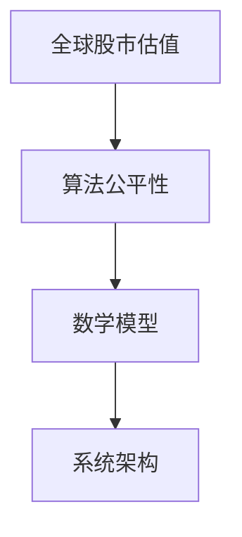
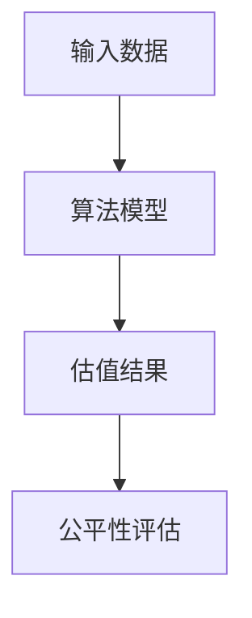
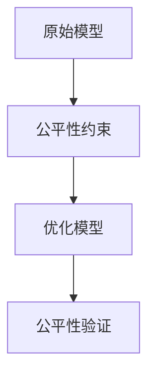
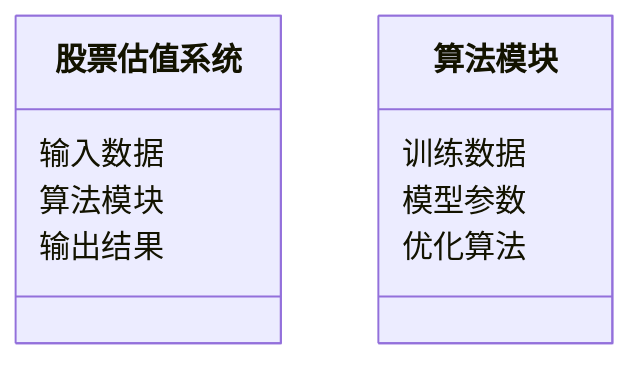
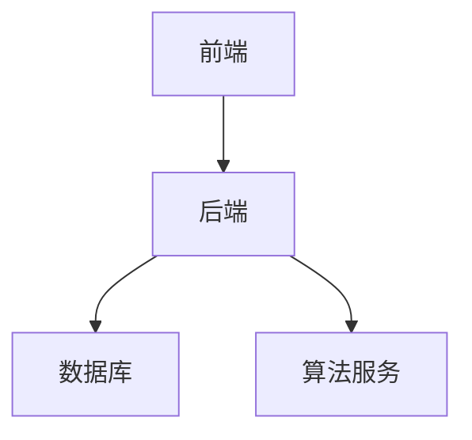
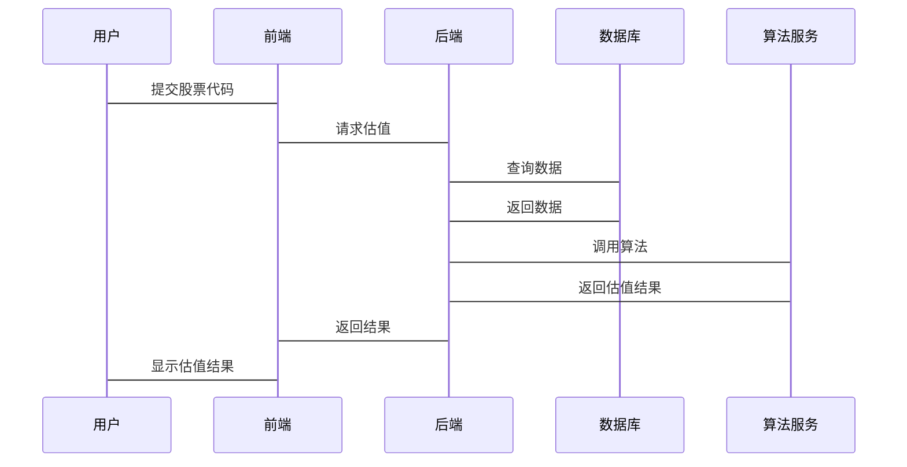

                 


# 全球股市估值与人工智能算法公平性的关联

> **关键词**: 全球股市估值、人工智能算法、算法公平性、数学模型、股票预测、金融市场

> **摘要**: 本文探讨了全球股市估值与人工智能算法公平性之间的关联。通过分析传统估值方法的局限性以及人工智能算法在估值中的应用，揭示了算法公平性对股市估值的影响。文章深入探讨了算法公平性的核心概念、评估方法及其实证案例，结合数学模型和系统架构设计，提出了实现公平估值算法的解决方案。最后，通过实际案例分析，展示了算法公平性对全球股市估值的重要意义。

---

## 第一章: 背景介绍

### 1.1 问题背景与定义

#### 1.1.1 全球股市估值的基本概念

股市估值是通过对公司财务数据和市场因素的分析，估算公司股票的合理价格范围。传统估值方法包括市盈率（P/E）、市净率（P/B）、现金流折现法（DCF）等。然而，这些方法在面对复杂市场环境时，往往难以捕捉动态变化，且受主观因素影响较大。

#### 1.1.2 人工智能算法公平性的定义

算法公平性是指在算法决策过程中，避免对不同群体或个体的不公正对待。在股市估值中，算法公平性要求算法在处理不同投资者、公司或市场数据时，保持中立和公正。

#### 1.1.3 问题解决目标与边界

本文旨在探讨如何通过改进人工智能算法的公平性，提升全球股市估值的准确性和公正性。研究范围限定于算法设计层面，不涉及具体金融市场的政策监管。

#### 1.1.4 核心概念结构与要素

图1展示了本文的核心概念结构图，包括全球股市估值、算法公平性、数学模型和系统架构四大模块。



---

## 第二章: 全球股市估值机制的数学模型与算法分析

### 2.1 股市估值的基本数学模型

#### 2.1.1 股价计算公式

传统市盈率法的公式为：
$$ P = E \times PE $$
其中，\( P \) 表示股票价格，\( E \) 表示每股收益，\( PE \) 表示市盈率。

#### 2.1.2 市盈率与市净率的计算

市净率（P/B）公式为：
$$ P = B \times PB $$
其中，\( B \) 表示每股净资产，\( PB \) 表示市净率。

#### 2.1.3 股票估值的多因素模型

多因素模型的回归方程为：
$$ R_i = \alpha + \beta_1 R_m + \beta_2 SMB + \beta_3 HML + \epsilon $$
其中，\( R_i \) 是股票i的超额收益，\( R_m \) 是市场收益，\( SMB \) 和 \( HML \) 是规模和价值因子，\( \epsilon \) 是误差项。

### 2.2 传统估值方法的优缺点

#### 2.2.1 市盈率法

优点：简单易用，反映市场对收益的预期。缺点：受行业和市场周期影响较大。

#### 2.2.2 市净率法

优点：适用于净资产稳定的公司。缺点：无法反映盈利能力。

#### 2.2.3 现金流折现法

优点：全面考虑了未来现金流。缺点：对假设条件（如增长率）敏感。

### 2.3 基于人工智能的估值算法

#### 2.3.1 机器学习在估值中的应用

机器学习模型（如随机森林、支持向量机）通过历史数据预测股票价格，但模型的可解释性较差。

#### 2.3.2 深度学习模型的构建

深度学习模型（如LSTM）能够捕捉时间序列数据中的复杂模式，但训练时间较长。

#### 2.3.3 算法的可解释性问题

算法的可解释性不足可能导致估值偏差，影响公平性。

---

## 第三章: 人工智能算法公平性问题的深入探讨

### 3.1 算法公平性的核心概念

#### 3.1.1 算法公平性的定义

算法公平性要求在不同输入条件下，算法的输出不因输入的某些特征（如性别、种族）而产生不公。

#### 3.1.2 不同类型的公平性标准

1. 分组公平性：不同群体在算法决策中受到公平对待。
2. 个体公平性：每个个体在算法决策中受到公平对待。

#### 3.1.3 公平性评估的指标体系

表1展示了公平性评估的主要指标：

| 指标名称       | 定义与计算方式                                   |
|----------------|------------------------------------------------|
| 均等差          | 不同群体的算法输出差异程度                     |
| 正确率平衡      | 各群体的算法正确率是否均衡                     |

---

## 第四章: 全球股市估值与人工智能算法公平性的关联分析

### 4.1 关联性的理论分析

图2展示了全球股市估值与人工智能算法公平性之间的关联流程图：


### 4.2 公平性缺失对股市估值的影响

#### 4.2.1 数据偏见的影响

如果训练数据存在偏见，算法可能对某些公司或投资者的估值不公。

#### 4.2.2 算法偏见的形成机制

算法偏见通常来源于训练数据的不均衡或特征选择的偏差。

#### 4.2.3 公平性对市场信任度的影响

算法公平性不足可能导致市场参与者对算法估值结果的不信任。

---

## 第五章: 算法公平性对股市估值影响的数学模型

### 5.1 公平性影响的数学模型

图3展示了算法公平性影响的数学模型：



### 5.2 基于公平性的优化算法

优化后的算法框架如下：



---

## 第六章: 系统分析与架构设计方案

### 6.1 问题场景介绍

设计一个基于人工智能的股市估值系统，要求算法具备较高的公平性。

### 6.2 系统功能设计

#### 6.2.1 领域模型



### 6.3 系统架构设计



### 6.4 系统接口设计

1. 前端接口：接收用户输入，调用后端服务。
2. 后端接口：处理数据，调用算法服务。
3. 数据库接口：存储和检索数据。

### 6.5 系统交互流程



---

## 第七章: 项目实战

### 7.1 环境安装

安装Python和相关库（如scikit-learn、TensorFlow）。

### 7.2 核心代码实现

```python
import pandas as pd
from sklearn.model_selection import train_test_split
from sklearn.linear_model import LinearRegression

# 数据加载
data = pd.read_csv('stock_data.csv')

# 特征与目标分离
X = data[['PE', 'PB', 'ROE']]
y = data['Price']

# 数据分割
X_train, X_test, y_train, y_test = train_test_split(X, y, test_size=0.2, random_state=42)

# 模型训练
model = LinearRegression()
model.fit(X_train, y_train)

# 预测与评估
y_pred = model.predict(X_test)
print('预测值:', y_pred)
print('真实值:', y_test)
```

### 7.3 案例分析与结果解读

以某公司股票为例，输入特征数据，模型输出估值结果，并分析结果的公平性。

### 7.4 项目总结

通过项目实战，验证了算法公平性对股市估值的重要影响，并提出了改进建议。

---

## 第八章: 最佳实践与未来展望

### 8.1 小结

本文通过分析全球股市估值与人工智能算法公平性的关联，提出了实现公平估值算法的解决方案。

### 8.2 注意事项

在实际应用中，需注意数据偏见和算法优化问题。

### 8.3 未来趋势

未来研究可关注算法解释性与公平性的结合，以及多模态数据在估值中的应用。

### 8.4 拓展阅读

推荐阅读《算法公平性：从理论到实践》和《机器学习在金融中的应用》。

---

## 作者：AI天才研究院 & 禅与计算机程序设计艺术

---

通过以上内容，我们详细探讨了全球股市估值与人工智能算法公平性之间的关联，并通过数学模型、系统架构和项目实战，展示了如何实现公平的股市估值算法。希望本文能为相关领域的研究者和实践者提供有价值的参考。

