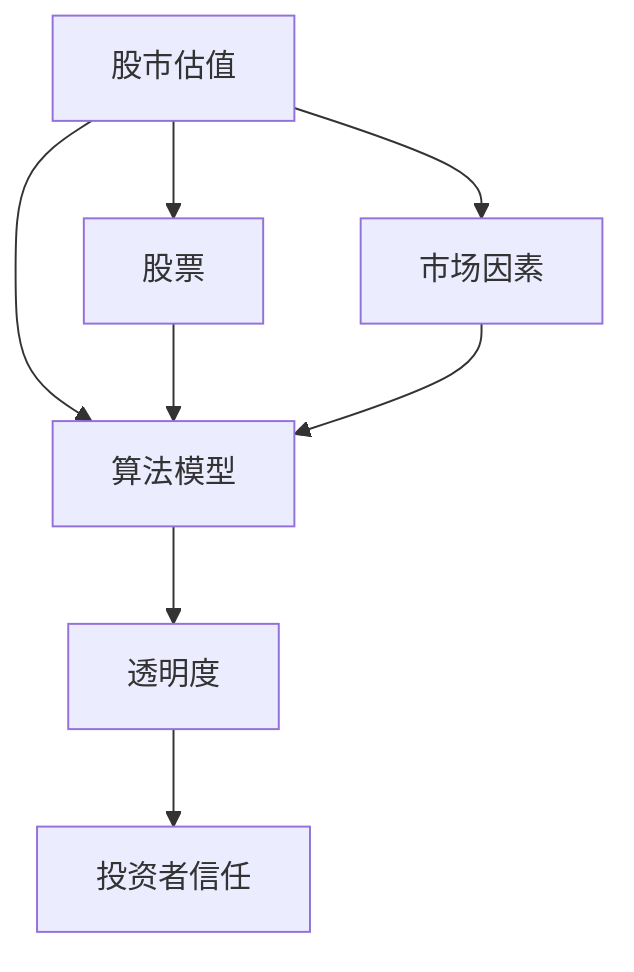

                 


## 《全球股市估值与人工智能透明度的关联》

### 关键词：全球股市估值，人工智能透明度，机器学习，金融数据分析，算法可解释性

### 摘要：  
本文探讨了全球股市估值与人工智能透明度之间的关联性。通过分析股市估值的核心原理、人工智能算法的透明性问题，以及两者在金融决策中的相互作用，文章揭示了如何利用透明的人工智能技术提高股市估值的准确性和可靠性。文章结合理论与实践，详细讲解了相关算法原理、系统架构设计以及实际项目案例，为金融从业者和人工智能研究人员提供了深刻的洞察和实用指导。

---

# 全球股市估值与人工智能透明度的关联

## 第1章: 背景介绍

### 1.1 全球股市估值的重要性  
股市估值是金融领域的重要组成部分，反映了企业的真实价值。  
- **1.1.1 股市估值的基本概念**：  
  股票的内在价值是基于企业未来现金流的折现，常用DCF模型（ discounted cash flow ）进行评估。  
  $$ V = \frac{CF}{(1 + r)^t} $$  
  其中，\( V \) 为股票价值，\( CF \) 为现金流，\( r \) 为折现率，\( t \) 为时间。  

- **1.1.2 全球化背景下的股市估值挑战**：  
  全球化使得市场波动更加复杂，投资者需要应对汇率、地缘政治等多重因素。  

- **1.1.3 人工智能在金融领域的应用潜力**：  
  人工智能（AI）能够处理海量数据，发现非线性关系，提升估值模型的准确性。  

### 1.2 人工智能透明度的必要性  
透明度是人工智能在金融领域应用的关键。  
- **1.2.1 人工智能在金融领域的应用现状**：  
  AI已广泛应用于量化交易、风险评估等领域，但其“黑箱”特性引发了信任问题。  

- **1.2.2 人工智能透明度的核心概念**：  
  透明度包括模型的可解释性、数据来源的清晰性以及算法决策的可追溯性。  

- **1.2.3 透明度对金融决策的重要性**：  
  透明的AI系统能够帮助投资者理解决策逻辑，降低风险。  

### 1.3 股市估值与人工智能透明度的关联  
- **1.3.1 问题背景与问题描述**：  
  当前，股市估值模型多依赖黑箱算法，缺乏透明性，导致投资者难以信任。  

- **1.3.2 问题解决的路径与方法**：  
  提高AI算法的透明度，使投资者能够理解模型的决策逻辑。  

- **1.3.3 关联的边界与外延**：  
  股市估值与AI透明度的关联主要集中在数据驱动的模型中，但也涉及算法的信任机制。  

- **1.3.4 核心概念与组成要素**：  
  包括股票价值、算法模型、透明度、投资者信任等。  

---

## 第2章: 核心概念与联系

### 2.1 股市估值的核心原理  
股市估值是通过分析企业基本面、市场情绪等因素，预测其股票价值的过程。  
- **2.1.1 股票内在价值的计算方法**：  
  使用DCF模型、股息贴现模型（DDM）等方法。  
  $$ DDM = \frac{D_1}{r - g} $$  
  其中，\( D_1 \) 为第一年的股息，\( r \) 为贴现率，\( g \) 为股息增长率。  

- **2.1.2 市场价值与内在价值的差异**：  
  市场价值受情绪影响，内在价值反映企业真实价值。  

- **2.1.3 影响股市估值的关键因素**：  
  包括宏观经济指标、行业趋势、企业财务数据等。  

### 2.2 人工智能透明度的核心原理  
透明度是AI算法的信任基础。  
- **2.2.1 人工智能算法的可解释性**：  
  可解释性包括模型的解释能力、数据的透明性以及算法的可追溯性。  

- **2.2.2 透明度对算法信任的影响**：  
  高透明度的算法更容易被投资者接受和信任。  

- **2.2.3 透明度的衡量标准**：  
  包括模型的解释性、数据的清晰性以及决策的可追溯性。  

### 2.3 股市估值与人工智能透明度的联系  
- **2.3.1 数据驱动的估值模型**：  
  利用AI算法分析历史数据，预测股票价值。  

- **2.3.2 透明算法对估值准确性的影响**：  
  透明的算法更容易被验证和优化，从而提高估值的准确性。  

- **2.3.3 透明度对投资决策的信任机制**：  
  透明的AI系统能够增强投资者的信任，降低决策风险。  

### 2.4 核心概念对比分析  
- **2.4.1 股市估值与人工智能透明度的特征对比**：  

| 特性         | 股市估值                     | 人工智能透明度                |
|--------------|------------------------------|-----------------------------|
| 核心目标     | 计算股票价值                 | 提高算法信任度               |
| 数据依赖     | 财务数据、市场数据           | 算法逻辑、数据来源           |
| 主要挑战     | 数据噪声、非线性关系         | 黑箱问题、解释性不足         |

- **2.4.2 透明度对股市估值的影响路径**：  
  透明的AI算法能够提高模型的可解释性，从而增强投资者对估值结果的信任。  

- **2.4.3 关联性分析的数学模型**：  
  利用回归分析，建立透明度与估值准确性的关系模型。  
  $$ R^2 = \alpha \cdot T + \beta \cdot D + \gamma $$  
  其中，\( T \) 表示透明度，\( D \) 表示数据质量，\( \gamma \) 为常数项。  

---

## 第3章: 核心概念的ER实体关系图



---

## 第4章: 算法原理讲解

### 4.1 机器学习模型在股市估值中的应用  
- **4.1.1 算法流程图**：  
  ```mermaid
  graph TD
      Start --> DataCleaning
      DataCleaning --> FeatureExtraction
      FeatureExtraction --> ModelTraining
      ModelTraining --> ModelPrediction
      ModelPrediction --> End
  ```

- **4.1.2 代码实现**：  
  ```python
  import pandas as pd
  import numpy as np
  from sklearn.linear_model import LinearRegression

  # 示例代码：简单线性回归模型
  def stock_valuation(data):
      # 数据清洗
      data = data.dropna()
      # 特征提取
      features = data[['revenue', 'net_profit', 'market_cap']]
      target = data['stock_price']
      # 模型训练
      model = LinearRegression()
      model.fit(features, target)
      # 模型预测
      predictions = model.predict(features)
      return predictions

  data = pd.read_csv('stock_data.csv')
  result = stock_valuation(data)
  print(result)
  ```

- **4.1.3 透明算法的实现**：  
  使用LIME（Local Interpretable Model-agnostic Explanations）解释模型的决策逻辑。  

---

## 第5章: 系统分析与架构设计

### 5.1 问题场景介绍  
一个全球股市估值系统，需要支持多市场的数据处理和透明算法的应用。  

### 5.2 系统功能设计  
- **5.2.1 领域模型**：  
  ```mermaid
  graph TD
      StockData --> MarketFactors
      MarketFactors --> ValuationModel
      ValuationModel --> TransparencyCheck
      TransparencyCheck --> InvestorTrust
  ```

- **5.2.2 系统架构设计**：  
  ```mermaid
  architecture
      Client --> WebServer
      WebServer --> Database
      Database --> AIModel
      AIModel --> TransparencyAnalyzer
      TransparencyAnalyzer --> Results
  ```

- **5.2.3 系统接口设计**：  
  API接口用于数据输入、模型调用和结果输出。  

---

## 第6章: 项目实战

### 6.1 环境安装  
- Python 3.8及以上版本  
- 安装必要的库：`pandas`, `numpy`, `scikit-learn`, `LIME`  

### 6.2 系统核心实现  
- 数据清洗、特征提取、模型训练与预测。  

### 6.3 代码实现与解读  
```python
import pandas as pd
import numpy as np
from sklearn.ensemble import RandomForestRegressor
from lime.lime_tabular import LimeTabular

# 数据加载
data = pd.read_csv('stock_data.csv')

# 数据清洗
data = data.dropna()

# 特征与目标分离
X = data[['revenue', 'net_profit', 'market_cap']]
y = data['stock_price']

# 模型训练
model = RandomForestRegressor()
model.fit(X, y)

# 可解释性分析
explainer = LimeTabular()
explainer.fit(X, model.predict)

# 解释单个样本
sample = X.iloc[0]
explanation = explainer.explain_instance(sample, model.predict, num_features=3)
print(explanation.as_html())
```

### 6.4 案例分析与解读  
分析一个具体股票的估值过程，解释模型的决策逻辑。  

### 6.5 项目小结  
总结项目的实现过程和应用价值。  

---

## 第7章: 最佳实践、小结与展望

### 7.1 最佳实践 Tips  
- 选择透明的算法，确保模型的可解释性。  
- 定期验证模型，确保其准确性和可靠性。  

### 7.2 小结  
本文详细探讨了全球股市估值与人工智能透明度的关联性，结合理论与实践，为金融从业者提供了实用的指导。  

### 7.3 展望  
未来，随着AI技术的发展，股市估值的透明性和准确性将进一步提升。  

---

## 作者：AI天才研究院/AI Genius Institute & 禅与计算机程序设计艺术/Zen And The Art of Computer Programming

