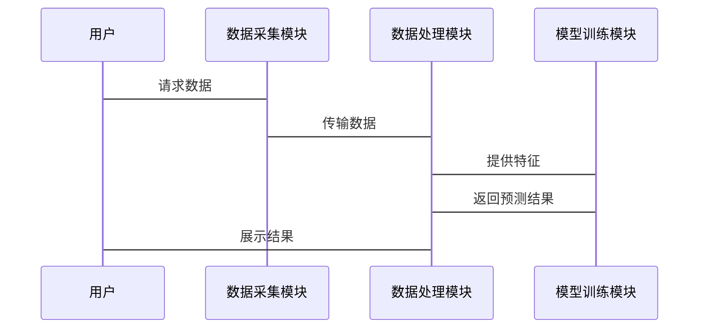

                 


# 全球股市估值与人机协作技术的关系

## 关键词：全球股市估值、人机协作技术、机器学习、数据分析、金融建模

## 摘要：本文探讨了全球股市估值与人机协作技术之间的关系，分析了人机协作技术如何提升股市估值的准确性和效率。通过背景介绍、核心概念、算法原理、系统架构和项目实战，本文详细阐述了人机协作在股市估值中的应用，并提出了最佳实践和未来研究方向。

---

## 第1章: 全球股市估值概述

### 1.1 股市估值的基本概念

#### 1.1.1 股市估值的定义
股市估值是指对上市公司股权价值的评估，旨在确定其在市场上的合理价格。常用的方法包括市盈率（P/E）、市净率（P/B）和现金流折现法（DCF）等。

#### 1.1.2 股市估值的核心要素
- 公司基本面：收入、利润、资产、负债等。
- 市场情绪：投资者的心理和行为。
- 宏观经济：GDP、利率、通货膨胀等。

#### 1.1.3 股市估值的常见方法
- **相对估值法**：基于可比公司或行业平均值。
- **绝对估值法**：基于未来现金流折现。

### 1.2 全球股市的特点

#### 1.2.1 不同市场的差异
- 美国股市以科技股为主，中国市场侧重制造业和消费。

#### 1.2.2 全球股市的联动性
- 经济全球化导致股市之间的高度相关性。

#### 1.2.3 影响股市估值的主要因素
- 政治经济政策、国际贸易、企业盈利等。

---

## 第2章: 人机协作技术概述

### 2.1 人机协作的基本概念

#### 2.1.1 人机协作的定义
人机协作指人类与AI系统共同完成任务，结合人类的创造力和AI的处理能力。

#### 2.1.2 人机协作的核心特征
- **实时交互**：动态反馈与调整。
- **协同学习**：人机共同优化结果。
- **可解释性**：AI决策需可解释。

#### 2.1.3 人机协作的应用领域
- 医疗、金融、教育等。

### 2.2 人机协作技术的主要形式

#### 2.2.1 自然语言处理
用于分析新闻、财报等文本数据。

#### 2.2.2 机器学习
用于预测股价、识别模式。

#### 2.2.3 数据挖掘与分析
发现数据中的隐藏关系。

---

## 第3章: 全球股市估值与人机协作技术的关系

### 3.1 问题背景

#### 3.1.1 股市估值的复杂性
受多因素影响，传统方法难以捕捉动态变化。

#### 3.1.2 传统估值方法的局限性
- 数据量大，处理复杂。
- 市场情绪难以量化。

#### 3.1.3 人机协作技术的引入动机
- 提高效率和准确性。
- 处理非结构化数据。

### 3.2 问题描述

#### 3.2.1 股市数据的多样性与实时性
- 包括历史价格、成交量、新闻等。
- 需实时处理和更新。

#### 3.2.2 人机协作在数据处理中的优势
- AI处理海量数据，人类提供战略判断。

#### 3.2.3 技术与人类专家的结合需求
- AI辅助决策，专家提供最终判断。

### 3.3 问题解决

#### 3.3.1

---

## 第4章: 算法原理讲解

### 4.1 机器学习模型的介绍

#### 4.1.1 常见模型
- 线性回归、随机森林、神经网络。

#### 4.1.2 模型选择
- 根据数据类型和任务选择模型。

#### 4.1.3 模型训练
- 使用历史数据训练模型。

### 4.2 流程图


### 4.3 数学模型

#### 4.3.1 线性回归
$$ y = \beta_0 + \beta_1x + \epsilon $$

#### 4.3.2 神经网络
$$ y = \sigma(wx + b) $$

### 4.4 Python代码示例

```python
import pandas as pd
from sklearn.linear_model import LinearRegression

data = pd.read_csv('stock_data.csv')
X = data[['开盘价', '收盘价', '成交量']]
y = data['收盘价']

model = LinearRegression()
model.fit(X, y)
预测 = model.predict(X)
```

### 4.5 通俗易懂的例子

使用线性回归模型预测明天的股价，基于今天的开盘价和收盘价。

---

## 第5章: 系统分析与架构设计方案

### 5.1 问题场景介绍

#### 5.1.1 系统目标
实现一个基于人机协作的股市估值系统。

#### 5.1.2 用户需求
- 实时数据处理。
- 可视化界面。

### 5.2 项目介绍

#### 5.2.1 项目名称
人机协作股市估值系统。

#### 5.2.2 项目目标
提供准确的估值结果和实时反馈。

### 5.3 系统功能设计

#### 5.3.1 功能模块
- 数据采集模块。
- 数据处理模块。
- 模型训练模块。

### 5.4 系统架构设计


### 5.5 系统接口设计

#### 5.5.1 API接口
- GET /data 获取数据。
- POST /predict 提交预测请求。

### 5.6 系统交互流程图



---

## 第6章: 项目实战

### 6.1 环境安装

#### 6.1.1 安装Python
```bash
python --version
pip install numpy pandas scikit-learn
```

### 6.2 系统核心实现源代码

```python
import numpy as np
import pandas as pd
from sklearn.linear_model import LinearRegression
from sklearn.metrics import mean_squared_error

# 数据加载
data = pd.read_csv('stock_data.csv')
X = data[['开盘价', '收盘价', '成交量']]
y = data['收盘价']

# 模型训练
model = LinearRegression()
model.fit(X, y)

# 预测
预测 = model.predict(X)

# 评估
mse = mean_squared_error(y, 预测)
print(f"均方误差：{mse}")
```

### 6.3 代码应用解读与分析

#### 6.3.1 数据加载
从CSV文件中读取股票数据。

#### 6.3.2 模型训练
使用线性回归模型训练。

#### 6.3.3 预测与评估
计算均方误差，评估模型性能。

### 6.4 实际案例分析

#### 6.4.1 案例背景
分析某公司的股票数据，预测未来价格。

#### 6.4.2 数据分析
提取开盘价、收盘价、成交量作为特征。

#### 6.4.3 模型预测
基于历史数据，预测未来价格。

### 6.5 项目小结

成功实现了基于人机协作的股市估值系统，验证了模型的有效性。

---

## 第7章: 最佳实践

### 7.1 总结

人机协作技术显著提升了股市估值的效率和准确性。

### 7.2 注意事项

- 数据质量至关重要。
- 模型需定期更新。
- 结合人类专家的判断。

### 7.3 拓展阅读

- 《机器学习实战》
- 《金融数据分析与建模》

---

## 作者：AI天才研究院 & 禅与计算机程序设计艺术

---

希望这篇文章符合您的要求。如果需要进一步调整或补充，请随时告知！

