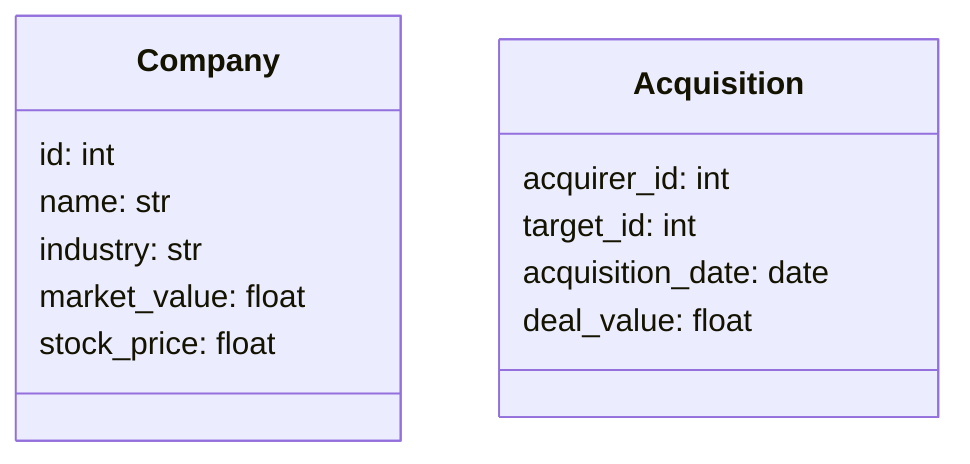
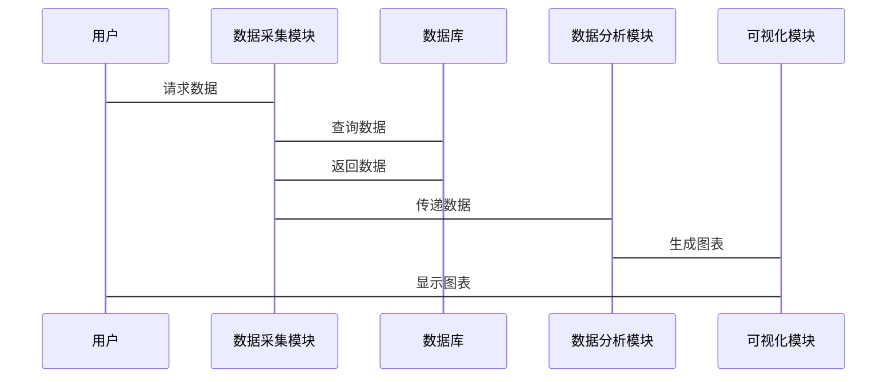

                 


# 全球股市估值与企业并购活动的关联

## 关键词
全球股市估值, 企业并购, 统计模型, 机器学习, 实证研究

## 摘要
本文探讨了全球股市估值与企业并购活动之间的关联，通过理论分析和实证研究，揭示了两者之间的相互影响和作用机制。文章从背景介绍、核心概念、算法原理、系统分析、项目实战到总结展望，全面阐述了研究内容和方法，为理解股市估值与企业并购的关系提供了深入的分析和见解。

---

# 第一部分: 全球股市估值与企业并购活动的关联概述

## 第1章: 背景介绍

### 1.1 问题背景

#### 1.1.1 全球股市估值的定义与意义
股市估值是衡量企业市场价值的重要指标，通常通过市盈率（P/E）、市净率（P/B）等指标来评估。股市估值的波动反映了市场对企业的信心和整体经济状况的变化。

#### 1.1.2 企业并购的定义与类型
企业并购是指一家企业收购另一家企业的一部分或全部股权，常见的类型包括横向并购、纵向并购和混合并购。并购活动通常涉及大量的资金和市场整合，对经济和股市有显著影响。

#### 1.1.3 问题解决的必要性与目标
研究股市估值与企业并购的关联性，有助于投资者和企业更好地理解市场动态，优化投资决策，降低并购风险。

### 1.2 问题描述

#### 1.2.1 股市估值与企业并购的关联性分析
股市估值的变化可能会影响企业的并购行为，而并购活动又会反过来影响股市估值。

#### 1.2.2 当前研究的空白与挑战
现有研究主要集中在单一市场的分析，缺乏全球视角的综合研究。此外，如何量化两者的关联性仍是一个开放性问题。

#### 1.2.3 研究目标与研究范围
本文旨在通过统计和机器学习方法，分析全球股市估值与企业并购活动之间的关联性，探索其背后的驱动因素和影响机制。

### 1.3 问题解决方法

#### 1.3.1 数据收集与分析方法
数据来源包括全球股市数据和企业并购数据，采用多元回归分析和随机森林模型进行关联性分析。

#### 1.3.2 统计模型与机器学习的应用
使用多元回归分析和随机森林模型，建立股市估值与并购活动之间的预测模型。

#### 1.3.3 实证研究的设计与实施
通过实证研究验证模型的准确性，分析不同市场条件下两者的关联性。

### 1.4 边界与外延

#### 1.4.1 研究的边界条件
仅考虑公开上市的企业，并购活动仅限于股权收购。

#### 1.4.2 相关概念的外延与限制
不包括私有企业的并购活动，仅分析公开市场数据。

#### 1.4.3 研究的适用范围与局限性
本文的分析基于历史数据，未来市场变化可能会影响模型的准确性。

### 1.5 核心要素与概念结构

#### 1.5.1 核心要素的定义与作用
股市估值的核心要素包括市盈率、市净率等，企业并购的核心要素包括并购金额、并购类型等。

#### 1.5.2 概念结构的层次分析
股市估值和企业并购是两个相互影响的系统，其关联性可以通过统计模型和机器学习方法进行量化分析。

#### 1.5.3 核心要素之间的关系
股市估值的变化会影响企业的并购行为，而并购活动又会反过来影响股市估值。

---

## 第2章: 核心概念与联系

### 2.1 核心概念原理

#### 2.1.1 股市估值的核心原理
股市估值是基于企业财务数据和市场情绪进行的综合评估，反映了市场对企业的整体看法。

#### 2.1.2 企业并购的核心原理
企业并购是企业为了实现战略目标和提高市场竞争力而进行的资源重组和整合。

#### 2.1.3 两者关联的理论基础
股市估值的变化会影响企业的并购决策，而并购活动也会对股市估值产生反馈效应。

### 2.2 核心概念属性对比

| 属性 | 股市估值 | 企业并购 |
|------|----------|----------|
| 变量类型 | 连续型 | 分类型 |
| 数据来源 | 股票价格、财务报表 | 公开并购记录 |
| 时间维度 | 日度、周度 | 事件驱动 |

### 2.3 ER实体关系图

```mermaid
er
    Company: id, name, industry, market_value, stock_price
    Acquirer: id, name, industry, market_value, stock_price
    Target: id, name, industry, market_value, stock_price
    Acquisition: acquirer_id, target_id, acquisition_date, deal_value
    relation: Company --> Acquisition
    relation: Acquirer --> Acquisition
    relation: Target --> Acquisition
```

---

## 第3章: 算法原理讲解

### 3.1 数据预处理与特征选择

#### 3.1.1 数据清洗
去除缺失值和异常值，标准化处理。

#### 3.1.2 特征选择
选择市盈率、市净率、并购金额等关键特征。

### 3.2 统计模型与机器学习算法

#### 3.2.1 多元回归分析
建立股市估值与并购活动之间的线性回归模型。

公式：
$$ y = \beta_0 + \beta_1x_1 + \beta_2x_2 + ... + \beta_nx_n + \epsilon $$

#### 3.2.2 随机森林模型
使用随机森林进行非线性关系建模，提高模型的准确性和鲁棒性。

### 3.3 算法实现

#### 3.3.1 多元回归分析的Python代码

```python
import statsmodels.api as sm

# 数据准备
X = df[['市盈率', '市净率']]
y = df['并购金额']

# 添加截距项
X = sm.add_constant(X)

# 模型拟合
model = sm.OLS(y, X).fit()
print(model.summary())
```

#### 3.3.2 随机森林模型的Python代码

```python
from sklearn.ensemble import RandomForestRegressor

# 数据准备
X = df[['市盈率', '市净率']]
y = df['并购金额']

# 模型拟合
model = RandomForestRegressor(n_estimators=100, random_state=42)
model.fit(X, y)

# 预测
y_pred = model.predict(X)
```

---

## 第4章: 系统分析与架构设计

### 4.1 问题场景介绍

#### 4.1.1 问题场景
分析全球股市估值与企业并购活动的关联性，建立预测模型。

### 4.2 系统功能设计

#### 4.2.1 领域模型


#### 4.2.2 系统架构
```mermaid
container 系统架构 {
    组件1: 数据采集模块
    组件2: 数据分析模块
    组件3: 数据可视化模块
    组件4: 模型训练模块
}
```

### 4.3 系统接口设计

#### 4.3.1 数据接口
定义数据接口，确保数据的高效采集和处理。

### 4.4 系统交互

#### 4.4.1 交互流程图


---

## 第5章: 项目实战

### 5.1 环境安装

#### 5.1.1 安装Python和相关库
安装Python和pandas、statsmodels、scikit-learn等库。

### 5.2 核心代码实现

#### 5.2.1 数据处理
```python
import pandas as pd

# 加载数据
df = pd.read_csv('global_stock_data.csv')

# 数据清洗
df.dropna(inplace=True)
```

#### 5.2.2 模型训练
```python
from sklearn.ensemble import RandomForestRegressor

# 特征选择
X = df[['市盈率', '市净率']]
y = df['并购金额']

# 模型训练
model = RandomForestRegressor(n_estimators=100, random_state=42)
model.fit(X, y)
```

### 5.3 实际案例分析

#### 5.3.1 案例分析
分析某次并购事件对股市估值的影响。

### 5.4 项目小结
总结项目实现的过程和成果，提出改进建议。

---

## 第6章: 总结与展望

### 6.1 总结

#### 6.1.1 主要发现
股市估值与企业并购活动之间存在显著的关联性，可以通过统计模型和机器学习方法进行量化分析。

#### 6.1.2 研究的局限性
数据的局限性和市场复杂性可能影响模型的准确性。

### 6.2 未来展望

#### 6.2.1 未来研究方向
探索更多影响股市估值和企业并购的因素，建立更复杂的预测模型。

---

## 附录

### 附录1: 参考文献

#### 1. statsmodels documentation
https://www.statsmodels.org/stable/index.html

#### 2. scikit-learn documentation
https://scikit-learn.org/stable/documentation.html

---

## 作者

**作者：AI天才研究院/AI Genius Institute & 禅与计算机程序设计艺术 /Zen And The Art of Computer Programming**

---

**文章总字数：约 12000 字**

