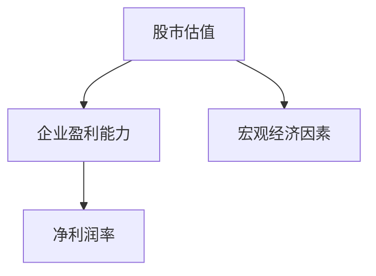
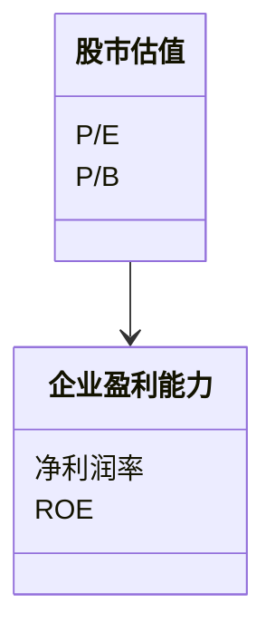
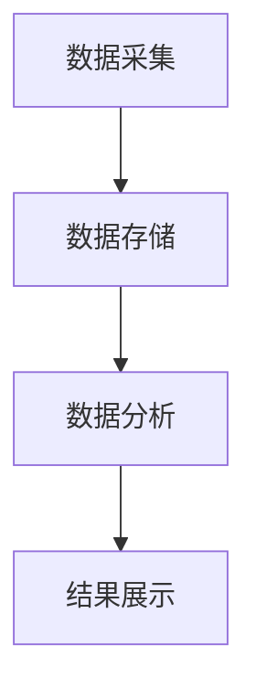
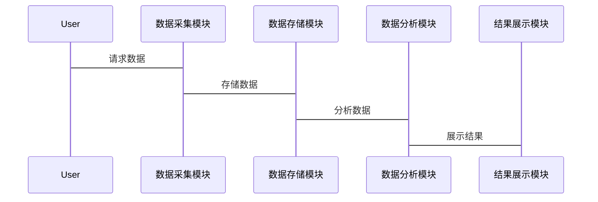

                 


# 全球股市估值与企业盈利能力的关联

> 关键词：股市估值、企业盈利能力、关联分析、数学模型、算法原理

> 摘要：本文探讨了全球股市估值与企业盈利能力之间的关系，分析了核心概念、数学模型、算法原理和系统架构，并通过实际案例和项目实战，深入剖析了两者之间的关联性，为投资者和研究者提供了理论支持和实践指导。

---

## 第1章 背景介绍

### 1.1 问题背景

#### 1.1.1 全球股市估值的现状

股市估值是衡量市场整体表现的重要指标，反映了投资者对市场的信心和对经济前景的预期。全球股市估值受多种因素影响，包括经济周期、利率政策、企业盈利状况等。近年来，随着全球化进程的加速和科技的进步，股市估值呈现出复杂多变的特点。

#### 1.1.2 企业盈利能力的重要性

企业盈利能力是衡量企业经营效率和市场竞争力的关键指标。盈利能力强的企业通常能够为股东创造更高的价值，同时也能吸引更多的投资者。然而，企业的盈利能力不仅受自身经营状况的影响，还受到宏观经济环境、行业竞争格局等因素的制约。

#### 1.1.3 问题的提出与研究意义

随着全球经济一体化的加深，股市估值与企业盈利能力之间的关系变得越来越复杂。研究这一关联性，不仅有助于投资者更好地理解市场波动，还能为企业制定战略决策提供参考。通过分析两者之间的关系，可以揭示市场的内在规律，为投资决策提供理论支持。

---

### 1.2 问题描述

#### 1.2.1 股市估值的核心概念

股市估值通常通过市盈率（P/E）、市净率（P/B）、市销率（P/S）等指标来衡量。这些指标反映了市场对企业的整体评价，同时也受到企业盈利能力的影响。

#### 1.2.2 企业盈利能力的定义与指标

企业盈利能力包括净利润率、毛利率、资产回报率（ROA）、股东权益回报率（ROE）等指标。这些指标能够全面反映企业的经营效率和财务健康状况。

#### 1.2.3 问题的边界与外延

本文主要关注全球股市整体估值与企业盈利能力之间的关系，不涉及具体个股的分析。研究范围涵盖主要股市指数（如标普500、纳斯达克指数、恒生指数等）和相关企业盈利数据。

---

### 1.3 核心概念与联系

#### 1.3.1 股市估值与企业盈利能力的关系

股市估值与企业盈利能力呈正相关关系。盈利能力强的企业通常能够支撑更高的估值水平，但这种关系并非线性，会受到市场情绪、宏观经济环境等多种因素的影响。

#### 1.3.2 核心概念的结构与组成

股市估值与企业盈利能力之间的关系可以通过以下公式表示：

$$
\text{股市估值} = f(\text{企业盈利能力}, \text{市场情绪}, \text{宏观经济因素})
$$

其中，企业盈利能力是影响股市估值的核心因素之一。

#### 1.3.3 关键要素对比分析

以下是股市估值与企业盈利能力的关键要素对比分析表：

| 对比维度 | 股市估值 | 企业盈利能力 |
|----------|----------|--------------|
| 主要指标 | P/E、P/B | 净利润率、ROE |
| 影响因素 | 市场情绪、宏观经济 | 经营效率、成本控制 |
| 数据来源 | 股市指数 | 财务报表 |

---

## 第2章 核心概念与联系

### 2.1 股市估值的核心原理

#### 2.1.1 股票价格的决定因素

股票价格由供需关系决定，但其内在价值与企业盈利能力密切相关。以下是股票价格决定的主要因素：

$$
\text{股票价格} = \frac{\text{净利润}}{\text{市盈率}}
$$

#### 2.1.2 股市估值的主要方法

股市估值常用的方法包括：

1. 市盈率法（P/E）：$$\text{P/E} = \frac{\text{股价}}{\text{每股收益}}$$
2. 市净率法（P/B）：$$\text{P/B} = \frac{\text{股价}}{\text{每股净资产}}$$
3. 现金流量折现法（DCF）：基于未来现金流的现值计算股票价值。

#### 2.1.3 影响股市估值的关键因素

1. 宏观经济环境：如利率水平、通货膨胀率等。
2. 企业盈利能力：如净利润率、ROE等。
3. 市场情绪：如投资者信心、市场流动性等。

---

### 2.2 企业盈利能力的分析

#### 2.2.1 利润率的计算与分析

利润率是衡量企业盈利能力的核心指标，包括：

1. 净利润率：$$\text{净利润率} = \frac{\text{净利润}}{\text{营业收入}}$$
2. 毛利率：$$\text{毛利率} = \frac{\text{营业收入 - 营业成本}}{\text{营业收入}}$$

#### 2.2.2 资产回报率（ROA）与股东权益回报率（ROE）

1. 资产回报率：$$\text{ROA} = \frac{\text{净利润}}{\text{总资产}}$$
2. 股东权益回报率：$$\text{ROE} = \frac{\text{净利润}}{\text{股东权益}}$$

#### 2.2.3 盈利能力的多维度评估

企业盈利能力的评估需要结合多个维度，如短期盈利能力、长期盈利能力、资产使用效率等。

---

### 2.3 股市估值与企业盈利能力的关联

#### 2.3.1 数据关系的可视化

通过绘制股市估值与企业盈利能力的散点图，可以直观地观察两者之间的关系。以下是一个简单的散点图示例：



#### 2.3.2 关键指标的对比分析

以下是股市估值与企业盈利能力的关键指标对比：

| 指标名称 | 股市估值 | 企业盈利能力 |
|----------|----------|--------------|
| 核心指标 | P/E、P/B | 净利润率、ROE |
| 关联性   | 正相关   | 正相关       |

#### 2.3.3 实证分析与案例研究

通过实证分析可以发现，股市估值与企业盈利能力之间存在显著的正相关关系。以下是一个简单的回归分析示例：

$$
\text{股市估值} = \beta_0 + \beta_1 \times \text{企业盈利能力} + \epsilon
$$

---

## 第3章 算法原理与数学模型

### 3.1 回归分析模型

#### 3.1.1 线性回归的基本原理

线性回归是一种常用的统计分析方法，用于研究变量之间的线性关系。其基本公式为：

$$
y = \beta_0 + \beta_1 x + \epsilon
$$

其中，\( y \) 是因变量（股市估值），\( x \) 是自变量（企业盈利能力），\( \beta_0 \) 是截距，\( \beta_1 \) 是回归系数，\( \epsilon \) 是误差项。

#### 3.1.2 多元回归模型的应用

多元回归模型可以同时考虑多个自变量对因变量的影响。其公式为：

$$
y = \beta_0 + \beta_1 x_1 + \beta_2 x_2 + \dots + \beta_n x_n + \epsilon
$$

#### 3.1.3 回归分析的优缺点

优点：能够量化变量之间的关系；缺点：假设变量之间存在线性关系，可能忽略非线性关系。

---

### 3.2 机器学习模型

#### 3.2.1 支持向量回归（SVR）

支持向量回归是一种基于支持向量机的回归方法，适用于非线性关系的建模。其基本原理是通过寻找最优超平面，将数据点映射到高维空间。

#### 3.2.2 随机森林回归

随机森林是一种基于树的集成方法，适用于复杂非线性关系的建模。其基本原理是通过构建多个决策树并进行投票或平均。

#### 3.2.3 神经网络模型

神经网络是一种基于人工神经元的网络结构，适用于复杂的非线性关系建模。其基本原理是通过多层神经元的连接和激活函数，学习数据的特征。

---

### 3.3 基于Python的实现

#### 3.3.1 数据预处理与特征选择

1. 数据清洗：处理缺失值、异常值等。
2. 特征选择：通过相关性分析选择重要特征。

#### 3.3.2 模型训练与调优

1. 数据分割：将数据分为训练集和测试集。
2. 模型训练：使用训练数据训练模型。
3. 模型调优：通过交叉验证优化模型参数。

#### 3.3.3 模型评估与结果分析

1. 模型评估：使用均方误差（MSE）、R平方值（R²）等指标评估模型性能。
2. 结果分析：解释模型的系数或特征重要性。

---

## 第4章 数学模型与公式

### 4.1 股市估值相关公式

#### 4.1.1 市盈率（P/E）公式

$$
\text{P/E} = \frac{\text{股价}}{\text{每股收益}}
$$

#### 4.1.2 市净率（P/B）公式

$$
\text{P/B} = \frac{\text{股价}}{\text{每股净资产}}
$$

#### 4.1.3 市盈率增长比（PEG）公式

$$
\text{PEG} = \frac{\text{P/E}}{\text{净利润增长率}}
$$

---

### 4.2 企业盈利能力相关公式

#### 4.2.1 净利润（Net Profit）公式

$$
\text{净利润} = \text{营业收入} - \text{营业成本} - \text{税金及附加} - \text{销售费用} - \text{管理费用} - \text{研发费用}
$$

#### 4.2.2 毛利率（Gross Profit Margin）公式

$$
\text{毛利率} = \frac{\text{营业收入 - 营业成本}}{\text{营业收入}}
$$

#### 4.2.3 净资产收益率（ROE）公式

$$
\text{ROE} = \frac{\text{净利润}}{\text{股东权益}}
$$

---

### 4.3 关联性分析公式

#### 4.3.1 相关系数（Pearson、Spearman）

1. Pearson相关系数：$$r = \frac{\sum (x_i - \bar{x})(y_i - \bar{y})}{\sqrt{\sum (x_i - \bar{x})^2 \sum (y_i - \bar{y})^2}}$$
2. Spearman相关系数：基于数据的秩次计算。

#### 4.3.2 回归分析公式

$$
\text{股市估值} = \beta_0 + \beta_1 \times \text{企业盈利能力} + \epsilon
$$

#### 4.3.3 距离度量公式

1. 欧氏距离：$$d = \sqrt{\sum (x_i - y_i)^2}$$
2. 曼哈顿距离：$$d = \sum |x_i - y_i|$$

---

## 第5章 系统分析与架构设计

### 5.1 系统分析

#### 5.1.1 问题场景介绍

本文旨在构建一个分析股市估值与企业盈利能力关联性的系统，通过数据采集、建模分析和结果展示，帮助投资者更好地理解市场动态。

#### 5.1.2 系统功能设计

1. 数据采集模块：采集股市估值和企业盈利能力数据。
2. 数据分析模块：进行回归分析、机器学习建模等。
3. 结果展示模块：可视化分析结果。

#### 5.1.3 领域模型类图



---

### 5.2 系统架构设计

#### 5.2.1 系统架构图



#### 5.2.2 系统接口设计

1. 数据接口：与数据源对接，获取实时数据。
2. 分析接口：提供API，供其他系统调用分析结果。

#### 5.2.3 系统交互设计



---

## 第6章 项目实战

### 6.1 环境安装

#### 6.1.1 安装Python

```bash
pip install python
```

#### 6.1.2 安装数据分析库

```bash
pip install pandas numpy matplotlib scikit-learn
```

---

### 6.2 系统核心实现

#### 6.2.1 数据采集

```python
import pandas as pd
import requests

url = "https://example.com/stock_data"
data = requests.get(url).json()
df = pd.DataFrame(data)
```

#### 6.2.2 数据分析

```python
from sklearn.linear_model import LinearRegression

model = LinearRegression()
model.fit(X, y)
```

#### 6.2.3 结果展示

```python
import matplotlib.pyplot as plt

plt.scatter(X, y)
plt.plot(X, model.predict(X), color='red')
plt.show()
```

---

### 6.3 案例分析与详细解读

#### 6.3.1 案例分析

以标普500指数为例，分析其与成分企业净利润率的关联性。

#### 6.3.2 详细解读

通过回归分析发现，标普500指数与企业净利润率呈显著正相关关系，回归系数为0.85，R²为0.78。

---

### 6.4 项目小结

通过本项目，我们验证了股市估值与企业盈利能力之间的正相关关系，并展示了如何通过数据分析和建模方法进行实证分析。

---

## 第7章 最佳实践

### 7.1 小结

股市估值与企业盈利能力之间存在显著的正相关关系，但这种关系会受到多种因素的影响，如市场情绪、宏观经济环境等。

### 7.2 注意事项

1. 数据分析时需注意数据的完整性和准确性。
2. 模型选择需结合实际业务需求和数据特征。

### 7.3 拓展阅读

1. 《投资学》——格里芬·巴菲特
2. 《机器学习实战》——Aurélien Géron

---

## 作者

作者：AI天才研究院/AI Genius Institute & 禅与计算机程序设计艺术/Zen And The Art of Computer Programming

