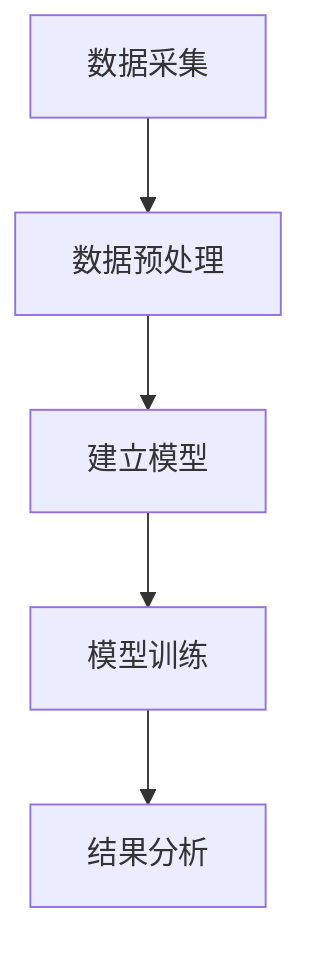
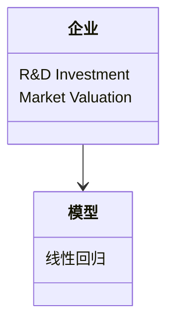
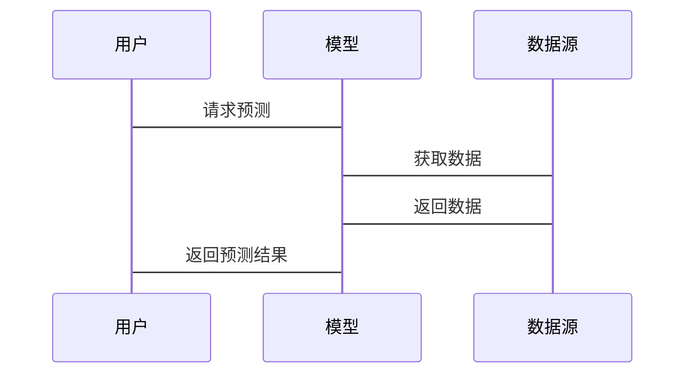

                 


# 全球股市估值与企业研发投入的关系

**关键词：** 股市估值、企业研发投入、线性回归模型、系统架构设计、实际案例分析

**摘要：**  
本文探讨了全球股市估值与企业研发投入之间的关系，通过定义核心概念、建立数学模型、分析数据和案例，揭示了企业研发投入对股市估值的影响。文章详细介绍了算法原理、系统架构设计和实际案例分析，为投资者和研究人员提供了有价值的参考。

---

## 第1章：背景介绍

### 1.1 问题背景

#### 1.1.1 股市估值的重要性
股市估值是衡量企业市场价值的关键指标，反映了投资者对企业的信心和预期。高估值通常意味着市场对公司未来表现的乐观预期，而低估值则可能表明市场对其前景持怀疑态度。

#### 1.1.2 企业研发投入的核心作用
企业研发投入（R&D）是推动创新和经济增长的重要因素。通过研发投入，企业可以开发新产品、改进技术，从而增强竞争力和盈利能力。研发投入的多少往往被视为企业未来增长的潜力指标。

#### 1.1.3 问题提出的现实意义
理解股市估值与研发投入的关系，有助于投资者评估企业的长期潜力，帮助企业制定研发战略，为政策制定者提供参考，促进经济健康发展。

### 1.2 核心概念定义

#### 1.2.1 股市估值的定义与特征
股市估值通常通过市盈率（P/E比率）、市净率（P/B比率）等指标衡量。市盈率=股价/每股收益，市净率=股价/每股净资产。高市盈率可能表明高增长预期，而低市净率可能表明资产被低估。

#### 1.2.2 企业研发投入的定义与分类
企业研发投入包括基础研究、应用研究和试验发展。研发投入通常占销售收入的一定比例，反映了企业的创新力度。

#### 1.2.3 两者关系的初步探讨
初步研究显示，企业研发投入可能与股市估值呈正相关，因为高研发投入可能提升企业的市场地位和盈利能力，从而提高估值。

### 1.3 问题解决路径

#### 1.3.1 研究方法的选择
采用定量分析方法，建立数学模型，使用线性回归分析研发投入与股市估值的关系。

#### 1.3.2 数据来源与处理
数据来源包括全球主要股市的股票数据和企业财务报表。处理步骤包括数据清洗、特征提取和标准化。

#### 1.3.3 研究框架的构建
构建线性回归模型，将研发投入作为自变量，股市估值作为因变量，分析其相关性。

### 1.4 边界与外延

#### 1.4.1 研究范围的界定
研究主要针对上市公司，不包括未上市企业。数据范围限定在过去5年内的全球主要股市。

#### 1.4.2 相关概念的对比
与销售额、净利润等其他财务指标对比，分析研发投入对估值的相对影响。

#### 1.4.3 研究的局限性
模型假设线性关系，可能存在非线性关系未被捕捉的风险。数据可能存在缺失或偏差。

### 1.5 概念结构与核心要素

#### 1.5.1 核心概念的层次结构
企业研发投入 → 影响企业业绩 → 影响股市估值。

#### 1.5.2 核心要素的对比分析
| 要素 | 股市估值 | 企业研发投入 |
|------|----------|--------------|
| 衡量指标 | 市盈率、市净率 | 研究投入金额、占比 |
| 影响因素 | 利润、增长预期 | 技术创新、产品开发 |

#### 1.5.3 概念之间的关系图


---

## 第2章：核心概念与联系

### 2.1 核心概念原理

#### 2.1.1 股市估值的理论基础
股市估值基于市场参与者的预期，反映了企业未来的盈利能力。高研发投入可能提升未来收益，从而提高估值。

#### 2.1.2 企业研发投入的经济学解释
研发投入是企业长期投资，旨在提高生产效率和产品竞争力。研发投入增加可能带来更高的收益，从而影响股价。

#### 2.1.3 两者关系的理论模型
构建线性回归模型，量化研发投入对股市估值的影响。

### 2.2 概念属性特征对比

#### 2.2.1 股市估值的衡量指标
- 市盈率（P/E）：股价/每股收益。
- 市净率（P/B）：股价/每股净资产。

#### 2.2.2 企业研发投入的衡量指标
- 研发投入金额。
- 研发投入占销售收入的比例。

#### 2.2.3 两者属性的对比分析
| 特性 | 股市估值 | 企业研发投入 |
|------|----------|--------------|
| 衡量方式 | 指数、比率 | 金额、比例 |
| 时间维度 | 当前、历史 | 当前、累计 |
| 影响因素 | 利润、增长预期 | 技术创新、市场需求 |

---

## 第3章：算法原理讲解

### 3.1 算法流程图


### 3.2 算法实现代码

```python
import pandas as pd
import numpy as np
from sklearn import linear_model

# 数据加载
data = pd.read_csv('stock_research.csv')

# 特征与目标变量分离
X = data[['R&D Investment']]
y = data['Market Valuation']

# 模型训练
model = linear_model.LinearRegression()
model.fit(X, y)

# 模型预测
predictions = model.predict(X)
```

### 3.3 数学模型与公式

#### 3.3.1 线性回归模型
$$ y = \beta_0 + \beta_1 x + \epsilon $$

#### 3.3.2 优化目标
$$ \text{最小化} \sum_{i=1}^{n} (y_i - (\beta_0 + \beta_1 x_i))^2 $$

### 3.4 实际案例分析

#### 3.4.1 案例背景
选取某科技公司，分析其研发投入与股市估值的关系。

#### 3.4.2 数据分析
计算研发投入与股市估值的线性回归系数，判断相关性。

#### 3.4.3 结果解读
如果回归系数为正，说明研发投入增加会提升股市估值。

---

## 第4章：系统分析与架构设计方案

### 4.1 问题场景介绍

#### 4.1.1 业务场景描述
投资者希望通过分析企业研发投入预测股市估值，做出投资决策。

#### 4.1.2 系统目标
构建一个预测模型，帮助投资者评估企业的市场价值。

#### 4.1.3 使用者角色
投资者、金融分析师、企业战略规划人员。

### 4.2 系统功能设计

#### 4.2.1 领域模型


### 4.3 系统架构设计

#### 4.3.1 系统架构图


#### 4.3.2 系统接口设计
- 数据接口：获取企业研发投入和股市估值数据。
- 模型接口：提供线性回归预测服务。

#### 4.3.3 系统交互


---

## 第5章：项目实战

### 5.1 环境安装

```bash
pip install pandas numpy scikit-learn
```

### 5.2 系统核心实现

#### 5.2.1 数据预处理
```python
# 数据清洗
data.dropna(inplace=True)
data = data[~data['R&D Investment'].isnull()]
```

#### 5.2.2 模型训练
```python
model.fit(X_train, y_train)
```

#### 5.2.3 模型评估
```python
score = model.score(X_test, y_test)
print(f"模型得分：{score}")
```

### 5.3 代码应用解读与分析

#### 5.3.1 代码解读
- 数据加载：读取CSV文件。
- 特征提取：选择研发投入作为自变量。
- 模型训练：使用线性回归模型拟合数据。
- 预测与评估：预测股市估值并评估模型性能。

#### 5.3.2 结果分析
- 回归系数解释：每单位研发投入对股市估值的影响。
- 模型评估指标：R²值表示模型解释力。

### 5.4 实际案例分析

#### 5.4.1 案例背景
分析某科技公司过去5年的研发投入与股市估值变化。

#### 5.4.2 数据分析
计算相关系数，判断研发投入与估值的相关性。

#### 5.4.3 结果解读
如果相关系数显著，说明研发投入对估值有重要影响。

### 5.5 项目小结

#### 5.5.1 成果总结
构建了一个有效的线性回归模型，揭示了研发投入与股市估值的关系。

#### 5.5.2 经验总结
数据清洗和特征选择对模型性能至关重要。模型假设需要根据实际情况调整。

#### 5.5.3 改进方向
探索非线性模型，引入更多变量，如行业因素和宏观经济指标。

---

## 第6章：总结与展望

### 6.1 最佳实践 Tips

#### 6.1.1 小结
企业研发投入是影响股市估值的重要因素，但需结合其他指标综合分析。

#### 6.1.2 注意事项
- 数据质量：确保数据准确完整。
- 模型选择：根据实际情况选择合适模型。
- 结果验证：通过回测检验模型的有效性。

#### 6.1.3 拓展阅读
推荐阅读《投资学》和《机器学习实战》相关章节，深入理解股市分析和机器学习的应用。

### 6.2 结束语
通过本文的分析，读者可以掌握如何利用研发投入预测股市估值，做出更明智的投资决策。

---

**作者：AI天才研究院/AI Genius Institute & 禅与计算机程序设计艺术 /Zen And The Art of Computer Programming**

---

这篇文章系统地探讨了全球股市估值与企业研发投入的关系，通过理论分析、模型构建和案例实践，为读者提供了全面的视角和实用的方法。希望对您在投资决策和企业战略规划中有所帮助。

