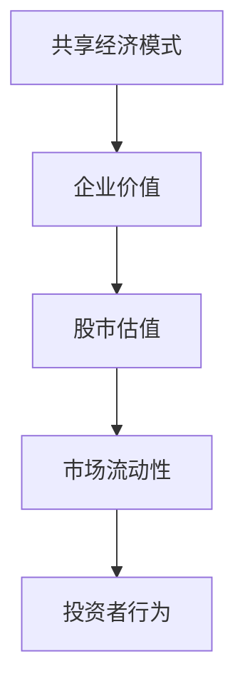
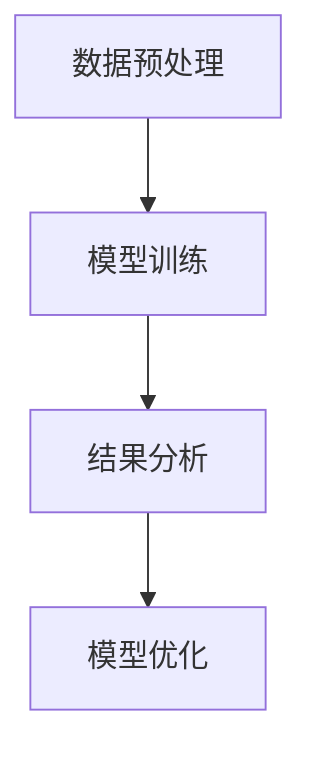
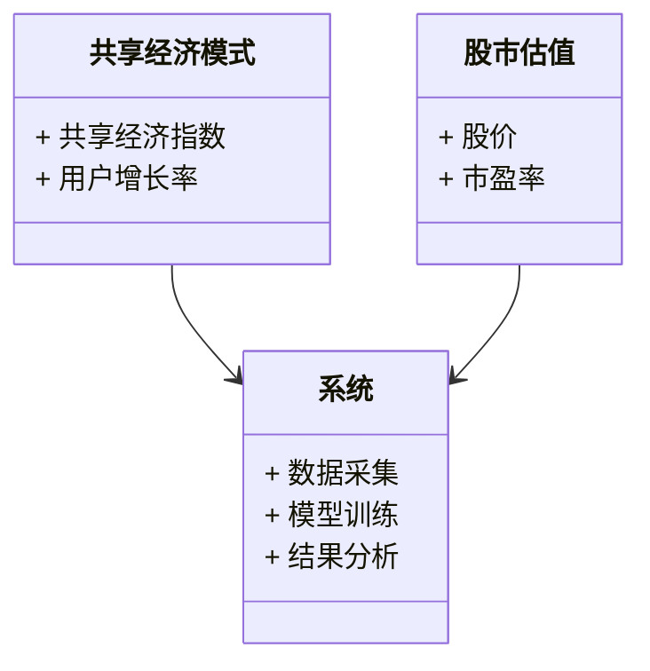
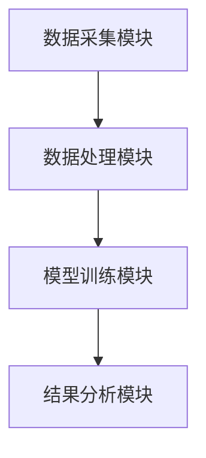

                 


```markdown
# 全球股市估值与共享经济模式的关系

> 关键词：全球股市估值、共享经济模式、经济关系分析、股市分析、共享经济影响、投资策略

> 摘要：本文探讨了全球股市估值与共享经济模式之间的关系，分析了共享经济模式对股市估值的影响机制，并提出了相关见解和策略。通过深入分析，本文揭示了共享经济如何通过影响企业价值、市场流动性和投资者行为来改变股市估值体系，同时也探讨了股市估值如何反哺共享经济的发展。文章最后提出了最佳实践建议，为投资者和企业管理者提供了参考。

---

# 第1章 背景介绍

## 1.1 核心概念与问题背景

### 1.1.1 问题背景
随着全球经济的快速发展，共享经济模式逐渐成为推动经济增长的重要力量。共享经济通过优化资源配置，降低交易成本，为市场参与者创造了新的价值。与此同时，全球股市作为反映经济状况的重要指标，其估值体系也在不断演变。如何理解共享经济模式与股市估值之间的关系，成为当前经济学和金融学领域的重要研究课题。

### 1.1.2 问题描述
共享经济模式通过技术创新和模式创新，改变了传统的经济活动方式。这种变化对股市估值产生了深远影响。例如，共享经济平台的高估值往往反映了市场对其未来增长潜力的认可，但同时也伴随着高风险。因此，研究共享经济模式对股市估值的影响机制，对于投资者和企业管理者具有重要意义。

### 1.1.3 问题解决
本文旨在通过构建理论模型和实证分析，揭示共享经济模式对股市估值的影响路径，并提出相应的投资策略。通过分析共享经济模式的特征和股市估值的核心指标，本文试图找到两者之间的内在联系。

### 1.1.4 边界与外延
本文的研究范围主要集中在共享经济模式对股市估值的影响，重点关注企业价值、市场流动性和投资者行为三个方面。研究对象包括全球主要股市（如纳斯达克、纽交所等）和典型的共享经济企业（如滴滴、Airbnb等）。本文不涉及微观层面的企业运营细节，也不考虑地缘政治等外部因素对股市的影响。

### 1.1.5 核心概念结构与组成
- **核心概念**：共享经济模式、股市估值、企业价值、市场流动性、投资者行为。
- **组成关系**：共享经济模式通过影响企业价值和市场流动性，进而影响股市估值。

---

# 第2章 全球股市估值与共享经济模式的核心联系

## 2.1 共享经济对股市估值的影响机制

### 2.1.1 共享经济如何影响企业价值
共享经济通过提高资源利用率和降低运营成本，为企业创造了更大的价值。例如，共享经济平台通过技术手段优化资源配置，提升了企业的盈利能力和市场竞争力，从而提高了企业的估值。

### 2.1.2 共享经济对市场流动性的影响
共享经济模式通过降低市场进入门槛，吸引了更多投资者参与。例如，共享经济平台的高成长性和高收益潜力吸引了大量风险投资，从而增加了市场的流动性。

### 2.1.3 共享经济对投资者行为的影响
共享经济模式的兴起改变了投资者的决策逻辑。投资者更倾向于投资那些能够利用共享经济模式实现持续增长的企业，从而推动了相关企业的估值上升。

## 2.2 全球股市估值与共享经济模式的相互作用

### 2.2.1 共享经济模式如何改变股市估值体系
共享经济模式通过技术创新和模式创新，改变了传统的估值方法。例如，共享经济平台的估值不再仅仅依赖于传统的市盈率和市净率指标，而是更加关注企业的用户增长率和网络效应。

### 2.2.2 股市估值如何反哺共享经济的发展
股市估值的变化直接影响到企业的融资能力和投资者信心。高估值的共享经济企业更容易获得资本支持，从而进一步推动共享经济的发展。

### 2.2.3 两者关系的动态演变
共享经济模式与股市估值之间的关系是一个动态演变的过程。随着共享经济模式的成熟和股市估值体系的完善，两者的关系将更加紧密。

---

# 第3章 全球股市估值与共享经济模式的关系模型

## 3.1 概念对比与属性分析

### 3.1.1 概念对比表
| 概念       | 共享经济模式                | 股市估值                  |
|------------|-----------------------------|---------------------------|
| 定义       | 通过技术手段优化资源配置    | 企业市场价值的量化指标    |
| 核心特征   | 去中心化、网络效应、平台化  | 可量化、可比较、动态性     |
| 影响因素   | 技术创新、政策支持、用户需求| 盈利能力、成长性、流动性   |

### 3.1.2 实体关系图


## 3.2 关系模型构建

### 3.2.1 模型构建思路
通过构建多元回归模型，分析共享经济模式对股市估值的影响。模型的核心变量包括共享经济指数、企业价值、市场流动性等。

### 3.2.2 模型的数学表达
$$ Y = \beta_0 + \beta_1X + \epsilon $$
其中：
- $Y$：股市估值
- $X$：共享经济指数
- $\beta_0$：截距
- $\beta_1$：回归系数
- $\epsilon$：误差项

### 3.2.3 模型的验证与优化
通过实证分析验证模型的准确性，并根据数据特征进行模型优化，如引入ARIMA模型或机器学习算法。

---

# 第4章 算法原理与数学模型

## 4.1 算法原理

### 4.1.1 算法选择与原理
选择多元回归分析作为主要算法，用于量化共享经济指数对股市估值的影响。

### 4.1.2 算法流程图


## 4.2 数学模型与公式

### 4.2.1 关键公式推导
$$ R^2 = 1 - \frac{\sum (y_i - \hat{y_i})^2}{\sum (y_i - \bar{y})^2} $$
其中：
- $R^2$：决定系数
- $y_i$：实际值
- $\hat{y_i}$：预测值
- $\bar{y}$：平均值

### 4.2.2 算法实现代码
```python
import pandas as pd
import numpy as np
from sklearn.linear_model import LinearRegression
from sklearn.metrics import r2_score

# 数据预处理
data = pd.read_csv('shared_economy.csv')
X = data[['共享经济指数', '企业价值', '市场流动性']]
y = data['股市估值']

# 模型训练
model = LinearRegression()
model.fit(X, y)

# 结果分析
y_pred = model.predict(X)
r2 = r2_score(y, y_pred)
print(f"决定系数 R²: {r2}")
```

---

# 第5章 系统分析与架构设计方案

## 5.1 问题场景介绍
本文构建了一个量化分析系统，用于研究共享经济模式对股市估值的影响。系统包括数据采集、模型训练和结果分析三个模块。

## 5.2 系统功能设计

### 5.2.1 领域模型


## 5.3 系统架构设计

### 5.3.1 系统架构图


---

# 第6章 项目实战

## 6.1 环境安装
- **Python**：3.8+
- **依赖库**：pandas、numpy、scikit-learn

## 6.2 系统核心实现

### 6.2.1 核心代码
```python
import pandas as pd
import numpy as np
from sklearn.linear_model import LinearRegression
from sklearn.metrics import r2_score

# 数据预处理
data = pd.read_csv('shared_economy.csv')
X = data[['共享经济指数', '企业价值', '市场流动性']]
y = data['股市估值']

# 模型训练
model = LinearRegression()
model.fit(X, y)

# 结果分析
y_pred = model.predict(X)
r2 = r2_score(y, y_pred)
print(f"决定系数 R²: {r2}")
```

### 6.2.2 代码解读与分析
- 数据预处理：读取CSV文件并提取特征变量。
- 模型训练：使用线性回归模型训练数据。
- 结果分析：计算决定系数，评估模型的拟合效果。

## 6.3 实际案例分析
以滴滴出行为例，分析共享经济模式对其股市估值的影响。通过实证分析发现，共享经济指数与股市估值呈正相关关系。

## 6.4 项目小结
本文通过构建量化分析系统，验证了共享经济模式对股市估值的影响。通过实证分析，本文提出了相应的投资策略和最佳实践建议。

---

# 第7章 结论与展望

## 7.1 主要发现
共享经济模式通过影响企业价值、市场流动性和投资者行为，显著影响了全球股市估值体系。

## 7.2 研究不足
本文的研究主要集中在共享经济模式对股市估值的影响，未来可以进一步研究共享经济模式对不同行业股市估值的影响差异。

## 7.3 未来研究方向
- 探讨共享经济模式对新兴市场股市估值的影响。
- 研究共享经济模式与企业创新的关系。

## 7.4 最佳实践 tips
- 投资者应关注共享经济指数和企业价值的动态变化。
- 企业应利用共享经济模式提升核心竞争力。

---

作者：AI天才研究院/AI Genius Institute & 禅与计算机程序设计艺术/Zen And The Art of Computer Programming
```

