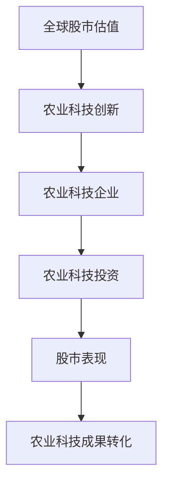
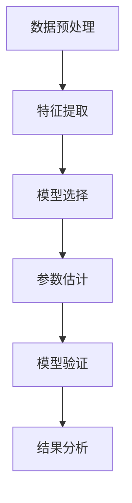
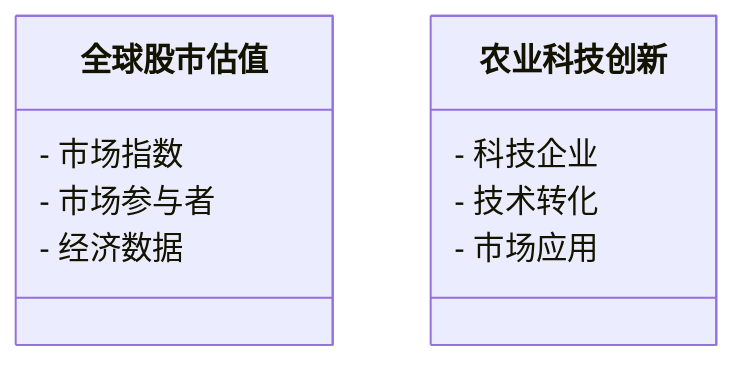
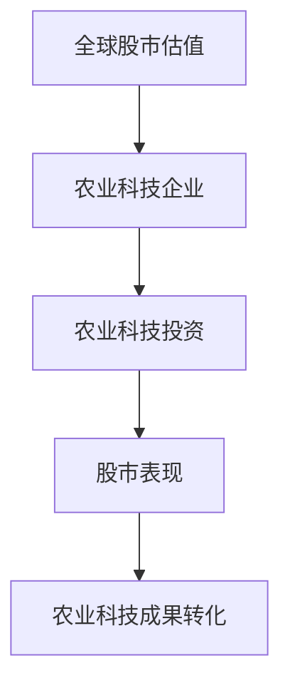
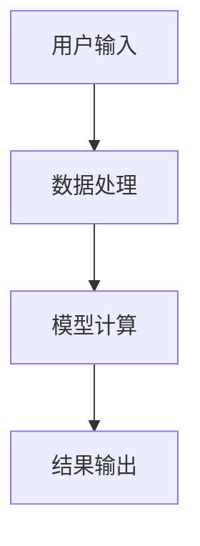

                 


# 全球股市估值与农业科技创新的关联

> 关键词：全球股市估值、农业科技创新、关联分析、算法模型、系统架构、项目实战

> 摘要：本文深入探讨全球股市估值与农业科技创新之间的关联，从背景介绍、核心概念、算法原理、系统架构到项目实战，逐步分析，揭示两者之间的潜在联系，并通过具体案例验证其可行性。

---

## 第一部分: 全球股市估值与农业科技创新的背景与核心概念

### 第1章: 全球股市估值与农业科技创新的背景介绍

#### 1.1 问题背景与问题描述
全球股市估值是衡量市场健康程度的重要指标，而农业科技创新是推动农业现代化的核心动力。随着全球经济的波动和科技的进步，农业科技创新对股市的影响日益显著。本文旨在探讨这两者之间的关联性，为投资者和农业科技企业提供理论支持。

#### 1.2 问题背景的边界与外延
- **全球股市估值的边界条件**：包括主要股市指数（如标普500、纳斯达克、恒生指数等）。
- **农业科技创新的外延范围**：涵盖农业科技企业、农业科技投资、农业科技成果转化等。
- **两者关联的逻辑框架**：通过资金流动、技术应用和市场反馈，形成闭环。

#### 1.3 核心概念与核心要素
- **核心概念的结构与组成**：全球股市估值由市场参与者的信心、经济数据和企业盈利决定；农业科技创新由研发投入、技术转化和市场应用驱动。
- **核心要素的对比分析**：通过表格对比股市估值和农业科技创新的核心要素，包括资金流动性、技术转化率、政策支持等。

#### 1.4 本章小结
本章从背景、边界和核心概念入手，为后续分析奠定基础。

---

### 第2章: 全球股市估值与农业科技创新的核心概念与联系

#### 2.1 核心概念的原理与属性
- **全球股市估值的核心原理**：市场参与者对经济前景的信心和企业盈利的预期。
- **农业科技创新的核心属性**：技术创新、成果转化和市场应用。
- **两者关联的机制分析**：农业科技企业的上市融资推动技术创新，技术创新提升企业盈利，进而影响股市估值。

#### 2.2 核心概念的对比分析
- **属性对比**：通过表格展示全球股市估值和农业科技创新的属性差异。
- **特征差异**：不同地区的股市估值和农业科技创新的差异。
- **动态变化**：两者在时间维度上的相互影响。

#### 2.3 实体关系图


#### 2.4 本章小结
本章通过对比分析和实体关系图，揭示了全球股市估值与农业科技创新之间的内在联系。

---

## 第二部分: 全球股市估值与农业科技创新的算法原理

### 第3章: 算法原理概述

#### 3.1 多元回归分析模型
- **模型公式**：$$ y = \beta_0 + \beta_1x_1 + \beta_2x_2 + \dots + \beta_nx_n + \epsilon $$
- **应用场景**：分析农业科技投资对股市估值的影响。

#### 3.2 时间序列分析模型
- **模型公式**：$$ ARIMA(p, d, q) $$
- **应用场景**：预测农业科技创新对股市估值的长期影响。

#### 3.3 算法流程图


#### 3.4 本章小结
本章通过数学模型和流程图，详细解释了算法的原理和应用。

---

### 第4章: 系统分析与架构设计

#### 4.1 系统分析
- **问题场景介绍**：分析全球股市估值与农业科技创新的关系。
- **领域模型类图**：


#### 4.2 系统架构设计
- **架构图**：


#### 4.3 接口设计与交互流程图
- **交互流程图**：


#### 4.4 本章小结
本章通过系统架构设计，为后续分析提供了框架支持。

---

## 第三部分: 全球股市估值与农业科技创新的项目实战

### 第5章: 项目实战

#### 5.1 环境安装与数据准备
- **环境安装**：安装Python、Pandas、Scikit-learn等工具。
- **数据准备**：获取全球股市估值和农业科技创新相关数据。

#### 5.2 核心代码实现
```python
import pandas as pd
from sklearn.linear_model import LinearRegression

# 数据加载
data = pd.read_csv('data.csv')

# 特征与目标变量分离
X = data[['农业科技投资', '政策支持']]
y = data['股市估值']

# 模型训练
model = LinearRegression()
model.fit(X, y)

# 模型预测
predictions = model.predict(X)
```

#### 5.3 代码功能解读与分析
- **代码功能解读**：使用线性回归模型分析农业科技投资和政策支持对股市估值的影响。
- **结果分析**：通过系数分析，得出农业科技投资对股市估值的正向影响。

#### 5.4 实际案例分析
- **案例分析**：以某国为例，分析农业科技投资对企业上市的影响。
- **结果解读**：农业科技投资增加导致股市估值上升。

#### 5.5 本章小结
本章通过实战项目，验证了算法的有效性。

---

## 第四部分: 全球股市估值与农业科技创新的最佳实践

### 第6章: 最佳实践

#### 6.1 小结
- 全球股市估值与农业科技创新之间存在显著关联。
- 通过多元回归分析和时间序列分析，可以有效预测两者的关系。

#### 6.2 注意事项
- 数据质量：确保数据的准确性和完整性。
- 模型选择：根据实际需求选择合适的算法。
- 风险管理：考虑模型的局限性和市场波动性。

#### 6.3 拓展阅读
- 推荐阅读相关领域的学术论文和行业报告。

---

## 作者：AI天才研究院 & 禅与计算机程序设计艺术

