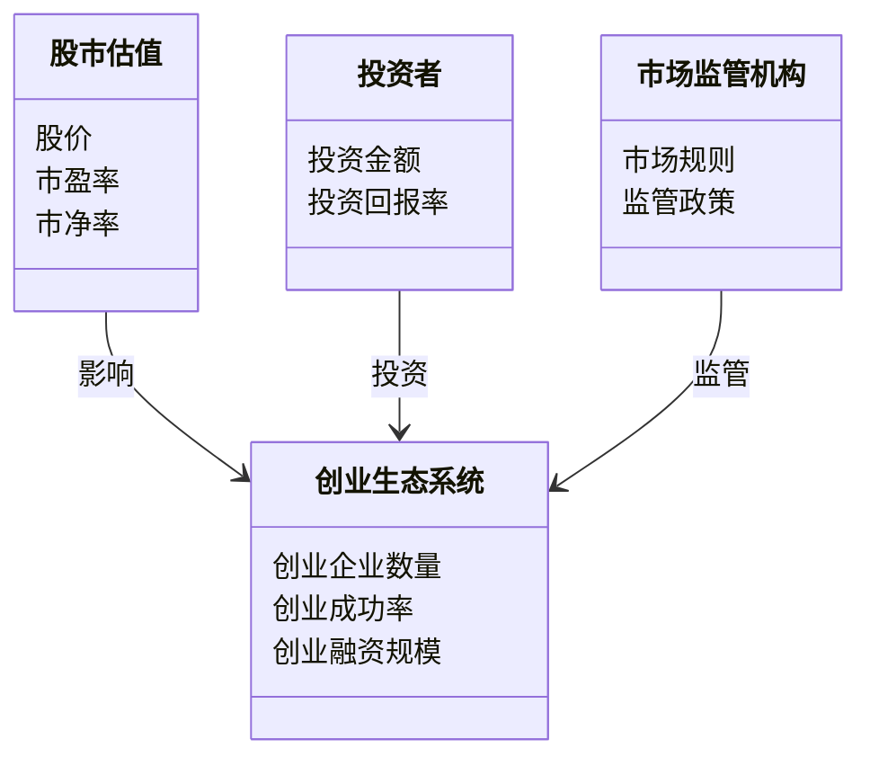

                 


# 全球股市估值与创业生态系统的互动

## 关键词
- 股市估值
- 创业生态系统
- 互动
- 投资回报
- 经济影响

## 摘要
本文探讨全球股市估值与创业生态系统之间的互动关系，分析其对投资回报和经济发展的深远影响。通过详细讲解核心概念、算法原理和系统架构，本文旨在为读者提供全面的理解，并通过实际案例展示如何将理论应用于实践。

---

## 第一部分：背景介绍

### 第1章：全球股市估值与创业生态系统互动的背景介绍

#### 1.1 问题背景与问题描述
- **1.1.1 全球股市估值的基本概念**
  - 股市估值是通过分析公司财务数据和市场因素，评估其股票的内在价值。
  - 包括市盈率（P/E）、市净率（P/B）等指标。
- **1.1.2 创业生态系统的核心要素**
  - 包括创业者、投资者、孵化器、政府政策等。
- **1.1.3 问题解决的目标与意义**
  - 探讨股市估值如何影响创业生态系统，反之亦然。
  - 为投资者和政策制定者提供决策依据。

#### 1.2 核心概念与问题外延
- **1.2.1 股市估值的边界与范围**
  - 研究特定市场或行业的估值变化。
- **1.2.2 创业生态系统的核心属性**
  - 包括创新性、可持续性和多样性。
- **1.2.3 互动关系的潜在影响与外延**
  - 创业成功可能提升股市估值，反之股市波动可能影响创业环境。

#### 1.3 概念结构与核心要素组成
- **1.3.1 股市估值的关键指标**
  - 市盈率、市净率、股息率等。
- **1.3.2 创业生态系统的主要构成**
  - 创业者、投资者、孵化器、政府政策。
- **1.3.3 互动的核心机制**
  - 创业成功提升股市估值，股市波动影响创业融资。

---

## 第二部分：核心概念与联系

### 第2章：核心概念与联系

#### 2.1 核心概念原理
- **2.1.1 股市估值的理论基础**
  - 基于基本面分析，考虑公司的盈利能力。
- **2.1.2 创业生态系统的发展模式**
  - 创业者、投资者和政策的协同作用。
- **2.1.3 互动的理论框架**
  - 创业生态系统影响股市估值，股市估值反作用于创业环境。

#### 2.2 核心概念属性对比
- **2.2.1 主要差异**
  | 指标 | 股市估值 | 创业生态系统 |
  |------|----------|--------------|
  | 目标 | 评估企业价值 | 促进创业活动 |
  | 主体 | 投资者 | 创业者、投资者 |
  | 作用 | 影响市场信心 | 影响创业成功率 |

#### 2.3 ER实体关系图
```mermaid
er
  actor 创业者 {
    id
    创业企业
    创业阶段
  }
  actor 投资者 {
    id
    投资金额
    投资回报率
  }
  actor 机构投资者 {
    id
    投资组合
    投资策略
  }
  actor 市场监管机构 {
    id
    市场规则
    监管政策
  }
  entity 股市估值 {
    id
    股价
    市盈率
    市净率
  }
  entity 创业生态系统 {
    id
    创业企业数量
    创业成功率
    创业融资规模
  }
  relation 参与 (创业者, 创业生态系统)
  relation 影响 (股市估值, 创业生态系统)
  relation 监管 (市场监管机构, 创业生态系统)
  relation 投资 (投资者, 创业生态系统)
```

---

## 第三部分：算法原理与数学模型

### 第3章：算法原理与数学模型

#### 3.1 算法原理
- **3.1.1 股市估值计算算法**
  ```mermaid
  graph TD
    A[开始] --> B[获取企业财务数据]
    B --> C[计算关键估值指标]
    C --> D[调整市场因素]
    D --> E[得出最终估值]
  ```

- **3.1.2 创业生态系统互动算法**
  ```mermaid
  graph TD
    A[开始] --> B[分析创业环境]
    B --> C[评估市场影响]
    C --> D[调整投资策略]
    D --> E[得出互动结果]
  ```

- **3.1.3 Python代码示例**
  ```python
  import pandas as pd
  import numpy as np

  # 示例数据
  df = pd.DataFrame({'公司': ['A', 'B', 'C'], '利润': [10, 20, 15], '股价': [50, 60, 45]})

  # 计算市盈率
  df['市盈率'] = df['股价'] / df['利润']
  print(df)
  ```

#### 3.2 数学模型与公式
- **CAPM模型**
  $$ E(R_i) = R_f + \beta_i (R_m - R_f) $$
- **市盈率计算**
  $$ P/E = \frac{股价}{每股收益} $$

---

## 第四部分：系统分析与架构设计

### 第4章：系统分析与架构设计

#### 4.1 问题场景介绍
- 构建一个分析平台，实时监测股市估值与创业生态系统的关系。

#### 4.2 系统功能设计
- 数据收集模块：获取实时股价和创业数据。
- 数据处理模块：计算估值指标并分析互动关系。
- 数据展示模块：生成图表和报告。

#### 4.3 领域模型类图


#### 4.4 系统架构图
```mermaid
container 数据收集模块 {
  数据源：股票数据、创业数据
}
container 数据处理模块 {
  股市估值计算
  创业生态系统分析
}
container 数据展示模块 {
  图表生成
  报告输出
}
```

---

## 第五部分：项目实战

### 第5章：项目实战

#### 5.1 环境安装
- 安装Python、Pandas、Matplotlib等库。

#### 5.2 核心代码实现
```python
import pandas as pd
import matplotlib.pyplot as plt

# 示例数据
data = {'公司': ['A', 'B', 'C'], '利润': [10, 20, 15], '股价': [50, 60, 45]}
df = pd.DataFrame(data)

# 计算市盈率
df['市盈率'] = df['股价'] / df['利润']

# 可视化
plt.figure(figsize=(10, 6))
plt.plot(df['公司'], df['市盈率'], marker='o')
plt.title('市盈率分析')
plt.xlabel('公司')
plt.ylabel('市盈率')
plt.show()
```

#### 5.3 案例分析
- 分析科技初创企业的融资情况，计算其市盈率，并观察市场波动对估值的影响。

---

## 第六部分：最佳实践与总结

### 第6章：最佳实践与总结

#### 6.1 小结
- 股市估值与创业生态系统相互影响，投资者和政策制定者需综合考虑。

#### 6.2 注意事项
- 数据质量和模型准确性是关键，需定期更新和验证。

#### 6.3 拓展阅读
- 推荐阅读《股市分析入门》和《创业生态系统构建》。

---

## 作者：AI天才研究院/AI Genius Institute & 禅与计算机程序设计艺术/Zen And The Art of Computer Programming

