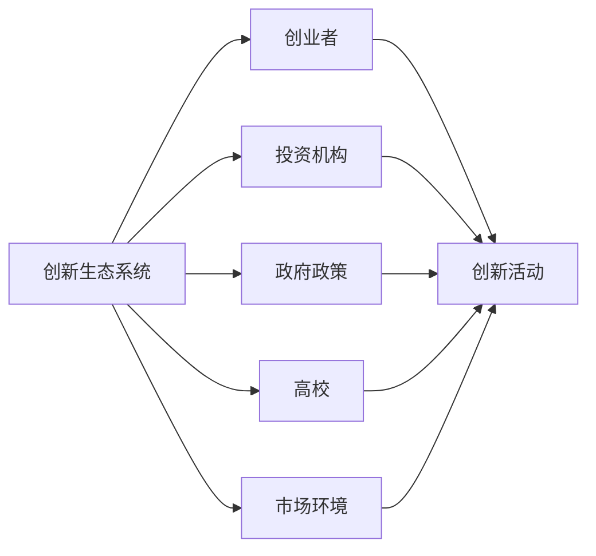
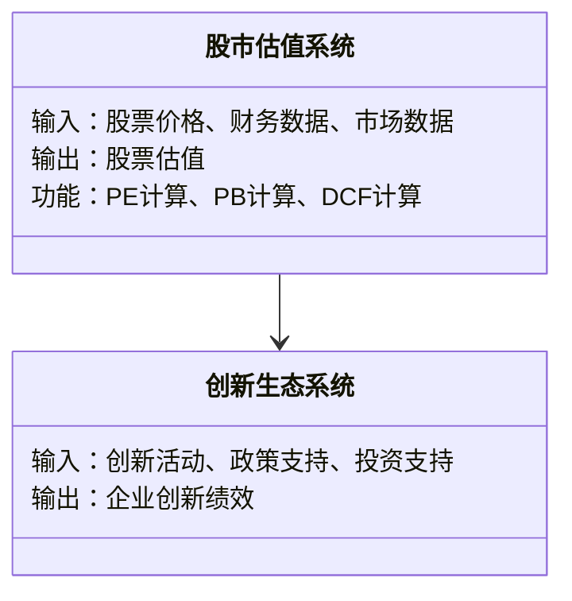
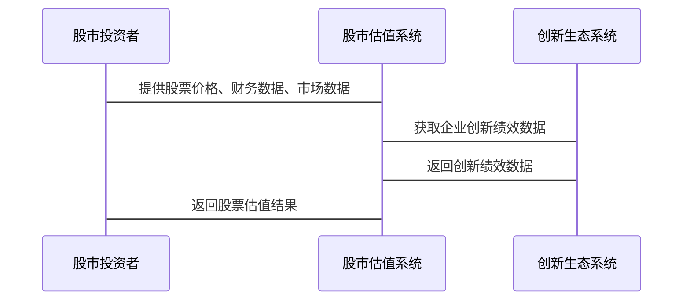
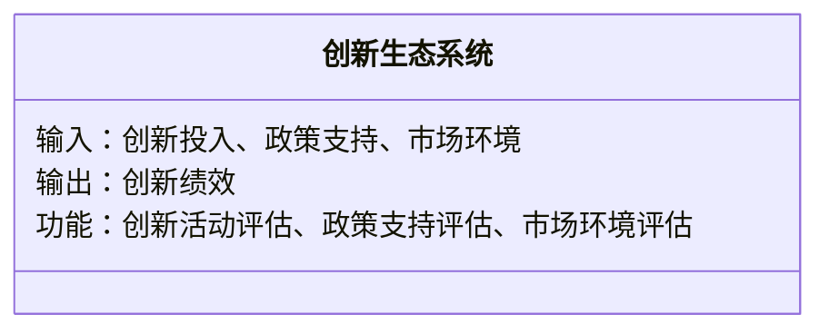
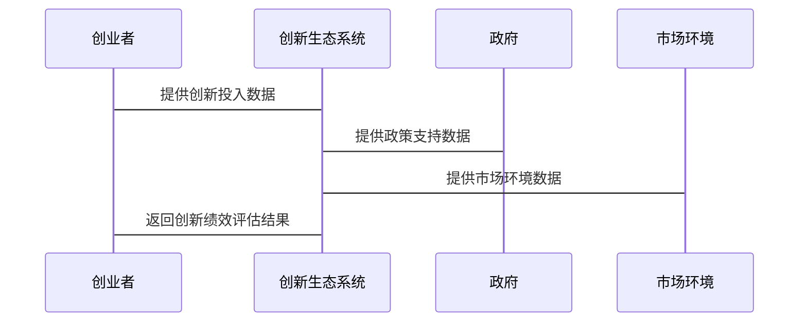

                 


# 全球股市估值与创新创业生态系统的关系

> 关键词：全球股市估值，创新创业生态系统，关系分析，数学模型，系统架构

> 摘要：本文探讨了全球股市估值与创新创业生态系统之间的复杂关系，通过分析股市估值的核心方法与模型，创新创业生态系统的核心要素与系统架构，以及两者之间的相互影响机制，深入揭示了创新生态系统如何通过影响企业的创新能力和市场表现，进而影响股市估值的变化。本文还结合实际案例，分析了创新生态系统对股市估值的具体影响路径，并提出了优化创新生态系统以提升股市估值的具体策略。

---

## 第一章：全球股市估值与创新创业生态系统的关系概述

### 1.1 问题背景

#### 1.1.1 全球股市估值的基本概念
股市估值是通过对企业的财务数据和市场表现进行分析，评估其股票的内在价值。常用的方法包括市盈率（PE）、市净率（PB）、现金流折现模型（DCF）等。这些方法旨在为企业和投资者提供一个合理的估值基准，帮助市场参与者做出更明智的投资决策。

#### 1.1.2 创新创业生态系统的核心要素
创新创业生态系统由多个关键要素构成，包括：
- 创业者：创新的核心驱动力。
- 投资机构：为创新提供资金支持。
- 政府政策：通过税收优惠、补贴等激励创新。
- 高等教育机构与研究机构：提供技术和知识支持。
- 市场环境：包括竞争程度、消费者需求等。

#### 1.1.3 问题描述：股市估值与创新生态系统的关系
随着全球经济的快速发展，创新创业生态系统在全球经济中的作用日益重要。然而，股市估值与创新生态系统之间的关系尚未被系统性地研究和量化。如何将创新生态系统的动态变化与股市估值的变化联系起来，是当前研究中的一个重要课题。

### 1.2 核心概念与联系

#### 1.2.1 核心概念原理
- 股市估值：通过财务指标和市场数据，评估企业的内在价值。
- 创新生态系统：由多个要素构成的复杂系统，支持和促进创新活动。

#### 1.2.2 创新生态系统与股市估值的属性特征对比（表格）

| 属性       | 创新生态系统         | 股市估值         |
|------------|--------------------|-----------------|
| 核心要素    | 创业者、投资机构、政府政策、高校、市场环境 | 财务数据、市场数据 |
| 影响因素    | 创新能力、政策支持、资金支持 | 盈利能力、成长性、市场情绪 |
| 目标        | 促进创新和技术进步   | 为投资者提供估值基准 |

#### 1.2.3 ER实体关系图架构（Mermaid流程图）



### 1.3 研究意义与目标

#### 1.3.1 研究意义
- 通过分析股市估值与创新生态系统的关系，可以更好地理解创新对经济发展的推动作用。
- 为投资者和政策制定者提供科学依据，帮助他们做出更明智的决策。

#### 1.3.2 研究目标
- 探讨创新生态系统对股市估值的具体影响路径。
- 提出优化创新生态系统以提升股市估值的具体策略。

---

## 第二章：全球股市估值的分析与模型

### 2.1 股市估值的基本方法

#### 2.1.1 市盈率（PE）模型
市盈率是衡量股票价值的重要指标，公式为：

$$ PE = \frac{Price}{Earnings} $$

其中，Price为股票价格，Earnings为每股收益。

#### 2.1.2 市净率（PB）模型
市净率是股票价格与每股净资产的比率，公式为：

$$ PB = \frac{Price}{Book\ Value\ Per\ Share} $$

#### 2.1.3 现金流折现模型（DCF）
DCF模型通过将未来现金流折现到现值，评估企业的内在价值。公式为：

$$ V = \sum_{t=1}^{n} \frac{CF_t}{(1+r)^t} + \frac{TV}{(1+r)^n} $$

其中，\( CF_t \) 为第t年的现金流，\( r \) 为折现率，\( TV \) 为终值。

### 2.2 股市估值的数学模型

#### 2.2.1 PE模型公式
$$ PE = \frac{Price}{Earnings} $$

#### 2.2.2 DCF模型公式
$$ V = \sum_{t=1}^{n} \frac{CF_t}{(1+r)^t} + \frac{TV}{(1+r)^n} $$

#### 2.2.3 模型的优缺点对比（表格）

| 模型       | 优点                     | 缺点                     |
|------------|--------------------------|--------------------------|
| PE模型     | 简单易懂，适用于盈利稳定的企业 | 无法反映资产质量，适用于亏损企业时效果不佳 |
| PB模型     | 考虑了资产价值，适用于资产密集型企业 | 不能反映盈利能力，适用于亏损企业时效果不佳 |
| DCF模型     | 能够全面反映企业未来现金流，适合长期估值 | 计算复杂，需要准确预测未来现金流 |

### 2.3 股市估值的系统分析

#### 2.3.1 问题场景介绍
本文以全球股市为研究对象，分析不同市场的股市估值差异及其背后的原因。

#### 2.3.2 系统功能设计（领域模型Mermaid类图）



#### 2.3.3 系统架构设计（Mermaid架构图）

```mermaid
C4Context
    Client 股市投资者
    Server 股市估值系统
    Database 股市数据
    Participant 创新生态系统
```

#### 2.3.4 系统接口设计与交互（Mermaid序列图）



---

## 第三章：创新创业生态系统的核心要素与分析

### 3.1 创新创业生态系统的核心要素

#### 3.1.1 创业者
创业者是创新生态系统的核心驱动力，他们的创新能力和企业家精神直接影响企业的市场表现。

#### 3.1.2 投资机构
投资机构为企业提供资金支持，帮助其进行技术创新和市场扩展。

#### 3.1.3 政府政策
政府政策通过税收优惠、补贴等激励措施，支持企业的创新活动。

#### 3.1.4 高等教育机构与研究机构
高校和研究机构为企业提供技术支持和知识储备，是创新生态系统的重要组成部分。

#### 3.1.5 市场环境
市场环境包括竞争程度、消费者需求等，直接影响企业的创新能力和市场表现。

### 3.2 创新创业生态系统的数学模型

#### 3.2.1 创新生态系统模型
$$ I = C + V + P $$

其中，\( I \) 为创新绩效，\( C \) 为创新投入，\( V \) 为创新能力和 \( P \) 为政策支持。

#### 3.2.2 创业生态系统模型
$$ E = S + I + F $$

其中，\( E \) 为创业绩效，\( S \) 为创业支持，\( I \) 为创新能力和 \( F \) 为市场环境。

### 3.3 创新创业生态系统的系统分析

#### 3.3.1 系统架构设计（Mermaid架构图）


#### 3.3.2 系统功能模块（Mermaid类图）



#### 3.3.3 系统接口设计与交互（Mermaid序列图）



---

## 第四章：全球股市估值与创新创业生态系统的关系分析

### 4.1 关系的核心机制

#### 4.1.1 创新驱动的股市估值提升
创新能力强的企业通常具有更高的市场估值，因为它们能够通过技术创新和产品升级获得更高的盈利能力。

#### 4.1.2 创业生态系统对股市的影响
创业生态系统的完善能够降低创业门槛，吸引更多的创新资源，从而提升企业的创新能力和市场表现。

#### 4.1.3 政策与市场环境的调节作用
政府政策和市场环境对创新生态系统和股市估值具有双重调节作用。积极的政策和良好的市场环境能够促进创新，进而提升股市估值。

### 4.2 关系的数学模型与分析

#### 4.2.1 综合关系模型
$$ V = f(I, P, S) $$

其中，\( V \) 为股市估值，\( I \) 为创新绩效，\( P \) 为政策支持，\( S \) 为市场环境。

---

## 第五章：案例分析与实际应用

### 5.1 案例分析

#### 5.1.1 案例背景
以某科技公司为例，分析其创新生态系统对其股市估值的具体影响。

#### 5.1.2 案例分析步骤
1. 收集公司的财务数据和市场数据。
2. 评估公司的创新能力和市场表现。
3. 分析创新生态系统对股市估值的具体影响路径。

#### 5.1.3 案例结论
创新能力强的企业通常具有更高的股市估值，因为它们能够通过技术创新和产品升级获得更高的盈利能力。

### 5.2 实际应用

#### 5.2.1 环境安装
- 数据获取：通过金融数据库获取企业的财务数据和市场数据。
- 工具安装：安装数据分析工具（如Python、R）和可视化工具（如Matplotlib、Tableau）。

#### 5.2.2 核心实现源代码
```python
import pandas as pd
import numpy as np

# 示例代码：计算市盈率
def calculate_pe(stock_price, earnings_per_share):
    return stock_price / earnings_per_share

# 示例代码：计算市净率
def calculate_pb(stock_price, book_value_per_share):
    return stock_price / book_value_per_share

# 示例代码：计算现金流折现模型
def calculate_dcf(cash_flows, discount_rate, terminal_value):
    return sum(cash_flows / (1 + discount_rate)**t for t in range(len(cash_flows))) + terminal_value / (1 + discount_rate)**len(cash_flows)
```

#### 5.2.3 代码应用解读与分析
通过上述代码，可以计算企业的市盈率、市净率和现金流折现模型，从而评估其股票的内在价值。

---

## 第六章：总结与展望

### 6.1 总结

#### 6.1.1 核心结论
- 创新生态系统是影响股市估值的重要因素。
- 创新能力强的企业通常具有更高的股市估值。
- 政府政策和市场环境对创新生态系统和股市估值具有双重调节作用。

#### 6.1.2 研究意义
通过分析股市估值与创新生态系统的关系，可以更好地理解创新对经济发展的推动作用，为投资者和政策制定者提供科学依据。

### 6.2 展望

#### 6.2.1 未来研究方向
- 探讨创新生态系统对股市估值的具体影响路径。
- 提出优化创新生态系统以提升股市估值的具体策略。

#### 6.2.2 注意事项
- 创新生态系统是一个复杂的系统，需要综合考虑多个因素。
- 股市估值受多种因素影响，需要结合实际情况进行分析。

#### 6.2.3 拓展阅读
- 推荐阅读相关领域的经典文献，深入理解创新生态系统和股市估值的理论与实践。

---

## 作者信息

作者：AI天才研究院/AI Genius Institute & 禅与计算机程序设计艺术/Zen And The Art of Computer Programming

---

以上是文章的完整内容，涵盖了从背景介绍到系统分析的各个方面，结合实际案例和数学模型，深入探讨了全球股市估值与创新创业生态系统之间的关系。

