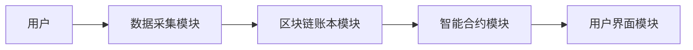

                 


# 全球股市估值与区块链在供应链金融中的应用

> 关键词：全球股市估值、区块链、供应链金融、分布式账本、智能合约

> 摘要：本文深入探讨了全球股市估值的基本概念、核心模型以及区块链技术在供应链金融中的创新应用。通过结合区块链技术的特性，分析了其如何解决供应链金融中的痛点，如透明度低、信任成本高等问题。同时，本文详细介绍了区块链技术在供应链金融中的具体应用场景、系统架构设计以及实际案例分析，展示了区块链技术如何赋能供应链金融，提升整体效率和安全性。

---

## 第1章：全球股市估值的背景与意义

### 1.1 股票估值的基本概念

股票估值是通过对公司财务数据和市场环境的分析，估算其股票的内在价值，以确定其合理的价格区间。股票估值不仅是投资者进行决策的重要依据，也是资本市场健康运行的基础。

#### 1.1.1 什么是股票估值
股票估值是通过分析公司财务状况、行业地位、市场前景等因素，评估其股票的内在价值。股票估值可以帮助投资者判断股票是否被高估或低估，从而做出投资决策。

#### 1.1.2 股票估值的重要性
股票估值是资本市场中不可或缺的一部分。它不仅帮助投资者做出明智的投资决策，还为公司提供了一种衡量自身价值的方式。合理的股票估值有助于市场的稳定运行和资源的优化配置。

#### 1.1.3 全球股市估值的现状与趋势
随着全球经济一体化的加深，全球股市估值的复杂性和重要性也在不断增加。投资者需要考虑的因素包括宏观经济环境、行业趋势、公司基本面等。同时，技术的进步也为股票估值提供了新的工具和方法，如大数据分析和人工智能技术。

---

### 1.2 股票估值的核心模型

股票估值的核心模型主要基于公司财务数据和市场环境分析。以下是几种常用的股票估值模型：

#### 1.2.1 市盈率（P/E）模型
市盈率是股票价格与每股收益的比率，用于衡量投资者对股票的支付意愿。公式如下：
$$P/E = \frac{\text{股价}}{\text{每股收益}}$$

#### 1.2.2 市净率（P/B）模型
市净率是股票价格与每股净资产的比率，用于衡量股票是否被低估。公式如下：
$$P/B = \frac{\text{股价}}{\text{每股净资产}}$$

#### 1.2.3 现金流折现模型（DCF）
DCF模型通过将未来现金流折现到现值，估算公司的内在价值。公式如下：
$$V = \sum_{t=1}^{n} \frac{CF_t}{(1+r)^t} + \frac{TV}{(1+r)^n}$$
其中，$CF_t$ 是第 $t$ 年的现金流，$r$ 是折现率，$TV$ 是终值。

---

## 第2章：区块链技术的核心原理

### 2.1 区块链的基本概念

区块链是一种分布式账本技术，通过去中心化的共识机制和加密技术，实现数据的安全存储和信任传递。

#### 2.1.1 分布式账本
分布式账本是指数据分散存储在网络中的多个节点上，每个节点都有一份完整的账本副本。通过这种方式，区块链技术确保了数据的透明性和不可篡改性。

#### 2.1.2 共识机制
共识机制是区块链技术的核心，用于确保所有节点达成一致。常见的共识机制包括工作量证明（PoW）、权益证明（PoS）和实用拜占庭容错（PBFT）等。

#### 2.1.3 智能合约
智能合约是区块链上的自动执行程序，能够在满足特定条件时自动执行预设的操作。智能合约的应用可以大大降低信任成本，提高交易效率。

---

### 2.2 区块链技术的数学模型

区块链技术的数学模型主要体现在共识机制和加密算法中。以下是一个简单的区块链共识机制模型：

$$
\text{共识机制} = \begin{cases}
\text{PoW} & \text{如果采用工作量证明} \\
\text{PoS} & \text{如果采用权益证明}
\end{cases}
$$

---

## 第3章：区块链技术在供应链金融中的应用

### 3.1 供应链金融的传统模式与挑战

供应链金融是通过整合供应链上下游企业，提供融资支持的一种金融服务模式。然而，传统供应链金融存在以下痛点：

#### 3.1.1 信息孤岛
由于信息分散在不同的企业中，供应链上下游企业之间的信息不透明，导致融资难度大。

#### 3.1.2 信任成本高
传统的供应链金融模式依赖于中心化机构的信任背书，信任成本高且效率低。

#### 3.1.3 融资渠道有限
中小型企业由于缺乏足够的抵押品或信用记录，难以获得融资支持。

---

### 3.2 区块链技术解决供应链金融痛点的方案

区块链技术通过去中心化、不可篡改和自动执行的特点，为供应链金融提供了新的解决方案。

#### 3.2.1 提高透明度
区块链技术可以实现供应链数据的实时共享，消除信息孤岛，提高整个供应链的透明度。

#### 3.2.2 降低信任成本
通过智能合约和分布式账本，区块链技术可以自动执行合同条款，减少对中心化机构的信任依赖。

#### 3.2.3 提升效率
区块链技术可以简化融资流程，实现自动化审批和结算，大大提高了供应链金融的效率。

---

## 第4章：区块链技术在供应链金融中的具体应用

### 4.1 应收账款融资

应收账款融资是供应链金融中的典型应用场景。通过区块链技术，可以实现应收账款的数字化和可追踪性，降低融资风险。

#### 4.1.1 应收账款的数字化
通过区块链技术，应收账款可以被记录在区块链上，形成不可篡改的数字凭证。

#### 4.1.2 应收账款融资的流程优化
区块链技术可以实现应收账款的快速确权和流转，简化融资流程，提高融资效率。

---

### 4.2 存货融资

存货融资是基于企业库存货物的融资方式。通过区块链技术，可以实现存货的实时监控和管理，降低融资风险。

#### 4.2.1 存货的实时监控
通过区块链技术，可以实时监控存货的状态和位置，确保存货的真实性和完整性。

#### 4.2.2 存货融资的自动化管理
区块链技术可以实现存货融资的自动化管理，包括质押、监控和解质押等流程。

---

## 第5章：系统设计与实现

### 5.1 系统设计概述

#### 5.1.1 系统功能模块
- 数据采集模块：负责采集供应链上下游企业的数据。
- 区块链账本模块：负责存储和管理供应链数据。
- 智能合约模块：负责自动执行合同条款。
- 用户界面模块：提供用户交互界面。

#### 5.1.2 系统架构设计
以下是系统架构的mermaid图：



---

## 第6章：项目实战与应用

### 6.1 项目环境搭建

#### 6.1.1 开发工具安装
- 安装区块链开发框架（如Hyperledger Fabric）
- 安装智能合约开发工具（如Solidity）

#### 6.1.2 系统核心代码实现
以下是智能合约的示例代码：

```solidity
// SPDX-License-Identifier: MIT
pragma solidity ^0.8.0;

contract SupplyChain {
    struct Product {
        uint256 id;
        string name;
        uint256 quantity;
        uint256 price;
        address owner;
    }

    Product[] public products;

    function addProduct(uint256 id, string memory name, uint256 quantity, uint256 price, address owner) public {
        products.push(Product(id, name, quantity, price, owner));
    }

    function transferProduct(uint256 id, address newOwner) public {
        Product storage product = products[id];
        product.owner = newOwner;
    }
}
```

---

## 第7章：总结与展望

### 7.1 总结

区块链技术在供应链金融中的应用前景广阔。通过区块链技术，可以实现供应链数据的透明共享，降低信任成本，提高融资效率。同时，区块链技术也为全球股市估值提供了新的工具和方法，推动了资本市场的创新发展。

### 7.2 展望

未来，随着区块链技术的进一步发展，其在供应链金融中的应用将更加广泛和深入。通过与人工智能、大数据等技术的结合，区块链技术将为供应链金融带来更多的创新和变革。

---

作者：AI天才研究院 & 禅与计算机程序设计艺术

