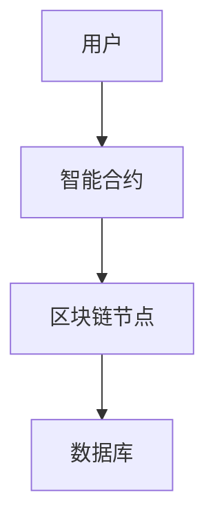

                 


# 全球股市估值与区块链应用的关联

> 关键词：股市估值，区块链，金融创新，分布式 ledger，智能合约，去中心化

> 摘要：本文系统地探讨了区块链技术如何影响全球股市估值，分析了区块链技术在金融领域的应用潜力，以及其对股市估值模型的数学建模和实际影响。文章通过技术原理、系统设计和项目实战三个层面，深入剖析了区块链技术对股市估值的深远影响，并提出了未来研究方向。

---

# 第一部分: 全球股市估值与区块链应用的背景与概念

## 第1章: 全球股市估值的基本概念

### 1.1 股市估值的定义与方法

#### 1.1.1 股市估值的基本概念
股市估值是指通过对上市公司的财务数据、市场环境和行业趋势等多方面因素的分析，确定公司股票的内在价值。常见的估值方法包括市盈率（P/E）、市净率（P/B）、股息率等。这些方法帮助投资者判断股票是否被高估或低估。

#### 1.1.2 常用的股市估值方法
1. **市盈率（P/E）**：股价与每股收益的比率。
2. **市净率（P/B）**：股价与每股净资产的比率。
3. **股息率**：每股股息与股价的比率。
4. **现金流折现法（DCF）**：通过未来现金流的现值计算公司价值。

#### 1.1.3 股市估值的影响因素
1. **宏观经济因素**：GDP增速、利率、通货膨胀等。
2. **行业因素**：行业景气度、竞争格局等。
3. **公司基本面**：收入、利润、资产负债情况等。
4. **市场情绪**：投资者情绪、市场流动性等。

### 1.2 区块链技术的基本概念

#### 1.2.1 区块链的定义与特点
区块链是一种去中心化的分布式账本技术，通过密码学和共识机制确保数据的安全性和不可篡改性。其特点包括去中心化、透明性、不可篡改性和可追溯性。

#### 1.2.2 区块链的核心技术原理
1. **分布式 ledger**：数据存储在多个节点，确保数据一致性。
2. **共识机制**：通过算法达成节点对账本一致性的共识。
3. **智能合约**：自动执行的脚本，用于自动化交易和操作。

#### 1.2.3 区块链的应用场景
1. **金融领域**：跨境支付、证券交易、供应链金融。
2. **法律领域**：智能合约、电子签名。
3. **物联网**：设备间的自动交互。

## 第2章: 股市估值与区块链的初步关联

### 2.1 区块链在金融领域的应用潜力

#### 2.1.1 区块链在金融领域的优势
1. **提高透明度**：区块链的公开账本确保交易的透明性。
2. **降低交易成本**：去中心化减少了中间环节，提高了效率。
3. **增强安全性**：区块链通过密码学确保数据安全。

#### 2.1.2 区块链对金融行业的潜在影响
1. **降低金融中介成本**：通过区块链技术减少对传统金融机构的依赖。
2. **提高交易速度**：区块链的去中心化特性使得交易更快捷。
3. **增强金融包容性**：让更多人能够参与到金融市场中。

### 2.2 区块链技术如何影响股市估值

#### 2.2.1 区块链对金融透明度的提升
区块链的公开账本使得股市交易更加透明，投资者可以更准确地评估公司的价值。

#### 2.2.2 区块链对交易效率的优化
通过智能合约和分布式 ledger，区块链可以提高交易效率，降低交易成本。

### 2.3 本章小结
本章探讨了区块链技术在金融领域的应用潜力，并初步分析了其对股市估值的影响。通过区块链技术的透明性和高效性，可以提升股市估值的准确性和效率。

---

# 第二部分: 区块链技术对股市估值的深层影响

## 第3章: 区块链技术的核心原理

### 3.1 区块链的共识机制

#### 3.1.1 共识机制的定义
共识机制是指在去中心化系统中，所有节点就账本内容达成一致的过程。

#### 3.1.2 常见的共识算法
1. **工作量证明（PoW）**：比特币采用的共识机制。
2. **权益证明（PoS）**：以太坊曾采用的共识机制。

#### 3.1.3 共识机制对股市估值的影响
共识机制的效率和安全性直接影响股市交易的可信度和效率，进而影响股市估值。

### 3.2 区块链的智能合约

#### 3.2.1 智能合约的定义与特点
智能合约是区块链上的自动执行脚本，根据预设条件自动执行交易或操作。

#### 3.2.2 智能合约的执行流程
1. **触发条件**：智能合约根据设定的条件自动执行。
2. **自动执行**：智能合约执行预设的操作，如转账、结算等。
3. **记录日志**：区块链记录智能合约的执行情况。

#### 3.2.3 智能合约在股市估值中的应用
通过智能合约实现自动化的股票交易和结算，提高交易效率，降低交易成本。

### 3.3 区块链的安全性与去中心化

#### 3.3.1 区块链的安全性机制
区块链通过密码学和共识机制确保数据的安全性，防止数据篡改。

#### 3.3.2 去中心化对金融系统的影响
去中心化减少了对传统金融机构的依赖，提高了金融系统的抗风险能力。

#### 3.3.3 去中心化对股市估值的潜在影响
去中心化提高了金融系统的透明度和效率，从而影响股市估值。

## 第4章: 区块链技术对股市估值的数学模型分析

### 4.1 区块链技术对金融市场的数学建模

#### 4.1.1 数学建模的基本方法
通过建立数学模型，分析区块链技术对股市估值的影响。

#### 4.1.2 区块链技术对金融市场的变量分析
1. **交易速度**：区块链提高了交易速度，影响股市的流动性。
2. **交易成本**：区块链降低了交易成本，影响股市的估值模型。
3. **透明度**：区块链提高了透明度，影响投资者的决策。

#### 4.1.3 区块链技术对股市估值的数学模型
$$ V = f(T, C, T) $$
其中，\( V \) 表示股票的估值，\( T \) 表示交易速度，\( C \) 表示交易成本，\( T \) 表示透明度。

### 4.2 区块链技术对股市估值的影响公式

#### 4.2.1 影响公式的基本结构
$$ V = \alpha \cdot T + \beta \cdot C + \gamma \cdot T $$
其中，\( \alpha \)、\( \beta \)、\( \gamma \) 是系数，表示各因素对估值的影响程度。

#### 4.2.2 公式中的变量解释
- \( T \)：交易速度，区块链技术提高了交易速度，对估值有正面影响。
- \( C \)：交易成本，区块链技术降低了交易成本，对估值有正面影响。
- \( T \)：透明度，区块链技术提高了透明度，对估值有正面影响。

#### 4.2.3 公式的实际应用案例
假设某公司股票的估值模型中，交易速度、交易成本和透明度分别对估值的影响系数为 0.4、0.3 和 0.3。当区块链技术实施后，交易速度提高了 20%，交易成本降低了 15%，透明度提高了 10%。则新的估值为：
$$ V = 0.4 \cdot 1.2 + 0.3 \cdot 0.85 + 0.3 \cdot 1.1 = 0.48 + 0.255 + 0.33 = 1.065 $$

### 4.3 数学模型的验证与优化

#### 4.3.1 模型的验证方法
通过实际数据验证模型的准确性，调整系数以提高模型的预测能力。

#### 4.3.2 模型的优化策略
引入更多的变量，如市场情绪、行业趋势等，提高模型的全面性。

#### 4.3.3 模型的实际效果分析
通过对比区块链实施前后的数据，验证模型的预测能力。

## 第5章: 区块链技术在股市估值中的系统设计

### 5.1 系统需求分析

#### 5.1.1 系统目标
设计一个基于区块链的股市估值系统，提高估值的准确性和效率。

#### 5.1.2 系统功能需求
1. **数据采集**：采集上市公司的财务数据和市场数据。
2. **智能合约**：根据设定的条件自动计算股票估值。
3. **数据存储**：将数据存储在区块链上，确保数据的安全性和可追溯性。

#### 5.1.3 系统性能需求
1. **高可用性**：系统能够7x24小时稳定运行。
2. **高扩展性**：系统能够支持大量的数据和交易。

### 5.2 系统架构设计

#### 5.2.1 系统架构图


#### 5.2.2 模块划分与功能分配
1. **用户模块**：用户提交股票信息和查询估值。
2. **智能合约模块**：根据设定的条件自动计算股票估值。
3. **区块链节点模块**：负责数据的存储和传输。
4. **数据库模块**：存储股票估值和相关数据。

#### 5.2.3 系统接口设计
1. **用户接口**：用户提交股票信息和查询估值的接口。
2. **智能合约接口**：智能合约与区块链节点之间的接口。
3. **数据库接口**：区块链节点与数据库之间的接口。

### 5.3 系统实现与测试

#### 5.3.1 系统实现
使用Solidity编写智能合约，部署在以太坊区块链上。

#### 5.3.2 系统测试
1. **功能测试**：测试系统的各项功能是否正常。
2. **性能测试**：测试系统的处理能力和扩展性。
3. **安全测试**：测试系统的安全性，防止数据篡改和攻击。

---

# 第三部分: 区块链技术在股市估值中的项目实战

## 第6章: 项目实战

### 6.1 环境安装

#### 6.1.1 安装以太坊节点
使用Geth或Parity安装以太坊节点。

#### 6.1.2 安装Solidity编译器
安装Solidity编译器，版本需与以太坊节点兼容。

### 6.2 系统核心实现源代码

#### 6.2.1 智能合约实现
```solidity
// SPDX-License-Identifier: MIT
pragma solidity ^0.8.0;

contract StockValuation {
    // 存储股票信息
    struct Stock {
        uint256 price;
        uint256 earningsPerShare;
        uint256 peRatio;
    }

    // 事件：股票估值更新
    event ValuationUpdated(address indexed _owner, uint256 _newValuation);

    // 函数：计算股票估值
    function calculateValuation(uint256 price, uint256 eps) public {
        uint256 pe = price / eps;
        emit ValuationUpdated(msg.sender, pe);
    }
}
```

#### 6.2.2 股票估值计算
通过智能合约自动计算股票的市盈率（PE Ratio），并触发事件通知用户。

### 6.3 代码应用解读与分析

#### 6.3.1 智能合约的功能分析
智能合约通过结构体存储股票信息，函数 `calculateValuation` 根据股价和每股收益计算市盈率，并触发事件通知用户。

#### 6.3.2 事件的触发机制
当函数 `calculateValuation` 被调用时，会触发 `ValuationUpdated` 事件，通知用户股票估值的更新。

### 6.4 实际案例分析

#### 6.4.1 案例背景
某上市公司股价为 $100，每股收益为 $20，市盈率为 5。

#### 6.4.2 案例分析
通过智能合约计算股票的市盈率：
$$ PE = \frac{Price}{EPS} = \frac{100}{20} = 5 $$

#### 6.4.3 案例结果
智能合约自动计算出市盈率为5，并触发事件通知用户。

### 6.5 项目小结
通过智能合约实现了股票估值的自动化计算，提高了估值的准确性和效率。

---

# 第四部分: 总结与未来展望

## 第7章: 总结与未来展望

### 7.1 本章总结
本文系统地探讨了区块链技术对全球股市估值的影响，分析了区块链技术在金融领域的应用潜力，并提出了基于区块链的股市估值系统的数学模型和系统设计。

### 7.2 未来研究方向
1. **优化数学模型**：引入更多的变量和因素，提高模型的预测能力。
2. **智能合约的优化**：优化智能合约的功能和性能，提高系统的效率。
3. **区块链的扩展性研究**：研究区块链技术在更大规模金融市场的应用。

---

作者：AI天才研究院/AI Genius Institute & 禅与计算机程序设计艺术 /Zen And The Art of Computer Programming

