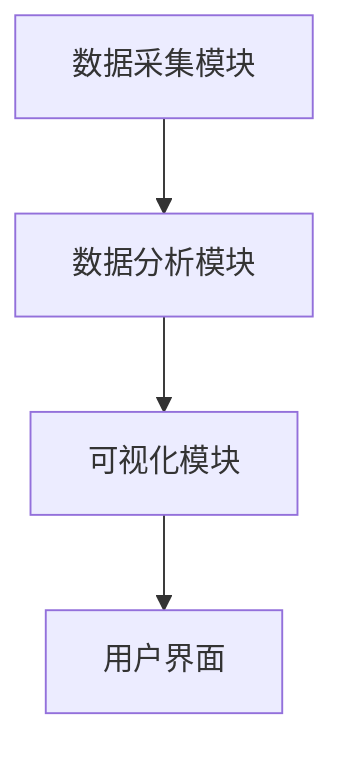

                 

# 全球股市估值与可再生能源储能技术的关系

> 关键词：全球股市估值，可再生能源，储能技术，股市与技术关系，投资分析

> 摘要：本文分析了可再生能源储能技术对全球股市估值的影响，探讨了储能技术的核心原理、对股市估值的作用机制，以及如何通过算法模型量化这种关系。通过实际案例分析，揭示了储能技术在股市中的价值和潜力。

---

## 第1章: 全球股市估值与可再生能源储能技术的背景

### 1.1 问题背景与定义

#### 1.1.1 问题背景
随着全球能源结构转型，可再生能源（如风能、太阳能）逐渐成为主要能源来源。然而，可再生能源的不稳定性（如间歇性）限制了其大规模应用。为了解决这一问题，储能技术（如电池储能、 pumped hydropower energy）被广泛应用，以平衡能源供应。

股市估值是衡量企业价值的重要指标。对于可再生能源企业而言，储能技术的成熟度和应用规模直接影响其市场表现。

#### 1.1.2 核心概念
- **股市估值**：通过财务指标和市场表现评估企业的内在价值。
- **可再生能源储能技术**：用于存储和释放可再生能源的物理或化学系统。

#### 1.1.3 问题解决的必要性
理解储能技术对股市估值的影响，可以帮助投资者做出更明智的决策，推动可再生能源行业的发展。

---

## 第2章: 可再生能源储能技术的核心原理与股市估值的影响机制

### 2.1 储能技术的核心原理

#### 2.1.1 储能技术分类
- **电池储能**：如锂离子电池、铅酸电池。
- ** pumped hydropower energy**：利用水力储存能量。
- **热储能**：通过储热材料储存能量。

#### 2.1.2 储能技术的关键指标
- **能量密度**：单位体积或质量的能量储存能力。
- **充放电效率**：储能系统的能量损耗。
- **成本**：影响可再生能源项目的经济性。

### 2.2 储能技术对股市估值的影响机制

#### 2.2.1 储能技术如何影响企业利润
- 提高能源利用效率，降低成本。
- 增强企业竞争力，扩大市场份额。

#### 2.2.2 股市估值的关键影响因素
- **技术成熟度**：储能技术的可靠性直接影响企业的市场表现。
- **市场需求**：政策支持和环保需求推动储能技术的普及。
- **企业竞争力**：拥有领先储能技术的企业更具投资价值。

---

## 第3章: 可再生能源储能技术对股市估值的算法分析

### 3.1 算法模型建立

#### 3.1.1 数据准备
- 收集可再生能源企业的财务数据和储能技术相关指标。
- 包括营收、净利润、研发投入、储能技术专利数量等。

#### 3.1.2 数据分析
使用回归分析模型，研究储能技术对企业估值的影响。

$$
\text{企业估值} = \beta_0 + \beta_1 \times \text{储能技术指标} + \epsilon
$$

其中，$\beta_1$ 表示储能技术对估值的影响系数。

#### 3.1.3 模型验证
通过历史数据验证模型的准确性，评估储能技术对股市估值的贡献。

---

## 第4章: 系统架构设计与案例分析

### 4.1 系统功能模块

#### 4.1.1 数据采集模块
收集可再生能源企业的财务数据和储能技术指标。

#### 4.1.2 数据分析模块
应用算法模型评估储能技术对股市估值的影响。

#### 4.1.3 可视化模块
展示分析结果，帮助投资者做出决策。

### 4.2 系统架构图

---

## 第5章: 项目实战——储能技术对股市估值的影响分析

### 5.1 实际案例

#### 5.1.1 案例选择
选择一家可再生能源企业，分析其储能技术对估值的影响。

#### 5.1.2 数据分析
使用回归模型计算储能技术对股价的影响。

#### 5.1.3 结果解读
储能技术的提升显著提高了企业的估值，证明了其重要性。

---

## 第6章: 总结与展望

### 6.1 总结
储能技术是推动可再生能源发展的重要因素，对股市估值具有显著影响。投资者应关注储能技术的创新和应用。

### 6.2 未来展望
随着技术进步，储能技术将进一步提升企业的市场价值，成为投资的重要方向。

---

作者：AI天才研究院 & 禅与计算机程序设计艺术

---

通过以上结构，我们可以清晰地看到，可再生能源储能技术对股市估值的影响是多方面的，从技术成熟度、市场需求到企业竞争力，都对股市表现产生重要影响。投资者和企业应充分考虑这些因素，抓住储能技术带来的投资机遇。

