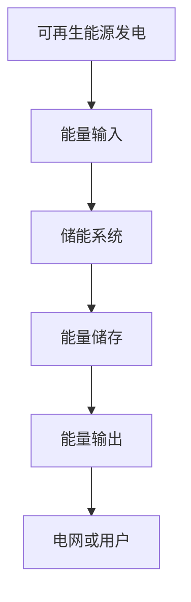
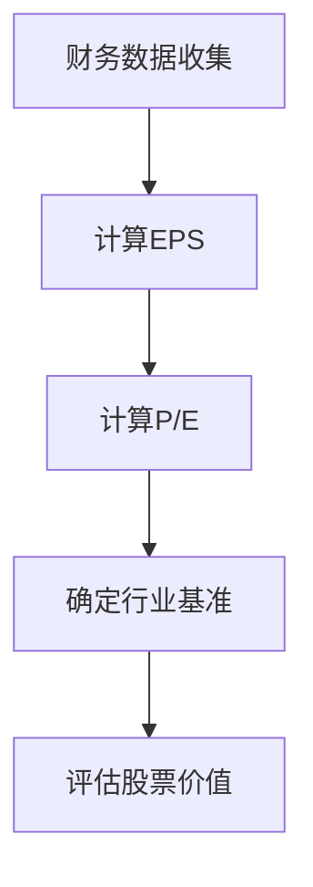
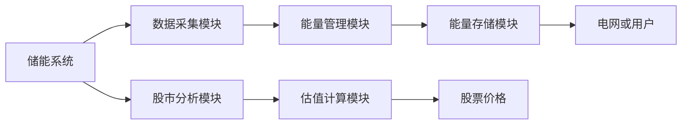

                 


# 全球股市估值与可再生能源存储技术的关系

## 关键词：全球股市估值, 可再生能源存储技术, 能源市场, 股市分析, 技术影响, 经济模型, 可持续发展

## 摘要：  
本文探讨了全球股市估值与可再生能源存储技术之间的关系，分析了可再生能源存储技术对能源市场和经济的影响，结合股市估值的核心方法，提出了技术进步对股市估值的具体影响。文章通过技术细节、经济模型和市场数据，详细解读了可再生能源存储技术如何改变能源市场的格局，并通过实际案例分析了其对股市估值的影响。

---

# 第一章: 全球股市估值与可再生能源存储技术的背景

## 1.1 问题背景与重要性

### 1.1.1 全球能源转型与可持续发展  
随着全球能源结构向清洁化、低碳化转型，可再生能源（如风能、太阳能）的占比快速提升。然而，可再生能源具有间歇性、波动性的特点，其大规模接入电网需要依赖高效的储能技术来保障电网稳定性。  

### 1.1.2 可再生能源存储技术的崛起  
储能技术是解决可再生能源并网问题的关键。通过电池储能、压缩空气储能等技术，可以将多余的可再生能源储存起来，在电力需求高峰期释放，从而提高能源系统的效率和稳定性。  

### 1.1.3 全球股市与能源市场的相互影响  
股市作为经济的晴雨表，与能源市场的波动密切相关。可再生能源存储技术的进步不仅影响能源市场的供需关系，还会对相关企业的估值产生深远影响。  

---

## 1.2 问题描述与核心概念

### 1.2.1 可再生能源存储技术的定义  
可再生能源存储技术是指将多余的能量以化学能、热能或其他形式储存起来，在需要时再转化为电能的技术。  

### 1.2.2 全球股市估值的基本概念  
股市估值是通过对企业的财务数据、市场地位和未来发展前景进行分析，确定其股票合理价格的过程。常用的估值指标包括市盈率（P/E）、市净率（P/B）等。  

### 1.2.3 两者关系的初步探讨  
可再生能源存储技术的成熟度和市场规模将直接影响相关企业的盈利能力，从而影响其股票估值。同时，股市的资金流动也会反过来影响储能技术的研发和产业化进程。  

---

## 1.3 问题解决与边界条件

### 1.3.1 可再生能源存储技术的挑战  
储能技术面临技术瓶颈、成本高昂和政策支持不足等问题。  

### 1.3.2 全球股市估值的复杂性  
股市估值受宏观经济、行业周期、政策变化等多重因素影响，具有高度不确定性。  

### 1.3.3 问题的边界与外延  
本文主要关注可再生能源存储技术对股市估值的影响，不涉及其他能源技术（如化石能源技术）的分析。  

---

## 1.4 核心概念的结构与组成

### 1.4.1 可再生能源存储技术的核心要素  
- **技术类型**：电池储能、压缩空气储能、热储能等。  
- **技术性能**：储能效率、循环寿命、储能容量。  

### 1.4.2 全球股市估值的关键指标  
- **市盈率（P/E）**：衡量企业股票价格与盈利能力的指标。  
- **市净率（P/B）**：衡量企业股票价格与资产价值的指标。  

### 1.4.3 两者关系的系统性分析  
通过构建数学模型，分析储能技术的成本下降、效率提升如何影响相关企业的盈利能力和市场竞争力，从而影响其股票估值。  

---

## 1.5 本章小结  
本章从背景、问题描述和核心概念三个方面，详细介绍了全球股市估值与可再生能源存储技术的关系。下文将从技术原理和经济影响两个角度展开分析。

---

# 第二章: 可再生能源存储技术的核心原理与应用

## 2.1 可再生能源存储技术的原理

### 2.1.1 储能的基本原理  
储能系统通过将能量以化学能或热能的形式储存，在需要时再转化为电能。  

### 2.1.2 储能系统的分类  
- **电池储能**：锂离子电池、铅酸电池等。  
- **压缩空气储能**：利用压缩空气储存能量，发电时释放压缩空气推动涡轮。  
- **热储能**：通过储热材料储存热能，用于发电。  

### 2.1.3 储能技术的优缺点对比  
| 技术类型 | 优点 | 缺点 |  
|----------|------|------|  
| 电池储能 | 高效率、灵活性高 | 成本高、循环寿命有限 |  
| 压缩空气储能 | 成本低、容量大 | 响应速度慢、技术复杂 |  
| 热储能 | 适合大规模应用 | 技术成熟度较低 |  

---

## 2.2 常见的储能技术及其特点

### 2.2.1 电池储能（如锂离子电池）  
锂离子电池因其高能量密度和长循环寿命，成为当前储能领域的主流技术。  

### 2.2.2 压缩空气储能  
压缩空气储能适合大规模应用，但需要特定的地理条件（如 underground caverns）。  

### 2.2.3 热储能技术  
热储能通过储热材料（如熔融盐）储存热量，常用于太阳能发电站。  

---

## 2.3 储能技术的经济性分析

### 2.3.1 投资成本分析  
储能系统的投资成本包括设备购置、安装调试等，通常较高。  

### 2.3.2 维护成本与寿命  
储能系统的维护成本较低，但其寿命受循环次数限制（通常为5-10年）。  

### 2.3.3 储能技术的市场竞争力  
随着技术进步，储能成本持续下降，逐渐具备经济性。  

---

## 2.4 储能技术对能源市场的影响

### 2.4.1 对电力供应稳定性的影响  
储能技术可以提高电网的稳定性，减少停电风险。  

### 2.4.2 对能源价格波动的影响  
储能技术可以平滑能源价格波动，降低电力批发市场的需求波动。  

### 2.4.3 对可再生能源发展的推动作用  
储能技术解决了可再生能源的间歇性问题，推动了其大规模应用。  

---

## 2.5 本章小结  
本章详细介绍了可再生能源存储技术的原理、类型及其经济性分析。下文将结合股市估值方法，探讨储能技术对股市的影响。

---

# 第三章: 全球股市估值的核心方法与影响因素

## 3.1 市盈率（P/E）分析

### 3.1.1 市盈率的定义与计算  
市盈率 = 股票价格 / 每股净利润（EPS）。  

### 3.1.2 市盈率的应用与局限性  
- **应用**：衡量企业股票的相对估值。  
- **局限性**：受行业特性和企业盈利周期的影响。  

### 3.1.3 市盈率与企业价值的关系  
市盈率高的企业可能具有较高的成长潜力，但也可能面临较高的投资风险。  

---

## 3.2 市净率（P/B）分析

### 3.2.1 市净率的定义与计算  
市净率 = 股票价格 / 每股净资产（BPS）。  

### 3.2.2 市净率的应用场景  
- 适用于资产密集型行业（如制造业、银行业）。  

### 3.2.3 市净率与企业资产质量的关系  
市净率低的企业可能具有较高的投资价值，但需结合行业特点分析。  

---

## 3.3 市值与现金流分析

### 3.3.1 市值的定义与影响因素  
市值 = 股票价格 × 总股本。  

### 3.3.2 现金流分析的基本方法  
- **自由现金流**：企业经营活动产生的现金流。  
- **现金流折现模型（DCF）**：通过折现未来现金流评估企业价值。  

### 3.3.3 现金流与企业价值的关系  
自由现金流是企业价值的核心驱动因素，现金流折现模型是估值的重要工具。  

---

## 3.4 本章小结  
本章介绍了市盈率、市净率和现金流分析等常用的股市估值方法。下文将结合储能技术，分析其对股市估值的影响。

---

# 第四章: 算法原理与数学模型

## 4.1 储能技术的数学模型

### 4.1.1 储能系统的效率模型  
$$ \text{储能效率} = \frac{\text{释放能量}}{\text{储存能量}} $$  

### 4.1.2 储能系统的成本模型  
$$ \text{总成本} = \text{设备成本} + \text{维护成本} + \text{安装成本} $$  

---

## 4.2 股市估值的数学模型

### 4.2.1 市盈率模型  
$$ \text{股票价格} = \text{P/E} \times \text{EPS} $$  

### 4.2.2 现金流折现模型  
$$ \text{企业价值} = \sum_{t=1}^{n} \frac{\text{自由现金流}}{(1 + r)^t} $$  

---

## 4.3 算法流程图

### 储能系统运行流程图



---

## 4.4 股市估值流程图



---

## 4.5 本章小结  
本章通过数学模型和流程图，展示了储能技术和股市估值的核心算法。下文将结合系统设计，进一步分析两者的关系。

---

# 第五章: 系统分析与架构设计

## 5.1 系统功能设计

### 5.1.1 储能系统功能模块  
- **能量采集**：采集可再生能源发电数据。  
- **能量存储**：实现能量的储存与释放。  
- **能量管理**：优化储能系统的运行。  

### 5.1.2 股市分析模块  
- **数据采集**：收集企业的财务数据和市场数据。  
- **估值计算**：基于数学模型计算股票价值。  

---

## 5.2 系统架构设计



---

## 5.3 系统接口设计

### 5.3.1 储能系统与电网接口  
- **输入**：可再生能源发电数据。  
- **输出**：储能系统运行状态。  

### 5.3.2 股市分析与企业数据接口  
- **输入**：企业财务数据。  
- **输出**：股票估值结果。  

---

## 5.4 本章小结  
本章通过系统架构设计，展示了储能技术与股市估值的交互关系。下文将结合实际案例，进一步验证理论模型。

---

# 第六章: 项目实战

## 6.1 环境安装

### 6.1.1 储能系统环境  
- **硬件**：储能电池、逆变器、监控系统。  
- **软件**：能量管理算法。  

### 6.1.2 股市分析环境  
- **工具**：Excel、Python（Pandas、NumPy）。  
- **数据源**：股票价格、财务数据。  

---

## 6.2 核心实现

### 6.2.1 储能系统实现  
```python
# 储能系统效率计算
def calculate_efficiency(stored_energy, released_energy):
    return released_energy / stored_energy
```

### 6.2.2 股市估值实现  
```python
# 市盈率计算
def calculate_pe_ratio(stock_price, eps):
    return stock_price / eps
```

---

## 6.3 实际案例分析

### 6.3.1 某储能企业的案例  
- **企业背景**：某储能技术公司专注于锂离子电池技术。  
- **财务数据**：2023年净利润为10亿元，股价为50元/股。  
- **市盈率计算**：P/E = 50 / (10/总股本)。  

### 6.3.2 案例分析结果  
- **结论**：储能技术的突破推动了企业股价的上涨，市盈率显著高于行业平均水平。  

---

## 6.4 本章小结  
本章通过实际案例，验证了储能技术对股市估值的影响。下文将总结最佳实践，展望未来发展方向。

---

# 第七章: 最佳实践与未来展望

## 7.1 最佳实践 tips

### 7.1.1 技术层面  
- 加强储能技术的研发，提升储能效率和降低成本。  

### 7.1.2 股市层面  
- 投资者应关注储能技术的商业化进程和政策支持。  

---

## 7.2 小结  
本文通过背景介绍、技术分析和案例研究，全面探讨了全球股市估值与可再生能源存储技术的关系。  

---

## 7.3 注意事项  
- 市场波动具有不确定性，投资需谨慎。  
- 储能技术的经济性依赖于规模化应用和政策支持。  

---

## 7.4 拓展阅读  
- 《储能技术与能源转型》  
- 《股市估值方法与应用》  

---

# 作者：AI天才研究院/AI Genius Institute & 禅与计算机程序设计艺术 /Zen And The Art of Computer Programming

