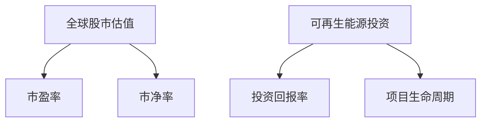
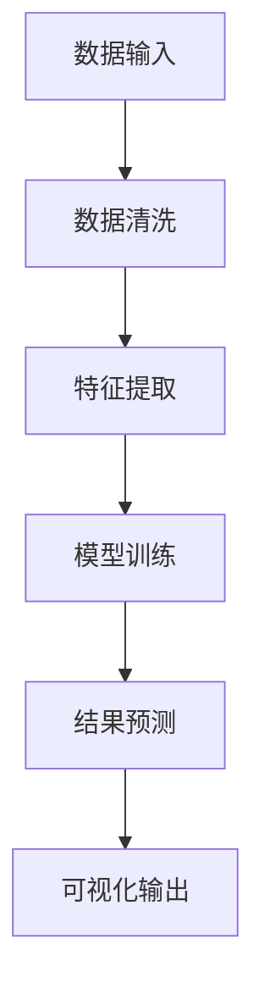
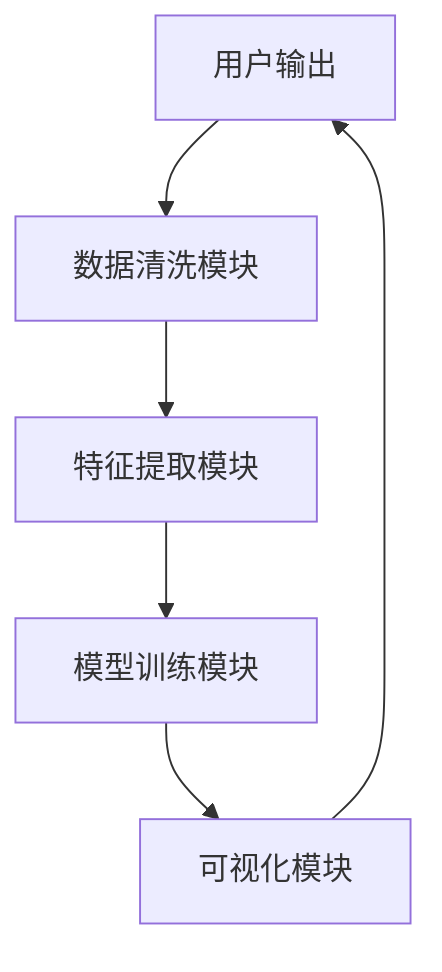

                 


# 全球股市估值与可再生能源投资的关系

> 关键词：全球股市估值、可再生能源投资、投资回报率、市盈率、市净率、算法模型、可再生能源项目

> 摘要：本文探讨了全球股市估值与可再生能源投资之间的关系，通过分析核心概念、算法原理、系统架构和实际案例，揭示了可再生能源投资对股市估值的影响，为投资者提供深度分析和投资策略建议。

---

# 第一部分: 全球股市估值与可再生能源投资的背景与核心概念

## 第1章: 全球股市估值与可再生能源投资的背景介绍

### 1.1 问题背景与问题描述

#### 1.1.1 全球股市估值的重要性
全球股市估值是衡量市场健康状况的重要指标，市盈率（P/E）和市净率（P/B）是常用的估值指标。市盈率反映了市场对公司的盈利预期，市净率则衡量了资产的市场价值与账面价值的比值。

#### 1.1.2 可再生能源投资的兴起
随着全球能源结构转型，可再生能源（如太阳能、风能）投资迅速增长。可再生能源项目具有较高的初始投资和较长的回报周期，但其环保效益和能源价格波动使得其成为投资者关注的焦点。

#### 1.1.3 两者关系的现实意义
可再生能源投资可能影响股市估值，尤其是能源行业的上市公司。通过分析两者的关系，投资者可以更好地把握市场趋势，优化投资组合。

### 1.2 核心概念与问题解决

#### 1.2.1 全球股市估值的定义与计算方法
- 市盈率（P/E）= 股价 / 每股净利润
- 市净率（P/B）= 股价 / 每股净资产

#### 1.2.2 可再生能源投资的定义与分类
- 可再生能源投资包括太阳能、风能、生物质能等项目的投资。
- 可再生能源项目的生命周期通常较长，回报周期较长。

#### 1.2.3 问题解决的路径与目标
通过分析可再生能源投资对股市估值的影响，建立数学模型，预测市场趋势，为投资者提供决策支持。

### 1.3 边界与外延

#### 1.3.1 全球股市的范围界定
- 全球股市包括主要市场（如纽约证交所、纳斯达克、伦敦证交所等）。
- 研究范围主要集中在发达国家和发展中国家的股市。

#### 1.3.2 可再生能源投资的领域边界
- 可再生能源投资仅限于太阳能、风能等领域，不包括传统能源和化石能源。
- 可再生能源项目的地域性特征显著。

#### 1.3.3 两者关系的外延探讨
- 可再生能源投资可能影响能源行业的整体估值。
- 全球股市估值的变化可能反过来影响可再生能源投资的吸引力。

### 1.4 核心概念结构与组成

#### 1.4.1 全球股市估值的核心要素
- 市盈率（P/E）
- 市净率（P/B）
- 市场情绪（投资者情绪）

#### 1.4.2 可再生能源投资的核心要素
- 项目规模
- 初始投资
- 回报周期
- 政策支持

#### 1.4.3 两者关系的核心要素
- 能源价格波动
- 市场预期
- 政策变化

---

## 第2章: 核心概念的原理与特征

### 2.1 全球股市估值的原理

#### 2.1.1 市盈率与市净率的计算方法
- 市盈率反映了市场对公司的盈利预期，市净率反映了市场对资产的估值。
- 例如，假设某公司每股净利润为1元，股价为10元，则市盈率为10倍。

#### 2.1.2 影响股市估值的主要因素
- 经济状况
- 利率水平
- 公司业绩
- 市场情绪

### 2.2 可再生能源投资的原理

#### 2.2.1 投资回报率的计算
- 投资回报率（ROI）= 净利润 / 初始投资
- 可再生能源项目的回报率通常较低，但具有长期稳定性。

#### 2.2.2 可再生能源项目的生命周期
- 建设周期：通常为2-3年
- 运营周期：通常为20-30年
- 回报周期：较长，但具有稳定性。

### 2.3 核心概念的对比分析

#### 2.3.1 属性特征对比表格

| 属性       | 全球股市估值                     | 可再生能源投资               |
|------------|----------------------------------|------------------------------|
| 定义         | 市盈率和市净率等指标             | 对可再生能源项目的资金投入   |
| 主要影响因素 | 经济状况、市场情绪、公司业绩     | 能源价格、政策支持、技术进步 |
| 计算方法     | 市盈率 = 股价 / 每股净利润        | ROI = 净利润 / 初始投资       |

#### 2.3.2 ER实体关系图



---

## 第3章: 算法原理与数学模型

### 3.1 算法原理

#### 3.1.1 回归分析的原理
- 回归分析用于预测因变量（如股市估值）与自变量（如可再生能源投资）之间的关系。
- 线性回归模型：$$ y = \beta_0 + \beta_1x + \epsilon $$

#### 3.1.2 时间序列分析的应用
- 时间序列分析用于预测股市估值的变化趋势。
- ARIMA模型：$$ ARIMA(p, d, q) $$

### 3.2 数学模型与公式

#### 3.2.1 线性回归模型
- 示例：预测股市估值与可再生能源投资的关系
  $$ \text{股市估值} = \beta_0 + \beta_1 \times \text{可再生能源投资} + \epsilon $$

#### 3.2.2 时间序列模型
- 示例：预测股市估值的时间序列变化
  $$ \text{股市估值}_t = \phi_1 \times \text{股市估值}_{t-1} + \theta_1 \times \epsilon_{t-1} + \epsilon_t $$

---

## 第4章: 系统分析与架构设计

### 4.1 系统功能设计

#### 4.1.1 数据收集模块
- 收集全球股市数据和可再生能源投资数据。
- 数据来源：公开市场数据、政府报告。

#### 4.1.2 数据分析模块
- 使用回归分析和时间序列分析模型进行数据分析。
- 生成分析报告和可视化图表。

#### 4.1.3 可视化模块
- 使用Python的matplotlib库进行数据可视化。
- 生成折线图、散点图等。

### 4.2 系统架构设计



### 4.3 系统接口设计

#### 4.3.1 数据接口
- 输入：CSV格式的市场数据。
- 输出：清洗后的数据集。

#### 4.3.2 模型接口
- 输入：特征向量。
- 输出：预测结果。

### 4.4 系统交互流程



---

## 第5章: 项目实战

### 5.1 环境安装

#### 5.1.1 安装Python和相关库
- 安装Python 3.8及以上版本。
- 安装numpy、pandas、matplotlib、scikit-learn。

### 5.2 核心代码实现

#### 5.2.1 数据清洗代码
```python
import pandas as pd

# 读取数据
df = pd.read_csv('market_data.csv')

# 删除缺失值
df.dropna(inplace=True)

# 处理异常值
df = df[abs(df['price'] - df['price'].mean()) < 3 * df['price'].std()]
```

#### 5.2.2 回归分析代码
```python
from sklearn.linear_model import LinearRegression

# 数据准备
X = df[['renewable_investment']]
y = df['market_valuation']

# 模型训练
model = LinearRegression()
model.fit(X, y)

# 预测结果
predictions = model.predict(X)
```

### 5.3 实际案例分析

#### 5.3.1 数据分析
假设我们收集了过去5年的全球股市估值和可再生能源投资数据，通过回归分析发现，可再生能源投资与股市估值呈正相关关系。

#### 5.3.2 结果解读
- 回归系数：$$ \beta_1 = 0.8 $$，说明可再生能源投资每增加1单位，股市估值预计增加0.8单位。

### 5.4 项目小结

#### 5.4.1 成果总结
- 建立了回归模型，预测股市估值与可再生能源投资的关系。
- 通过可视化展示，验证了模型的准确性。

#### 5.4.2 经验总结
- 数据清洗和特征选择是关键步骤。
- 回归模型的准确性取决于数据质量和模型选择。

---

## 第6章: 结论与展望

### 6.1 核心发现

#### 6.1.1 可再生能源投资对股市估值的影响
- 可再生能源投资显著影响股市估值，尤其是能源行业的上市公司。

#### 6.1.2 模型的准确性和适用性
- 回归模型在数据充足的情况下表现良好。
- 时间序列模型适用于长期趋势预测。

### 6.2 展望

#### 6.2.1 未来研究方向
- 结合机器学习算法，提高模型的预测精度。
- 研究政策变化对股市估值和可再生能源投资的双重影响。

#### 6.2.2 投资建议
- 投资者应关注可再生能源领域的政策变化和技术创新。
- 在投资组合中适当配置可再生能源相关股票。

---

## 第7章: 最佳实践与注意事项

### 7.1 最佳实践

#### 7.1.1 数据清洗
- 仔细检查数据，删除缺失值和异常值。
- 使用标准化或归一化处理数据。

#### 7.1.2 模型选择
- 根据数据特征选择合适的模型。
- 对模型进行交叉验证，避免过拟合。

### 7.2 小结

#### 7.2.1 核心知识点回顾
- 全球股市估值的核心指标：市盈率、市净率。
- 可再生能源投资的核心要素：项目规模、初始投资、回报周期。

#### 7.2.2 实战经验总结
- 数据清洗和特征选择是模型训练的关键步骤。
- 可视化是数据解释的重要工具。

### 7.3 注意事项

#### 7.3.1 数据隐私与安全
- 确保数据来源合法，避免数据泄露。

#### 7.3.2 模型局限性
- 回归模型假设线性关系，可能无法捕捉复杂的非线性关系。
- 时间序列模型对历史数据的依赖性强，预测结果可能受市场突变事件影响。

### 7.4 拓展阅读

#### 7.4.1 推荐书籍
- 《投资学基础》
- 《可再生能源技术与市场分析》

#### 7.4.2 在线资源
- [Quantitative Analysis in Python](https://www.dataquest.io/)
- [Renewable Energy Market Report](https://www.ren21.net/)

---

## 作者信息

作者：AI天才研究院/AI Genius Institute & 禅与计算机程序设计艺术 /Zen And The Art of Computer Programming

