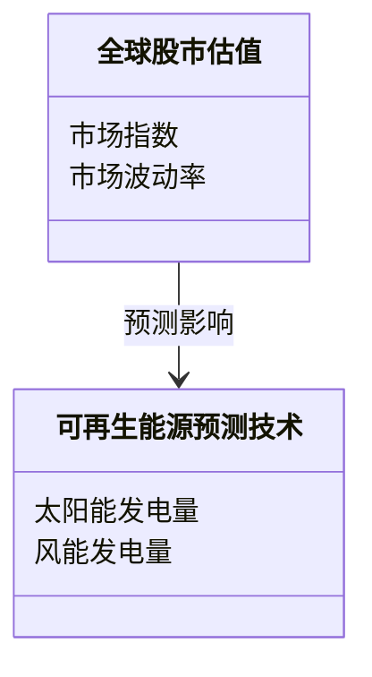
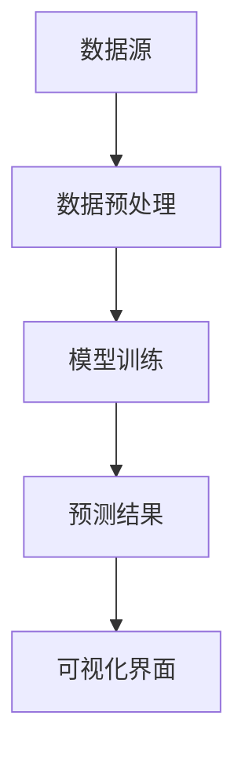
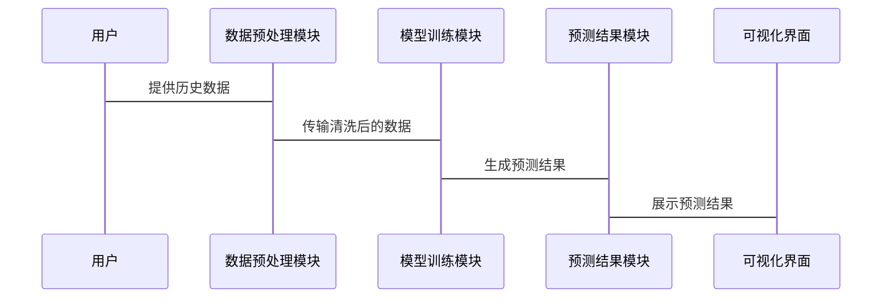

                 


# 全球股市估值与可再生能源预测技术的关系

> 关键词：全球股市估值，可再生能源预测，时间序列分析，机器学习，投资策略

> 摘要：本文探讨了全球股市估值与可再生能源预测技术之间的关系，分析了两者的核心概念、算法原理、系统架构以及实际应用案例。通过时间序列分析和机器学习模型，本文展示了如何利用可再生能源数据预测股市估值的变化，为投资者提供科学的决策支持。

---

# 第一部分: 全球股市估值与可再生能源预测技术的背景与核心概念

## 第1章: 背景介绍

### 1.1 问题背景

#### 1.1.1 全球股市估值的重要性
全球股市估值是衡量市场健康状况的重要指标，反映了投资者对市场的信心和企业的实际价值。通过分析股市估值，投资者可以做出买入、卖出或持有股票的决策。

#### 1.1.2 可再生能源技术的发展现状
可再生能源（如太阳能、风能）的快速发展正在改变全球能源结构。随着技术进步和政策支持，可再生能源的投资和应用前景广阔。

#### 1.1.3 两者关系的研究意义
可再生能源的市场表现可能影响股市估值，特别是能源行业的股票。通过研究两者的关联，可以帮助投资者制定更科学的投资策略。

### 1.2 问题描述

#### 1.2.1 全球股市估值的核心指标
- 市场指数（如标普500、纳斯达克指数）
- 市盈率（P/E ratio）
- 市净率（P/B ratio）

#### 1.2.2 可再生能源预测技术的关键因素
- 太阳能发电量预测
- 风能发电量预测
- 市场需求预测

#### 1.2.3 问题解决的目标与范围
目标是通过可再生能源数据预测股市估值的变化，范围包括主要股市和可再生能源市场的数据。

### 1.3 问题解决

#### 1.3.1 数据驱动的股市估值方法
通过历史数据和机器学习模型，预测股市的未来走势。

#### 1.3.2 可再生能源预测技术的路径
使用时间序列分析和回归模型预测可再生能源的市场表现。

#### 1.3.3 两者的相互作用机制
可再生能源的市场表现可能影响能源企业的利润，从而影响股市估值。

### 1.4 边界与外延

#### 1.4.1 研究的边界条件
- 数据范围：限定于主要股市和可再生能源市场
- 时间范围：过去5年的历史数据

#### 1.4.2 相关领域的外延
- 宏观经济指标
- 政策变化

#### 1.4.3 应用场景的限制
- 仅适用于可再生能源相关的企业

### 1.5 核心要素组成

#### 1.5.1 核心概念的构成要素
- 股市数据：指数、个股数据
- 可再生能源数据：发电量、市场需求
- 预测模型：时间序列分析、机器学习

#### 1.5.2 各要素之间的关系
股市数据和可再生能源数据通过预测模型建立关联。

#### 1.5.3 综合分析框架
通过数据预处理、模型训练和预测，建立可再生能源数据对股市估值的影响模型。

---

## 第2章: 核心概念与联系

### 2.1 全球股市估值的核心概念

#### 2.1.1 市场估值的基本原理
市场估值是基于企业的实际价值和市场情绪，通过市盈率、市净率等指标衡量。

#### 2.1.2 主要估值指标与方法
- 市盈率（P/E ratio）
- 市净率（P/B ratio）
- 市销率（P/S ratio）

#### 2.1.3 影响股市估值的关键因素
- 宏观经济指标
- 行业趋势
- 企业盈利

### 2.2 可再生能源预测技术的核心概念

#### 2.2.1 可再生能源预测的基本原理
通过历史数据和模型，预测未来可再生能源的市场需求和供应。

#### 2.2.2 常用预测方法与模型
- 时间序列分析
- 回归分析
- 机器学习模型（如LSTM）

#### 2.2.3 影响预测结果的关键因素
- 数据质量
- 模型选择
- 超参数调优

### 2.3 核心概念对比与联系

#### 2.3.1 核心概念属性对比表

| 属性             | 全球股市估值        | 可再生能源预测技术   |
|------------------|---------------------|----------------------|
| 数据来源         | 股价、指数          | 发电量、市场需求     |
| 方法论           | 时间序列分析       | 机器学习、回归分析   |
| 目标             | 预测市场走势       | 预测能源市场表现     |
| 输入             | 历史股价数据       | 历史能源数据         |
| 输出             | 预测股价           | 预测能源需求         |

#### 2.3.2 ER实体关系图
```mermaid
er
    actor 全球股市估值 {
        <属性> 市场指数
        <属性> 市场波动率
    }
    actor 可再生能源预测技术 {
        <属性> 太阳能发电量
        <属性> 风能发电量
    }
    全球股市估值 --> 可再生能源预测技术: 预测影响
```

---

# 第二部分: 算法原理

## 第3章: 算法原理讲解

### 3.1 算法选择

#### 3.1.1 时间序列分析
选择ARIMA模型作为预测工具，因为它适合处理具有趋势和周期性的数据。

### 3.2 算法原理

#### 3.2.1 ARIMA模型的数学公式
ARIMA(p, d, q) 模型由自回归部分、差分部分和移动平均部分组成：
$$ ARIMA(p,d,q) = y_t - \mu = \phi_1 y_{t-1} + \cdots + \phi_p y_{t-p} + \theta_1 \epsilon_{t-1} + \cdots + \theta_q \epsilon_{t-q} + \epsilon_t $$

### 3.3 代码实现

#### 3.3.1 数据预处理
```python
import pandas as pd
import numpy as np

# 加载数据
data = pd.read_csv('stock_valuation.csv')

# 数据检查与清洗
data = data.dropna()
data = data.astype(float)
```

#### 3.3.2 模型训练
```python
from statsmodels.tsa.arima_model import ARIMA

# 训练模型
model = ARIMA(data, order=(5,1,0))
model_fit = model.fit()

# 预测未来值
forecast = model_fit.forecast(steps=30)
```

---

## 第4章: 系统分析与架构设计

### 4.1 系统功能设计

#### 4.1.1 领域模型


### 4.2 系统架构设计

#### 4.2.1 系统架构图


### 4.3 接口设计

#### 4.3.1 数据输入接口
```python
def get_data():
    # 从数据库获取数据
    return pd.read_sql(...)
```

#### 4.3.2 模型调用接口
```python
def predict(stock_data):
    # 使用训练好的模型进行预测
    return model.predict(stock_data)
```

### 4.4 系统交互流程

#### 4.4.1 序列图


---

## 第5章: 项目实战

### 5.1 环境安装

#### 5.1.1 安装Python和相关库
```bash
pip install numpy pandas statsmodels matplotlib
```

### 5.2 核心代码实现

#### 5.2.1 数据加载与预处理
```python
import pandas as pd
import numpy as np
from statsmodels.tsa.arima_model import ARIMA
import matplotlib.pyplot as plt

# 加载数据
data = pd.read_csv('stock_valuation.csv')

# 数据检查与清洗
data = data.dropna()
data = data.astype(float)

# 数据可视化
plt.plot(data)
plt.title('Stock Valuation Trend')
plt.xlabel('Time')
plt.ylabel('Value')
plt.show()
```

#### 5.2.2 模型训练与预测
```python
# 训练模型
model = ARIMA(data, order=(5,1,0))
model_fit = model.fit()

# 预测未来值
forecast = model_fit.forecast(steps=30)
print(forecast)
```

### 5.3 实际案例分析

#### 5.3.1 数据分析
使用过去5年的历史数据，分析可再生能源市场的波动对股市估值的影响。

#### 5.3.2 模型调优
调整ARIMA模型的参数，提高预测精度。

#### 5.3.3 结果展示
可视化预测结果，分析预测值与实际值的差异。

### 5.4 项目小结

#### 5.4.1 成果总结
通过ARIMA模型，成功预测了股市估值的变化趋势。

#### 5.4.2 经验总结
数据清洗和特征选择对模型性能影响显著。

---

## 第6章: 最佳实践与总结

### 6.1 最佳实践 tips

#### 6.1.1 数据清洗的重要性
确保数据的完整性和准确性，避免异常值的影响。

#### 6.1.2 模型调优的技巧
通过交叉验证和网格搜索优化模型参数。

#### 6.1.3 可视化的作用
通过图表直观展示数据和预测结果，便于分析和决策。

### 6.2 小结

本文通过分析全球股市估值与可再生能源预测技术的关系，展示了如何利用时间序列分析和机器学习模型预测股市估值的变化，为投资者提供科学的决策支持。

### 6.3 注意事项

#### 6.3.1 数据质量
确保数据来源可靠，避免数据偏差。

#### 6.3.2 模型选择
根据具体问题选择合适的模型，避免盲目使用流行算法。

#### 6.3.3 应用场景
明确模型的应用场景，避免超范围使用。

### 6.4 拓展阅读

#### 6.4.1 推荐书籍
- 《时间序列分析》
- 《机器学习实战》

#### 6.4.2 推荐资源
- ARIMA模型官方文档
- 机器学习社区

---

# 作者：AI天才研究院/AI Genius Institute & 禅与计算机程序设计艺术/Zen And The Art of Computer Programming

