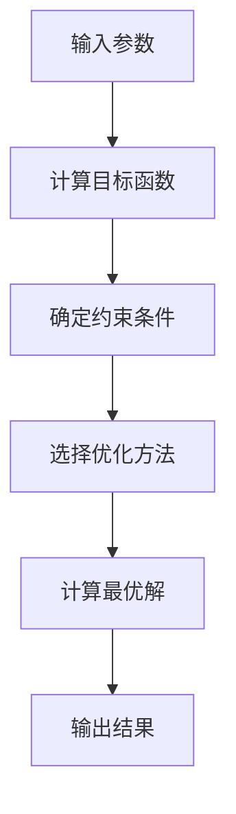
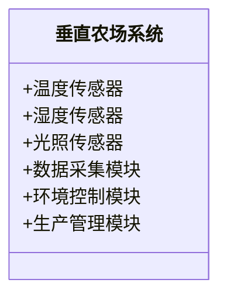

                 


# 全球股市估值与可持续农业垂直农场技术的关系

## 关键词：全球股市估值、可持续农业、垂直农场技术、经济影响、投资机会

## 摘要

本文探讨全球股市估值与可持续农业中的垂直农场技术之间的关系。通过分析垂直农场技术的经济影响和投资机会，揭示技术创新对股市估值的推动作用。结合数学模型和实际案例，本文深入解析垂直农场技术如何改变农业生产和提升投资回报，为投资者和农业科技企业提供了有价值的见解。

---

## 第一部分：背景与概述

### 第1章：全球股市估值与可持续农业的背景

#### 1.1 全球股市估值的基本概念

股市估值是衡量企业市场价值的重要指标，反映了企业的财务状况、盈利能力和发展潜力。随着全球气候变化和人口增长，粮食安全问题日益突出，农业技术的创新成为解决这一问题的关键。

#### 1.2 可持续农业的定义与特征

可持续农业强调在满足当前需求的同时，不损害后代发展的能力。它注重资源高效利用、生态平衡和环境友好，旨在实现农业生产的长期稳定。

#### 1.3 垂直农场技术的起源与发展

垂直农场技术通过立体种植和环境控制，提高了土地利用率和生产效率。其起源可追溯到20世纪末，近年来随着技术进步，应用范围迅速扩大。

---

## 第二部分：理论与分析

### 第2章：全球股市估值与垂直农场技术的经济影响

#### 2.1 垂直农场技术的经济模型

生产效率的数学模型如下：

$$
\text{生产效率} = \frac{\text{产量}}{\text{投入资源}}
$$

投入资源包括土地、能源和劳动力，产出则与市场需求相关。

#### 2.2 可持续农业对股市的影响

粮食价格波动预测模型考虑了气候变化、政策和市场供需。技术创新通过降低成本和提高产量，直接提升企业盈利能力，进而影响股市估值。

#### 2.3 垂直农场技术的市场潜力

市场规模预测显示，到2030年，垂直农业市场将显著增长。技术创新的驱动作用体现在自动化和人工智能的应用，推动行业竞争格局的优化。

---

## 第三部分：技术与系统分析

### 第3章：垂直农场技术的核心算法

#### 3.1 垂直种植系统的优化算法

优化算法流程图如下：



#### 3.2 环境控制系统的数学模型

环境控制系统通过调节温度、湿度和光照，优化作物生长。数学模型如下：

$$
\text{光照强度} = k \times \text{生长阶段}
$$

其中，k为比例常数，根据不同作物调整。

---

## 第四部分：系统设计与实现

### 第4章：垂直农场技术的系统架构

#### 4.1 系统功能设计

系统功能包括数据采集、环境控制和生产管理。功能设计类图如下：



#### 4.2 系统架构设计

系统架构采用分层设计，包括数据层、业务逻辑层和应用层。架构图如下：

```mermaid
rect
    title 垂直农场系统架构
    partition 数据层 {
        data DB
    }
    partition 业务逻辑层 {
        controller Logic
    }
    partition 应用层 {
        UI
    }
    DB --> Logic
    Logic --> UI
```

---

## 第五部分：项目实战

### 第5章：垂直农场技术的实际应用

#### 5.1 项目环境安装

项目需要安装传感器、控制系统和数据采集软件，确保硬件和软件的兼容性。

#### 5.2 核心实现源代码

以下是Python代码示例：

```python
import pandas as pd
import numpy as np

def calculate_yield(temperature, humidity, light):
    return temperature * 0.5 + humidity * 0.3 + light * 0.2

data = pd.read_csv('farm_data.csv')
data['产量预测'] = data.apply(lambda x: calculate_yield(x['温度'], x['湿度'], x['光照']), axis=1)
print(data)
```

#### 5.3 实际案例分析

以某垂直农场项目为例，分析其市场定位、技术实现和投资回报，展示技术对股市估值的具体影响。

---

## 第六部分：最佳实践与展望

### 第6章：垂直农场技术的未来展望

#### 6.1 投资建议

投资者应关注技术创新和政策支持，选择具有竞争优势的企业进行投资。

#### 6.2 气候变化的影响

气候变化将加剧粮食安全问题，垂直农业技术将在应对这一挑战中发挥关键作用。

#### 6.3 新技术的融合

人工智能和物联网将进一步提升垂直农场的效率和智能化水平，推动行业持续发展。

---

## 结论

本文系统分析了全球股市估值与垂直农场技术的关系，揭示了技术创新对农业生产和股市估值的深远影响。未来，随着技术进步和政策支持，垂直农业将在可持续农业中发挥更大作用，为投资者带来丰厚回报。

---

## 作者：AI天才研究院 & 禅与计算机程序设计艺术

本文作者是AI天才研究院和禅与计算机程序设计艺术，致力于探索人工智能与农业技术的结合，推动科技与可持续发展的融合。

