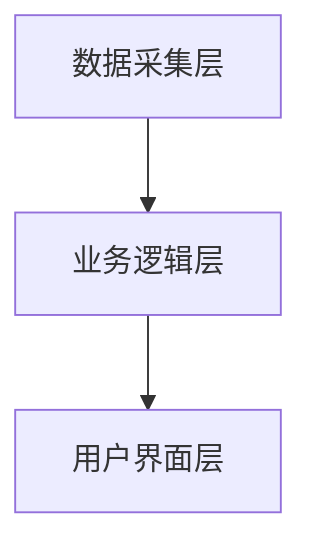

                 

---

# 全球股市估值与可持续农业垂直种植技术的关系

> 关键词：全球股市估值、可持续农业、垂直种植技术、技术驱动、经济影响、数学模型

> 摘要：本文探讨了全球股市估值与可持续农业垂直种植技术之间的关系。首先介绍了全球股市估值的基本概念、现状及其与经济发展的关系。然后详细阐述了可持续农业与垂直种植技术的定义、发展及两者结合的优势。接着，分析了垂直种植技术对股市估值的具体影响，提出了数学模型和关系分析。最后，通过系统架构设计和项目实战，展示了如何将垂直种植技术应用于实际，推动农业可持续发展，并对全球经济产生积极影响。

---

## 第一部分: 全球股市估值与可持续农业垂直种植技术的背景与关系

### 第1章: 全球股市估值概述

#### 1.1 股市估值的基本概念

股票市场的估值是投资者评估企业价值的重要手段，常用的指标包括市盈率（P/E）、市净率（P/B）和股息率等。这些指标帮助投资者判断股票的合理价格区间，从而做出投资决策。

$$\text{市盈率} = \frac{\text{股价}}{\text{每股收益}}$$

#### 1.2 全球股市估值的现状

全球股市估值受多种因素影响，包括经济周期、货币政策、地缘政治等。不同国家和地区的股市表现差异显著，例如美国市场的科技股占比较高，而新兴市场则更多依赖制造业和资源行业。

#### 1.3 股市估值与经济发展的关系

股市估值不仅是经济的晴雨表，还通过资本流动推动经济发展。高估值的股市通常意味着较高的企业融资能力，从而促进技术创新和产业升级。

---

### 第2章: 可持续农业与垂直种植技术的发展

#### 2.1 可持续农业的基本概念

可持续农业强调在满足当前需求的同时，不损害后代发展的能力。它注重资源高效利用、环境保护和生态平衡。

#### 2.2 垂直种植技术的创新

垂直种植技术通过立体空间利用，大幅提高土地利用率。它采用人工光照、智能温控和自动灌溉系统，实现高效生产。

#### 2.3 可持续农业与垂直种植技术的结合

垂直种植技术的应用不仅提高了农业生产力，还减少了对自然资源的依赖，有助于实现农业的可持续发展。

---

### 第3章: 全球股市估值与可持续农业垂直种植技术的关系分析

#### 3.1 股市估值与农业技术的相互影响

农业技术创新通过提高生产效率和降低风险，直接提升农业企业的盈利能力，进而提高其股票估值。同时，股市的资金流动为农业技术创新提供了资金支持。

#### 3.2 垂直种植技术对股市估值的具体影响

通过提高农业企业的产量和降低成本，垂直种植技术显著提升了企业的盈利能力，从而增加了股票的吸引力。

---

## 第二部分: 数学模型与关系分析

### 第4章: 数学模型与关系分析

#### 4.1 股市估值的数学模型

使用CAPM模型评估股票的预期回报率：

$$
r = r_f + \beta (r_m - r_f)
$$

其中，$r$ 是预期回报率，$r_f$ 是无风险利率，$\beta$ 是股票的贝塔系数，$r_m$ 是市场预期回报率。

#### 4.2 垂直种植技术对农业企业价值的影响

通过构建多元回归模型，分析垂直种植技术对企业估值的影响因素：

$$
\text{企业价值} = \alpha + \beta_1 \times \text{技术投入} + \beta_2 \times \text{生产效率} + \epsilon
$$

---

## 第三部分: 系统架构设计与项目实战

### 第5章: 系统架构设计

#### 5.1 系统功能设计

系统将整合股市数据和农业技术数据，提供实时估值分析和投资建议。

#### 5.2 系统架构设计

使用分层架构，包括数据采集层、业务逻辑层和用户界面层。

#### 5.3 系统接口设计

通过API接口实现数据的实时交互，确保系统的高效运行。

---

### 第6章: 项目实战

#### 6.1 环境安装

安装必要的开发工具和数据库，配置API接口。

#### 6.2 核心代码实现

编写数据采集和分析模块，实现对垂直种植技术企业的估值计算。

#### 6.3 案例分析

通过具体案例，展示垂直种植技术对股市估值的实际影响。

---

## 第四部分: 结论与展望

### 第7章: 结论与展望

#### 7.1 本章总结

总结全文内容，强调垂直种植技术对股市估值的积极影响。

#### 7.2 未来研究方向

建议进一步研究垂直种植技术在不同地区的应用及其对股市的长期影响。

---

## 作者信息

作者：AI天才研究院/AI Genius Institute & 禅与计算机程序设计艺术 /Zen And The Art of Computer Programming

---

**注意：** 以上内容仅为示例，实际撰写时需要根据具体情况进行调整和补充，确保逻辑严谨、数据准确。

