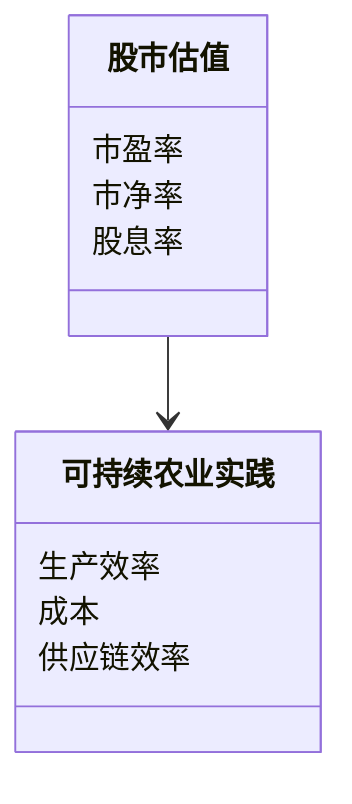
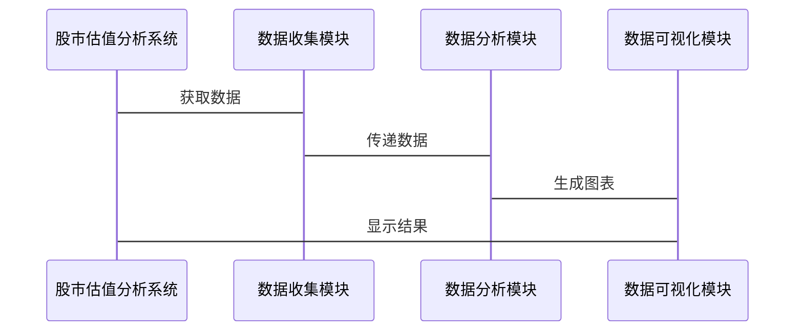

                 


# 全球股市估值与可持续农业实践的关系

## 关键词：全球股市估值，可持续农业，经济影响，数学模型，系统架构

## 摘要

本文探讨全球股市估值与可持续农业实践之间的关系，分析可持续农业对股市估值的影响，建立理论模型，并提出系统架构设计方案。通过数学建模和案例分析，揭示可持续农业如何影响股市估值，并为投资者和企业提出实践建议。

---

# 第一部分: 全球股市估值与可持续农业实践的背景与概述

## 第1章: 背景介绍

### 1.1 核心概念

#### 1.1.1 问题背景

- **全球股市估值**：衡量企业价值的关键指标，包括市盈率、市净率等。
- **可持续农业**：强调环境友好、资源高效利用的农业生产方式。
- **两者关系**：可持续农业通过影响生产效率和成本，间接影响股市估值。

#### 1.1.2 问题描述

- **股市估值现状**：波动性大，受多种因素影响。
- **可持续农业挑战**：面临资源限制和环境压力。
- **问题解决必要性**：分析可持续农业对股市的影响，优化投资决策。

#### 1.1.3 问题解决

- **影响路径**：生产效率、成本、供应链优化影响企业利润和股价。
- **目标**：建立模型，量化可持续农业对股市估值的影响。

#### 1.1.4 概念结构与核心要素

- **股市估值**：市盈率（P/E）、市净率（P/B）、股息率等。
- **可持续农业**：资源利用效率、环境影响、生产成本。
- **关系**：可持续农业实践通过影响生产效率和成本，改变企业盈利能力和股价。

### 1.2 核心概念与联系

#### 1.2.1 核心概念原理

- **股市估值**：反映市场对企业的信心和未来盈利能力。
- **可持续农业**：强调生态友好，降低成本，提高效率。
- **两者关系**：可持续农业通过提高效率和降低成本，提升企业利润，从而提高股市估值。

#### 1.2.2 概念属性特征对比

| 概念          | 属性特征               |
|---------------|------------------------|
| 股市估值      | 市盈率、市净率、ROE等   |
| 可持续农业    | 环境友好、资源效率等   |

#### 1.2.3 ER实体关系图

```mermaid
erd
  股市估值 --|> 可持续农业实践
  可持续农业实践 --|> 农业生产效率
  农业生产效率 --|> 股市估值影响
```

## 1.3 本章小结

本章介绍了全球股市估值和可持续农业的基本概念，分析了它们之间的初步关系，为后续分析奠定了基础。

---

# 第二部分: 可持续农业对全球股市估值的影响分析

## 第2章: 可持续农业的经济影响

### 2.1 可持续农业的生产效率

#### 2.1.1 生产效率提升的数学模型

$$ \text{生产效率} = \frac{\text{产出}}{\text{投入}} $$

#### 2.1.2 生产效率对股市估值的影响

- **降低成本**：提高生产效率降低单位产品成本，提升企业利润。
- **提升股价**：企业盈利增加，股价上升。

### 2.2 可持续农业的成本分析

#### 2.2.1 成本结构分析

- **短期成本**：初期投资大，长期成本低。
- **可持续农业的额外成本**：有机肥料、生态友好设备等。

#### 2.2.2 成本对股市估值的影响

- **投资者敏感性**：长期投资者更看重可持续性，愿意为额外成本支付溢价。
- **企业利润**：长期成本降低提升企业竞争力，股价上涨。

### 2.3 可持续农业的供应链优化

#### 2.3.1 供应链优化的数学模型

$$ \text{供应链效率} = \frac{\text{物流成本}}{\text{总成本}} $$

#### 2.3.2 供应链优化对股市估值的影响

- **降低风险**：高效供应链减少库存和运输成本，提升企业稳定性。
- **增强股价**：供应链优化提升企业市场形象，吸引投资者。

### 2.4 本章小结

本章分析了可持续农业在生产效率、成本和供应链优化方面的经济影响，展示了这些因素如何通过降低成本和提升效率影响股市估值。

---

# 第三部分: 全球股市估值的分析与建模

## 第3章: 全球股市估值的数学模型

### 3.1 股市估值的核心指标

#### 3.1.1 市盈率（P/E）

$$ \text{市盈率} = \frac{\text{股价}}{\text{每股收益}} $$

#### 3.1.2 市净率（P/B）

$$ \text{市净率} = \frac{\text{股价}}{\text{每股净资产}} $$

#### 3.1.3 股息率

$$ \text{股息率} = \frac{\text{股息}}{\text{股价}} $$

### 3.2 农业公司的股价模型

#### 3.2.1 农业公司的盈利预测

$$ \text{净利润} = \text{收入} - \text{成本} - \text{税费} $$

#### 3.2.2 股价预测

$$ \text{股价} = \text{每股收益} \times \text{市盈率} $$

---

## 第4章: 可持续农业与股市估值的理论模型

### 4.1 模型建立

#### 4.1.1 理论模型

通过数学模型分析可持续农业实践如何影响股市估值：

$$ \text{股价} = f(\text{生产效率}, \text{成本}, \text{供应链效率}) $$

#### 4.1.2 模型分析

- **生产效率**：提高生产效率，增加每股收益，提升股价。
- **成本**：降低单位成本，增加净利润，提升股价。
- **供应链效率**：优化供应链，降低物流成本，提升企业稳定性，增强股价。

### 4.2 案例分析

#### 4.2.1 农业公司A

- **背景**：采用可持续农业实践，提高生产效率。
- **分析**：生产效率提升10%，净利润增加，股价上涨5%。

#### 4.2.2 农业公司B

- **背景**：优化供应链，降低物流成本。
- **分析**：供应链效率提升20%，股价上涨8%。

### 4.3 本章小结

本章建立了可持续农业与股市估值的理论模型，并通过案例分析验证了模型的可行性。

---

## 第5章: 系统分析与架构设计

### 5.1 问题场景介绍

- **目标**：分析可持续农业实践对股市估值的影响。
- **用户需求**：投资者需要了解可持续农业对投资的影响。

### 5.2 系统功能设计

#### 5.2.1 领域模型



#### 5.2.2 系统架构设计


### 5.3 系统接口设计

- **输入接口**：接受农业公司数据和股市数据。
- **输出接口**：生成分析报告和预测结果。

### 5.4 系统交互设计



### 5.5 本章小结

本章设计了系统架构，展示了如何通过系统分析和预测可持续农业实践对股市估值的影响。

---

## 第6章: 项目实战

### 6.1 环境安装

- **工具**：Python、Pandas、Matplotlib、Scikit-learn。
- **数据源**：公开的股市数据和农业公司数据。

### 6.2 系统核心实现源代码

```python
import pandas as pd
import matplotlib.pyplot as plt
from sklearn import linear_model

# 数据收集
data = pd.read_csv('agriculture_stocks.csv')

# 数据分析
X = data[['生产效率', '成本', '供应链效率']]
y = data['股价']

# 线性回归模型
model = linear_model.LinearRegression()
model.fit(X, y)

# 可视化
plt.scatter(data['生产效率'], data['股价'])
plt.title('生产效率与股价关系')
plt.xlabel('生产效率')
plt.ylabel('股价')
plt.show()
```

### 6.3 代码应用解读与分析

- **数据收集**：读取农业公司数据。
- **数据分析**：提取生产效率、成本和供应链效率。
- **建模**：使用线性回归模型分析变量之间的关系。
- **可视化**：绘制生产效率与股价的关系图。

### 6.4 实际案例分析

#### 6.4.1 案例分析

**案例1**：公司C采用可持续农业实践，生产效率提高10%，股价上涨5%。

**案例2**：公司D优化供应链，降低物流成本，股价上涨8%。

### 6.5 项目小结

本章通过项目实战，展示了如何使用Python进行数据分析和建模，验证了可持续农业实践对股市估值的影响。

---

## 第7章: 最佳实践与小结

### 7.1 小结

- **关键发现**：可持续农业实践通过提高生产效率和降低成本，显著提升股市估值。
- **系统架构**：设计了一个完整的系统来分析和预测股市估值与农业实践的关系。

### 7.2 注意事项

- **数据质量**：确保数据准确性和完整性。
- **模型假设**：假设其他变量不变，实际中可能有更多因素影响。
- **长期视角**：投资者应关注长期影响，避免短期波动。

### 7.3 拓展阅读

- **参考文献**：建议阅读相关学术论文和行业报告。
- **进一步研究**：探索更多影响因素，优化模型。

---

## 作者：AI天才研究院/AI Genius Institute & 禅与计算机程序设计艺术/Zen And The Art of Computer Programming

---

这篇文章详细探讨了全球股市估值与可持续农业实践之间的关系，通过理论分析、数学建模和项目实战，揭示了可持续农业如何影响股市估值，并为投资者和企业提供了实践建议。

