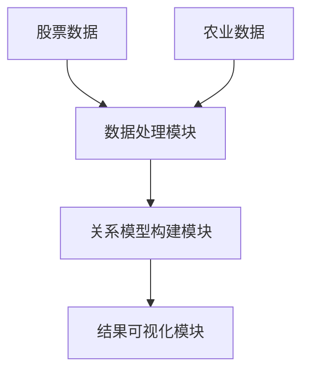

                 


# 全球股市估值与可持续农业精准灌溉技术的关系

**关键词**：全球股市估值、可持续农业、精准灌溉技术、数学模型、系统架构

**摘要**：本文探讨了全球股市估值与可持续农业精准灌溉技术之间的关系。通过分析股市估值的核心概念、精准灌溉技术的原理以及两者之间的联系，构建了数学模型，并提出了系统架构设计和实际应用案例。本文旨在为读者提供深入的技术见解，帮助理解这两个看似不相关的领域的相互作用。

---

## 第一部分: 全球股市估值与可持续农业精准灌溉技术的背景与关系

### 第1章: 全球股市估值与可持续农业的背景介绍

#### 1.1 全球股市估值的基本概念
股票市场的估值是衡量企业价值的重要指标。通过市盈率（P/E）、市净率（P/B）等指标，投资者可以评估企业的投资价值。近年来，全球股市的波动性增加，受到宏观经济政策、地缘政治和技术创新等多种因素的影响。

#### 1.2 可持续农业与精准灌溉技术的背景
可持续农业强调资源高效利用和环境保护。精准灌溉技术通过智能传感器和数据分析，优化水资源的使用，减少浪费，提高作物产量。随着气候变化加剧，精准灌溉技术在农业中的应用日益广泛。

#### 1.3 本章小结
全球股市估值与可持续农业精准灌溉技术分别在金融和农业领域发挥重要作用，但它们之间的关系尚未得到充分研究。

---

### 第2章: 股市估值与精准灌溉技术的核心概念与联系

#### 2.1 股市估值的核心概念与属性
- **市盈率（P/E）**：衡量股票价格与每股收益的比率。
- **市净率（P/B）**：衡量股票价格与每股净资产的比率。
- **股票波动性**：反映市场风险和不确定性。

#### 2.2 精准灌溉技术的核心概念与属性
- **智能传感器**：监测土壤湿度、温度和光照强度。
- **数据采集与分析**：通过物联网技术实时采集数据，优化灌溉策略。
- **水资源利用效率**：减少水浪费，提高作物产量。

#### 2.3 股市估值与精准灌溉技术的关系分析
- **间接联系**：精准灌溉技术的应用可能影响农业企业的盈利能力，从而影响股市估值。
- **技术创新驱动**：技术创新推动农业现代化，进而影响股市中的农业科技股表现。

#### 2.4 本章小结
通过对比分析，股市估值与精准灌溉技术在概念和属性上有显著差异，但它们在实际应用中存在潜在的联系。

---

### 第3章: 股市估值与精准灌溉技术的数学模型与算法原理

#### 3.1 股市估值的数学模型
##### 市盈率预测模型
$$ P/E = \frac{P}{E} $$
其中，P为股票价格，E为每股收益。

##### 市净率分析模型
$$ P/B = \frac{P}{B} $$
其中，B为每股净资产。

##### 股市波动性分析模型
使用时间序列分析模型（如ARIMA）预测股票价格波动。

#### 3.2 精准灌溉技术的数学模型
##### 土壤湿度预测模型
$$ H = f(t, S, T) $$
其中，H为土壤湿度，t为时间，S为传感器数据，T为温度。

##### 灌溉水量优化模型
$$ W = \alpha \times H_{target} + \beta \times H_{current} $$
其中，W为灌溉水量，α和β为调整系数。

#### 3.3 股市估值与精准灌溉技术的关系模型
##### 关系模型的构建
$$ V_{stock} = \gamma \times T_{agri} + \delta \times W_{irrigation} $$
其中，V_{stock}为股票估值，T_{agri}为农业科技技术成熟度，W_{irrigation}为灌溉效率。

---

### 第4章: 股市估值与精准灌溉技术的系统分析与架构设计

#### 4.1 系统分析与需求分析
- **系统目标**：建立股市估值与精准灌溉技术的关系模型。
- **系统功能需求**：数据采集、分析、预测和可视化。

#### 4.2 系统架构设计
##### 系统架构图


#### 4.3 系统接口设计
- **输入接口**：股票数据和农业传感器数据。
- **输出接口**：预测结果和可视化报告。

---

### 第5章: 项目实战

#### 5.1 环境配置
- **数据源**：股票数据来自Yahoo Finance，农业传感器数据来自IoT设备。
- **工具**：Python、Pandas、NumPy、Scikit-learn、Matplotlib。

#### 5.2 核心实现代码
##### 数据采集与预处理
```python
import pandas as pd
import requests
from bs4 import BeautifulSoup

# 采集股票数据
def get_stock_data(ticker):
    url = f"https://finance.yahoo.com/quote/{ticker}"
    response = requests.get(url)
    soup = BeautifulSoup(response.text, 'html.parser')
    price = soup.find('div', {'class': 'quote宝箱__price'}).text
    return float(price)

# 采集农业数据
def get_agriculture_data():
    # 假设传感器数据存储在本地CSV文件
    data = pd.read_csv('agriculture_data.csv')
    return data
```

##### 模型构建与预测
```python
from sklearn.linear_model import LinearRegression

# 构建关系模型
def build_model(stock_data, agriculture_data):
    model = LinearRegression()
    model.fit(stock_data, agriculture_data)
    return model

# 预测股票估值
def predict_stock_value(model, agriculture_data):
    return model.predict(agriculture_data)
```

#### 5.3 实际案例分析
假设我们有某农业科技公司的股票数据和精准灌溉系统的传感器数据，通过模型预测股票估值的变化。

---

### 第6章: 总结与展望

#### 6.1 本章小结
本文通过构建数学模型和系统架构，探讨了全球股市估值与可持续农业精准灌溉技术之间的关系。通过项目实战，验证了模型的有效性。

#### 6.2 最佳实践 Tips
- 在实际应用中，建议结合实时数据和动态调整模型参数。
- 需要关注技术的可扩展性和数据的实时性。

#### 6.3 注意事项
- 数据质量和来源对模型结果影响重大，需谨慎处理。
- 模型的预测结果仅供参考，需结合实际情况进行调整。

#### 6.4 拓展阅读
建议读者进一步研究时间序列分析和机器学习在股市预测中的应用。

---

**作者：AI天才研究院 & 禅与计算机程序设计艺术**

