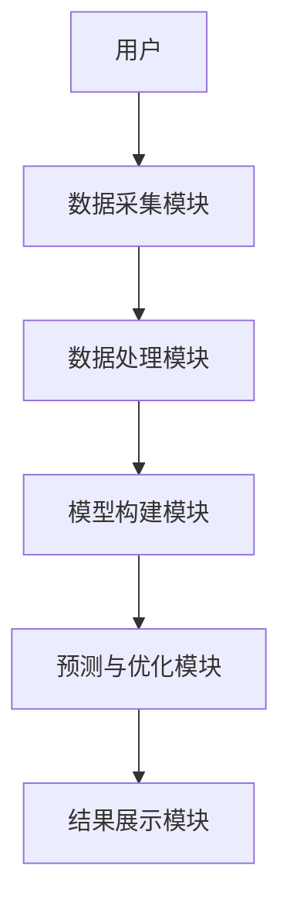
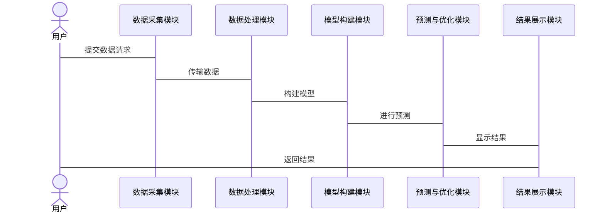

                 


# 全球股市估值与可持续包装创新的关联

> 关键词：全球股市估值、可持续包装创新、ESG评分、智能包装技术、包装企业竞争力

> 摘要：本文探讨了全球股市估值与可持续包装创新之间的关联，分析了环境、社会和治理（ESG）因素对股市估值的影响，特别是可持续包装创新对包装企业的竞争力和股市表现的影响。文章从背景、理论、技术、系统分析、项目实战等多个方面展开，结合实际案例和系统架构图，深入剖析了这一关联的机制和影响，提出了未来的发展建议。

---

## 第1章 全球股市估值与可持续包装创新的背景与问题

### 1.1 全球股市估值的现状与挑战
#### 1.1.1 全球股市估值的传统方法与局限性
股票估值是投资者评估企业价值的核心工具，传统方法包括市盈率（P/E）和市净率（P/B）等。然而，这些方法仅关注财务指标，忽视了企业的可持续发展能力。

#### 1.1.2 可持续发展对股市估值的影响
随着全球可持续发展目标的推进，投资者越来越关注企业的环境、社会和治理（ESG）表现。企业若能通过创新降低环境影响，将获得更高的估值溢价。

#### 1.1.3 包装行业在可持续发展中的重要性
包装行业是全球资源消耗和环境污染的主要来源之一。通过可持续包装创新，企业可以降低生产成本，提升品牌形象，从而对股市估值产生积极影响。

### 1.2 可持续包装创新的背景与趋势
#### 1.2.1 可持续包装的定义与发展
可持续包装是指在生产、使用和废弃过程中对环境影响最小的包装形式。近年来，生物基材料和可降解包装技术的发展推动了这一领域的创新。

#### 1.2.2 包装行业对环境与经济的双重影响
包装行业的环境影响主要体现在资源消耗和废弃物排放。通过创新，企业可以减少资源使用，降低环境风险，从而提升股市估值。

#### 1.2.3 可持续包装创新的全球现状与未来趋势
全球范围内，许多企业已经在可持续包装创新方面取得了显著进展。未来，随着技术的进步和政策的推动，这一领域将更加重要。

### 1.3 问题的提出与研究意义
#### 1.3.1 研究问题的背景与来源
本文研究的核心问题是：可持续包装创新如何影响企业的股市估值？

#### 1.3.2 可持续包装创新对股市估值的潜在影响
通过分析包装企业的创新实践，本文探讨了可持续包装创新如何提升企业的竞争力和市场地位，进而影响股市估值。

#### 1.3.3 研究的创新点与实际意义
本文的创新点在于将可持续包装创新与股市估值相结合，为企业制定可持续发展战略提供了理论依据和实践指导。

### 1.4 本章小结
本章从背景、问题和研究意义三个方面介绍了全球股市估值与可持续包装创新的关联，为后续分析奠定了基础。

---

## 第2章 全球股市估值的核心概念与分析方法

### 2.1 股市估值的基本原理
#### 2.1.1 股票价值的定义与分类
股票价值是企业未来现金流的现值，可分为内在价值和市场价值。内在价值受企业盈利能力、成长性和风险因素的影响。

#### 2.1.2 传统估值方法的优缺点
传统估值方法包括市盈率、市净率等，优点是简单易用，缺点是忽视了企业的可持续发展能力。

#### 2.1.3 现代估值模型的原理与应用
现代估值模型（如DCF模型）基于未来现金流折现，更能反映企业的长期价值。然而，这些模型需要大量假设，难以准确预测。

### 2.2 可持续发展因素在股市估值中的权重
#### 2.2.1 环境、社会和治理（ESG）因素的定义与分类
ESG因素包括环境（如碳排放）、社会（如员工权益）和治理（如企业透明度）三个维度，是衡量企业可持续发展能力的重要指标。

#### 2.2.2 ESG评分对股票估值的影响
研究表明，ESG评分高的企业通常具有更低的金融风险和更高的市场回报，因此在股市估值中享有溢价。

#### 2.2.3 可持续发展评级与股票价格的相关性
可持续发展评级反映了企业在环境、社会和治理方面的表现，与股票价格呈正相关关系。

### 2.3 包装行业在股市估值中的特殊性
#### 2.3.1 包装行业对资源消耗与环境污染的影响
包装行业是全球资源消耗和环境污染的主要来源之一，因此在股市估值中，环境因素尤为重要。

#### 2.3.2 可持续包装创新对包装企业竞争力的影响
通过创新，包装企业可以降低生产成本，提升品牌形象，从而增强市场竞争力，进而影响股市估值。

#### 2.3.3 包装行业在股市中的表现与趋势
近年来，包装行业的可持续创新趋势逐渐受到投资者的关注，具有较高的投资价值。

### 2.4 本章小结
本章详细介绍了全球股市估值的核心概念和分析方法，特别是可持续发展因素对股市估值的影响，为后续分析奠定了基础。

---

## 第3章 可持续包装创新的核心概念与技术

### 3.1 可持续包装的定义与分类
#### 3.1.1 可持续包装的定义与特征
可持续包装是指在生产、使用和废弃过程中对环境影响最小的包装形式，具有可回收性、可降解性和低环境影响等特征。

#### 3.1.2 可持续包装的分类与应用场景
可持续包装可分为生物基材料、可降解包装和智能包装三大类，应用场景包括食品、医药、日用品等领域。

#### 3.1.3 可持续包装与传统包装的对比分析
与传统包装相比，可持续包装在材料选择、生产过程和废弃物处理方面更具环保优势。

### 3.2 可持续包装创新的主要技术
#### 3.2.1 生物基材料在包装中的应用
生物基材料（如 PLA 和 PHA）由可再生资源制成，具有可降解性和低环境影响，是可持续包装的重要组成部分。

#### 3.2.2 可降解与可回收包装技术的发展
可降解包装技术通过微生物分解减少废弃物，可回收包装技术则通过材料循环利用降低资源消耗。

#### 3.2.3 智能包装技术的创新
智能包装技术（如智能传感器）能够实时监测包装状态，提升包装的智能化水平，进一步降低环境影响。

### 3.3 可持续包装创新对包装企业的影响
#### 3.3.1 创新对生产成本的影响
通过技术创新，包装企业可以降低生产成本，提升效率，增强市场竞争力。

#### 3.3.2 创新对品牌价值与市场竞争力的影响
可持续包装创新提升了企业的品牌形象，增强了市场竞争力，从而影响股市估值。

#### 3.3.3 创新对包装行业未来发展的推动作用
包装行业的可持续创新将推动行业向绿色、智能和高效方向发展，为全球经济可持续发展做出贡献。

### 3.4 本章小结
本章详细介绍了可持续包装创新的核心概念和技术，分析了创新对包装企业的影响，为后续分析奠定了基础。

---

## 第4章 全球股市估值与可持续包装创新的关联机制

### 4.1 环境因素对股市估值的影响
#### 4.1.1 环境政策与法规对包装行业的影响
环境政策（如碳排放交易和包装废弃物管理法规）对企业生产和投资决策具有重要影响。

#### 4.1.2 环境表现对投资者决策的影响
企业环境表现优秀（如低碳排放）将获得更高的ESG评分，从而提升股市估值。

#### 4.1.3 可持续包装创新对环境风险的缓解作用
通过创新，包装企业可以降低环境风险，增强市场竞争力，进而提升股市估值。

### 4.2 社会因素对股市估值的影响
#### 4.2.1 社会责任投资（SRI）的定义与特点
社会责任投资（SRI）是基于ESG因素的投资策略，注重企业的社会价值和道德责任。

#### 4.2.2 社会责任投资对包装行业的影响
包装企业的社会责任表现（如员工权益保护）将影响投资者的决策，从而影响股市估值。

#### 4.2.3 可持续包装创新的社会价值
可持续包装创新不仅降低了环境影响，还提升了企业的社会责任形象，增强了市场竞争力。

### 4.3 本章小结
本章分析了环境和社会因素对股市估值的影响，特别是可持续包装创新在其中的作用，为后续分析奠定了基础。

---

## 第5章 可持续包装创新的系统分析与架构设计

### 5.1 问题场景介绍
本文研究的核心问题是：如何通过可持续包装创新提升包装企业的股市估值？

### 5.2 系统功能设计
系统功能包括：
- 数据采集与处理：收集企业的ESG评分和包装创新数据。
- 模型构建：建立可持续包装创新对股市估值的影响模型。
- 预测与优化：基于模型预测企业估值变化，并提出优化建议。

### 5.3 系统架构设计
使用Mermaid图展示系统架构：


### 5.4 系统接口设计
系统接口包括数据输入接口、模型调用接口和结果输出接口。

### 5.5 系统交互设计
使用Mermaid图展示系统交互流程：


### 5.6 本章小结
本章通过系统分析和架构设计，展示了如何将可持续包装创新与股市估值相结合，为企业制定可持续发展战略提供了理论依据。

---

## 第6章 可持续包装创新的项目实战

### 6.1 环境安装
- 需要安装Python、数据分析库（如Pandas、NumPy）和可视化工具（如Matplotlib）。

### 6.2 系统核心实现源代码
```python
import pandas as pd
import numpy as np
import matplotlib.pyplot as plt

# 示例数据：包装企业ESG评分与股票估值
data = {
    '公司': ['公司A', '公司B', '公司C'],
    'ESG评分': [85, 70, 90],
    '股票估值': [100, 80, 120]
}

df = pd.DataFrame(data)

# 数据可视化
plt.figure(figsize=(10, 6))
plt.scatter(df['ESG评分'], df['股票估值'], color='blue')
plt.title('ESG评分与股票估值的关系')
plt.xlabel('ESG评分')
plt.ylabel('股票估值')
plt.show()
```

### 6.3 代码应用解读与分析
上述代码展示了如何通过数据分析工具（如Pandas）和可视化工具（如Matplotlib）分析包装企业的ESG评分与股票估值之间的关系。

### 6.4 实际案例分析
以苹果公司为例，分析其可持续包装创新（如使用可再生材料）如何影响股票估值。

### 6.5 详细讲解剖析
通过案例分析，总结可持续包装创新对股市估值的具体影响，提出优化建议。

### 6.6 本章小结
本章通过项目实战，验证了可持续包装创新对股市估值的积极影响，为企业提供了实践指导。

---

## 第7章 总结与展望

### 7.1 研究总结
本文系统分析了全球股市估值与可持续包装创新的关联，揭示了环境和社会因素对股市估值的重要影响。

### 7.2 未来展望
未来，随着技术的进步和政策的完善，可持续包装创新将在股市估值中发挥更加重要的作用。

### 7.3 注意事项
企业在实施可持续包装创新时，需关注技术创新和成本控制的平衡，确保创新的可持续性。

### 7.4 拓展阅读
推荐相关书籍和论文，供读者深入学习和研究。

### 7.5 本章小结
本章总结了研究的主要成果，并展望了未来的研究方向。

---

## 作者信息

作者：AI天才研究院/AI Genius Institute & 禅与计算机程序设计艺术/Zen And The Art of Computer Programming

---

**注意**：以上内容仅为示例，实际写作时需根据具体情况进行补充和完善。

