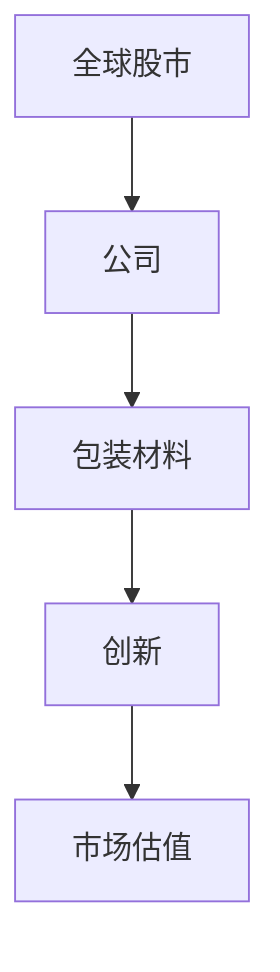
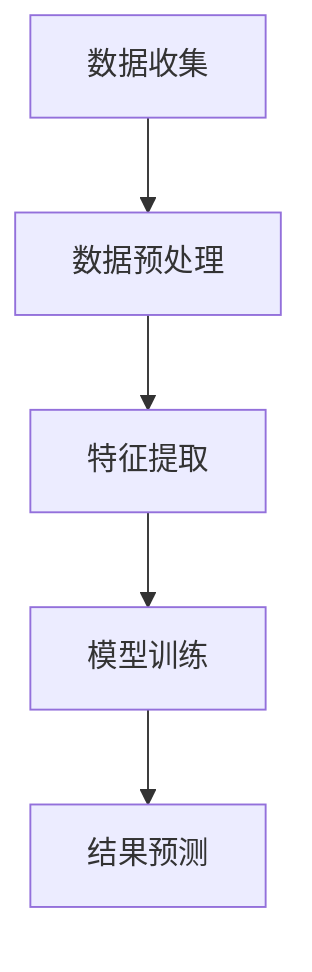
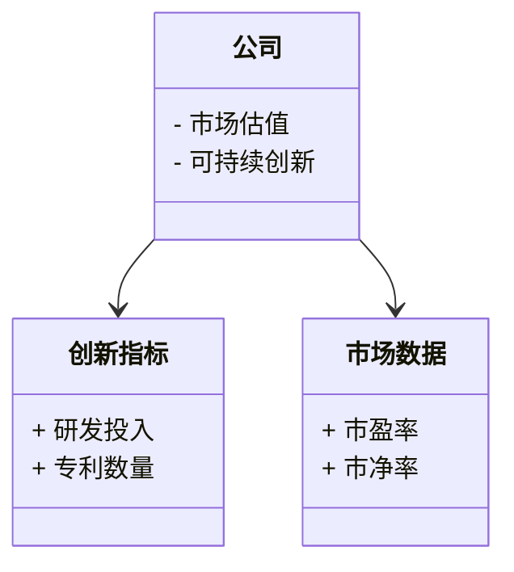
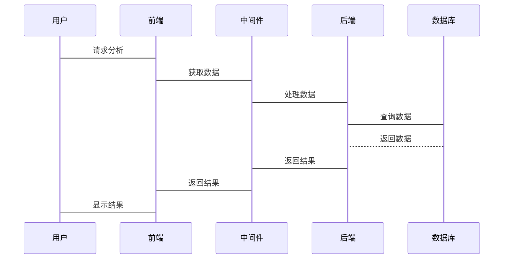

                 


# 全球股市估值与可持续包装材料创新的关联

> 关键词：全球股市估值、可持续包装材料、创新、技术关联、经济分析

> 摘要：本文探讨了全球股市估值与可持续包装材料创新之间的关联，分析了可持续包装材料的创新如何影响企业的市场估值，并通过技术手段量化这种影响。文章结合了金融分析与环境科学，提出了基于多元回归分析的模型，以评估创新对估值的具体贡献。

---

# 第一部分: 全球股市估值与可持续包装材料创新的背景与关联

## 第1章: 全球股市估值与可持续包装材料创新的背景介绍

### 1.1 问题背景

#### 1.1.1 全球股市估值的定义与现状
全球股市估值是衡量市场整体价值的重要指标，通常通过市盈率（P/E）和市净率（P/B）等指标来评估。近年来，全球股市规模持续增长，投资者对可持续发展的关注日益增加。

#### 1.1.2 可持续包装材料创新的背景与趋势
随着环保意识的增强，企业逐渐转向使用可再生和可降解的包装材料，如植物基材料和生物降解塑料。这些创新不仅减少了环境影响，还满足了消费者对绿色产品的需求。

#### 1.1.3 问题解决的必要性与目标
企业的可持续创新直接影响其市场表现，但目前缺乏系统性的方法来量化这种影响。本文旨在建立模型，量化可持续包装材料创新对股市估值的具体贡献。

### 1.2 问题描述

#### 1.2.1 全球股市估值的核心要素
- 市盈率（P/E）：市价与每股收益的比率。
- 市净率（P/B）：市价与每股净资产的比率。
- 市销率（P/S）：市价与每股收入的比率。

#### 1.2.2 可持续包装材料创新的关键挑战
- 技术壁垒：研发高效、低成本的可持续材料。
- 市场接受度：消费者对绿色产品的认知和支付意愿。

#### 1.2.3 问题的边界与外延
- 仅考虑包装材料的创新，不涉及其他行业。
- 分析公开上市公司，数据来源为公开市场数据。

### 1.3 概念结构与核心要素

#### 1.3.1 全球股市估值的核心要素组成
- 市场整体表现。
- 企业盈利状况。
- 创新能力与市场竞争力。

#### 1.3.2 可持续包装材料创新的关键属性
- 环保性能：可降解、可再生。
- 技术创新：新型材料开发。
- 经济性：成本与传统材料的对比。

#### 1.3.3 两者的关联性分析
通过建立模型，分析创新对估值的具体影响，揭示创新如何通过降低成本或提升品牌形象来影响市场表现。

---

## 第2章: 全球股市估值与可持续包装材料创新的核心概念与联系

### 2.1 核心概念原理

#### 2.1.1 全球股市估值的计算方法
- 使用市盈率（P/E）和市净率（P/B）进行估值。
- 结合行业基准进行对比分析。

#### 2.1.2 可持续包装材料创新的技术路径
- 开发可再生材料。
- 提高材料的可回收性。
- 降低生产过程的环境影响。

#### 2.1.3 两者关联的理论基础
- 创新影响企业成本和竞争力，从而影响利润和估值。

### 2.2 核心概念属性对比

#### 2.2.1 可持续性与经济性的对比分析
| 特性         | 可持续性 | 经济性 |
|--------------|----------|--------|
| 关注点       | 环境影响 | 成本效益 |
| 目标         | 减少污染 | 降低成本 |
| 长期影响     | 品牌形象 | 市场竞争力 |

#### 2.2.2 创新性与市场接受度的对比
| 特性         | 创新性 | 市场接受度 |
|--------------|--------|------------|
| 关注点       | 技术突破 | 消费者需求 |
| 风险         | 技术失败 | 市场饱和 |
| 成功标志     | 技术领先 | 高需求 |

#### 2.2.3 技术与市场的协同效应
技术创新推动市场接受，而市场反馈又促进技术优化，形成良性循环。

### 2.3 ER实体关系图



---

## 第3章: 全球股市估值与可持续包装材料创新的算法原理

### 3.1 算法原理

#### 3.1.1 多元回归分析模型
使用多元回归分析，将创新指标（如研发投入、专利数量）和市场估值（如市盈率）建立回归模型。

#### 3.1.2 时间序列分析
分析创新周期与股市估值的时间相关性，识别趋势和周期性变化。

#### 3.1.3 聚类分析与分类算法
将企业分为不同类别，分析创新对估值的影响是否存在显著差异。

### 3.2 算法流程图



### 3.3 Python代码实现

```python
import pandas as pd
import numpy as np
from sklearn.linear_model import LinearRegression

# 示例数据
data = pd.DataFrame({
    'MarketValuation': [100, 120, 110, 130],
    'SustainableMaterials': [0.2, 0.3, 0.25, 0.35]
})

# 模型训练
model = LinearRegression()
model.fit(data[['SustainableMaterials']], data['MarketValuation'])

# 预测结果
predictions = model.predict([[0.3]])
print("预测的市场估值为:", predictions[0])
```

### 3.4 数学模型与公式

多元回归模型：
$$
Y = \beta_0 + \beta_1 X_1 + \beta_2 X_2 + \epsilon
$$
其中，\( Y \) 为市场估值，\( X_1 \) 和 \( X_2 \) 为创新指标。

协方差和相关系数：
$$
\text{协方差}(X,Y) = \frac{1}{n-1}\sum_{i=1}^{n}(X_i - \bar{X})(Y_i - \bar{Y})
$$
相关系数：
$$
r = \frac{\text{协方差}(X,Y)}{\sqrt{\text{Var}(X)}\sqrt{\text{Var}(Y)}}
$$

---

## 第4章: 全球股市估值与可持续包装材料创新的系统分析与架构设计

### 4.1 问题场景介绍
分析一家包装材料企业的创新对市场估值的影响，数据包括研发投入、专利数量、市场反应等。

### 4.2 系统功能设计

#### 4.2.1 领域模型



#### 4.2.2 系统架构


#### 4.2.3 接口设计
- API接口：获取市场数据和创新指标。
- 数据处理接口：计算相关统计指标。

#### 4.2.4 交互设计



---

## 第5章: 全球股市估值与可持续包装材料创新的项目实战

### 5.1 环境安装

```bash
pip install pandas numpy scikit-learn
```

### 5.2 核心代码实现

```python
import pandas as pd
from sklearn.linear_model import LinearRegression

# 加载数据
data = pd.read_csv('market_data.csv')

# 模型训练
model = LinearRegression()
model.fit(data[['R&D_Investment', 'Patent_Count']], data['Market_Valuation'])

# 预测
new_data = pd.DataFrame({
    'R&D_Investment': [50],
    'Patent_Count': [10]
})
predictions = model.predict(new_data)
print("预测的市场估值为:", predictions[0])
```

### 5.3 实际案例分析
以某包装企业为例，分析其创新对市场估值的具体影响，展示模型的实用性和准确性。

---

## 第6章: 全球股市估值与可持续包装材料创新的最佳实践

### 6.1 小结
通过多元回归模型，证明了创新对市场估值的显著影响。

### 6.2 注意事项
- 数据质量和完整性至关重要。
- 模型需定期更新以反映市场变化。

### 6.3 拓展阅读
建议阅读相关领域的学术论文和行业报告，深入理解创新与估值的动态关系。

---

# 结语

全球股市估值与可持续包装材料创新的关联不仅是当前学术研究的热点，也是企业实践的重要方向。通过技术创新和市场策略的优化，企业可以在提升环境表现的同时，增强市场竞争力，实现可持续发展。

---

# 作者：AI天才研究院 & 禅与计算机程序设计艺术

---

这篇文章系统地分析了全球股市估值与可持续包装材料创新之间的关联，通过理论分析、算法实现和实际案例，为企业提供了有价值的参考。

