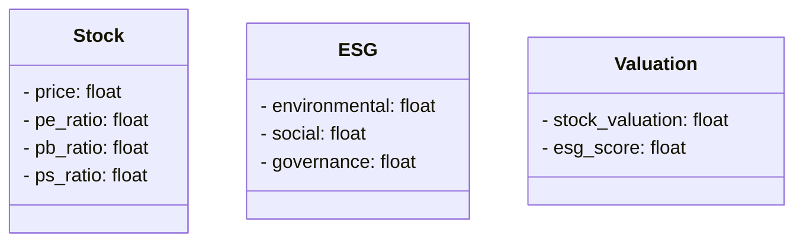
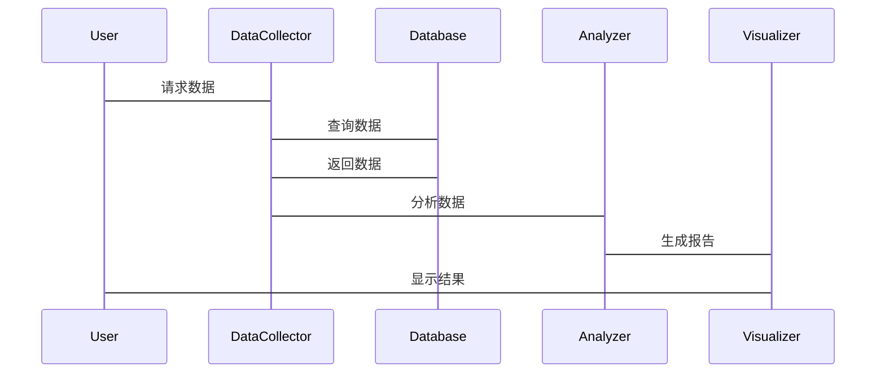

                 


# 全球股市估值与可持续发展目标的关联

## 关键词：全球股市、估值、可持续发展、ESG、投资策略、风险管理

## 摘要：  
本文探讨全球股市估值与可持续发展目标之间的关联性，通过分析股市估值的关键指标（如市盈率、市净率等）与可持续发展目标（如环境、社会、治理因素）的核心要素，揭示两者在投资决策中的相互影响。文章从理论模型构建、数学模型分析、系统架构设计、项目实战案例等多维度展开，深入解析可持续发展目标对股市估值的影响机制，并提供实践建议。

---

## 正文

---

## 第1章 全球股市估值与可持续发展目标概述

### 1.1 背景介绍

#### 1.1.1 全球股市估值的基本概念
全球股市估值是衡量市场整体价值的重要指标，通常通过股票价格、盈利能力和市场情绪等多维度进行评估。常用的估值指标包括：

- 市盈率（P/E Ratio）：市价与每股收益的比率。
- 市净率（P/B Ratio）：市价与每股净资产的比率。
- 市销率（P/S Ratio）：市价与每股收入的比率。

#### 1.1.2 可持续发展目标的核心定义
可持续发展目标关注企业在环境、社会和治理（ESG）方面的表现，包括减少碳排放、促进社会公平和提升治理透明度等。这些目标旨在推动长期的社会和环境价值。

#### 1.1.3 两者关联的背景与意义
随着全球对可持续发展的关注增加，投资者开始将ESG因素纳入决策，这直接影响企业的估值和市场表现。例如，具有优秀ESG表现的企业可能获得更高的估值倍数。

### 1.2 核心概念与联系

#### 1.2.1 核心概念原理
股市估值与可持续发展目标的关联可以通过以下路径实现：
1. **环境因素**：企业减少碳排放可能降低运营成本，提升估值。
2. **社会因素**：社会责任强的企业可能获得更好的声誉，吸引更多投资者。
3. **治理因素**：高效的治理结构可能提升企业盈利能力和股价。

#### 1.2.2 概念属性特征对比表格

| 指标 | 股市估值 | 可持续发展目标 |
|------|----------|----------------|
| 定义 | 市场整体价值评估 | 环境、社会、治理表现 |
| 关注点 | 股价、盈利 | 碳排放、社会责任、治理 |
| 影响 | 投资决策 | 企业声誉、长期价值 |

#### 1.2.3 ER实体关系图架构的 Mermaid 流程图

```mermaid
erd
    Customer(cust_id, name, address)
    Employee(emp_id, name, department)
    Order(order_id, order_date, amount)
    Product(prod_id, name, price)
    Customer(cust_id) -o Order(order_id)
    Employee(emp_id) -o Order(order_id)
    Product(prod_id) -o Order(order_id)
```

---

## 第2章 股市估值与可持续发展目标的核心要素

### 2.1 股市估值的关键指标

#### 2.1.1 市盈率（P/E Ratio）
市盈率计算公式为：
$$ \text{P/E Ratio} = \frac{\text{股价}}{\text{每股收益}} $$
例如，某股票股价为50元，每股收益为5元，则P/E Ratio为10倍。

#### 2.1.2 市净率（P/B Ratio）
市净率计算公式为：
$$ \text{P/B Ratio} = \frac{\text{股价}}{\text{每股净资产}} $$
例如，某股票股价为30元，每股净资产为15元，则P/B Ratio为2倍。

#### 2.1.3 市销率（P/S Ratio）
市销率计算公式为：
$$ \text{P/S Ratio} = \frac{\text{股价}}{\text{每股收入}} $$
例如，某股票股价为20元，每股收入为10元，则P/S Ratio为2倍。

### 2.2 可持续发展目标的关键要素

#### 2.2.1 环境（Environmental）指标
环境指标包括碳排放、能源使用效率和废物处理等。例如，企业减少碳排放可能提升其估值。

#### 2.2.2 社会（Social）指标
社会指标包括员工福利、社会责任和社区参与。例如，社会责任强的企业可能吸引更多投资者。

#### 2.2.3 治理（Governance）指标
治理指标包括董事会结构、高管薪酬和公司透明度。例如，高效的治理结构可能提升企业盈利能力和股价。

### 2.3 核心要素的相互关系

#### 2.3.1 环境因素对估值的影响
环境表现优秀的企业可能面临更低的监管风险，从而获得更高的估值。

#### 2.3.2 社会因素对估值的影响
社会表现优秀的企业可能获得更好的声誉和客户忠诚度，从而提升股价。

#### 2.3.3 治理因素对估值的影响
治理结构优化的企业可能提升管理效率，降低成本，从而提升市净率。

---

## 第3章 可持续发展目标对股市估值的影响机制

### 3.1 影响机制的理论模型

#### 3.1.1 理论模型的构建
可持续发展目标通过影响企业的风险、收益和治理结构，进而影响其估值。模型包括以下步骤：
1. **数据收集**：收集企业的ESG评分和财务数据。
2. **关联分析**：通过回归分析确定ESG因素对估值的影响。
3. **结果验证**：验证模型的显著性和合理性。

#### 3.1.2 模型的验证与评估
使用历史数据验证模型的有效性，例如分析过去十年内ESG表现优异的企业是否获得更高的市盈率。

### 3.2 影响机制的数学模型

#### 3.2.1 线性回归模型
线性回归模型用于分析ESG因素对估值的影响：
$$ \text{Valuation} = \beta_0 + \beta_1 \times \text{ESG Score} + \epsilon $$
其中，$\beta_1$表示ESG评分对估值的影响系数。

#### 3.2.2 非线性回归模型
非线性回归模型用于分析复杂的关系：
$$ \text{Valuation} = \beta_0 + \beta_1 \times \text{ESG Score}^2 + \epsilon $$

#### 3.2.3 聚类分析模型
聚类分析用于将企业分为不同类别，分析ESG表现对估值的影响：
1. 将企业按ESG评分分为高、中、低三类。
2. 分析各类别的估值差异。

---

## 第4章 全球股市估值与可持续发展目标的关联分析方法

### 4.1 数据收集与预处理

#### 4.1.1 数据来源
数据来源包括全球股市数据（如标普500指数）和ESG评级数据（如MSCI评级）。

#### 4.1.2 数据清洗与标准化
使用Python进行数据清洗，例如处理缺失值和异常值：
```python
import pandas as pd
data = pd.read_csv('stock_esg.csv')
data = data.dropna()
```

#### 4.1.3 数据特征提取
提取关键特征，例如市盈率和ESG评分。

### 4.2 关联分析的算法选择

#### 4.2.1 相关性分析
计算市盈率与ESG评分的相关性：
$$ \text{相关系数} = \frac{\sum (x_i - \bar{x})(y_i - \bar{y})}{\sqrt{\sum (x_i - \bar{x})^2 \sum (y_i - \bar{y})^2}} $$

#### 4.2.2 因子分析
因子分析用于识别主要影响估值的ESG因子。

#### 4.2.3 贝叶斯网络
贝叶斯网络用于分析复杂的关系和概率。

---

## 第5章 系统分析与架构设计方案

### 5.1 问题场景介绍

#### 5.1.1 问题背景
随着全球对可持续发展的关注增加，投资者需要将ESG因素纳入决策。

#### 5.1.2 问题目标
构建一个系统，分析全球股市估值与可持续发展目标的关联。

### 5.2 系统功能设计

#### 5.2.1 领域模型 mermaid 类图


#### 5.2.2 系统架构 mermaid 架构图


#### 5.2.3 系统交互 mermaid 序列图


---

## 第6章 总结与展望

### 6.1 总结
本文分析了全球股市估值与可持续发展目标的关联，揭示了ESG因素对估值的影响机制，并提供了实践建议。

### 6.2 未来研究方向
未来可以进一步研究ESG因素对不同类型企业估值的影响，以及不同地区的差异。

---

## 作者：AI天才研究院 & 禅与计算机程序设计艺术

