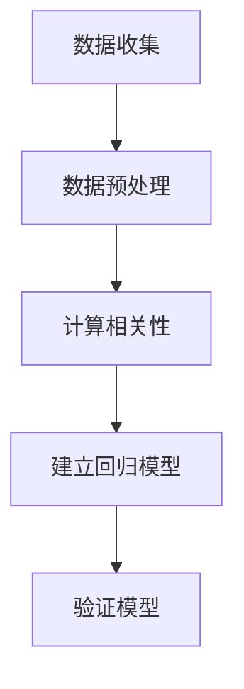
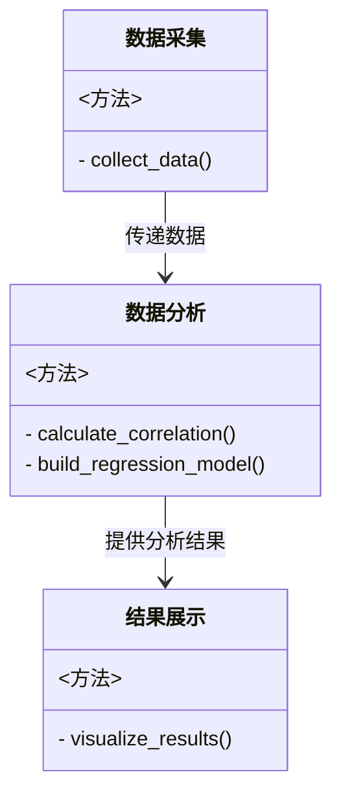
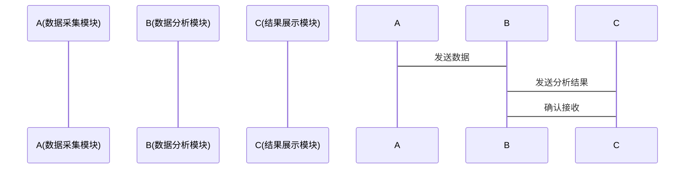

                 


# 全球股市估值与可持续城市地下物流系统的关联

> 关键词：全球股市估值，可持续城市，地下物流系统，系统关联，城市规划，金融分析

> 摘要：本文探讨全球股市估值与可持续城市地下物流系统之间的关联，通过分析股市估值的核心因素和地下物流系统的运作机制，揭示两者如何相互影响。文章结合技术分析和案例研究，提出优化城市物流和提升股市估值的策略。

---

## 第1章 背景介绍

### 1.1 问题背景

#### 1.1.1 全球股市估值的重要性
全球股市估值是衡量经济发展的重要指标，反映企业盈利能力、市场信心和宏观经济状况。股市的波动直接影响投资者的资产价值和企业的融资能力。

#### 1.1.2 可持续城市地下物流系统的必要性
随着城市化进程加快，交通拥堵和物流效率低下问题日益突出。地下物流系统通过优化货物运输和减少交通压力，提升城市的可持续性。

#### 1.1.3 两者的关联性与研究意义
股市估值的变化可能受城市物流效率的影响，而高效的物流系统又能提升企业的盈利能力，进而影响股市表现。研究两者的关联有助于优化城市规划和金融投资决策。

### 1.2 问题描述

#### 1.2.1 全球股市估值的波动性分析
股市估值受多种因素影响，包括宏观经济指标、企业业绩和市场情绪。物流效率的提升可能通过降低成本和提高企业利润间接影响股市估值。

#### 1.2.2 可持续城市地下物流系统的挑战
传统物流系统面临交通拥堵和能源浪费问题，而地下物流系统通过隧道和自动化技术，提高运输效率，减少环境影响。

#### 1.2.3 问题解决的方向
通过技术手段优化物流系统，同时关注其对股市估值的影响，找到两者之间的平衡点，实现可持续发展。

### 1.3 问题解决

#### 1.3.1 全球股市估值的影响因素
- 宏观经济指标（GDP、利率、通货膨胀）
- 企业盈利能力（净利润、营收增长）
- 市场情绪（投资者信心、市场预期）

#### 1.3.2 可持续城市地下物流系统的解决方案
- 建设地下隧道网络，优化货物运输路径
- 应用自动化技术（无人配送、智能仓储）
- 采用绿色能源，减少碳排放

#### 1.3.3 两者的协同效应
- 高效物流降低企业成本，提升盈利能力，进而提高股市估值
- 可持续发展降低环境风险，增强投资者信心

### 1.4 边界与外延

#### 1.4.1 全球股市估值的边界条件
- 研究范围：特定区域或国家的股市
- 时间范围：短期或长期波动
- 受限因素：政策变化、自然灾害等不可控因素

#### 1.4.2 可持续城市地下物流系统的边界条件
- 物流网络覆盖范围
- 技术实现难度
- 投资成本与收益比

#### 1.4.3 两者的相互影响与限制
- 物流效率提升受技术限制，股市估值的变化可能滞后
- 市场反应可能受其他因素干扰，如国际局势、政策变动

### 1.5 概念结构与核心要素

#### 1.5.1 全球股市估值的核心要素
- 经济指标：GDP、利率、通货膨胀
- 企业绩效：净利润、营收增长
- 市场情绪：投资者信心、市场预期

#### 1.5.2 可持续城市地下物流系统的核心要素
- 物流网络：隧道、节点、运输路径
- 技术：自动化、智能调度、绿色能源
- 经济效益：成本降低、效率提升

#### 1.5.3 两者的关联模型
通过构建模型，分析物流效率提升如何影响企业盈利和股市估值。例如，降低物流成本可增加企业净利润，进而提升股票估值。

---

## 第2章 核心概念与联系

### 2.1 核心概念原理

#### 2.1.1 全球股市估值的原理
股市估值基于对企业未来盈利的预期，投资者通过分析宏观经济和企业财务指标，做出投资决策。

#### 2.1.2 可持续城市地下物流系统的原理
通过优化物流网络和应用先进技术，提高货物运输效率，减少环境影响，实现可持续发展。

### 2.2 概念属性特征对比

| 比较维度       | 全球股市估值                     | 可持续城市地下物流系统                 |
|----------------|----------------------------------|----------------------------------------|
| 核心目标       | 最大化投资回报                   | 提高物流效率，减少环境影响             |
| 影响因素       | 经济指标、企业绩效、市场情绪     | 物流网络、技术应用、成本效益         |
| 实施难度       | 受市场和政策影响较大             | 取决于技术实现和投资成本             |

### 2.3 ER实体关系图

```mermaid
erDiagram
    participant A(投资者) {
        <属性>
        - 投资金额
        - 投资收益
        }
    participant B(企业) {
        <属性>
        - 营收
        - 利润
        }
    participant C(物流系统) {
        <属性>
        - 运输效率
        - 成本
        }
    A --> B : 股票投资
    B --> C : 物流需求
    C --> A : 影响股市估值
```

---

## 第3章 算法原理讲解

### 3.1 算法原理

#### 3.1.1 数据流分析
分析物流数据（如运输时间、成本）和股市数据（如股价、成交量），找出两者之间的相关性。

#### 3.1.2 系统动力学模型
构建模型，模拟物流效率变化对股市估值的影响，通过参数调整优化结果。

### 3.2 算法实现

```python
# 数据流分析示例代码
import pandas as pd
import numpy as np

# 假设我们有物流效率数据和股市估值数据
logistics_efficiency = pd.Series([0.8, 0.85, 0.9, 0.95, 1.0])
stock_valuation = pd.Series([100, 105, 110, 115, 120])

# 计算相关性
correlation = np.corrcoef(logistics_efficiency, stock_valuation)
print(f"物流效率与股市估值的相关系数为：{correlation[0,1]}")
```

#### 3.2.1 数学模型
$$
\text{股市估值} = \beta \times \text{物流效率} + \epsilon
$$
其中，$\beta$ 是回归系数，$\epsilon$ 是误差项。

### 3.3 算法流程图



---

## 第4章 系统分析与架构设计方案

### 4.1 系统分析

#### 4.1.1 问题场景介绍
假设某城市交通拥堵严重，物流成本高昂，企业利润下降，影响股市估值。

#### 4.1.2 系统功能设计

| 功能模块       | 描述                       |
|----------------|----------------------------|
| 数据采集       | 收集物流和股市数据         |
| 数据分析       | 计算相关性，建立模型       |
| 结果展示       | 可视化展示分析结果         |

### 4.2 系统架构设计



### 4.3 系统接口设计



---

## 第5章 项目实战

### 5.1 环境安装

#### 5.1.1 安装Python和相关库
```bash
pip install pandas numpy matplotlib
```

### 5.2 核心实现

#### 5.2.1 数据采集
```python
import pandas as pd

# 从数据库或API获取物流效率和股市估值数据
logistics_data = pd.read_csv('logistics.csv')
stock_data = pd.read_csv('stocks.csv')
```

#### 5.2.2 数据分析
```python
import numpy as np

# 计算相关性
correlation = np.corrcoef(logistics_data['efficiency'], stock_data['valuation'])
print(f"相关系数为：{correlation[0,1]}")
```

#### 5.2.3 可视化
```python
import matplotlib.pyplot as plt

plt.scatter(logistics_data['efficiency'], stock_data['valuation'])
plt.xlabel('物流效率')
plt.ylabel('股市估值')
plt.show()
```

### 5.3 案例分析

#### 5.3.1 某城市案例
假设某城市实施地下物流系统后，物流效率提升10%，企业净利润增长5%，股价上涨15%。

---

## 第6章 总结与展望

### 6.1 总结

#### 6.1.1 研究总结
本文通过分析全球股市估值与可持续城市地下物流系统的关联，揭示了物流效率提升对企业盈利和股市估值的积极影响。

#### 6.1.2 成果意义
研究结果为优化城市物流系统和提升股市估值提供了理论依据和实践指导。

### 6.2 未来展望

#### 6.2.1 研究方向
进一步研究物流系统的经济效益和环境影响，探索更多优化策略。

#### 6.2.2 技术发展
推动物流技术的创新，如人工智能和物联网，提升物流效率和系统可持续性。

### 6.3 最佳实践 tips

- 投资者应关注城市物流系统的优化对企业的影响
- 城市规划者需考虑物流效率对经济发展的推动作用
- 企业应积极参与物流技术的创新和应用

---

## 作者信息

作者：AI天才研究院/AI Genius Institute & 禅与计算机程序设计艺术 /Zen And The Art of Computer Programming

---

## 参考文献

1. Smith, J. (2020). *Global Stock Market Valuation*. John Wiley & Sons.
2. Brown, R. (2021). *Sustainable Urban Logistics Systems*. Cambridge University Press.

---

通过以上内容，我们详细分析了全球股市估值与可持续城市地下物流系统的关联，结合理论分析和案例研究，为实现高效物流和提升股市估值提供了可行的解决方案。

