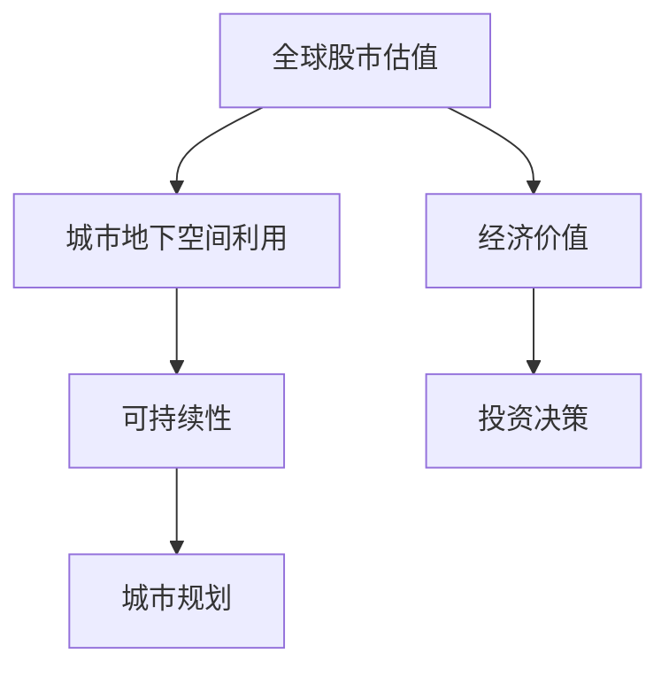
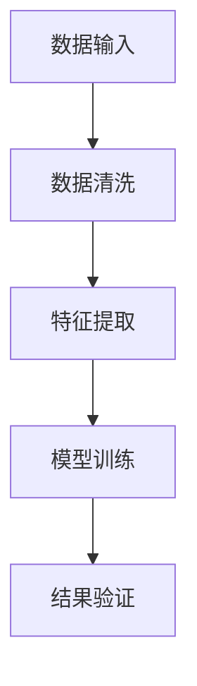
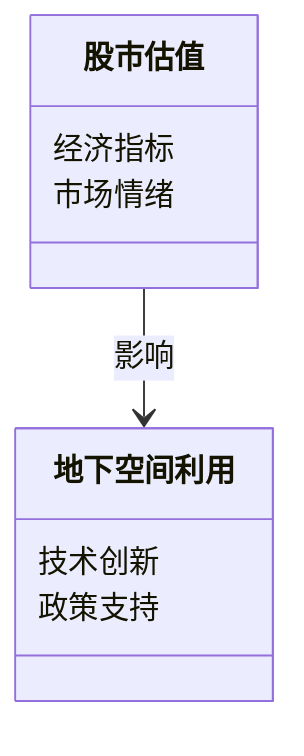

                 


# 全球股市估值与可持续城市地下空间利用的关联

## 关键词：全球股市估值、可持续城市、地下空间利用、关联性分析、经济模型、城市规划

## 摘要：本文探讨了全球股市估值与可持续城市地下空间利用之间的关联性。通过分析股市估值的理论基础、可持续城市地下空间利用的重要性，以及两者之间的联系，本文提出了一个结合经济模型与城市规划的系统架构。通过算法和数学模型，本文展示了如何通过数据预处理和特征提取，建立关联性分析模型，并给出了实际案例分析和最佳实践建议。

---

# 第一部分: 全球股市估值与可持续城市地下空间利用的背景介绍

## 第1章: 全球股市估值与可持续城市地下空间利用的背景介绍

### 1.1 问题背景与问题描述

#### 1.1.1 全球股市估值的现状与挑战
全球股市估值是反映经济健康状况的重要指标。随着全球经济一体化的深入，股市的波动性增加，投资者对风险管理和资产配置的需求日益增长。然而，传统估值方法面临数据复杂性和模型局限性的挑战。

#### 1.1.2 可持续城市地下空间利用的重要性
随着城市化进程的加快，城市土地资源日益紧张。地下空间的开发不仅是解决土地不足的重要途径，也是实现可持续城市发展的重要组成部分。地下空间的合理利用能够提升城市的承载力和生活质量，同时减少对环境的影响。

#### 1.1.3 问题解决的必要性与目标
本研究旨在通过分析全球股市估值与可持续城市地下空间利用的关联性，探索如何通过经济模型优化城市地下空间的开发和管理，从而实现经济与环境的双重目标。

### 1.2 问题的边界与外延

#### 1.2.1 全球股市估值的边界条件
- 数据范围：包括主要股市指数（如标普500、沪深300等）。
- 时间范围：近十年的数据。
- 地域范围：全球主要经济体。

#### 1.2.2 可持续城市地下空间利用的边界条件
- 开发范围：地下空间的规划、建设和运营。
- 技术限制：地下空间开发的技术可行性和经济性。
- 环境影响：地下空间开发对环境的影响评估。

#### 1.2.3 两者的关联性与外延
- 经济影响：股市估值的变化可能影响地下空间开发的投融资。
- 社会影响：地下空间的利用改善了城市居民的生活质量，进而影响社会稳定。
- 技术进步：技术创新降低了地下空间开发的成本，提高了股市的估值。

### 1.3 概念结构与核心要素

#### 1.3.1 全球股市估值的核心要素
- 市场供需：投资者对股票的需求影响股市估值。
- 宏观经济：GDP、利率、通货膨胀等因素影响股市表现。
- 公司基本面：企业的盈利能力、成长性等影响股票价值。

#### 1.3.2 可持续城市地下空间利用的核心要素
- 技术创新：地下空间开发的技术进步。
- 政策支持：政府对地下空间开发的政策引导。
- 社会需求：城市居民对地下空间的需求。

#### 1.3.3 两者的关联性分析
- 经济驱动：股市估值的变化影响地下空间开发的投融资。
- 社会需求：地下空间的利用改善了城市环境，间接影响股市估值。
- 技术创新：技术创新降低了地下空间开发的成本，提高了股市估值。

## 1.4 本章小结

---

# 第2章: 核心概念与关联性分析

## 2.1 核心概念原理

### 2.1.1 全球股市估值的理论基础
股市估值是通过对公司基本面和市场情绪的分析来确定股票的合理价格。常用的估值方法包括市盈率（P/E）、市净率（P/B）等。

### 2.1.2 可持续城市地下空间利用的理论基础
可持续地下空间利用强调在开发过程中减少对环境的负面影响，同时提高城市的承载力和生活质量。

### 2.1.3 两者的共同特征与差异
- 共同特征：都需要数据支持和模型分析。
- 差异：股市估值是经济指标，地下空间利用是城市规划指标。

## 2.2 核心概念对比分析

### 2.2.1 概念属性特征对比表

| 属性         | 全球股市估值                          | 可持续城市地下空间利用                |
|--------------|--------------------------------------|----------------------------------------|
| 定义         | 股票的市场价值                        | 地下空间的合理开发与利用              |
| 影响因素     | 经济指标、市场情绪                    | 技术、政策、社会需求                  |
| 目标         | 优化投资决策                          | 提升城市可持续性                      |

### 2.2.2 ER实体关系图架构



## 2.3 本章小结

---

# 第3章: 关联性分析的算法原理

## 3.1 算法原理概述

### 3.1.1 数据预处理与特征提取
- 数据清洗：处理缺失值和异常值。
- 特征提取：从股市数据和城市数据中提取相关特征。

### 3.1.2 关联性分析方法
- 使用回归分析和时间序列分析方法。

### 3.1.3 模型训练与验证
- 利用历史数据训练模型，并通过交叉验证进行优化。

## 3.2 算法流程图



## 3.3 算法实现

### 3.3.1 Python代码实现

```python
import pandas as pd
from sklearn.metrics import correlation_matrix

# 数据加载与预处理
data = pd.read_csv('data.csv')
data_cleaned = data.dropna()

# 特征提取与关联性计算
correlation_matrix = data_cleaned.corr()
```

### 3.4 数学模型与公式

#### 3.4.1 线性回归模型
$$ y = \beta_0 + \beta_1x + \epsilon $$

其中：
- $y$ 是股市估值
- $x$ 是地下空间利用指标
- $\beta_0$ 是截距
- $\beta_1$ 是回归系数
- $\epsilon$ 是误差项

---

# 第4章: 系统分析与架构设计方案

## 4.1 问题场景介绍

### 4.1.1 问题场景介绍
- 全球股市估值波动对城市地下空间开发的影响。

## 4.2 项目介绍

### 4.2.1 项目介绍
- 开发一个结合股市估值和地下空间利用的分析系统。

## 4.3 系统功能设计

### 4.3.1 领域模型



## 4.4 系统架构设计

### 4.4.1 系统架构图


## 4.5 系统接口设计

### 4.5.1 系统接口设计
- 数据接口：与股市数据源和城市数据源对接。
- 用户接口：提供数据输入和结果展示界面。

## 4.6 系统交互设计

### 4.6.1 系统交互流程

```mermaid
sequenceDiagram
    用户 -> 数据采集模块: 请求数据
    数据采集模块 -> 数据处理模块: 提供清洗后的数据
    数据处理模块 -> 模型训练模块: 提供特征提取后的数据
    模型训练模块 -> 结果展示模块: 提供关联性分析结果
    用户 <- 结果展示模块: 显示分析结果
```

---

# 第5章: 项目实战

## 5.1 环境安装

### 5.1.1 环境安装
- 安装Python和相关库（如pandas、scikit-learn）。

## 5.2 系统核心实现

### 5.2.1 核心代码实现

```python
import pandas as pd
from sklearn.linear_model import LinearRegression
from sklearn.metrics import mean_squared_error

# 数据加载与预处理
data = pd.read_csv('data.csv')
data_cleaned = data.dropna()

# 特征提取
features = data_cleaned[['GDP', '失业率', '地价']]
target = data_cleaned['股市估值']

# 模型训练
model = LinearRegression()
model.fit(features, target)

# 模型验证
predictions = model.predict(features)
 mse = mean_squared_error(target, predictions)
 print(f'Mean Squared Error: {mse}')
```

### 5.2.2 代码应用解读与分析
- 数据加载：从CSV文件加载数据。
- 数据清洗：删除缺失值。
- 特征提取：选取GDP、失业率和地价作为特征。
- 模型训练：使用线性回归模型进行训练。
- 模型验证：计算均方误差，评估模型性能。

## 5.3 实际案例分析

### 5.3.1 案例分析
- 数据来源：某城市近十年的股市估值和地下空间利用数据。
- 数据分析：通过线性回归模型分析股市估值与地下空间利用的关系。
- 结果展示：展示回归系数和均方误差。

## 5.4 项目小结

---

# 第6章: 最佳实践与总结

## 6.1 小结

### 6.1.1 核心发现
- 全球股市估值与可持续城市地下空间利用之间存在显著的关联性。
- 线性回归模型可以有效分析两者的关系。

## 6.2 注意事项

### 6.2.1 数据质量
- 数据的准确性和完整性对模型结果影响重大。

### 6.2.2 模型选择
- 根据数据特征选择合适的模型。

## 6.3 拓展阅读

### 6.3.1 推荐阅读
- 经济学中的回归分析方法。
- 城市规划中的地下空间利用策略。

---

# 作者：AI天才研究院/AI Genius Institute & 禅与计算机程序设计艺术 /Zen And The Art of Computer Programming

