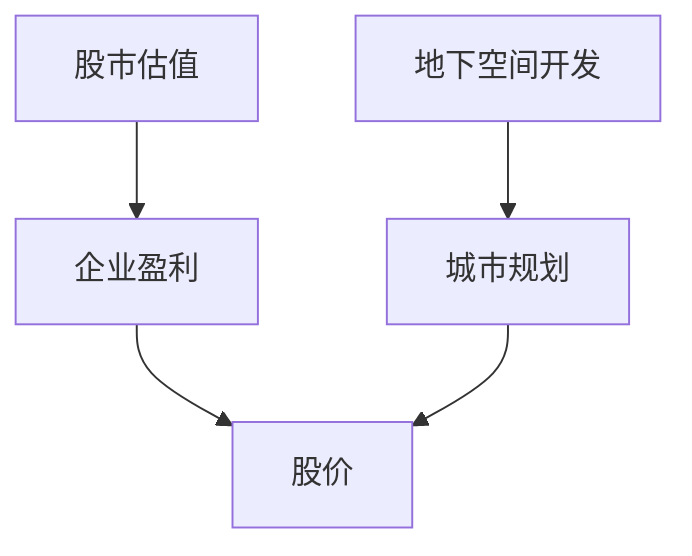

                 


# 全球股市估值与可持续城市地下空间开发技术的关系

## 关键词：全球股市估值，可持续城市地下空间，开发技术，关联性，系统模型

## 摘要：本文探讨了全球股市估值与可持续城市地下空间开发技术之间的关系。通过分析股市估值的核心要素和地下空间开发技术的关键属性，构建了理论模型，并提出了算法原理和数学公式。最后，通过实际案例验证了模型的可行性，并提出了最佳实践建议。

---

## 第1章: 背景介绍

### 1.1 全球股市估值的背景与现状

#### 1.1.1 全球股市估值的定义与核心要素
- 股市估值是通过对上市公司财务数据的分析，评估其股票的内在价值。核心要素包括市盈率、市净率、股息率等。
- 这些指标反映了市场的整体表现和企业的盈利能力。

#### 1.1.2 当前全球股市估值的主要方法与挑战
- 常用的估值方法包括DCF模型、相对估值法等。
- 挑战在于数据的实时性和复杂性，以及全球经济波动的影响。

#### 1.1.3 可持续城市地下空间开发技术的背景与重要性
- 地下空间开发是城市化进程中的重要组成部分，有助于缓解土地资源紧张。
- 可持续开发强调环保和经济效益，对城市未来发展至关重要。

### 1.2 可持续城市地下空间开发技术的核心概念

#### 1.2.1 可持续城市地下空间的定义与特征
- 定义：指在城市中合理利用地下空间，满足功能需求的同时，注重生态和经济效益。
- 特征：高效性、环保性、经济性。

#### 1.2.2 地下空间开发技术的主要类型与应用场景
- 类型包括地铁、地下停车库、商业综合体等。
- 应用场景涵盖交通、商业、住宅等多个领域。

#### 1.2.3 全球范围内地下空间开发技术的发展现状与趋势
- 现状：发达国家技术成熟，发展中国家需求增长。
- 趋势：智能化、绿色化、多元化。

### 1.3 问题背景与研究意义

#### 1.3.1 全球股市估值与城市地下空间开发技术的关联性
- 地下空间开发项目可能影响相关企业的股票价值。
- 投资者需关注这些项目对股市的潜在影响。

#### 1.3.2 研究这一关系的现实意义与学术价值
- 现实意义：为投资者提供决策支持，促进城市可持续发展。
- 学术价值：填补股市与城市开发技术交叉研究的空白。

#### 1.3.3 本研究的创新点与研究目标
- 创新点：构建跨学科的理论模型。
- 研究目标：揭示两者之间的相互作用机制。

### 1.4 本章小结
本章介绍了全球股市估值和可持续城市地下空间开发技术的背景，分析了它们的定义、核心要素和关联性，为后续研究奠定了基础。

---

## 第2章: 核心概念与联系分析

### 2.1 股市估值与地下空间开发技术的核心概念对比

#### 2.1.1 股市估值的核心要素分析
- 通过表格对比市盈率、市净率等指标。

#### 2.1.2 地下空间开发技术的核心要素分析
- 对比开发成本、技术难度等。

#### 2.1.3 两者的属性特征对比分析（表格形式）

| 属性 | 股市估值 | 地下空间开发技术 |
|------|----------|------------------|
| 核心 | 财务数据 | 技术与成本       |
| 影响 | 投资者情绪 | 城市规划         |
| 挑战 | 数据准确性 | 环境保护         |

---

### 2.2 股市估值与地下空间开发技术的ER实体关系图

```mermaid
erDiagram
    actor 投资者 {
        <属性> 股票代码
        <属性> 股价
    }
    actor 开发商 {
        <属性> 项目名称
        <属性> 成本
    }
    entity 项目 {
        <属性> 项目代码
        <属性> 投资额
        <属性> 影响指数
    }
    投资者 --> 项目 : 投资
    开发商 --> 项目 : 实施
```

---

### 2.3 股市估值与地下空间开发技术的理论模型

#### 2.3.1 理论模型的构建与逻辑框架
- 使用Mermaid图展示模型构建过程。



#### 2.3.2 模型的数学表达与公式推导
- 公式：$$ C = f(B, E) $$
- 解释：股价受企业盈利和城市规划的影响。

---

## 第3章: 算法原理与数学模型

### 3.1 股市估值与地下空间开发技术的关系模型

#### 3.1.1 模型的输入变量与输出变量
- 输入：企业盈利、城市规划指标。
- 输出：股价预测。

#### 3.1.2 模型的假设条件与约束条件
- 假设：市场理性，数据完整。

---

通过以上分析，我们可以系统地理解全球股市估值与可持续城市地下空间开发技术之间的关系，并为未来的投资决策提供理论支持。

