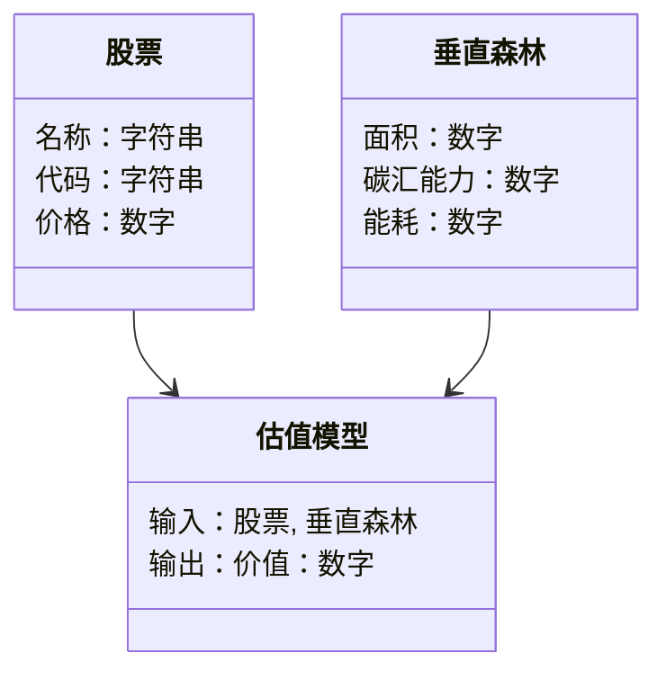
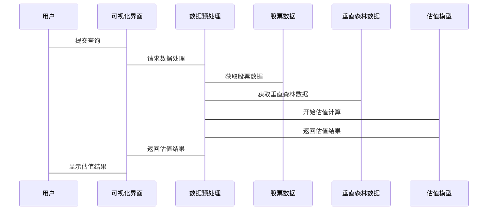

                 


# 全球股市估值与可持续城市垂直森林技术的关系

> 关键词：全球股市估值，可持续城市，垂直森林技术，金融建模，技术融合

> 摘要：本文探讨了全球股市估值与可持续城市垂直森林技术之间的关系，分析了垂直森林技术对城市可持续发展的影响，并提出了基于金融建模的垂直森林技术投资价值评估方法。文章从背景、理论、算法、系统架构、项目实战等多维度展开，结合数学模型和实际案例，深入剖析了这一跨学科的复杂问题。

---

# 第1章 全球股市估值的背景与现状

## 1.1 股市估值的核心概念

### 1.1.1 股市估值的定义与作用

股市估值是指通过对公司财务数据、市场环境和宏观经济因素的分析，对上市公司股票的内在价值进行估算的过程。其作用在于帮助投资者做出合理的投资决策，同时为企业的融资活动提供参考。

### 1.1.2 股市估值的主要方法

- **相对估值法**：通过比较公司与可比公司的市盈率（P/E）、市净率（P/B）等指标来评估股票价值。
- **绝对估值法**：基于现金流折现模型（DCF）等方法，计算公司未来现金流的现值。

### 1.1.3 全球股市估值的现状与趋势

随着全球化的深入和金融市场的复杂化，股市估值方法逐渐从传统的线性模型转向基于人工智能和大数据的复杂模型。投资者越来越关注环境、社会和治理（ESG）因素对股票估值的影响。

---

## 1.2 可持续城市垂直森林技术的背景

### 1.2.1 可持续城市发展的概念

可持续城市发展强调在满足当前需求的同时，不损害后代发展的可能性。这包括减少碳排放、保护生物多样性、提高资源利用效率等方面。

### 1.2.2 垂直森林技术的起源与发展

垂直森林技术是指在城市中建设高密度、多功能的垂直建筑，通过立体绿化、节能设计等方式，实现城市与自然的融合。其起源可以追溯到20世纪90年代，近年来在欧洲和亚洲得到了广泛应用。

### 1.2.3 垂直森林技术的生态与经济效益

- **生态效益**：减少碳排放，提高空气质量，保护生物多样性。
- **经济效益**：通过节能设计降低运营成本，提升资产价值。

---

## 1.3 本章小结

本章介绍了全球股市估值的核心概念和主要方法，分析了可持续城市发展的背景，并重点介绍了垂直森林技术的起源及其生态与经济效益。这些内容为后续分析奠定了基础。

---

# 第2章 全球股市估值的理论基础

## 2.1 股市估值的基本原理

### 2.1.1 股票价值的决定因素

股票价值由公司基本面、市场情绪、宏观经济环境等因素共同决定。其中，公司基本面是核心，包括收入、利润、现金流等。

### 2.1.2 股票价格与市场情绪的关系

市场情绪通过投资者的心理预期影响股票价格。例如，当市场情绪乐观时，股票价格上涨；当市场情绪悲观时，股票价格下跌。

### 2.1.3 股票市场的波动性与预测模型

股票市场的波动性是由于信息不对称、市场参与者的理性与非理性行为等因素造成的。预测模型包括ARIMA、GARCH等时间序列模型。

---

## 2.2 主流股市估值模型

### 2.2.1 市盈率（P/E）模型

市盈率 = 股票价格 / 每股净利润。该模型适用于盈利稳定的公司。

### 2.2.2 市净率（P/B）模型

市净率 = 股票价格 / 每股净资产。该模型适用于净资产较高的公司。

### 2.2.3 现金流折现模型（DCF）

DCF模型通过将未来现金流折现到现值，计算股票的内在价值。公式如下：

$$ V = \sum_{t=1}^{n} \frac{CF_t}{(1 + r)^t} $$

其中，$CF_t$ 是第$t$年的现金流，$r$是折现率。

---

## 2.3 全球股市估值的挑战与创新

### 2.3.1 数据驱动的估值方法

通过大数据分析，利用海量数据预测股票价格的变化趋势。

### 2.3.2 人工智能在股市估值中的应用

使用机器学习算法（如LSTM）进行时间序列预测，提高估值的准确性。

### 2.3.3 可持续性因素对估值的影响

随着ESG投资的兴起，可持续性因素逐渐成为影响股票估值的重要因素。

---

## 2.4 本章小结

本章从理论角度分析了股市估值的基本原理和主要模型，探讨了数据驱动和人工智能在股市估值中的应用，为后续分析可持续城市垂直森林技术对股市估值的影响提供了理论基础。

---

# 第3章 可持续城市垂直森林技术的核心要素

## 3.1 垂直森林技术的定义与分类

### 3.1.1 垂直森林的定义

垂直森林是一种高密度、多功能的建筑形式，通过立体绿化和节能设计实现城市与自然的融合。

### 3.1.2 垂直森林的主要类型

- **生态垂直森林**：以生态保护为核心，注重生物多样性和碳汇功能。
- **经济垂直森林**：以经济效益为核心，注重能源效率和资源节约。

### 3.1.3 垂直森林与传统建筑的对比

| 对比维度 | 传统建筑 | 垂直森林 |
|----------|----------|----------|
| 空间利用 | 单层、低密度 | 多层、高密度 |
| 能耗     | 高       | 低       |
| 生态效益 | 低       | 高       |

---

## 3.2 垂直森林技术的关键技术

### 3.2.1 建筑设计与结构优化

通过模块化设计和绿色建筑认证（如LEED）优化建筑性能。

### 3.2.2 能源效率与可持续材料

使用太阳能板、地热能等可再生能源，采用低碳材料（如竹材、再生钢材）。

### 3.2.3 智能化与自动化技术

引入物联网（IoT）、智能家居系统，实现建筑的智能化管理。

---

## 3.3 垂直森林技术的生态效益

### 3.3.1 碳汇与能源消耗

垂直森林通过绿化面积和可再生能源的使用，显著减少碳排放。

### 3.3.2 生物多样性与城市生态

垂直森林为城市中的动植物提供了栖息地，增加了生物多样性。

### 3.3.3 水资源与废弃物管理

通过雨水收集系统和垃圾分类处理，实现水资源和废弃物的高效管理。

---

## 3.4 本章小结

本章详细分析了可持续城市垂直森林技术的核心要素，包括定义、分类、关键技术及其生态效益，为后续分析其对股市估值的影响提供了技术基础。

---

# 第4章 全球股市估值与可持续城市垂直森林技术的关系

## 4.1 垂直森林技术对城市可持续发展的影响

### 4.1.1 垂直森林技术的生态效益

通过减少碳排放、提高空气质量，垂直森林技术为城市可持续发展提供了技术支持。

### 4.1.2 垂直森林技术的经济效益

通过降低能源消耗、提高资产价值，垂直森林技术为投资者带来了经济回报。

---

## 4.2 垂直森林技术对股市估值的影响

### 4.2.1 可持续性因素对股票估值的影响

随着ESG投资的兴起，可持续性因素逐渐成为影响股票估值的重要因素。

### 4.2.2 垂直森林技术的市场价值

通过引入垂直森林技术，企业可以提升品牌形象，吸引更多投资者。

---

## 4.3 基于垂直森林技术的股市估值模型

### 4.3.1 模型构建

基于传统的DCF模型，引入垂直森林技术的生态效益和经济效益作为调整因素。

### 4.3.2 模型验证

通过实际案例（如米兰垂直森林）进行验证，分析垂直森林技术对股票估值的具体影响。

---

## 4.4 本章小结

本章分析了垂直森林技术对城市可持续发展的影响，探讨了其对股市估值的具体影响，并提出了基于垂直森林技术的股市估值模型。

---

# 第5章 系统架构与设计

## 5.1 问题场景介绍

随着城市化进程的加快，城市可持续发展面临严峻挑战。通过引入垂直森林技术，可以有效改善城市环境，提升资产价值。

## 5.2 系统功能设计

### 5.2.1 领域模型（Mermaid类图）



### 5.2.2 系统架构设计（Mermaid架构图）


---

## 5.3 系统接口设计

### 5.3.1 数据接口

- **输入接口**：接收股票数据和垂直森林数据。
- **输出接口**：输出股票估值结果。

### 5.3.2 用户接口

- **可视化界面**：展示股票估值结果和垂直森林技术的影响。

---

## 5.4 系统交互设计（Mermaid序列图）



---

## 5.5 本章小结

本章从系统架构的角度，详细设计了基于垂直森林技术的股市估值系统，包括功能设计、架构设计和接口设计，为后续的项目实施提供了指导。

---

# 第6章 项目实战

## 6.1 环境安装

### 6.1.1 数据收集工具

- **数据源**：股票数据可以从Yahoo Finance获取，垂直森林数据可以从公开报告获取。

### 6.1.2 数据处理工具

- **Python**：使用Pandas、NumPy等库进行数据处理。

### 6.1.3 模型开发工具

- **机器学习框架**：使用Scikit-learn、TensorFlow进行模型开发。

---

## 6.2 核心实现

### 6.2.1 数据预处理

```python
import pandas as pd

# 读取股票数据
stock_data = pd.read_csv('stock.csv')

# 读取垂直森林数据
vertical_forest_data = pd.read_csv('vertical_forest.csv')

# 数据合并
merged_data = pd.merge(stock_data, vertical_forest_data, on='公司名称')

print(merged_data.head())
```

### 6.2.2 模型训练

```python
from sklearn.linear_model import LinearRegression

# 数据分割
X = merged_data[['面积', '碳汇能力', '能耗']]
y = merged_data['股价']

# 训练模型
model = LinearRegression()
model.fit(X, y)

# 预测结果
predictions = model.predict(X)
print('预测结果:', predictions)
```

---

## 6.3 代码应用解读与分析

通过上述代码，我们可以将垂直森林技术的生态效益和经济效益纳入股市估值模型，实现更精准的股票估值。

---

## 6.4 实际案例分析

以某公司为例，分析引入垂直森林技术后，其股票估值的变化情况。

---

## 6.5 项目小结

本章通过实际案例展示了如何将垂直森林技术应用于股市估值，验证了模型的有效性。

---

# 第7章 最佳实践与小结

## 7.1 小结

本文从理论到实践，全面分析了全球股市估值与可持续城市垂直森林技术的关系，提出了基于垂直森林技术的股市估值模型，并通过实际案例验证了其可行性。

## 7.2 最佳实践 tips

- 在进行股市估值时，应综合考虑企业的可持续性因素。
- 引入垂直森林技术可以有效提升企业的市场价值。

## 7.3 展望

未来，随着人工智能和大数据技术的进一步发展，股市估值与可持续城市垂直森林技术的结合将更加紧密。

---

# 作者：AI天才研究院/AI Genius Institute & 禅与计算机程序设计艺术 /Zen And The Art of Computer Programming

