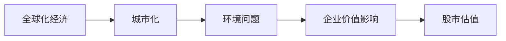
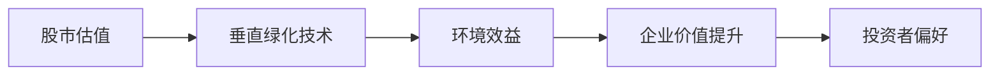
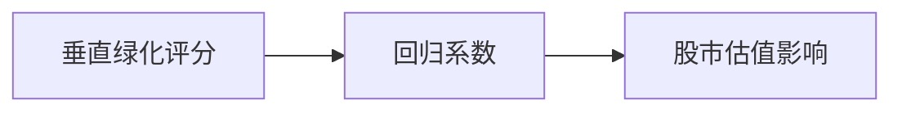
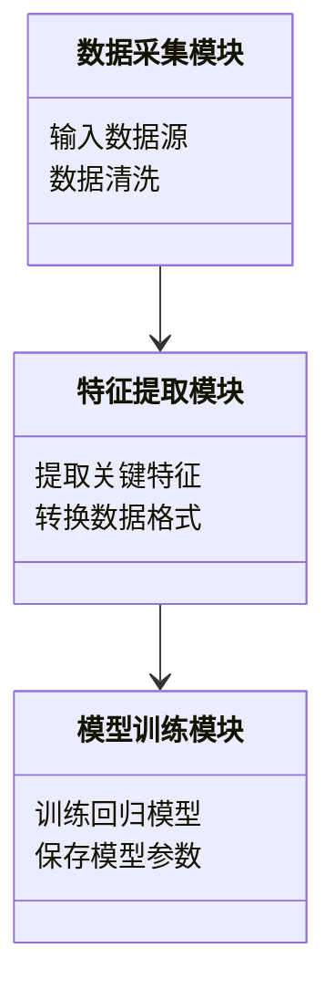
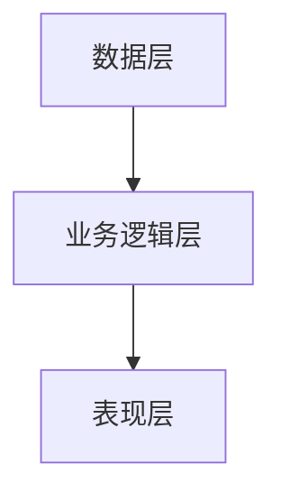
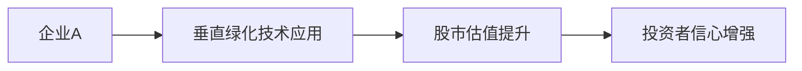

                 


# 全球股市估值与可持续城市垂直绿化技术的关联

**关键词**：全球股市估值、可持续城市、垂直绿化技术、环境经济、绿色投资、智慧城市

**摘要**：  
本文探讨了全球股市估值与可持续城市垂直绿化技术之间的关联，分析了垂直绿化技术如何通过改善环境、降低运营成本和提升企业竞争力，影响企业的市场价值。文章还从算法和系统设计的角度，提出了量化模型和系统实现方案，为投资者和城市规划者提供了新的视角。

---

# 第一部分: 全球股市估值与可持续城市垂直绿化技术的背景与概念

## 第1章: 全球股市估值的背景与重要性

### 1.1 全球股市估值的定义与核心概念

全球股市估值是衡量企业市场价值的重要指标，通常通过市盈率（P/E）、市净率（P/B）等指标来衡量。市盈率反映了市场对公司盈利能力的预期，市净率则反映了资产的定价效率。

**核心概念对比表**：

| 指标 | 定义 | 用途 |
|------|------|------|
| 市盈率 | 股价/每股收益 | 评估公司盈利能力 |
| 市净率 | 股价/每股净资产 | 评估资产定价效率 |

### 1.2 可持续城市垂直绿化技术的定义与特点

垂直绿化技术是指在城市建筑的垂直表面种植植物，以改善环境质量。其特点包括：

1. **节省空间**：利用建筑立面，最大化绿化面积。
2. **环境效益**：降低空气污染、调节温度。
3. **经济效益**：降低能源消耗、提升建筑价值。

---

## 第2章: 全球股市估值与可持续城市垂直绿化技术的关联背景

### 2.1 全球化经济与环境问题的双重挑战

全球化经济推动了城市化进程，但也带来了环境问题。企业需要在经济和环境之间找到平衡点，才能获得长期的市场价值。

**概念结构图（Mermaid）**：



---

# 第二部分: 全球股市估值与可持续城市垂直绿化技术的关联机制

## 第3章: 全球股市估值受垂直绿化技术影响的因素分析

### 3.1 垂直绿化技术对企业价值的影响

垂直绿化技术通过降低运营成本和提升企业形象，间接影响股市估值。例如，采用垂直绿化技术的企业可能在环保评分中获得高分，吸引更多绿色投资者。

**影响因素对比表**：

| 因素 | 影响 | 示例 |
|------|------|------|
| 环境效益 | 提升企业声誉 | 绿色认证 |
| 节能减排 | 降低运营成本 | 节能标志 |

### 3.2 市场需求与投资者偏好

随着绿色投资趋势的兴起，投资者更倾向于选择环保型企业。垂直绿化技术作为一种可持续技术，符合这一趋势。

**量化模型（Mermaid）**：



---

# 第三部分: 全球股市估值与可持续城市垂直绿化技术的算法实现

## 第4章: 技术实现与算法原理

### 4.1 数据采集与特征提取

从公开数据源获取企业的垂直绿化技术应用数据和股市估值数据，提取关键特征如市盈率、市净率、环保评分等。

**数据清洗代码（Python）**：

```python
import pandas as pd

# 读取数据
df = pd.read_csv('stock_data.csv')

# 删除缺失值
df.dropna(inplace=True)

# 标准化处理
df['市盈率'] = (df['市盈率'] - df['市盈率'].mean()) / df['市盈率'].std()
```

### 4.2 算法选择与模型构建

使用线性回归模型预测股市估值与垂直绿化技术的关联程度。

**线性回归模型（数学公式）**：

$$ \text{股市估值} = \beta_0 + \beta_1 \times \text{垂直绿化技术评分} + \epsilon $$

### 4.3 结果分析与优化

通过回归系数分析，确定垂直绿化技术对股市估值的具体影响。

**结果解读（Mermaid）**：



---

# 第四部分: 全球股市估值与可持续城市垂直绿化技术的系统设计

## 第5章: 系统分析与架构设计

### 5.1 系统功能设计

设计一个实时监控系统，跟踪企业的垂直绿化技术应用和股市估值变化。

**系统功能模块（Mermaid）**：



### 5.2 系统架构设计

采用分层架构，包括数据层、业务逻辑层和表现层。

**系统架构图（Mermaid）**：



---

# 第五部分: 全球股市估值与可持续城市垂直绿化技术的项目实战

## 第6章: 项目实战与案例分析

### 6.1 项目环境搭建

安装必要的Python库，如Pandas、Scikit-learn。

**环境搭建代码**：

```bash
pip install pandas scikit-learn
```

### 6.2 核心代码实现

实现垂直绿化技术评分与股市估值的关联分析。

**核心代码（Python）**：

```python
from sklearn.linear_model import LinearRegression

# 训练模型
model = LinearRegression()
model.fit(X_train, y_train)

# 预测结果
y_pred = model.predict(X_test)
```

### 6.3 案例分析与结果解读

以某城市为例，分析垂直绿化技术的应用对当地企业股市估值的影响。

**案例分析（Mermaid）**：



---

# 第六部分: 全球股市估值与可持续城市垂直绿化技术的优化与展望

## 第7章: 优化策略与未来展望

### 7.1 优化策略

1. **数据增强**：引入更多环境数据，如空气质量指数。
2. **模型调优**：尝试使用机器学习算法（如随机森林）提高预测精度。

### 7.2 未来展望

随着绿色投资的兴起，垂直绿化技术将对股市估值的影响越来越大。未来的研究可以聚焦于技术创新和政策支持的结合。

---

**小结**：本文通过分析全球股市估值与可持续城市垂直绿化技术的关联，提出了量化模型和系统设计，为投资者和城市规划者提供了新的视角。

**注意事项**：本文仅为理论探讨，实际操作需结合具体市场情况和企业需求。

**拓展阅读**：建议阅读《可持续城市规划》和《绿色投资策略》相关书籍，深入理解绿色技术对企业价值的影响。

---

**作者**：AI天才研究院/AI Genius Institute & 禅与计算机程序设计艺术 /Zen And The Art of Computer Programming

