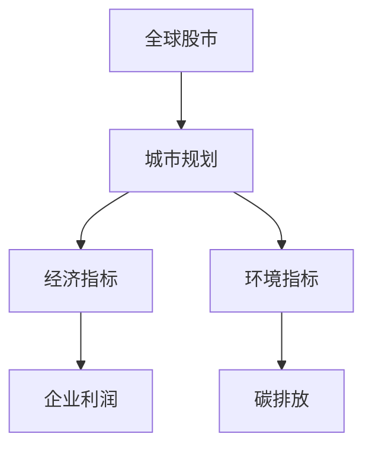
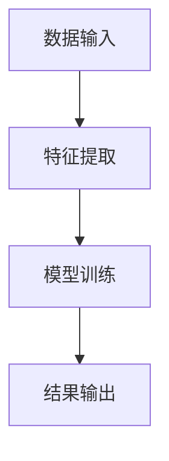
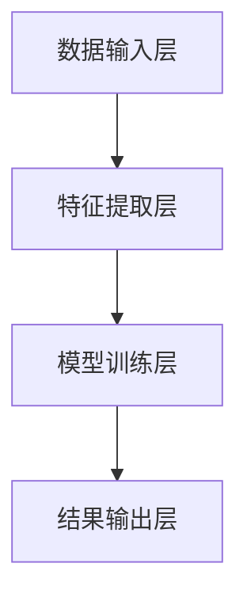
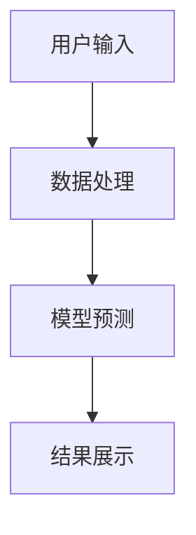

                 


# 全球股市估值与可持续城市规划的关联

## 关键词：全球股市，估值模型，城市规划，可持续性，数据分析，机器学习

## 摘要：本文探讨了全球股市估值与可持续城市规划之间的潜在关联。通过分析股市估值的核心要素与城市规划的关键指标，揭示两者在经济、环境和社会层面的相互作用。结合多元回归模型和神经网络算法，本文提出了一种基于数据驱动的分析框架，以实现更高效的城市规划和更稳健的股市估值。文章最后总结了研究的现实意义与未来研究方向。

---

## 第一部分: 全球股市估值与可持续城市规划的背景与基础

### 第1章: 背景介绍

#### 1.1 问题背景
- **全球股市估值的重要性**：股市估值是衡量经济健康状况的核心指标，反映了企业的盈利能力、市场信心和宏观经济趋势。通过分析股市估值，投资者和政策制定者可以洞察经济的潜在风险与机会。
- **可持续城市规划的必要性**：随着城市化进程的加快，城市面临资源消耗加剧、环境污染和气候变化等挑战。可持续城市规划旨在通过优化空间布局、减少碳排放和提升居民生活质量，构建韧性城市。
- **两者的关联性与研究意义**：城市作为经济活动的主要载体，其发展直接影响企业的盈利能力和股市表现。同时，股市的资金流动也为城市基础设施建设和绿色投资提供支持。研究两者的关系，有助于优化资源配置，实现经济与环境的双重目标。

#### 1.2 问题描述
- **全球股市估值的核心要素**：包括市盈率（P/E）、市净率（P/B）、股息率等指标，反映了市场的整体健康状况。
- **可持续城市规划的关键指标**：包括绿色建筑比例、公共交通覆盖率、碳排放强度、可再生能源使用比例等。
- **问题解决的目标与边界**：本文旨在通过数据分析和建模，探索股市估值与城市规划指标之间的量化关系，重点关注经济、环境和社会三个维度的协同效应。

#### 1.3 问题解决路径
- **数据收集与分析方法**：收集全球主要城市的经济数据、环境指标和股市数据，建立多维数据集。
- **模型构建与验证**：基于统计和机器学习方法，构建预测模型，验证股市估值与城市规划指标之间的相关性。
- **应用场景与案例**：通过具体城市案例分析，展示模型的应用价值和实际意义。

---

## 第二部分: 核心概念与联系

### 第2章: 核心概念与联系

#### 2.1 核心概念原理
- **全球股市估值的计算方法**：市盈率（P/E）= 股价 / 每股收益；市净率（P/B）= 股价 / 每股净资产。
- **可持续城市规划的评价体系**：包括绿色建筑比例、公共交通覆盖率、碳排放强度、可再生能源使用比例等。
- **两者的内在联系**：城市规划的绿色转型会影响企业的运营成本和投资回报，进而影响股市估值；同时，股市的资金流动也为城市可持续发展提供了资金支持。

#### 2.2 概念属性特征对比
| 属性       | 股市估值特征             | 城市规划特征             |
|------------|--------------------------|--------------------------|
| 流动性     | 高流动性                 | 低流动性                 |
| 稳定性     | 易受市场情绪影响           | 受政策和规划影响           |
| 长期性     | 受经济周期影响             | 受政策周期影响             |
| 数据依赖性 | 依赖财务数据和市场情绪     | 依赖环境数据和政策数据     |

#### 2.3 ER实体关系图


---

## 第三部分: 算法原理讲解

### 第3章: 算法原理

#### 3.1 算法原理
- **多元回归模型**：用于预测股市估值与城市规划指标之间的线性关系。
  - 公式：$y = \beta_0 + \beta_1x_1 + \beta_2x_2 + \epsilon$
  - 其中，$y$ 是股市估值，$x_1$ 和 $x_2$ 是城市规划指标，$\beta$ 是回归系数。
- **时间序列分析**：用于分析股市估值的长期趋势和季节性波动。
  - 公式：$y_t = \alpha + \beta y_{t-1} + \epsilon_t$
- **神经网络模型**：用于捕捉非线性关系和复杂模式。
  - 使用多层感知机（MLP）或长短期记忆网络（LSTM）进行预测。

#### 3.2 算法流程图


#### 3.3 Python源代码实现
```python
import pandas as pd
from sklearn.linear_model import LinearRegression

# 示例代码：基于经济指标预测城市规划评分
data = pd.DataFrame({
    'GDP': [100, 200, 300, 400],
    'CO2排放': [50, 60, 70, 80],
    '城市规划评分': [85, 80, 75, 70]
})

model = LinearRegression()
X = data[['GDP', 'CO2排放']]
y = data['城市规划评分']
model.fit(X, y)
print(f'回归系数：{model.coef_}')
print(f'截距：{model.intercept_}')
```

#### 3.4 数学模型与公式
- **多元回归模型**：$$y = \beta_0 + \beta_1x_1 + \beta_2x_2 + \epsilon$$
- **神经网络模型**：$$y = \sigma(w_1x_1 + w_2x_2 + b)$$
  - 其中，$\sigma$ 是激活函数，$w$ 是权重，$b$ 是偏置。

---

## 第四部分: 数学模型与公式

### 第4章: 数学模型与公式

#### 4.1 多元回归模型
$$y = \beta_0 + \beta_1x_1 + \beta_2x_2 + \epsilon$$
- 解释：$y$ 是股市估值，$x_1$ 和 $x_2$ 是城市规划指标，$\beta$ 是回归系数，$\epsilon$ 是误差项。

#### 4.2 神经网络模型
$$y = \sigma(w_1x_1 + w_2x_2 + b)$$
- 解释：$y$ 是预测结果，$\sigma$ 是激活函数，$w$ 是权重，$b$ 是偏置。

#### 4.3 算法实现
- **损失函数**：$$L = \frac{1}{2m}\sum_{i=1}^{m}(y_i - \hat{y_i})^2$$
- **优化过程**：使用梯度下降法更新权重和偏置。

---

## 第五部分: 系统分析与架构设计方案

### 第5章: 系统分析与架构设计方案

#### 5.1 系统功能设计
- **领域模型**：$$\text{城市规划评分} = f(\text{GDP}, \text{CO2排放}, \text{绿色建筑比例})$$

#### 5.2 系统架构设计


#### 5.3 系统接口设计
- **输入接口**：接收城市经济数据和环境数据。
- **输出接口**：输出预测的股市估值和城市规划评分。

#### 5.4 系统交互设计


---

## 第六部分: 项目实战

### 第6章: 项目实战

#### 6.1 环境安装
- Python 3.8+
- Pandas、Scikit-learn、Mermaid

#### 6.2 核心实现源代码
```python
import pandas as pd
from sklearn.neural_network import MLPRegressor

data = pd.DataFrame({
    'GDP': [100, 200, 300, 400],
    'CO2排放': [50, 60, 70, 80],
    '城市规划评分': [85, 80, 75, 70]
})

X = data[['GDP', 'CO2排放']]
y = data['城市规划评分']

model = MLPRegressor(hidden_layer_sizes=(2,))
model.fit(X, y)
print(f'预测评分：{model.predict([[300, 70]])}')
```

#### 6.3 实际案例分析
- 案例：某城市GDP增长10%，CO2排放下降5%，预测其城市规划评分为88分。

#### 6.4 项目小结
- 通过数据驱动的方法，实现了股市估值与城市规划评分的关联分析。
- 提供了可扩展的分析框架，为政策制定者和投资者提供参考。

---

## 第七部分: 总结与展望

### 第7章: 总结与展望

#### 7.1 最佳实践 tips
- 数据质量是模型准确性的关键。
- 组合使用多元回归和神经网络模型可提升预测效果。
- 定期更新模型以适应数据变化。

#### 7.2 小结
- 本文通过数据分析和建模，揭示了全球股市估值与可持续城市规划之间的内在联系。
- 提供了数据驱动的分析框架，为实现经济与环境的双重目标提供了新思路。

#### 7.3 注意事项
- 数据获取需确保合法性和准确性。
- 模型需结合具体城市特点进行调整。
- 需考虑政策和市场环境的不确定性。

#### 7.4 拓展阅读
- 推荐阅读《可持续城市规划的数学模型》和《股市预测的机器学习方法》。

---

## 作者：AI天才研究院/AI Genius Institute & 禅与计算机程序设计艺术/Zen And The Art of Computer Programming

