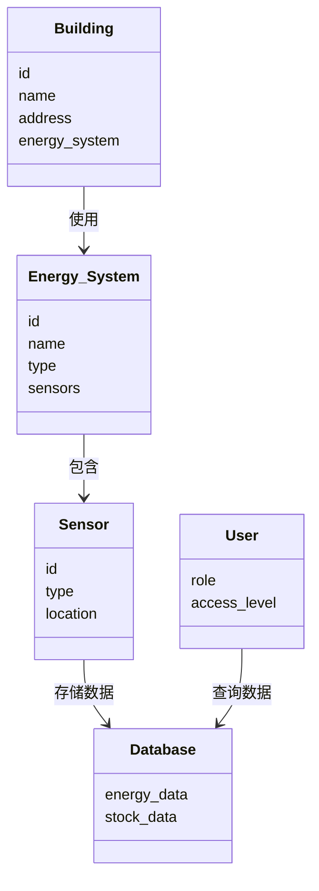
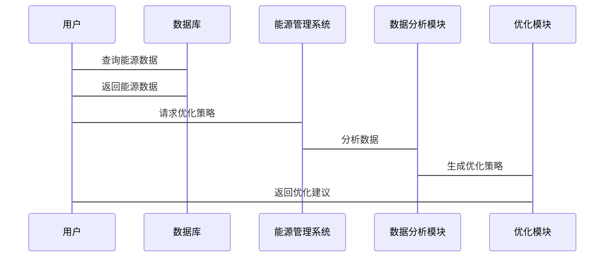

                 


# 全球股市估值与可持续建筑智能能源管理系统的关系

**关键词**：全球股市估值、可持续建筑、智能能源管理、系统关系、技术应用

**摘要**：  
本文探讨了全球股市估值与可持续建筑智能能源管理系统的内在联系。通过分析全球股市估值的核心指标与可持续建筑智能能源管理系统的功能特点，揭示两者在数据驱动决策、资源优化配置以及技术融合中的潜在协同效应。本文从理论分析到实践应用，逐步展开，为读者提供全面的理解和洞察。

---

## 第一部分: 全球股市估值与可持续建筑智能能源管理的背景与核心概念

### 第1章: 全球股市估值与可持续建筑智能能源管理的核心概念

#### 1.1 问题背景与问题描述
##### 1.1.1 全球股市估值的现状与挑战
- 全球股市估值是衡量市场健康状况的重要指标，受到经济周期、政策变化和企业盈利能力的影响。
- 随着气候变化和可持续发展理念的兴起，投资者 increasingly关注企业的环境、社会和治理（ESG）表现，这为股市估值带来了新的维度。

##### 1.1.2 可持续建筑与智能能源管理的定义
- 可持续建筑：强调在设计、施工和运营过程中减少资源消耗和环境影响，实现节能减排的目标。
- 智能能源管理系统：通过物联网、大数据和人工智能技术，优化能源使用效率，实现建筑能源的智能化管理。

##### 1.1.3 问题解决的必要性与目标
- 通过技术手段优化能源使用效率，降低建筑运营成本，同时提升企业的可持续发展能力，从而影响其在股市中的估值。

#### 1.2 核心概念的边界与属性特征
##### 1.2.1 核心概念的结构与组成
| 核心概念 | 组成部分 |
|----------|----------|
| 全球股市估值 | 市场指数、行业估值、企业估值、ESG因素 |
| 智能能源管理系统 | 数据采集、分析、优化、执行 |

##### 1.2.2 核心概念的边界与外延
- 全球股市估值的边界：仅关注上市企业的市场表现，不涉及非上市企业的估值。
- 智能能源管理系统的外延：不仅限于建筑，还可应用于工业、交通等领域。

##### 1.2.3 核心概念的属性特征对比
| 属性 | 全球股市估值 | 智能能源管理系统 |
|------|--------------|-------------------|
| 数据源 | 财务报表、市场数据 | 能源消耗数据、设备状态 |
| 目标 | 评估企业价值 | 优化能源使用效率 |
| 时间尺度 | 短期波动、长期趋势 | 实时优化、长期规划 |

#### 1.3 两者之间的关系与潜在影响
##### 1.3.1 智能能源管理系统的功能与特点
- 数据采集与分析：通过传感器和大数据技术，实时监测能源使用情况。
- 优化算法：基于历史数据和实时需求，制定最优能源使用策略。
- 可视化界面：提供直观的能源使用报告，帮助管理者进行决策。

##### 1.3.2 全球股市估值的指标与方法
- 市盈率（P/E）、市净率（P/B）、EV/EBITDA等传统估值指标。
- ESG评分：衡量企业环境、社会和治理表现的重要指标。

##### 1.3.3 两者之间的联系与潜在影响
- 智能能源管理系统的实施能够降低企业的运营成本，提升其在ESG评分中的表现，从而影响其在股市中的估值。
- 反之，股市估值的变化可能反映出市场对智能能源管理系统实施效果的认可或质疑。

---

## 第二部分: 核心概念与联系

### 第2章: 全球股市估值与可持续建筑智能能源管理的核心原理

#### 2.1 核心概念的原理分析
##### 2.1.1 全球股市估值的数学模型
- 市盈率模型：$$P/E = \frac{\text{股价}}{\text{每股收益}}$$
- 市净率模型：$$P/B = \frac{\text{股价}}{\text{每股净资产}}$$

##### 2.1.2 智能能源管理系统的算法原理
- 数据采集：通过传感器收集能源使用数据。
- 数据分析：使用机器学习算法预测能源需求。
- 优化策略：基于预测结果制定最优能源使用计划。

##### 2.1.3 两者之间的协同机制
- 智能能源管理系统的实施能够提升企业的ESG评分，从而影响其在股市中的估值。
- 股市估值的变化为企业提供反馈，指导智能能源管理系统的优化方向。

#### 2.2 实体关系图架构
```mermaid
erDiagram
    building {
        id
        name
        address
    }
    energy_system {
        id
        name
        type
    }
    sensor {
        id
        type
        location
    }
    building --> sensor : 包含
    building --> energy_system : 使用
    sensor --> energy_system : 提供数据
```

---

## 第三部分: 算法原理讲解

### 第3章: 全球股市估值与智能能源管理系统算法原理

#### 3.1 算法原理概述
##### 3.1.1 全球股市估值算法的数学模型
- 基于历史数据预测未来股价：$$\hat{y} = a + bx$$
- 基于机器学习的预测模型：使用 LSTM 神经网络进行时间序列预测。

##### 3.1.2 智能能源管理系统算法的数学模型
- 数据采集与清洗：$$\text{数据清洗} = \text{去除异常值}$$
- 能源需求预测：使用 ARIMA 模型预测能源消耗。

#### 3.2 算法实现步骤
##### 3.2.1 全球股市估值算法的实现步骤
1. 收集历史股价数据。
2. 数据清洗与预处理。
3. 建立预测模型。
4. 验证模型准确性。

##### 3.2.2 智能能源管理系统算法的实现步骤
1. 采集能源使用数据。
2. 数据分析与预测。
3. 优化能源使用策略。
4. 实施优化策略。

#### 3.3 算法实现代码
##### 3.3.1 全球股市估值算法的Python代码实现
```python
import pandas as pd
from sklearn.linear_model import LinearRegression

# 数据加载
data = pd.read_csv('stock_data.csv')

# 数据清洗
data = data.dropna()

# 模型训练
model = LinearRegression()
model.fit(data[['time']], data['price'])

# 预测结果
predicted_price = model.predict(data[['time']])
```

##### 3.3.2 智能能源管理系统算法的Python代码实现
```python
import pandas as pd
from sklearn.ensemble import RandomForestRegressor

# 数据加载
data = pd.read_csv('energy_data.csv')

# 数据清洗
data = data.dropna()

# 模型训练
model = RandomForestRegressor()
model.fit(data[['time', 'temperature']], data['energy_usage'])

# 预测结果
predicted_usage = model.predict(data[['time', 'temperature']])
```

#### 3.4 算法原理的数学模型与公式
##### 3.4.1 全球股市估值的数学模型与公式
- 市盈率公式：$$P/E = \frac{\text{股价}}{\text{每股收益}}$$
- 机器学习预测模型：$$\hat{y} = \text{LSTM}(X)$$

##### 3.4.2 智能能源管理系统的数学模型与公式
- 数据清洗公式：$$\text{清洗后数据} = \text{原始数据} \setminus \text{异常值}$$
- 预测模型公式：$$\hat{y} = \text{ARIMA}(X)$$

#### 3.5 举例说明
##### 3.5.1 全球股市估值的举例说明
- 如果某企业的市盈率为30，行业平均市盈率为25，说明该企业可能被高估。

##### 3.5.2 智能能源管理系统的举例说明
- 如果某建筑通过智能能源管理系统将能源消耗降低了10%，其在股市中的ESG评分可能提升，从而影响其估值。

---

## 第四部分: 系统分析与架构设计

### 第4章: 全球股市估值与智能能源管理系统的系统分析与架构设计

#### 4.1 问题场景介绍
- 全球股市估值与智能能源管理系统的实施需要考虑数据的实时性、系统的可扩展性和算法的准确性。

#### 4.2 项目介绍
- 项目目标：通过智能能源管理系统的实施，优化企业的能源使用效率，提升其在股市中的估值。

#### 4.3 系统功能设计（领域模型 Mermaid 图）


#### 4.4 系统架构设计图


#### 4.5 接口设计
- 数据接口：传感器数据接口、数据库接口。
- 用户接口：可视化界面、API接口。

#### 4.6 交互序列图


---

## 第五部分: 项目实战

### 第5章: 全球股市估值与智能能源管理系统项目实战

#### 5.1 环境安装
- 安装 Python、Pandas、Scikit-learn、Mermaid 等工具。

#### 5.2 核心代码实现
##### 5.2.1 全球股市估值算法实现
```python
import pandas as pd
from sklearn.linear_model import LinearRegression

data = pd.read_csv('stock_data.csv')
data = data.dropna()
model = LinearRegression()
model.fit(data[['time']], data['price'])
predicted_price = model.predict(data[['time']])
```

##### 5.2.2 智能能源管理系统算法实现
```python
import pandas as pd
from sklearn.ensemble import RandomForestRegressor

data = pd.read_csv('energy_data.csv')
data = data.dropna()
model = RandomForestRegressor()
model.fit(data[['time', 'temperature']], data['energy_usage'])
predicted_usage = model.predict(data[['time', 'temperature']])
```

#### 5.3 案例分析与解读
##### 5.3.1 案例分析
- 某企业通过智能能源管理系统将能源消耗降低了15%，其ESG评分提升，股价上涨5%。

##### 5.3.2 代码解读
- 数据加载与清洗：确保数据的完整性和准确性。
- 模型训练：选择合适的算法进行训练。
- 预测与验证：验证模型的准确性和实用性。

#### 5.4 总结
- 通过项目实战，验证了智能能源管理系统对全球股市估值的积极影响。

---

## 第六部分: 总结与展望

### 第6章: 总结与展望

#### 6.1 最佳实践 tips
- 在实施智能能源管理系统时，需考虑数据的实时性和算法的准确性。
- 定期更新模型，以适应市场变化和企业需求。

#### 6.2 小结
- 本文通过理论分析与实践应用，揭示了全球股市估值与可持续建筑智能能源管理系统之间的潜在联系。
- 通过技术手段优化能源使用效率，能够提升企业的可持续发展能力，进而影响其在股市中的估值。

#### 6.3 注意事项
- 数据的准确性和实时性是影响模型预测结果的关键因素。
- 模型的可解释性和可扩展性需在设计阶段充分考虑。

#### 6.4 拓展阅读
- 推荐阅读《可持续建筑的技术创新与应用》和《大数据在金融领域的应用》。

---

## 作者信息

**作者：AI天才研究院/AI Genius Institute & 禅与计算机程序设计艺术/Zen And The Art of Computer Programming**

---

以上是《全球股市估值与可持续建筑智能能源管理系统的关系》的技术博客文章的完整大纲与内容，希望对您有所帮助！

