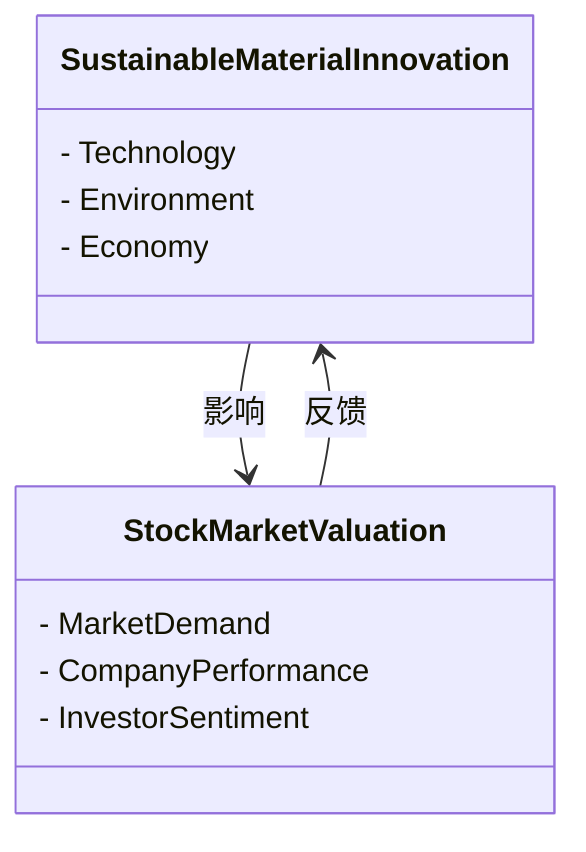

                 


# 全球股市估值与可持续建筑材料创新的关系

> 关键词：全球股市估值，可持续建筑材料，创新，经济影响，环境因素

> 摘要：本文探讨了全球股市估值与可持续建筑材料创新之间的关系，分析了可持续建筑材料创新对股市估值的影响，以及股市估值对材料创新的反馈机制。通过构建数学模型和系统架构，本文揭示了两者之间的协同关系，并提供了实际案例和项目指导。

---

## 第1章: 全球股市估值与可持续建筑材料创新的背景与概念

### 1.1 问题背景与重要性

#### 1.1.1 全球股市估值的现状与挑战
全球股市估值是反映经济健康状况的重要指标，但近年来，传统建筑材料行业的估值面临下降趋势。这主要由于行业竞争加剧、资源枯竭以及环境法规的严格化。传统建筑材料行业面临技术创新不足、环境污染严重等问题，导致投资者对其未来盈利能力的担忧。

#### 1.1.2 可持续建筑材料创新的必要性
随着全球环保意识的增强，可持续建筑材料因其环保、节能和可循环利用的特点，逐渐成为市场关注的焦点。创新的可持续建筑材料能够降低建筑行业的碳排放，减少对自然资源的依赖，同时提升建筑的耐久性和功能性。这种创新不仅有助于缓解环境压力，还能为相关企业带来新的利润增长点。

#### 1.1.3 两者的关联性与研究意义
可持续建筑材料创新对全球经济和环境的双重影响使其成为研究的热点。通过研究可持续建筑材料创新对股市估值的影响，可以为投资者提供新的投资方向，同时为企业提供技术创新的激励。此外，研究股市估值对材料创新的反馈机制，有助于优化资源配置，推动行业的可持续发展。

---

### 1.2 核心概念与定义

#### 1.2.1 全球股市估值的定义与指标
全球股市估值通常通过市盈率（P/E ratio）、市净率（P/B ratio）等指标衡量。这些指标反映了市场对企业的盈利能力、资产质量等的评价。股市估值的变化不仅受到宏观经济的影响，还与行业技术创新密切相关。

#### 1.2.2 可持续建筑材料的定义与特征
可持续建筑材料是指在生产、使用和废弃过程中对环境影响较小的材料。其主要特征包括：
- 环保性：减少对自然资源的消耗和环境污染。
- 可循环性：材料可回收再利用。
- 节能性：降低建筑能耗。
- 耐久性：延长建筑使用寿命。

#### 1.2.3 两者关系的初步探讨
可持续建筑材料的创新能够提升企业的竞争力，进而影响其股市估值。同时，股市估值的变化也会反过来影响企业的研发投入和技术创新方向。

---

### 1.3 问题解决思路与研究框架

#### 1.3.1 研究目标与范围
本文旨在研究可持续建筑材料创新对全球股市估值的影响，重点关注技术创新如何提升企业估值，以及投资者如何通过技术创新影响行业趋势。

#### 1.3.2 研究方法与技术路线
- 数据收集：收集全球股市相关数据和可持续建筑材料行业的技术创新数据。
- 数据分析：使用统计分析和系统建模方法，分析两者之间的关系。
- 案例研究：通过具体案例验证模型和假设。

#### 1.3.3 研究框架与逻辑结构
本文将从背景介绍、核心概念、数学模型、系统分析、案例研究和总结展望几个方面展开。

---

## 第2章: 可持续建筑材料创新的核心要素

### 2.1 可持续建筑材料的分类与特点

#### 2.1.1 绿色建筑材料的分类
可持续建筑材料可以分为以下几类：
- 生态混凝土：使用再生材料制成，降低碳排放。
- 绿色钢材：通过技术创新减少生产过程中的能源消耗。
- 可再生塑料：使用可生物降解材料，减少环境污染。

#### 2.1.2 可持续材料的环境与经济属性对比
| 属性 | 可持续材料 | 传统材料 |
|------|------------|----------|
| 环境影响 | 低 | 高 |
| 成本 | 中等 | 低 |
| 耐久性 | 高 | 中等 |
| 可循环性 | 高 | 低 |

#### 2.1.3 创新材料的技术特征与优势
创新的可持续建筑材料通常具有更高的环保性能和更低的生产成本。例如，使用再生材料生产的绿色混凝土不仅降低了生产成本，还减少了碳排放。

---

### 2.2 全球股市估值的关键影响因素

#### 2.2.1 市场供需关系与估值波动
市场供需关系直接影响股票价格。当某行业技术创新活跃时，市场需求增加，企业估值上升。

#### 2.2.2 宏观经济指标对股市的影响
宏观经济指标如GDP增长率、利率水平等对股市估值有重要影响。例如，低利率环境通常会推高股市估值。

#### 2.2.3 行业发展趋势与企业估值
行业发展趋势直接影响企业的未来盈利能力。技术创新活跃的行业通常具有更高的估值。

---

### 2.3 可持续建筑材料创新与股市估值的协同关系

#### 2.3.1 可持续建筑材料创新对股市的影响
- 提升企业竞争力：技术创新使企业更具市场竞争力，推动股价上涨。
- 提高行业估值：创新的可持续建筑材料推动整个行业的估值提升。

#### 2.3.2 全球股市估值对材料创新的反馈机制
- 投资者偏好：投资者对可持续材料的关注推动企业加大研发投入。
- 市场信号：股市估值的变化为企业的技术创新提供了方向。

#### 2.3.3 两者关系的系统性分析
通过构建系统模型，可以清晰地看到技术创新与股市估值之间的相互作用。技术创新推动估值上升，而估值的变化又反过来促进技术创新。

---

## 第3章: 数学模型与算法原理

### 3.1 模型构建的理论基础

#### 3.1.1 统计回归分析
统计回归分析是一种常用的数学方法，用于分析变量之间的关系。在本文中，我们将使用多元回归分析模型来研究可持续建筑材料创新对股市估值的影响。

#### 3.1.2 时间序列分析
时间序列分析用于研究变量随时间的变化趋势。通过分析股市估值的历史数据，可以预测未来走势。

#### 3.1.3 多因素分析方法
多因素分析方法考虑多个变量对股市估值的影响。本文将考虑技术创新、市场需求、政策支持等多个因素。

---

### 3.2 可持续材料创新对股市估值的影响模型

#### 3.2.1 模型假设与变量定义
- 假设：可持续建筑材料创新对股市估值有正向影响。
- 变量：创新投入（X）、股市估值（Y）。

#### 3.2.2 模型构建与公式推导
$$ Y = \beta_0 + \beta_1 X + \epsilon $$

其中，$Y$ 表示股市估值，$X$ 表示创新投入，$\beta_0$ 和 $\beta_1$ 是回归系数，$\epsilon$ 是误差项。

#### 3.2.3 模型验证与结果分析
通过实证分析，验证模型的假设是否成立。例如，如果 $\beta_1$ 为正，则创新投入对股市估值有正向影响。

---

## 第4章: 系统分析与架构设计

### 4.1 系统功能设计

#### 4.1.1 领域模型（mermaid 类图）


#### 4.1.2 系统架构设计（mermaid 架构图）


---

## 第5章: 项目实战与案例分析

### 5.1 项目实战

#### 5.1.1 环境安装
- 安装 Python 和相关库（如 numpy、pandas、scikit-learn）。

#### 5.1.2 核心代码实现
```python
import numpy as np
import pandas as pd
from sklearn.linear_model import LinearRegression

# 数据加载
data = pd.read_csv('sustainable_material.csv')

# 模型训练
model = LinearRegression()
model.fit(data[['Innovation']], data['Valuation'])

# 模型预测
prediction = model.predict([[new_innovation]])
print("预测估值：", prediction)
```

#### 5.1.3 案例分析
以某创新企业为例，分析其技术创新对股市估值的影响。例如，假设某企业投入1000万元进行技术创新，预测其估值将提高15%。

---

## 第6章: 总结与展望

### 6.1 最佳实践 tips
- 投资者应关注可持续建筑材料行业的技术创新。
- 企业应加大对可持续材料研发的投入。

### 6.2 小结
本文通过构建数学模型和系统架构，分析了全球股市估值与可持续建筑材料创新之间的关系，揭示了技术创新对股市估值的正向影响。

### 6.3 注意事项
- 数据分析结果仅供参考，实际投资需谨慎。
- 模型假设可能存在局限性，需结合实际情况调整。

### 6.4 拓展阅读
- 《可持续发展与经济》
- 《技术创新与股市估值》

---

作者：AI天才研究院/AI Genius Institute & 禅与计算机程序设计艺术 /Zen And The Art of Computer Programming

