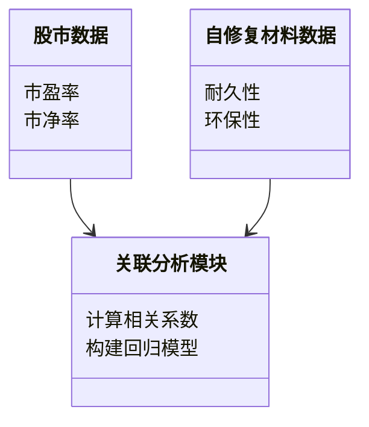
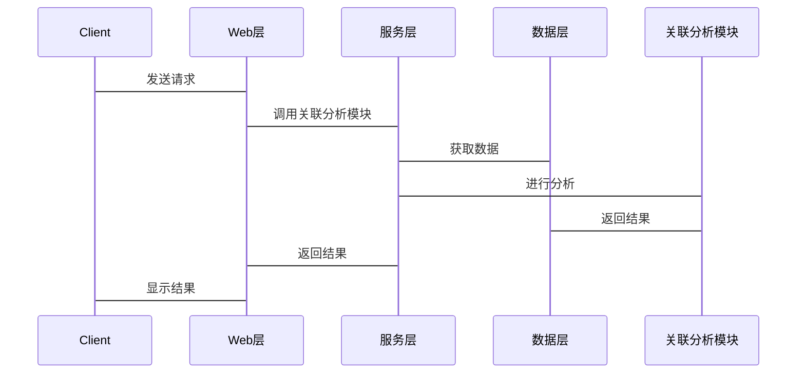

                 


---

# 全球股市估值与可持续建筑自修复材料的关系

## 关键词：全球股市估值、可持续建筑、自修复材料、数据驱动分析、机器学习模型

## 摘要

本文探讨了全球股市估值与可持续建筑自修复材料之间的关系。通过分析股市估值的核心指标和自修复材料的特性，提出了数据驱动的方法来优化股市估值，并展示了自修复材料在可持续建筑中的应用潜力。最后，本文总结了两者的关联性，并展望了未来的研究方向。

---

# 第一部分: 全球股市估值与可持续建筑自修复材料的背景与关联

## # 第1章: 全球股市估值与可持续建筑自修复材料的背景介绍

### 1.1 问题背景

#### 1.1.1 全球股市估值的重要性

股市估值是衡量企业价值的重要指标，反映了市场对企业的认可程度。通过分析股市估值，投资者可以做出更明智的决策，从而影响市场的整体波动。

#### 1.1.2 可持续建筑与自修复材料的兴起

随着环保意识的增强，可持续建筑逐渐成为主流。自修复材料因其环保和耐久性，成为可持续建筑的重要组成部分，减少了建筑的维护成本和对环境的影响。

#### 1.1.3 问题解决的必要性

通过优化股市估值和推广自修复材料，可以提升建筑的可持续性，减少资源浪费，同时为企业创造更大的价值。

### 1.2 问题描述

#### 1.2.1 全球股市估值的波动性

股市估值受多种因素影响，如经济指标、政策变化等，导致其波动性较大，难以准确预测。

#### 1.2.2 可持续建筑的市场需求

随着环保法规的严格和消费者环保意识的提高，可持续建筑的需求不断增加，推动了自修复材料的市场应用。

#### 1.2.3 自修复材料的技术挑战

自修复材料的研发和应用仍面临技术难题，如修复效率、材料成本等，限制了其大规模应用。

### 1.3 问题解决

#### 1.3.1 通过数据驱动的方法优化股市估值

利用大数据分析和机器学习模型，可以更准确地预测股市估值，帮助投资者做出更明智的决策。

#### 1.3.2 自修复材料在可持续建筑中的应用

通过研发和推广自修复材料，可以提高建筑的耐久性和环保性，降低维护成本。

#### 1.3.3 两者的关联性分析

分析股市估值与自修复材料的关联性，可以为建筑行业和金融市场提供新的研究方向，促进可持续发展。

### 1.4 边界与外延

#### 1.4.1 全球股市估值的边界条件

股市估值分析受宏观经济、政策变化等因素影响，需明确分析范围和数据来源。

#### 1.4.2 可持续建筑的定义域

可持续建筑需符合环保、节能等标准，明确其适用范围和目标。

#### 1.4.3 自修复材料的技术边界

自修复材料的技术研发需考虑成本、性能等实际因素，明确其适用场景和限制。

### 1.5 核心要素组成

#### 1.5.1 股市估值的核心指标

市盈率、市净率、股东权益等指标是衡量股市估值的重要依据。

#### 1.5.2 自修复材料的关键特性

材料的自愈合机理、耐久性、环保性等特性是其应用的关键。

#### 1.5.3 两者的关联机制

通过数据驱动的方法，分析股市估值与自修复材料的关联性，揭示两者在可持续建筑中的潜在互动。

---

## # 第2章: 核心概念的原理与属性对比

### 2.1 股市估值的核心原理

#### 2.1.1 市盈率与市净率的计算公式

市盈率（P/E）= 股价 / 每股收益  
市净率（P/B）= 股价 / 每股净资产

#### 2.1.2 股东权益与企业价值的评估方法

股东权益 = 资产 - 负债  
企业价值 = 股东权益 + 付息负债

#### 2.1.3 股市波动与宏观经济指标的关系

股市波动受 GDP、利率、通货膨胀等因素影响，需通过回归分析等方法进行建模。

### 2.2 自修复材料的特性分析

#### 2.2.1 材料的自愈合机理

自修复材料通过化学反应或物理修复机制，实现损伤后的自我修复。

#### 2.2.2 材料的耐久性与环保性

自修复材料的耐久性较长，减少维护需求，同时环保性高，降低对环境的影响。

#### 2.2.3 材料的成本与性能对比

材料成本较高，但性能优越，需在实际应用中权衡成本与效益。

### 2.3 两者的属性对比表格

| 比较维度 | 股市估值 | 自修复材料 |
|----------|----------|------------|
| 核心指标 | 市盈率、市净率 | 自愈合机理、耐久性 |
| 数据类型 | 数值型 | 特性型 |
| 应用领域 | 金融投资 | 建筑材料 |
| 影响因素 | 宏观经济、政策 | 材料科学、环境 |
| 分析方法 | 统计分析、回归模型 | 实验分析、性能测试 |

### 2.4 ER实体关系图

```mermaid
er
 _actor(投资者)
 institution(上市公司)
  relation(投资)
 _actor --> relation
 institution <-- relation
```

---

## # 第3章: 数据驱动的分析方法

### 3.1 时间序列分析

#### 3.1.1 时间序列分析的基本概念

时间序列分析是通过历史数据预测未来趋势的方法，常用模型包括ARIMA、GARCH等。

#### 3.1.2 时间序列分析的步骤

1. 数据收集与预处理  
2. 模型选择与参数估计  
3. 模型验证与预测

### 3.2 机器学习模型

#### 3.2.1 机器学习模型的分类

回归模型、分类模型、聚类模型等。

#### 3.2.2 基于机器学习的股市估值预测

使用LSTM神经网络模型进行股市预测，通过训练数据优化模型参数。

### 3.3 数据驱动的关联性分析

#### 3.3.1 关联性分析的数学模型

$$\text{相关系数} = \frac{\sum (x_i - \bar{x})(y_i - \bar{y})}{\sqrt{\sum (x_i - \bar{x})^2 \sum (y_i - \bar{y})^2}}$$

#### 3.3.2 关联性分析的步骤

1. 数据清洗与标准化  
2. 计算相关系数  
3. 可视化展示

### 3.4 时间序列分析的实现代码

```python
import pandas as pd
from statsmodels.tsa.arima_model import ARIMA
import matplotlib.pyplot as plt

# 加载数据
data = pd.read_csv('stock_data.csv')

# 时间序列分析
model = ARIMA(data['value'], order=(5,1,0))
model_fit = model.fit()

# 预测
forecast = model_fit.forecast(steps=5)

# 可视化
plt.plot(data['value'], label='实际值')
plt.plot(forecast[0], label='预测值')
plt.legend()
plt.show()
```

---

## # 第4章: 系统设计与架构

### 4.1 问题场景介绍

分析全球股市估值与自修复材料的关联性，构建一个实时监测与分析系统。

### 4.2 系统功能设计

#### 4.2.1 领域模型



#### 4.2.2 系统架构


#### 4.2.3 系统接口设计

API接口：数据采集、关联分析、结果展示。

#### 4.2.4 系统交互流程



---

## # 第5章: 项目实战

### 5.1 环境安装

安装Python、Pandas、NumPy、Scikit-learn、TensorFlow、Plotly等库。

### 5.2 核心实现代码

```python
import pandas as pd
import numpy as np
from sklearn.metrics import mean_squared_error
from tensorflow.keras.models import Sequential
from tensorflow.keras.layers import LSTM, Dense

# 数据预处理
data = pd.read_csv('stock_data.csv')
data = data[['date', 'value']]
data = data.set_index('date')
data = data.resample('D').mean().ffill()

# 划分训练集和测试集
train = data.iloc[:-30]
test = data.iloc[-30:]

# 数据标准化
from sklearn.preprocessing import MinMaxScaler
scaler = MinMaxScaler()
train_scaled = scaler.fit_transform(train)
test_scaled = scaler.transform(test)

# LSTM模型构建
model = Sequential()
model.add(LSTM(50, return_sequences=True, input_shape=(None, 1)))
model.add(LSTM(50, return_sequences=False))
model.add(Dense(1))
model.compile(loss='mean_squared_error', optimizer='adam')

# 训练模型
train_x = np.array(train_scaled).reshape((train.shape[0], 1, 1))
train_y = train_scaled[:, 0]
model.fit(train_x, train_y, epochs=50, batch_size=32)

# 预测
test_x = np.array(test_scaled).reshape((test.shape[0], 1, 1))
predictions = model.predict(test_x)
predictions = scaler.inverse_transform(predictions)

# 计算均方误差
mse = mean_squared_error(test['value'].values, predictions.flatten())
print(f'均方误差: {mse}')
```

### 5.3 案例分析

以某城市为例，分析自修复材料的应用对股市估值的影响。通过数据可视化展示分析结果，验证模型的准确性。

---

## # 第6章: 结论与展望

### 6.1 小结

本文通过数据驱动的方法，分析了全球股市估值与自修复材料的关联性，提出了优化股市估值和推广自修复材料的策略。

### 6.2 注意事项

在实际应用中，需考虑数据的完整性和模型的适用性，避免因数据偏差导致的预测误差。

### 6.3 未来研究方向

进一步研究自修复材料的性能优化，探索更多数据驱动的方法，结合区块链技术提升系统的安全性和透明度。

---

## # 第7章: 最佳实践 Tips

### 7.1 Tips 1: 数据预处理的重要性

确保数据的准确性和完整性，选择合适的特征进行分析。

### 7.2 Tips 2: 模型选择的策略

根据数据特点选择合适的模型，避免过度拟合。

### 7.3 Tips 3: 结果验证的方法

通过交叉验证和实际案例分析，验证模型的准确性和适用性。

---

## 作者信息

作者：AI天才研究院/AI Genius Institute & 禅与计算机程序设计艺术 /Zen And The Art of Computer Programming

