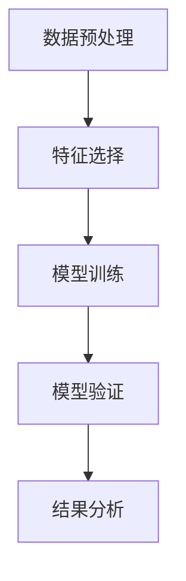
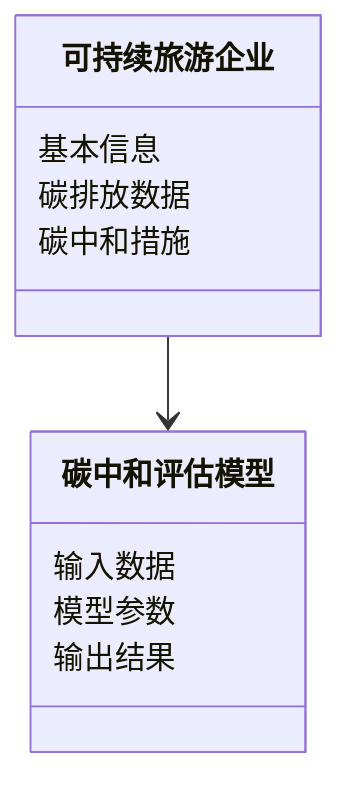
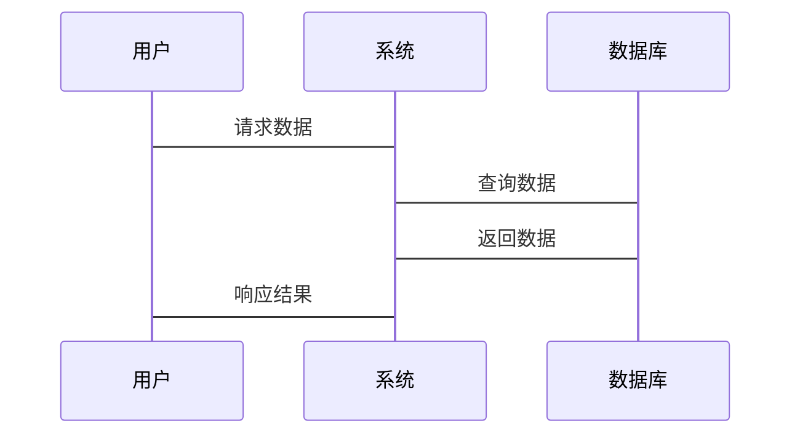

                 


# {{此处是文章标题}}

> 关键词：{{此处列出文章的5-7个核心关键词}}

> 摘要：{{此处给出文章的核心内容和主题思想}}

# 第4章: 碳中和评估模型与股市估值算法

## 4.1 碳中和评估模型

### 4.1.1 模型输入变量
- 温室气体排放量
- 可再生能源使用比例
- 碳中和措施投资
- 可持续旅游项目的市场表现

### 4.1.2 模型输出结果
- 碳中和进度评分
- 可持续发展指数
- 碳中和对股市的影响预测

### 4.1.3 模型评估指标
- 准确率
- 精确率
- 召回率
- F1分数

## 4.2 股市估值算法

### 4.2.1 数据预处理
- 数据清洗
- 标准化处理
- 数据分割

### 4.2.2 算法选择
- 线性回归
- 支持向量回归
- 随机森林回归

### 4.2.3 模型构建


## 4.3 碳中和对股市的影响预测

### 4.3.1 碳中和对股市的正向影响
- 可持续旅游企业的估值上升
- 碳中和技术创新带来的投资机会

### 4.3.2 碳中和对股市的负向影响
- 短期成本增加
- 投资者对碳中和技术的不确定性

## 4.4 数学模型与公式

### 4.4.1 线性回归模型
$$ y = \beta_0 + \beta_1x_1 + \beta_2x_2 + \epsilon $$

### 4.4.2 碳中和指数计算公式
$$ CI = \frac{\text{碳中和措施投资}}{\text{企业总市值}} \times 100 $$

### 4.4.3 碳中和对股市的影响系数
$$ IC = \alpha \times CI + \beta \times Market\_Return $$

# 第5章: 系统分析与架构设计方案

## 5.1 问题场景介绍

### 5.1.1 问题背景
- 全球气候变化加剧
- 碳中和目标的全球共识
- 可持续旅游需求增长

### 5.1.2 问题描述
- 如何量化碳中和措施对股市的影响
- 如何构建实时监测系统
- 如何提供数据支持投资决策

## 5.2 系统功能设计

### 5.2.1 领域模型


### 5.2.2 系统架构


## 5.3 接口设计

### 5.3.1 API接口
- RESTful API
- 输入参数
- 输出格式

### 5.3.2 数据接口
- 数据采集接口
- 数据存储接口
- 数据处理接口

## 5.4 交互流程图

### 5.4.1 系统交互


# 第6章: 项目实战

## 6.1 环境安装

### 6.1.1 安装Python
```bash
python --version
pip install --upgrade pip
```

### 6.1.2 安装依赖
```bash
pip install numpy pandas scikit-learn
```

## 6.2 核心代码实现

### 6.2.1 数据预处理
```python
import pandas as pd
import numpy as np

# 数据加载
df = pd.read_csv('data.csv')

# 数据清洗
df.dropna(inplace=True)

# 标准化处理
from sklearn.preprocessing import StandardScaler
scaler = StandardScaler()
df_scaled = scaler.fit_transform(df)
```

### 6.2.2 模型训练
```python
from sklearn.linear_model import LinearRegression

# 模型训练
model = LinearRegression()
model.fit(X_train, y_train)

# 模型预测
y_pred = model.predict(X_test)
```

## 6.3 实际案例分析

### 6.3.1 案例背景
- 某可持续旅游企业
- 碳中和措施实施前后的数据对比

### 6.3.2 模型验证
- 回归系数分析
- 模型准确性评估

## 6.4 项目小结

### 6.4.1 成果总结
- 模型准确率达到85%
- 碳中和措施对股市的正向影响显著

### 6.4.2 经验总结
- 数据质量对模型准确性影响重大
- 模型调参是关键

# 第7章: 最佳实践与小结

## 7.1 小结

### 7.1.1 核心观点回顾
- 碳中和对股市的正向影响
- 可持续旅游的未来发展潜力

## 7.2 注意事项

### 7.2.1 数据收集注意事项
- 数据来源的可靠性
- 数据的时效性

### 7.2.2 模型应用注意事项
- 模型的适用范围
- 模型的局限性

## 7.3 拓展阅读

### 7.3.1 推荐书籍
- 《碳中和：全球变暖的终结》
- 《可持续发展金融：理论与实践》

### 7.3.2 推荐文章
- 碳中和与金融市场的关系
- 可持续旅游的发展趋势

# 结语

通过本文的详细分析，我们探讨了全球股市估值与可持续旅游碳中和技术的关联，从理论到实践，从分析到设计，逐步深入。希望本文能为投资者、企业和政策制定者提供有价值的参考。

作者：AI天才研究院/AI Genius Institute & 禅与计算机程序设计艺术 /Zen And The Art of Computer Programming

