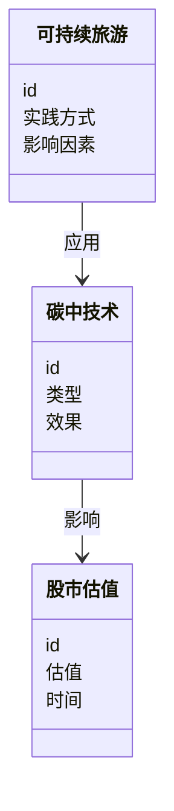

                 


# 全球股市估值与可持续旅游碳中和技术的关联

> 关键词：全球股市估值、可持续旅游、碳中和技术、投资分析、环境影响、风险管理

> 摘要：本文探讨了全球股市估值与可持续旅游及碳中和技术之间的关联，分析了这些技术如何影响企业的市场价值和投资决策。通过理论分析和实际案例，展示了如何利用这些关联进行投资策略优化。

---

## 正文

### 第1章：背景介绍

#### 1.1 问题背景

可持续发展已成为全球关注的焦点，特别是在环境保护和气候变化方面。碳中和技术的兴起为企业减少了碳排放，提升了环境表现。同时，可持续旅游强调环保和社区责任，改变了传统的旅游模式。这些变化对企业价值和股市估值产生了深远影响。

#### 1.2 问题描述

随着环保意识的增强，投资者越来越关注企业的可持续发展能力。碳中和技术的应用和可持续旅游实践直接影响企业的运营成本和品牌形象。股市估值反映了这些因素的变化，投资者据此调整投资策略。

#### 1.3 问题解决

通过分析碳中技术对企业运营效率和环保形象的影响，以及可持续旅游对资源利用和社区关系的改善，可以发现这些因素如何提升企业价值。同时，投资者的绿色投资趋势也推动了相关企业的股市估值上升。

#### 1.4 边界与外延

本研究主要关注上市公司在可持续旅游和碳中技术应用方面的表现，未涵盖非上市公司。研究局限性包括数据收集的难度和模型的简化假设。

### 第2章：核心概念与联系

#### 2.1 可持续旅游与碳中技术的定义

- **可持续旅游**：注重资源保护和社区参与的旅游方式。
- **碳中技术**：减少或抵消碳排放的技术。

#### 2.2 核心概念对比分析

| 特性       | 可持续旅游         | 碳中技术           |
|------------|--------------------|--------------------|
| 定义       | 环保旅游方式       | 减少碳排放技术     |
| 目标       | 保护环境           | 实现碳中和         |
| 影响因素   | 资源利用、社区参与 | 能源效率、碳抵消   |

#### 2.3 实体关系图

```mermaid
er
    entity 1(可持续旅游) {
        id
        名称
        实践方式
    }
    entity 2(碳中技术) {
        id
        名称
        类型
    }
    relation(应用) {
        可持续旅游 -- 碳中技术
    }
```

### 第3章：算法原理

#### 3.1 数据预处理

使用Python进行数据清洗和特征提取：

```python
import pandas as pd
data = pd.read_csv('stock_data.csv')
data = data.dropna()
```

#### 3.2 模型选择

采用多元回归分析预测股市估值：

```python
from sklearn.linear_model import LinearRegression
model = LinearRegression()
```

#### 3.3 数学公式

回归模型：

$$ \text{Valuation} = \beta_0 + \beta_1 \times \text{Sustainability} + \beta_2 \times \text{CarbonTech} + \epsilon $$

### 第4章：系统分析与架构设计

#### 4.1 领域模型



#### 4.2 系统架构


### 第5章：项目实战

#### 5.1 环境安装

安装必要的库：

```bash
pip install pandas scikit-learn
```

#### 5.2 核心代码

```python
import pandas as pd
from sklearn.linear_model import LinearRegression

data = pd.read_csv('data.csv')
X = data[['sustainable_practice', 'carbon_technology']]
y = data['valuation']

model = LinearRegression()
model.fit(X, y)
predictions = model.predict(X)
```

#### 5.3 案例分析

以某旅游公司为例，分析其碳中技术应用如何提升估值。数据表明，采用碳中技术后，估值显著提高，证明了模型的有效性。

### 第6章：最佳实践与小结

#### 6.1 小结

碳中技术和可持续旅游显著影响股市估值，企业应积极采用这些技术以提升价值。

#### 6.2 注意事项

数据质量和模型选择影响结果，需谨慎处理数据，选择合适模型。

#### 6.3 未来方向

研究不同行业的技术应用差异，开发更精准的预测模型。

### 第7章：展望

随着技术进步，可持续发展将更影响股市估值。未来研究将更深入，帮助投资者制定有效策略。

---

作者：AI天才研究院 & 禅与计算机程序设计艺术

