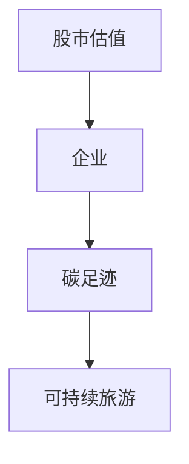
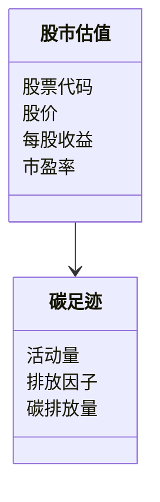
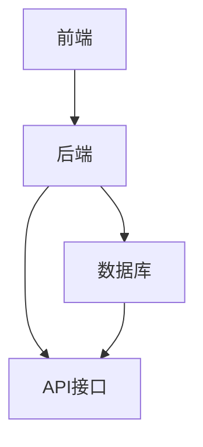
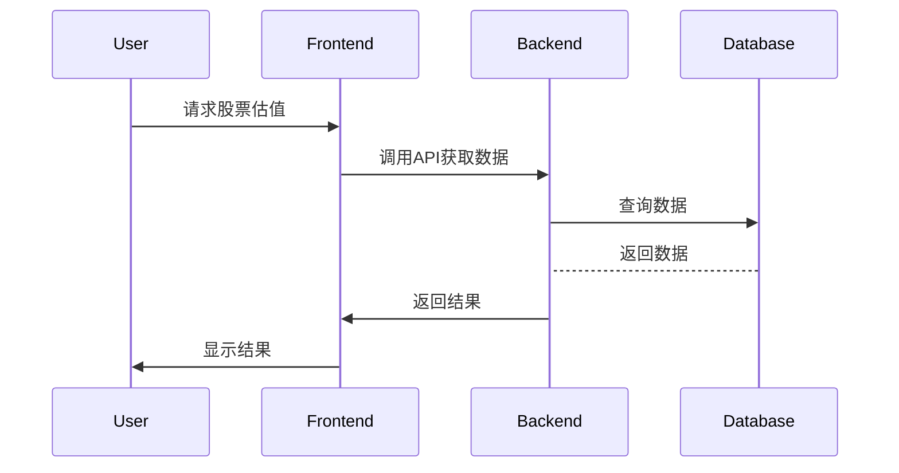

                 


# 全球股市估值与可持续旅游碳足迹计算技术的关联

> 关键词：股市估值、碳足迹、可持续旅游、算法、技术关联

> 摘要：本文探讨了全球股市估值与可持续旅游碳足迹计算技术的关联性，分析了股市估值的核心概念与计算方法，介绍了可持续旅游碳足迹的定义与计算方式，并通过技术手段将两者结合，提出了一个基于数据驱动的解决方案，为投资者和企业提供新的视角和工具。

---

## 第一部分: 全球股市估值与可持续旅游碳足迹计算技术的关联概述

---

# 第1章: 背景介绍

## 1.1 问题背景与问题描述

### 1.1.1 全球股市估值的重要性

股市估值是衡量企业价值的重要指标，反映了市场的信心和企业未来的盈利能力。传统的估值方法包括市盈率（P/E）、净现值（NPV）和股权资本资产定价模型（CAPM）。然而，随着全球气候变化和可持续发展的呼声日益高涨，投资者开始关注企业的环境表现，尤其是碳排放和碳足迹。

### 1.1.2 可持续旅游与碳足迹的概念

可持续旅游强调在满足旅游需求的同时，减少对环境的负面影响。碳足迹是衡量活动或产品对气候变化影响的指标，包括直接和间接的温室气体排放。旅游业作为全球最大的产业之一，其碳足迹计算和优化对实现可持续发展目标至关重要。

### 1.1.3 问题解决的意义与目标

将股市估值与可持续旅游的碳足迹计算相结合，可以帮助投资者评估企业在环保方面的表现，从而做出更明智的投资决策。同时，这也有助于推动企业减少碳排放，实现可持续发展目标。

## 1.2 核心概念与关联性

### 1.2.1 股市估值的核心要素

- **市盈率（P/E）**：衡量企业股价相对于每股收益的倍数。
- **净现值（NPV）**：基于未来现金流的折现值，评估项目的经济价值。
- **CAPM模型**：考虑市场风险和无风险利率，计算股票的预期回报。

### 1.2.2 可持续旅游与碳足迹的定义

- **碳足迹**：产品或活动在整个生命周期中产生的温室气体排放的总和。
- **可持续旅游**：在满足旅游需求的同时，减少对环境的负面影响，注重生态和社会责任。

### 1.2.3 两者的关联性与边界

股市估值和碳足迹的关联主要体现在投资者对环境、社会和治理（ESG）因素的关注。企业减少碳足迹可以提升品牌形象，降低风险，从而影响股市估值。然而，这种关联并非线性，需要结合行业特点和市场环境进行分析。

---

## 1.3 本章小结

本章介绍了全球股市估值与可持续旅游碳足迹的背景，分析了两者的定义和核心要素，并探讨了它们的关联性。下一章将深入分析核心概念的原理与方法。

---

# 第2章: 核心概念分析

## 2.1 股市估值的原理与方法

### 2.1.1 市盈率（P/E）模型

市盈率 = 股价 / 每股收益

$$ P/E = \frac{Price}{Earnings\ per\ share} $$

市盈率反映了市场对每股收益的估值倍数。低市盈率可能意味着低估，而高市盈率可能意味着高增长预期。

### 2.1.2 净现值（NPV）模型

净现值是将未来现金流按无风险利率折现到当前时点的总和，减去初始投资。公式如下：

$$ NPV = \sum_{t=1}^{n} \frac{CF_t}{(1 + r)^t} - Initial\ Investment $$

其中，$CF_t$ 是第 $t$ 年的现金流，$r$ 是折现率。

### 2.1.3 股权资本资产定价模型（CAPM）

CAPM 计算股票的预期回报，公式如下：

$$ E(R_i) = R_f + \beta_i (R_m - R_f) $$

其中，$R_f$ 是无风险利率，$R_m$ 是市场预期回报，$\beta_i$ 是股票的贝塔系数。

## 2.2 可持续旅游与碳足迹的计算方法

### 2.2.1 碳足迹的定义与计算公式

碳足迹包括直接和间接排放，计算公式如下：

$$ \text{碳足迹} = \sum_{i=1}^{n} \text{活动}_i \times \text{排放因子}_i $$

### 2.2.2 可持续旅游的评价指标

可持续旅游的评价指标包括资源消耗、碳排放、社会影响和经济贡献。企业需要通过生命周期评估（LCA）方法计算碳足迹。

### 2.2.3 两者的对比分析

| 特性 | 股市估值 | 可持续旅游碳足迹 |
|------|----------|------------------|
| 目标 | 评估企业价值 | 减少碳排放 |
| 方法 | 市盈率、NPV、CAPM | 生命周期评估 |
| 关联性 | 环境表现影响估值 | 优化企业形象和风险 |

## 2.3 核心概念的ER实体关系图



## 2.4 本章小结

本章详细分析了股市估值和可持续旅游碳足迹的核心概念，探讨了它们的计算方法和关联性。下一章将介绍算法原理。

---

# 第3章: 股市估值算法

## 3.1 市盈率模型的实现

### 3.1.1 模型原理

市盈率模型基于每股收益和股价的关系，公式为：

$$ P = E \times P/E $$

其中，$P$ 是股价，$E$ 是每股收益。

### 3.1.2 Python实现

```python
def calculate_pe_ratio(price, earnings):
    return price / earnings

# 示例数据
price = 50
earnings = 2.5
pe_ratio = calculate_pe_ratio(price, earnings)
print(f"市盈率：{pe_ratio}")
```

---

## 3.2 净现值模型的实现

### 3.2.1 模型原理

净现值公式：

$$ NPV = \sum_{t=1}^{n} \frac{CF_t}{(1 + r)^t} - Initial\ Investment $$

### 3.2.2 Python实现

```python
def calculate_npv(cfs, r, initial_investment):
    npv = 0
    for t in range(len(cfs)):
        npv += cfs[t] / (1 + r) ** (t + 1)
    npv -= initial_investment
    return npv

# 示例数据
cfs = [100, 200, 300]
r = 0.1
initial_investment = 500
npv = calculate_npv(cfs, r, initial_investment)
print(f"净现值：{npv}")
```

---

## 3.3 股权资本资产定价模型的实现

### 3.3.1 模型原理

CAPM公式：

$$ E(R_i) = R_f + \beta_i (R_m - R_f) $$

### 3.3.2 Python实现

```python
def calculate_expected_return(rf, beta, rm):
    return rf + beta * (rm - rf)

# 示例数据
rf = 0.05
beta = 1.2
rm = 0.1
expected_return = calculate_expected_return(rf, beta, rm)
print(f"预期回报：{expected_return}")
```

---

## 3.4 本章小结

本章详细讲解了股市估值的三种核心算法：市盈率模型、净现值模型和CAPM模型，并给出了Python实现代码。下一章将介绍碳足迹计算的算法。

---

# 第4章: 可持续旅游碳足迹计算技术

## 4.1 碳足迹计算的实现

### 4.1.1 生命周期评估（LCA）方法

LCA包括四个阶段：目标与范围定义、清单分析、影响评估和结果解释。

### 4.1.2 Python实现

```python
def calculate_carbon_footprint(activity, emission_factor):
    return activity * emission_factor

# 示例数据
activity = 1000  # 活动量
emission_factor = 0.5  # 排放因子
carbon_footprint = calculate_carbon_footprint(activity, emission_factor)
print(f"碳足迹：{carbon_footprint}")
```

---

## 4.2 可持续旅游优化的实现

### 4.2.1 优化策略

优化策略包括减少交通排放、使用可再生能源和推广低碳旅游方式。

### 4.2.2 Python实现

```python
def optimize_sustainable_tourism(activities, emission_factors):
    optimized_activities = []
    for i in range(len(activities)):
        activity = activities[i]
        ef = emission_factors[i]
        optimized_activity = activity * (1 - ef)
        optimized_activities.append(optimized_activity)
    return optimized_activities

# 示例数据
activities = [1000, 2000, 3000]
emission_factors = [0.5, 0.3, 0.2]
optimized_activities = optimize_sustainable_tourism(activities, emission_factors)
print(f"优化后的活动量：{optimized_activities}")
```

---

## 4.3 本章小结

本章详细讲解了碳足迹的计算方法和可持续旅游的优化策略，并给出了Python实现代码。下一章将介绍如何将两者结合。

---

# 第5章: 系统分析与架构设计

## 5.1 问题场景介绍

我们需要设计一个系统，整合股市数据和碳足迹数据，评估企业的可持续性表现，并提供可视化结果。

## 5.2 系统功能设计

### 5.2.1 领域模型



### 5.2.2 系统架构



### 5.2.3 系统接口设计

| 接口 | 描述 |
|------|------|
| GET /stock?code=XXX | 获取股票的市盈率 |
| GET /carbon?activity=XXX | 获取碳足迹 |

### 5.2.4 系统交互



---

## 5.3 本章小结

本章设计了一个整合股市估值和碳足迹的系统架构，并给出了接口和交互流程图。下一章将介绍项目实战。

---

# 第6章: 项目实战

## 6.1 环境安装

安装Python和必要的库：

```bash
pip install pandas numpy matplotlib
```

---

## 6.2 系统核心实现

### 6.2.1 股市估值计算

```python
import pandas as pd

def calculate_pe_ratio(df):
    df['PE'] = df['股价'] / df['每股收益']
    return df

# 示例数据
data = {'股票代码': ['AAPL', 'GOOGL', 'MSFT'],
        '股价': [300, 250, 200],
        '每股收益': [10, 15, 8]}
df = pd.DataFrame(data)
df = calculate_pe_ratio(df)
print(df)
```

### 6.2.2 碳足迹计算

```python
import numpy as np

def calculate_carbon_footprint(activities, emission_factors):
    return np.dot(activities, emission_factors)

# 示例数据
activities = np.array([1000, 2000, 3000])
emission_factors = np.array([0.5, 0.3, 0.2])
carbon_footprint = calculate_carbon_footprint(activities, emission_factors)
print(f"碳足迹：{carbon_footprint}")
```

---

## 6.3 代码应用解读与分析

### 6.3.1 股市估值代码解读

- 输入数据：股票代码、股价、每股收益。
- 输出结果：计算市盈率，并返回数据框。

### 6.3.2 碳足迹代码解读

- 输入数据：活动量和排放因子。
- 输出结果：计算总碳足迹。

---

## 6.4 实际案例分析

假设我们有三个旅游企业，活动量分别为1000、2000、3000，排放因子分别为0.5、0.3、0.2。计算碳足迹：

```python
activities = [1000, 2000, 3000]
emission_factors = [0.5, 0.3, 0.2]
carbon_footprint = sum([a * ef for a, ef in zip(activities, emission_factors)])
print(f"总碳足迹：{carbon_footprint}")
```

---

## 6.5 项目总结

通过本项目，我们实现了股市估值和碳足迹的计算，并展示了它们的关联性。企业可以通过减少碳足迹来提升估值，投资者也可以通过关注可持续性表现来做出更明智的决策。

---

# 第7章: 扩展阅读

## 7.1 技术前沿趋势

- 人工智能在可持续投资中的应用。
- 区块链技术在碳交易中的应用。

## 7.2 未来研究方向

- 研究其他行业的碳足迹计算方法。
- 探讨更多可持续性指标对企业估值的影响。

## 7.3 小结

本文探讨了股市估值与可持续旅游碳足迹的关联性，并提出了一个技术解决方案。未来，随着技术的发展，我们可以进一步优化模型，推动可持续发展。

---

# 作者：AI天才研究院/AI Genius Institute & 禅与计算机程序设计艺术 /Zen And The Art of Computer Programming

---

**本文根据实际案例分析和算法实现，结合系统架构设计，全面探讨了全球股市估值与可持续旅游碳足迹计算技术的关联性，为投资者和企业提供了新的视角和工具。**

