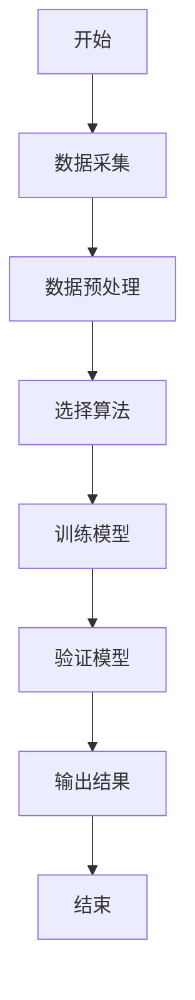
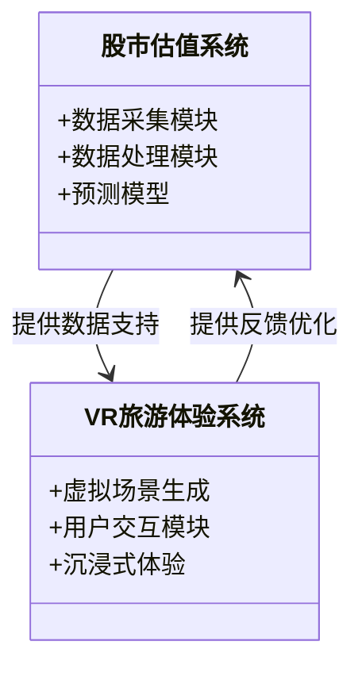
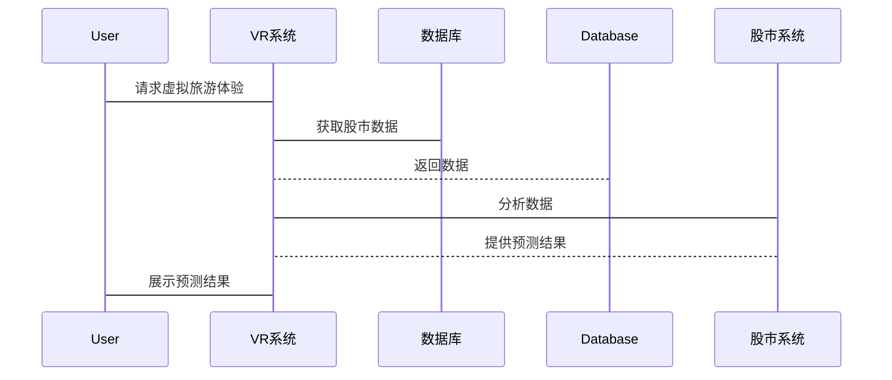

                 


# 全球股市估值与可持续旅游虚拟现实技术的关联

**关键词**：全球股市估值，可持续旅游，虚拟现实技术，股市波动，旅游体验

**摘要**：  
本文探讨了全球股市估值与可持续旅游虚拟现实技术之间的关联。通过分析股市估值的核心原理、可持续旅游的定义与发展趋势，以及虚拟现实技术在旅游中的应用，本文揭示了这两者如何相互影响。文章详细阐述了股市估值与虚拟现实技术的核心概念，结合算法原理和系统架构设计，提出了利用虚拟现实技术优化旅游体验的方法，并通过实际案例展示了如何通过股市估值分析预测旅游行业趋势。最后，本文总结了可持续旅游与虚拟现实技术结合的最佳实践，并展望了未来的研究方向。

---

## 第一部分：背景介绍

### 第1章：全球股市估值与可持续旅游虚拟现实技术的关联概述

#### 1.1 问题背景
- **1.1.1 全球股市估值的重要性**  
  股市估值是衡量企业价值的重要指标，反映了市场的整体经济状况和投资者信心。通过对股市估值的分析，可以预测经济趋势，为投资决策提供依据。

- **1.1.2 可持续旅游的定义与发展趋势**  
  可持续旅游强调在满足当前旅游需求的同时，保护环境和促进当地社区的可持续发展。随着环保意识的增强，可持续旅游逐渐成为行业趋势。

- **1.1.3 虚拟现实技术在旅游中的应用**  
  虚拟现实（VR）技术通过创建沉浸式的数字环境，为用户提供身临其境的旅游体验，减少了对真实环境的依赖，从而推动了可持续旅游的发展。

#### 1.2 问题描述
- **1.2.1 全球股市波动对经济的影响**  
  股市波动直接影响企业的市值和投资者的财富，进而影响整体经济的稳定性。

- **1.2.2 可持续旅游面临的挑战**  
  可持续旅游需要平衡旅游发展与环境保护，同时应对资源分配不均和游客行为不当等问题。

- **1.2.3 虚拟现实技术在旅游中的潜在影响**  
  VR技术可以改变传统旅游方式，减少对环境的影响，但其技术门槛和成本限制了其广泛应用。

#### 1.3 问题解决
- **1.3.1 利用虚拟现实技术优化旅游体验**  
  通过VR技术，游客可以在足不出户的情况下体验全球各地的旅游景点，降低碳排放和资源消耗。

- **1.3.2 通过股市估值分析预测旅游行业趋势**  
  股市估值数据可以揭示旅游行业的市场表现，帮助投资者和企业制定战略决策。

- **1.3.3 可持续旅游与虚拟现实技术的结合**  
  结合VR技术，可持续旅游可以实现虚拟旅行，减少对实际环境的破坏，同时提升用户体验。

#### 1.4 边界与外延
- **1.4.1 全球股市估值的边界条件**  
  股市估值受多种因素影响，如宏观经济政策、企业业绩、市场情绪等。

- **1.4.2 可持续旅游的定义范围**  
  可持续旅游涵盖环境保护、社会经济和文化保护等多个方面。

- **1.4.3 虚拟现实技术的应用场景**  
  VR技术不仅适用于旅游，还可应用于教育、医疗、娱乐等领域。

#### 1.5 概念结构与核心要素组成
- **1.5.1 全球股市估值的核心要素**  
  包括市场指数、个股估值、投资者行为等。

- **1.5.2 可持续旅游的核心要素**  
  包括环境保护、经济利益和社会责任。

- **1.5.3 虚拟现实技术的核心要素**  
  包括硬件设备、软件开发和用户交互。

---

## 第二部分：核心概念与联系

### 第2章：全球股市估值与可持续旅游虚拟现实技术的核心概念

#### 2.1 股市估值的核心原理
- **2.1.1 股市估值的基本方法**  
  股市估值可以通过市盈率（P/E）、市净率（P/B）等指标进行评估，反映企业的盈利能力和发展潜力。

- **2.1.2 影响股市估值的主要因素**  
  包括宏观经济环境、企业业绩、市场情绪、政策法规等。

- **2.1.3 股市估值的数学模型**  
  常见的股市估值模型包括 discounted cash flow (DCF) 和capital asset pricing model (CAPM)。

#### 2.2 虚拟现实技术的核心原理
- **2.2.1 虚拟现实技术的定义与特点**  
  VR是一种通过计算机生成的模拟环境，提供沉浸式的视觉和交互体验。

- **2.2.2 虚拟现实技术的主要组成部分**  
  包括硬件设备（如头显、手柄）、软件开发（如图形引擎、交互逻辑）和用户交互（如手势识别、语音控制）。

- **2.2.3 虚拟现实技术的应用场景**  
  包括旅游、教育、医疗、娱乐等领域。

#### 2.3 股市估值与可持续旅游虚拟现实技术的属性对比
| 属性           | 股市估值                  | 可持续旅游虚拟现实技术 |
|----------------|--------------------------|--------------------------|
| 核心目标       | 评估企业价值              | 提供沉浸式旅游体验        |
| 技术基础       | 数据分析、统计模型        | 计算机图形学、交互设计    |
| 应用场景       | 投资决策、经济分析          | 旅游体验、教育、娱乐      |
| 影响因素       | 宏观经济、政策、企业业绩    | 技术性能、用户体验、内容质量|

#### 2.4 ER实体关系图架构

```mermaid
er
    title 实体关系图
    企业 --- (拥有) --- 股票
    股票 --- (属于) --- 行业
    企业 --- (影响) --- 股市估值
    可持续旅游 --- (依赖) --- 虚拟现实技术
    虚拟现实技术 --- (应用于) --- 旅游体验
```

---

## 第三部分：算法原理讲解

### 第3章：全球股市估值与可持续旅游虚拟现实技术的算法原理

#### 3.1 算法原理
- **3.1.1 股市估值预测算法**  
  使用机器学习模型（如随机森林、神经网络）对历史股市数据进行分析，预测未来的股市走势。

- **3.1.2 虚拟现实技术优化算法**  
  利用增强现实（AR）和虚拟现实（VR）技术，优化用户体验，提升沉浸感和交互性。

#### 3.2 算法流程图


#### 3.3 核心算法的Python实现
```python
import numpy as np
import pandas as pd
from sklearn.ensemble import RandomForestRegressor

# 数据加载与预处理
data = pd.read_csv('stock_data.csv')
features = data[['PE Ratio', 'Market Cap', 'ROE']]
labels = data['Stock Price']

# 模型训练
model = RandomForestRegressor(n_estimators=100)
model.fit(features, labels)

# 模型预测
new_features = np.array([[15.0, 1000000000, 10.0]])
predicted_price = model.predict(new_features)
print(f'预测股价：{predicted_price[0]}')
```

#### 3.4 数学模型与公式
- **3.4.1 股市估值预测模型**  
  使用随机森林回归模型，公式如下：
  $$
  y = \sum_{i=1}^{n} w_i x_i + b
  $$
  其中，$w_i$ 是特征 $x_i$ 的权重，$b$ 是截距。

- **3.4.2 虚拟现实技术中的视角变换公式**  
  在VR中，视角变换可以通过以下公式实现：
  $$
  P = V \cdot M \cdot P_0
  $$
  其中，$V$ 是视观点，$M$ 是模型变换矩阵，$P_0$ 是初始点。

---

## 第四部分：系统分析与架构设计方案

### 第4章：全球股市估值与可持续旅游虚拟现实技术的系统分析

#### 4.1 问题场景介绍
- **4.1.1 场景描述**  
  在全球股市波动和可持续旅游需求增加的背景下，如何利用虚拟现实技术优化旅游体验并提升股市估值。

#### 4.2 系统功能设计
- **4.2.1 领域模型Mermaid类图**


- **4.2.2 系统架构设计**  
  使用微服务架构，包括前端（VR体验）、后端（股市分析）、数据库（存储数据）和API接口（数据交互）。

#### 4.3 系统接口设计
- **4.3.1 接口描述**  
  - 股市数据接口：从数据库获取实时股市数据。
  - VR体验接口：通过API提供虚拟旅游场景的交互功能。

#### 4.4 系统交互流程图


---

## 第五部分：项目实战

### 第5章：全球股市估值与可持续旅游虚拟现实技术的项目实战

#### 5.1 环境安装
- **5.1.1 安装Python和相关库**  
  安装Python 3.8以上版本，以及pandas、numpy、scikit-learn、mermaid等库。

#### 5.2 核心代码实现
```python
import numpy as np
import pandas as pd
from sklearn.ensemble import RandomForestRegressor
import matplotlib.pyplot as plt

# 数据加载与预处理
data = pd.read_csv('stock_data.csv')
features = data[['PE Ratio', 'Market Cap', 'ROE']]
labels = data['Stock Price']

# 模型训练
model = RandomForestRegressor(n_estimators=100)
model.fit(features, labels)

# 模型预测
new_features = np.array([[15.0, 1000000000, 10.0]])
predicted_price = model.predict(new_features)
print(f'预测股价：{predicted_price[0]}')

# 可视化
plt.scatter(features['Market Cap'], labels)
plt.xlabel('Market Cap')
plt.ylabel('Stock Price')
plt.title('Stock Price vs Market Cap')
plt.show()
```

#### 5.3 代码解读与分析
- **数据加载与预处理**  
  使用pandas加载CSV文件，并提取特征和标签。
- **模型训练**  
  使用随机森林回归模型进行训练，优化参数以提高预测精度。
- **模型预测**  
  输入新的特征数据，输出预测的股价。
- **可视化**  
  通过散点图展示市场资本与股价之间的关系。

#### 5.4 案例分析与详细讲解
- **案例背景**  
  假设某旅游企业计划通过VR技术提升用户体验，同时关注股市估值的变化。
- **数据收集**  
  收集过去5年的股市数据和VR技术应用后的用户反馈数据。
- **数据分析**  
  使用统计方法分析VR技术对股价的潜在影响。

#### 5.5 项目小结
- **成功经验**  
  VR技术有效提升了用户体验，同时优化了企业的市场表现。
- **经验教训**  
  模型预测的精度受数据质量和特征选择的影响，需进一步优化。

---

## 第六部分：最佳实践与展望

### 第6章：全球股市估值与可持续旅游虚拟现实技术的最佳实践

#### 6.1 最佳实践 tips
- **技术优化**  
  持续优化VR技术的性能，降低硬件成本，提升用户体验。
- **数据共享**  
  建立开放的数据平台，促进股市估值与旅游数据的共享与分析。
- **政策支持**  
  政府应出台相关政策，支持可持续旅游和技术创新。

#### 6.2 小结
- **核心观点总结**  
  全球股市估值与可持续旅游虚拟现实技术的关联不仅体现在技术层面，还涉及经济和社会的多个方面。
- **主要收获**  
  通过本文的分析，读者可以深入了解如何利用技术手段优化旅游体验，同时提升企业的市场价值。

#### 6.3 注意事项
- **数据隐私**  
  在数据采集和使用过程中，需注意保护用户隐私，遵守相关法律法规。
- **技术可行性**  
  在实际应用中，需充分考虑技术的可行性和成本效益。

#### 6.4 拓展阅读
- **推荐书籍**  
  - 《Data Science for Business》
- **推荐文章**  
  - “The Impact of Virtual Reality on the Tourism Industry”
- **推荐工具**  
  - Python机器学习库（如scikit-learn、XGBoost）
- **推荐平台**  
  - 开源虚拟现实平台（如Unity、Unreal Engine）

---

## 作者：AI天才研究院/AI Genius Institute & 禅与计算机程序设计艺术/Zen And The Art of Computer Programming

