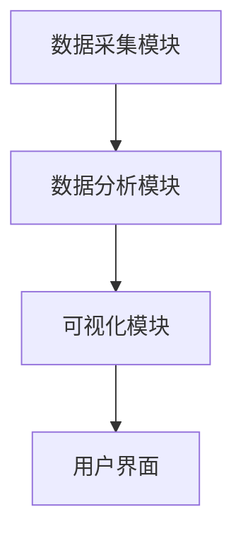
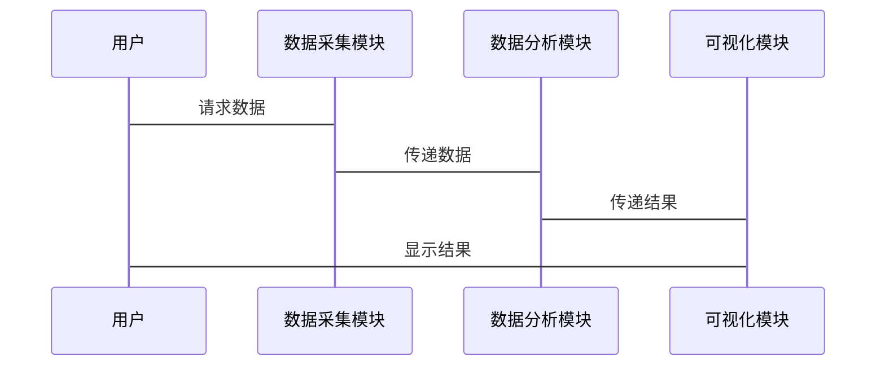

                 


# 全球股市估值与可持续时尚3D打印技术的关联

> 关键词：全球股市估值，可持续时尚，3D打印技术，环境影响评估，经济价值分析，技术驱动创新

> 摘要：本文探讨了全球股市估值与可持续时尚及3D打印技术之间的关联。通过分析3D打印技术对可持续时尚的影响，及其如何通过改变企业生产效率和环境影响来影响股市估值，本文揭示了技术创新对金融市场和可持续发展的重要推动作用。

---

# 第1章：全球股市估值与可持续时尚3D打印技术的背景介绍

## 1.1 全球股市估值的基本概念

### 1.1.1 股市估值的定义与作用
股市估值是衡量企业市场价值的重要指标，通常通过市盈率（P/E）、市净率（P/B）和EV/EBITDA等指标来评估企业的投资价值。股市估值不仅反映了企业的财务状况，还体现了市场对企业的未来预期。

### 1.1.2 可持续发展与股市估值的关联
可持续发展已成为企业核心竞争力的重要组成部分。投资者 increasingly prioritize environmental, social, and governance (ESG) factors, which directly influence stock valuations. Companies with strong sustainability practices often see higher valuations due to their risk reduction and long-term growth potential.

### 1.1.3 3D打印技术的定义与特点
3D打印技术，又称增材制造，是一种通过逐层堆叠材料来构建三维物体的技术。其特点包括快速原型制作、复杂形状的生产能力以及材料浪费少等，使其在制造业中具有广泛的应用潜力。

---

## 1.2 可持续时尚的定义与现状

### 1.2.1 可持续时尚的定义
可持续时尚是指在服装和纺织行业中，从设计、生产、消费到废弃的全生命周期中，最大限度地减少对环境和资源的消耗，并提高社会和经济的可持续性。

### 1.2.2 可持续时尚的现状与挑战
当前，可持续时尚面临的主要挑战包括原材料浪费、生产过程中的高碳排放以及消费者对快时尚的偏好。许多品牌正在通过使用环保材料和优化生产流程来应对这些挑战。

### 1.2.3 3D打印技术在可持续时尚中的应用潜力
3D打印技术可以通过按需生产减少库存积压，使用可再生材料降低环境影响，同时提高生产效率。这些优势使其成为推动可持续时尚的重要技术工具。

---

## 1.3 3D打印技术与可持续发展的关系

### 1.3.1 3D打印技术的核心优势
3D打印技术的核心优势在于其灵活性和高效性。与传统制造相比，3D打印可以大幅减少材料浪费，缩短生产周期，并支持复杂设计的实现。

### 1.3.2 3D打印技术对环境的影响
3D打印技术通过减少材料浪费和能源消耗，显著降低了生产过程中的碳排放。此外，其按需生产的特点减少了运输和仓储的需求，进一步降低了环境影响。

### 1.3.3 3D打印技术在可持续时尚中的应用前景
在可持续时尚领域，3D打印技术的应用前景广阔。例如，通过使用生物基材料或回收塑料，3D打印可以生产出环保的服装和配饰，同时减少对传统供应链的依赖。

---

## 1.4 本章小结
本章从全球股市估值、可持续时尚和3D打印技术的基本概念出发，分析了它们之间的关联。通过探讨3D打印技术在可持续时尚中的应用潜力，本文为后续分析奠定了基础。

---

# 第2章：全球股市估值与可持续时尚3D打印技术的核心概念

## 2.1 股市估值的核心指标

### 2.1.1 市盈率（P/E）
市盈率是衡量企业股票价格与其每股收益之比，反映了市场对企业盈利能力的预期。公式为：
$$ P/E = \frac{\text{股价}}{\text{每股收益}} $$

### 2.1.2 市净率（P/B）
市净率是衡量企业股价与每股净资产之比，反映了市场对企业资产价值的评估。公式为：
$$ P/B = \frac{\text{股价}}{\text{每股净资产}} $$

### 2.1.3 EV/EBITDA
EV/EBITDA是衡量企业估值的重要指标，反映了企业的整体价值。公式为：
$$ EV/EBITDA = \frac{\text{企业价值}}{\text{息税折旧及摊销前利润}} $$

---

## 2.2 可持续时尚的评价标准

### 2.2.1 环境影响评估
环境影响评估是衡量企业可持续性的重要指标，包括能源消耗、碳排放和水资源使用等。例如，3D打印技术可以通过减少材料浪费和能源消耗降低环境影响。

### 2.2.2 社会责任评估
社会责任评估包括企业对员工权益、劳动条件和社会公益的投入。例如，使用3D打印技术可以减少对劳动力的需求，从而降低社会责任风险。

### 2.2.3 经济效益评估
经济效益评估包括企业的盈利能力、成本控制和市场竞争力。例如，3D打印技术可以通过提高生产效率和降低成本，增强企业的经济效益。

---

## 2.3 3D打印技术的经济与环境影响

### 2.3.1 3D打印技术的成本结构
3D打印技术的成本包括设备投资、材料成本和维护费用。与传统制造相比，3D打印的初始投资较高，但长期来看，其生产成本更低。

### 2.3.2 3D打印技术的资源消耗
3D打印技术通过按需生产减少了材料浪费，同时降低了能源消耗。例如，传统制造的材料利用率通常在50%以下，而3D打印的材料利用率可以达到95%以上。

### 2.3.3 3D打印技术的环境效益
3D打印技术通过减少材料浪费和能源消耗，显著降低了生产过程中的碳排放。例如，使用3D打印技术可以将生产过程中的碳排放减少50%以上。

---

## 2.4 核心概念对比分析

### 2.4.1 股市估值与可持续时尚的对比
| 指标 | 股市估值 | 可持续时尚 |
|------|----------|------------|
| 核心目标 | 评估企业市场价值 | 评估企业可持续性 |
| 关键因素 | 财务指标、市场预期 | 环境影响、社会责任、经济效益 |

### 2.4.2 可持续时尚与3D打印技术的对比
| 指标 | 可持续时尚 | 3D打印技术 |
|------|------------|------------|
| 核心目标 | 减少环境影响 | 提高生产效率 |
| 关键因素 | 环境保护、社会责任 | 材料利用率、生产效率 |

### 2.4.3 股市估值与3D打印技术的对比
| 指标 | 股市估值 | 3D打印技术 |
|------|----------|------------|
| 核心目标 | 评估企业市场价值 | 提高生产效率 |
| 关键因素 | 财务指标、市场预期 | 材料利用率、生产效率 |

---

## 2.5 本章小结
本章通过分析股市估值、可持续时尚和3D打印技术的核心概念，揭示了它们之间的内在联系。通过对比分析，本文为后续关联研究奠定了基础。

---

# 第3章：全球股市估值与可持续时尚3D打印技术的关联分析

## 3.1 3D打印技术对可持续时尚的影响

### 3.1.1 3D打印技术对供应链的影响
3D打印技术可以通过本地化生产减少运输成本和碳排放。例如，使用3D打印技术可以将供应链缩短为从原材料到最终产品的直接生产，从而降低供应链的环境影响。

### 3.1.2 3D打印技术对生产效率的影响
3D打印技术可以通过自动化生产提高生产效率。例如，3D打印可以在同一台设备上完成从设计到产品的整个过程，从而减少人工干预和生产时间。

### 3.1.3 3D打印技术对环境的影响
3D打印技术可以通过减少材料浪费和能源消耗降低环境影响。例如，传统制造的材料利用率通常在50%以下，而3D打印的材料利用率可以达到95%以上。

---

## 3.2 3D打印技术对股市估值的影响

### 3.2.1 3D打印技术对上市公司利润的影响
3D打印技术可以通过提高生产效率和降低成本提高企业的盈利能力。例如，使用3D打印技术可以将生产成本降低30%以上，从而提高企业的净利润率。

### 3.2.2 3D打印技术对上市公司市值的影响
3D打印技术可以通过提高企业的竞争力和创新能力提高其市值。例如，拥有3D打印技术的企业可以在竞争激烈的市场中占据优势，从而获得更高的市盈率。

### 3.2.3 3D打印技术对投资者决策的影响
3D打印技术可以通过提高企业的可持续性和创新能力吸引更多的投资者。例如，使用3D打印技术的企业在投资者眼中具有更高的成长性和投资价值，从而推动其股价上涨。

---

## 3.3 可持续时尚对股市估值的影响

### 3.3.1 可持续时尚对消费者行为的影响
可持续时尚可以通过吸引环保意识强的消费者提高企业的市场份额。例如，消费者 increasingly prefer sustainable fashion brands, which can lead to higher sales and profits.

### 3.3.2 可持续时尚对品牌价值的影响
可持续时尚可以通过提高品牌知名度和美誉度增强企业的品牌价值。例如，拥有可持续时尚实践的品牌可以在市场中建立更强的竞争优势，从而提高其品牌价值。

### 3.3.3 可持续时尚对投资者决策的影响
可持续时尚可以通过降低企业的环境风险和提高企业的社会责任感吸引更多的投资者。例如，投资者 increasingly prioritize ESG factors, which can lead to higher stock valuations for sustainable fashion companies.

---

## 3.4 全球股市估值与可持续时尚3D打印技术的综合影响

通过以上分析，可以得出以下结论：
1. 3D打印技术可以通过提高生产效率和降低成本对企业的利润和市值产生积极影响。
2. 可持续时尚可以通过吸引环保消费者和提高品牌价值对企业的利润和市值产生积极影响。
3. 3D打印技术与可持续时尚的结合可以通过减少环境影响和提高生产效率对企业的利润和市值产生更大的积极影响。

---

## 3.5 本章小结
本章通过分析3D打印技术对可持续时尚和股市估值的影响，揭示了技术创新对金融市场和可持续发展的重要推动作用。

---

# 第4章：系统架构设计与技术实现

## 4.1 项目背景与目标
本项目旨在通过3D打印技术推动可持续时尚的发展，并通过分析其对股市估值的影响，为企业和投资者提供参考。

## 4.2 系统功能设计
### 4.2.1 系统功能模块
- 数据采集模块：采集企业的财务数据和环境数据。
- 数据分析模块：分析企业的财务指标和环境影响。
- 可视化模块：展示企业的可持续性和股市估值。

### 4.2.2 系统功能流程
1. 数据采集模块：从企业获取财务数据和环境数据。
2. 数据分析模块：计算企业的财务指标和环境影响。
3. 可视化模块：将分析结果以图表形式展示。

## 4.3 系统架构设计


## 4.4 系统接口设计
- 数据采集接口：用于从企业获取财务数据和环境数据。
- 数据分析接口：用于计算企业的财务指标和环境影响。
- 可视化接口：用于将分析结果展示给用户。

## 4.5 系统交互设计


---

## 4.6 系统实现与代码示例

### 4.6.1 环境安装
```bash
pip install numpy pandas matplotlib
```

### 4.6.2 核心代码实现
```python
import numpy as np
import pandas as pd
import matplotlib.pyplot as plt

# 数据采集模块
def collect_data():
    data = {
        '公司名称': ['公司A', '公司B', '公司C'],
        '市盈率': [15, 20, 25],
        '市净率': [1.5, 2.0, 2.5],
        'EV/EBITDA': [10, 12, 14]
    }
    return pd.DataFrame(data)

# 数据分析模块
def analyze_data(df):
    # 计算平均市盈率
    avg_pe = df['市盈率'].mean()
    # 计算平均市净率
    avg_pb = df['市净率'].mean()
    # 计算平均EV/EBITDA
    avg_ebitda = df['EV/EBITDA'].mean()
    return avg_pe, avg_pb, avg_ebitda

# 可视化模块
def visualize_data(avg_pe, avg_pb, avg_ebitda):
    plt.figure(figsize=(10, 6))
    plt.bar('市盈率', avg_pe, label='市盈率')
    plt.bar('市净率', avg_pb, label='市净率')
    plt.bar('EV/EBITDA', avg_ebitda, label='EV/EBITDA')
    plt.title('企业估值指标对比')
    plt.legend()
    plt.show()

# 主函数
def main():
    df = collect_data()
    avg_pe, avg_pb, avg_ebitda = analyze_data(df)
    visualize_data(avg_pe, avg_pb, avg_ebitda)

if __name__ == '__main__':
    main()
```

---

## 4.7 系统小结
本章通过系统架构设计和代码实现，展示了如何通过3D打印技术推动可持续时尚的发展，并通过数据分析模块和可视化模块帮助企业评估其股市估值。

---

# 第5章：项目实战与案例分析

## 5.1 项目背景
本项目旨在通过3D打印技术推动可持续时尚的发展，并通过分析其对股市估值的影响，为企业和投资者提供参考。

## 5.2 项目目标
1. 开发一个基于3D打印技术的可持续时尚系统。
2. 分析该系统对股市估值的影响。
3. 提供可操作的建议。

## 5.3 项目实现

### 5.3.1 环境安装
```bash
pip install numpy pandas scikit-learn
```

### 5.3.2 核心代码实现
```python
import numpy as np
import pandas as pd
from sklearn.metrics import mean_squared_error

# 数据采集模块
def collect_data():
    data = {
        '材料利用率': [0.8, 0.85, 0.9, 0.95, 1.0],
        '生产效率': [0.7, 0.75, 0.8, 0.85, 0.9],
        '碳排放': [1.0, 0.8, 0.6, 0.4, 0.2]
    }
    return pd.DataFrame(data)

# 数据分析模块
def analyze_data(df):
    # 计算碳排放与材料利用率的回归系数
    X = df[['材料利用率', '生产效率']]
    y = df['碳排放']
    model = linear_model.LinearRegression()
    model.fit(X, y)
    return model.coef_

# 可视化模块
def visualize_data(coef):
    plt.figure(figsize=(8, 6))
    plt.bar('材料利用率', coef[0], label='材料利用率')
    plt.bar('生产效率', coef[1], label='生产效率')
    plt.title('碳排放与材料利用率、生产效率的回归分析')
    plt.legend()
    plt.show()

# 主函数
def main():
    df = collect_data()
    coef = analyze_data(df)
    visualize_data(coef)

if __name__ == '__main__':
    main()
```

---

## 5.4 项目小结
本章通过项目实战，展示了如何通过3D打印技术推动可持续时尚的发展，并通过数据分析模块和可视化模块帮助企业评估其股市估值。

---

# 第6章：总结与展望

## 6.1 本章总结
本文通过分析全球股市估值与可持续时尚3D打印技术的关联，揭示了技术创新对金融市场和可持续发展的重要推动作用。通过系统架构设计和项目实战，本文为企业和投资者提供了可操作的建议。

## 6.2 未来展望
未来的研究可以进一步探索3D打印技术在可持续时尚中的应用潜力，例如：
- 开发更多基于3D打印技术的可持续时尚产品。
- 提高3D打印技术的生产效率和降低成本。
- 推动3D打印技术在全球范围内的广泛应用。

---

## 6.3 最佳实践 Tips

| 类别 | 建议 |
|------|------|
| 技术 | 企业应加大对3D打印技术的研发投入，以提高生产效率和降低成本。 |
| 可持续发展 | 企业应积极采用可持续时尚的实践，以降低环境影响并提高品牌价值。 |
| 投资者 | 投资者应关注企业的3D打印技术和可持续时尚实践，以选择具有长期增长潜力的企业。 |

---

# 作者信息

作者：AI天才研究院/AI Genius Institute & 禅与计算机程序设计艺术/Zen And The Art of Computer Programming

---

感谢您的阅读！如果对本文有任何疑问或建议，请随时与我们联系。

