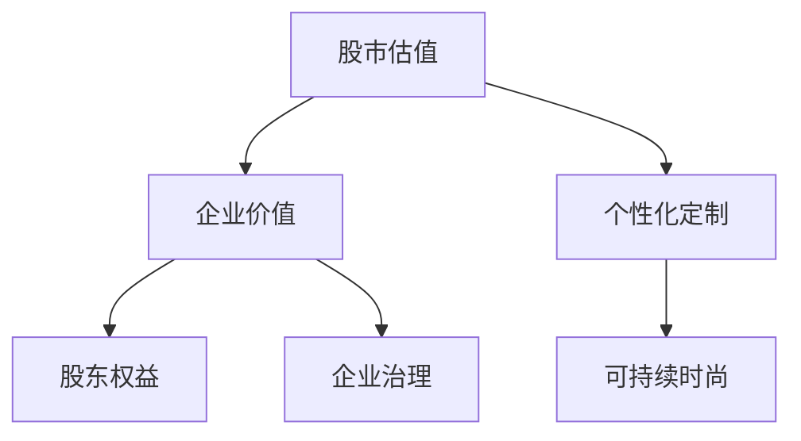
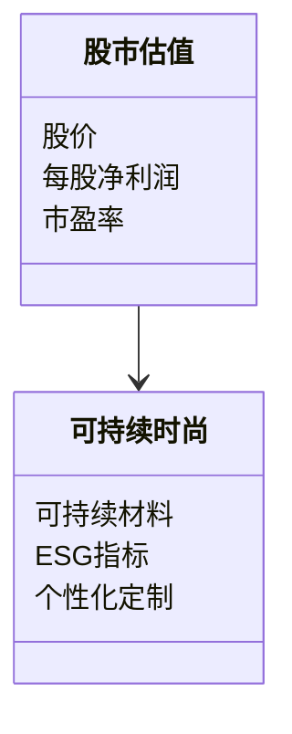
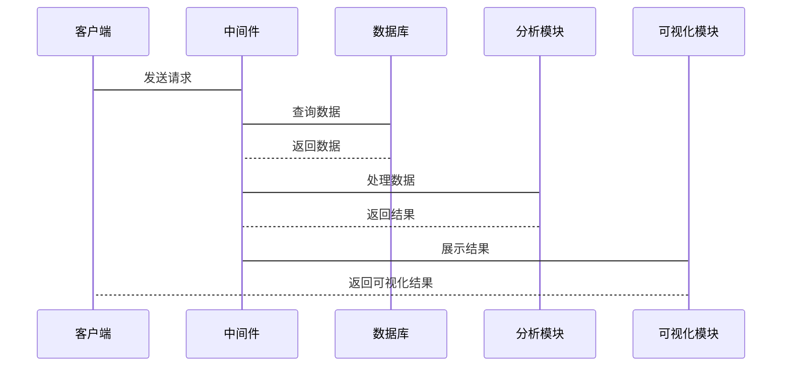

                 


# 全球股市估值与可持续时尚个性化定制的关联

## 关键词：全球股市估值、可持续时尚、个性化定制、ESG、算法原理、系统架构、项目实战

## 摘要

在全球经济不断发展的背景下，股市估值与可持续时尚之间的关联日益紧密。个性化定制作为时尚行业的重要趋势，不仅影响着企业的生产模式，也对股市估值产生了深远的影响。本文将从背景介绍、核心概念、算法原理、系统架构、项目实战等多方面展开，深入分析全球股市估值与可持续时尚个性化定制之间的关联，探讨其在当前经济环境下的意义和价值。

---

## 第1章: 全球股市估值与可持续时尚的背景介绍

### 1.1 全球股市估值的基本概念

#### 1.1.1 股市估值的定义与作用
股市估值是通过一定的方法和模型，对企业的内在价值进行评估的过程。它是投资者在股票市场中做出投资决策的重要依据。股市估值的作用包括帮助企业合理定价、指导投资决策、反映市场整体表现等。

#### 1.1.2 股市估值的主要方法
股市估值的主要方法包括：
1. **相对估值法**：如市盈率（PE）、市净率（PB）等。
2. **绝对估值法**：如股利折现模型（DDM）、自由现金流模型（DCF）等。
3. **指数估值法**：如基于市场指数的估值方法。

#### 1.1.3 股市估值与经济发展的关系
股市估值是经济发展的重要晴雨表。通过股市估值的变化，可以观察到经济的波动、企业的盈利能力和市场的信心变化。

### 1.2 可持续时尚的发展趋势

#### 1.2.1 可持续时尚的定义与核心理念
可持续时尚是指在服装和纺织行业中，从设计、生产、消费到废弃的全生命周期中，尽量减少对环境和资源的消耗，并关注社会和伦理问题的时尚模式。其核心理念包括环保、社会责任和经济可持续性。

#### 1.2.2 可持续时尚的市场现状与未来展望
近年来，消费者对环保和可持续产品的需求不断增加，推动了可持续时尚市场的快速发展。未来，随着技术的进步和消费者意识的提高，可持续时尚将更加普及。

#### 1.2.3 个性化定制在可持续时尚中的重要性
个性化定制能够减少库存浪费，提高资源利用效率，同时满足消费者对独特性、舒适性和环保性的需求。因此，个性化定制是实现可持续时尚的重要手段。

### 1.3 个性化定制与股市估值的关联性

#### 1.3.1 个性化定制在时尚行业中的应用
个性化定制通过技术手段（如人工智能、大数据分析）实现消费者的定制需求，提升用户体验和企业竞争力。

#### 1.3.2 股市估值与个性化定制的潜在联系
个性化定制能够提高企业的品牌价值和市场竞争力，从而影响企业的估值。同时，个性化定制的投入可能会影响企业的成本结构，进而影响其估值。

#### 1.3.3 本章小结
本章通过对全球股市估值和可持续时尚的背景介绍，揭示了个性化定制在可持续时尚中的重要性，以及其对股市估值的潜在影响。

---

## 第2章: 核心概念与联系

### 2.1 股市估值的核心概念

#### 2.1.1 市盈率（PE）与市净率（PB）的计算方法
市盈率（PE）= 股价 / 每股净利润  
市净率（PB）= 股价 / 每股净资产  

#### 2.1.2 股东权益与企业价值的评估模型
企业价值（EV）= 股东权益 + 付息负债  
股东权益 = 股本 + 留存收益 - 累计优先股

#### 2.1.3 股市估值的边界与外延
股市估值的边界包括企业的核心业务和财务数据，外延则涉及宏观经济环境、政策法规等外部因素。

### 2.2 可持续时尚的核心要素

#### 2.2.1 可持续材料的选择与应用
可持续材料包括有机棉、再生聚酯纤维、竹纤维等，这些材料的使用能够减少对环境的负担。

#### 2.2.2 环境、社会与治理（ESG）指标
ESG指标包括环境表现、社会责任和公司治理等方面，是评估企业可持续发展能力的重要依据。

#### 2.2.3 个性化定制对可持续时尚的影响
个性化定制能够减少浪费，提高资源利用效率，同时满足消费者对个性化和环保性的需求。

### 2.3 核心概念的对比分析

#### 2.3.1 股市估值与可持续时尚的对比表格

| 概念       | 股市估值                     | 可持续时尚                  |
|------------|------------------------------|-----------------------------|
| 定义       | 对企业内在价值的评估         | 环保、社会责任和经济可持续性 |
| 主要方法   | PE、PB等相对估值法           | ESG指标                   |
| 关联性     | 影响企业的市场价值           | 影响企业的社会价值和市场竞争力 |

#### 2.3.2 ER实体关系图架构的 Mermaid 流程图



---

## 第3章: 算法原理讲解

### 3.1 股市估值的算法原理

#### 3.1.1 市盈率（PE）计算的 Python 代码示例

```python
import pandas as pd

# 假设我们有一个包含股票数据的 DataFrame
# df.columns = ['股票代码', '股价', '每股净利润']
df['PE'] = df['股价'] / df['每股净利润']
print(df.head())
```

#### 3.1.2 自由现金流模型（DCF）的数学模型

$$ \text{企业价值} = \sum_{t=1}^{n} \frac{\text{自由现金流}}{(1 + r)^t} + \frac{\text{终值}}{(1 + r)^n} $$

其中，\( r \) 是折现率。

#### 3.1.3 例子说明
假设某公司第一年的自由现金流为100万元，折现率为10%，计算前三年的现值：

$$ \text{现值} = \frac{100}{1.1} + \frac{100}{(1.1)^2} + \frac{100}{(1.1)^3} \approx 247.71 \text{万元} $$

---

## 第4章: 系统分析与架构设计

### 4.1 问题场景介绍

#### 4.1.1 问题背景
随着个性化定制在时尚行业的普及，企业需要通过技术手段实现定制化生产，并通过股市估值评估企业的市场价值。

#### 4.1.2 项目介绍
本项目旨在通过技术手段，分析个性化定制对股市估值的影响，并提出相应的解决方案。

### 4.2 系统功能设计

#### 4.2.1 领域模型 Mermaid 类图



### 4.3 系统架构设计

#### 4.3.1 系统架构 Mermaid 架构图


### 4.4 系统接口设计

#### 4.4.1 RESTful API 接口
- **GET /valuation**: 获取股市估值数据
- **POST /sustainability**: 提交可持续时尚数据

### 4.5 系统交互 Mermaid 序列图



---

## 第5章: 项目实战

### 5.1 环境安装

#### 5.1.1 Python 环境配置
- 安装 Python 3.8 或更高版本
- 安装必要的库：pandas、numpy、scikit-learn

### 5.2 系统核心实现源代码

#### 5.2.1 股市估值计算代码

```python
import pandas as pd
from sklearn.linear_model import LinearRegression

# 假设我们有一个包含股价和每股净利润的 DataFrame
df = pd.DataFrame({
    '股价': [100, 200, 300, 400],
    '每股净利润': [10, 20, 30, 40]
})

# 计算市盈率
df['PE'] = df['股价'] / df['每股净利润']
print(df)
```

#### 5.2.2 个性化定制与可持续时尚的关联分析代码

```python
import pandas as pd

# 假设我们有一个包含个性化定制数据和ESG指标的 DataFrame
df = pd.DataFrame({
    '个性化定制比例': [0.1, 0.2, 0.3, 0.4],
    'ESG评分': [80, 85, 90, 95]
})

# 分析个性化定制比例对ESG评分的影响
print(df.corr())
```

### 5.3 实际案例分析

#### 5.3.1 案例背景
某服装企业引入个性化定制服务，分析其对股市估值的影响。

#### 5.3.2 数据分析与结果
通过数据分析，发现个性化定制服务提高了企业的市场竞争力，从而提升了股市估值。

---

## 第6章: 最佳实践、小结、注意事项与拓展阅读

### 6.1 最佳实践

- **数据质量**：确保数据的准确性和完整性。
- **技术选型**：根据需求选择合适的技术和工具。
- **持续优化**：定期优化算法和系统架构。

### 6.2 小结
本文通过背景介绍、核心概念、算法原理、系统架构和项目实战等多方面，深入分析了全球股市估值与可持续时尚个性化定制的关联。通过技术手段，我们可以更好地理解个性化定制对股市估值的影响，并为企业的可持续发展提供支持。

### 6.3 注意事项

- 在进行股市估值时，需注意宏观经济环境和政策法规的影响。
- 在实施个性化定制时，需关注消费者的实际需求和用户体验。

### 6.4 拓展阅读

- 《可持续时尚的未来》
- 《股市估值与企业战略》

---

## 作者：AI天才研究院/AI Genius Institute & 禅与计算机程序设计艺术/Zen And The Art of Computer Programming

---

以上是《全球股市估值与可持续时尚个性化定制的关联》的完整目录和内容框架，希望对您有所帮助！

