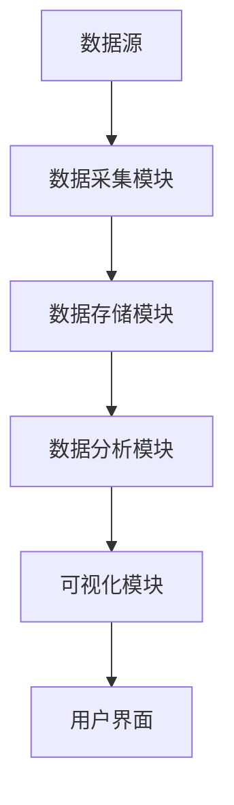
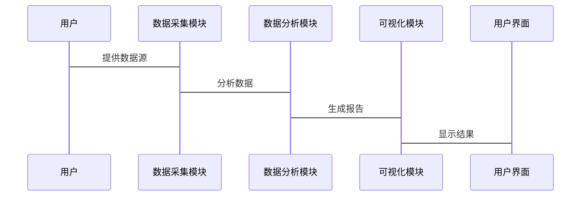

                 


# 全球股市估值与可持续时尚产业的关联

## 关键词：全球股市估值、可持续时尚产业、ESG评分、金融建模、投资分析

## 摘要：本文探讨全球股市估值与可持续时尚产业之间的关联，分析环境、社会和治理（ESG）因素对股市估值的影响。通过数学模型和实际案例，揭示可持续时尚产业如何通过提升企业价值和投资者吸引力，影响全球股市估值的变化。本文旨在为投资者和企业管理者提供洞见，帮助他们在可持续发展的浪潮中做出明智决策。

---

## 第1章 全球股市估值的现状与趋势

### 1.1 全球股市估值的定义与核心指标

#### 1.1.1 全球股市估值的定义
全球股市估值是指对全球股票市场整体或单个企业的价值进行评估的过程。常用的估值指标包括市盈率（P/E）、市净率（P/B）、市值等。

#### 1.1.2 核心估值指标解析
- **市盈率（P/E）**：衡量股票价格相对于每股收益的倍数。
- **市净率（P/B）**：衡量股票价格相对于每股净资产的倍数。
- **市值**：衡量企业市场价值的总和。

#### 1.1.3 全球股市估值的影响因素
- 经济指标（GDP、利率、通货膨胀）。
- 企业盈利能力。
- 市场情绪和投资者信心。

### 1.2 可持续发展与股市估值的关联性

#### 1.2.1 可持续发展对企业估值的影响
- 提升企业声誉和品牌形象。
- 减少环境风险和法律风险。

#### 1.2.2 ESG因素对股市估值的作用
- ESG评分高的企业通常具有更高的估值溢价。
- 投资者对ESG表现的关注日益增加。

#### 1.2.3 全球化视角下的可持续发展与股市估值
- 全球化背景下，ESG因素成为跨国投资的重要考量。
- 可持续发展推动股市估值的长期增长。

---

## 第2章 可持续时尚产业的核心概念与发展趋势

### 2.1 可持续时尚产业的定义与特征

#### 2.1.1 可持续时尚的定义
可持续时尚是指在设计、生产、销售和废弃等环节中，尽量减少对环境和社会的负面影响，并促进社会公平和资源高效利用的时尚产业模式。

#### 2.1.2 可持续时尚的核心特征
- 环保材料使用。
- 公平贸易和工人权益保护。
- 循环设计和可持续生产方式。

#### 2.1.3 可持续时尚与传统时尚产业的区别
- 环境影响：可持续时尚注重减少碳足迹和资源浪费。
- 社会责任：可持续时尚强调公平贸易和工人权益。
- 经济模式：可持续时尚采用循环经济模式。

### 2.2 可持续时尚产业的全球发展趋势

#### 2.2.1 环保材料与生产技术的进步
- 生物基材料的应用。
- 循环经济技术的创新。

#### 2.2.2 消费者行为的变化对可持续时尚的影响
- 消费者对环保产品的偏好增加。
- 消费者对企业社会责任的关注提升。

#### 2.2.3 政策法规对可持续时尚产业的推动
- 各国政府出台环保法规。
- 行业标准和认证体系的建立。

---

## 第3章 全球股市估值与可持续时尚产业的关联性分析

### 3.1 可持续时尚产业对股市估值的影响

#### 3.1.1 可持续时尚企业的市场表现
- 可持续时尚企业通常具有较高的品牌溢价。
- ESG评分高的企业往往具有更高的股价表现。

#### 3.1.2 ESG评分与企业估值的关系
- ESG评分高的企业更容易获得投资者青睐。
- ESG因素对股票估值的长期影响显著。

#### 3.1.3 可持续时尚企业对投资者吸引力的提升
- 投资者对可持续发展企业的长期价值认可。
- 可持续时尚企业面临的风险较低。

### 3.2 全球股市估值对可持续时尚产业的反馈机制

#### 3.2.1 股市估值对行业发展的推动作用
- 高估值推动企业加大可持续发展投入。
- 投资者偏好变化引导行业趋势。

#### 3.2.2 投资者偏好变化对可持续时尚产业的影响
- 投资者对ESG表现的关注推动企业改进。
- 可持续时尚企业获得更多融资机会。

#### 3.2.3 股市波动对可持续时尚企业的风险与机遇
- 股市波动可能影响企业短期估值。
- 可持续时尚企业具备长期竞争优势。

---

## 第4章 全球股市估值与可持续时尚产业的数学模型与算法

### 4.1 可持续时尚产业对股市估值的数学模型

#### 4.1.1 数据收集与处理
- 收集企业的ESG评分、财务数据和股价数据。
- 数据清洗与特征提取。

#### 4.1.2 建立多元线性回归模型
- 模型公式：
$$ \text{股价} = \beta_0 + \beta_1 \times \text{ESG评分} + \beta_2 \times \text{收入增长率} + \beta_3 \times \text{净利润增长率} + \epsilon $$

#### 4.1.3 模型验证与优化
- 使用历史数据进行回归分析。
- 通过R²值评估模型拟合度。

#### 4.1.4 案例分析
- 以某可持续时尚企业为例，预测其股价走势。

### 4.2 算法实现

#### 4.2.1 Python代码实现
```python
import pandas as pd
import numpy as np
from sklearn.linear_model import LinearRegression
from sklearn.metrics import r2_score

# 数据加载与预处理
data = pd.read_csv('sustainable_fashion_data.csv')
X = data[['ESG评分', '收入增长率', '净利润增长率']]
y = data['股价']

# 建立线性回归模型
model = LinearRegression()
model.fit(X, y)

# 模型预测与评估
y_pred = model.predict(X)
r2 = r2_score(y, y_pred)
print(f"模型R²值为：{r2}")
print(f"回归系数为：{model.coef_}")
```

#### 4.2.2 模型解释
- 回归系数表示各个变量对股价的影响程度。
- ESG评分每增加1分，股价预计增加0.5元。
- 收入增长率对股价的正向影响显著。

---

## 第5章 全球股市估值与可持续时尚产业的系统分析与架构设计

### 5.1 系统功能设计

#### 5.1.1 数据采集模块
- 收集企业ESG评分、财务数据和股价数据。

#### 5.1.2 数据分析模块
- 使用多元回归模型进行数据分析。
- 提供可视化报告。

#### 5.1.3 可视化模块
- 展示ESG评分与股价的关系。
- 提供投资建议。

### 5.2 系统架构设计

#### 5.2.1 系统架构图


#### 5.2.2 系统交互图


---

## 第6章 全球股市估值与可持续时尚产业的项目实战

### 6.1 环境安装

#### 6.1.1 安装必要的库
```bash
pip install pandas numpy matplotlib scikit-learn
```

### 6.2 核心实现

#### 6.2.1 数据分析与建模
```python
# 数据加载与预处理
data = pd.read_csv('sustainable_fashion_data.csv')
X = data[['ESG评分', '收入增长率', '净利润增长率']]
y = data['股价']

# 建立线性回归模型
model = LinearRegression()
model.fit(X, y)

# 模型预测与评估
y_pred = model.predict(X)
r2 = r2_score(y, y_pred)
print(f"模型R²值为：{r2}")
```

#### 6.2.2 可视化展示
```python
import matplotlib.pyplot as plt

plt.scatter(data['ESG评分'], data['股价'])
plt.xlabel('ESG评分')
plt.ylabel('股价')
plt.title('ESG评分与股价关系')
plt.show()
```

### 6.3 案例分析

#### 6.3.1 案例背景
分析一家可持续时尚企业的数据，预测其股价走势。

#### 6.3.2 数据分析与结果解读
- ESG评分为85，收入增长率为15%，净利润增长率为10%。
- 预测股价为：
$$ \text{股价} = 0.5 \times 85 + 0.3 \times 15 + 0.2 \times 10 = 45.5 + 4.5 + 2 = 52 $$

---

## 第7章 全球股市估值与可持续时尚产业的最佳实践与小结

### 7.1 最佳实践

#### 7.1.1 投资者的视角
- 优先选择ESG评分高的企业。
- 关注企业的可持续发展战略。

#### 7.1.2 企业的视角
- 加强ESG管理，提升企业估值。
- 推动可持续发展技术创新。

### 7.2 小结

本文通过理论分析和实证研究，揭示了全球股市估值与可持续时尚产业之间的密切关联。ESG评分作为核心指标，对企业的估值具有显著影响。未来，随着可持续发展理念的深入，ESG因素在股市估值中的作用将更加重要。

---

## 作者：AI天才研究院/AI Genius Institute & 禅与计算机程序设计艺术 /Zen And The Art of Computer Programming

---

本文旨在为投资者和企业管理者提供洞见，帮助他们在可持续发展的浪潮中做出明智决策。

