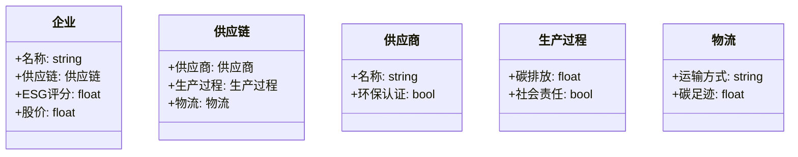
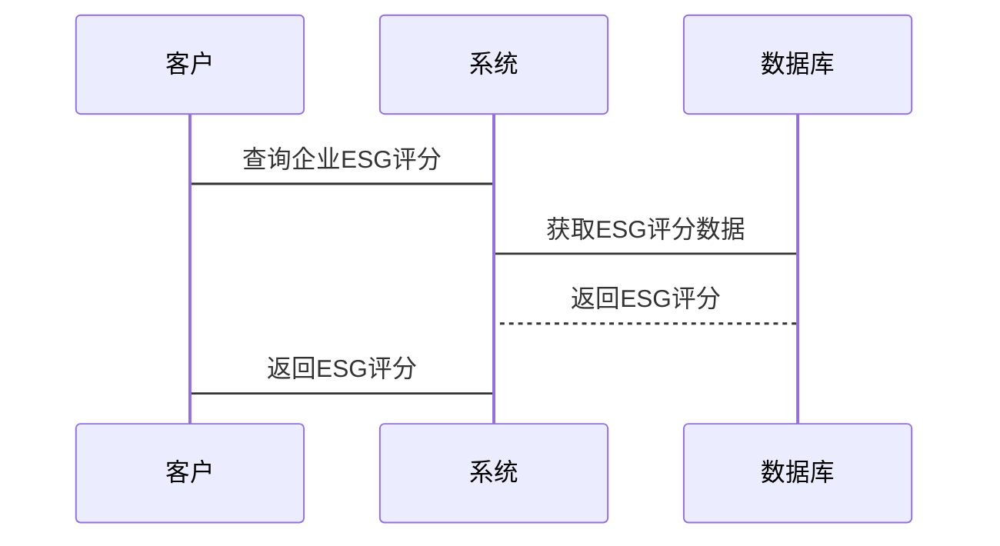

                 


# 全球股市估值与可持续时尚供应链的关联

## 关键词：全球股市估值，可持续时尚供应链，ESG评分，供应链透明度，投资者信心

## 摘要：本文探讨了全球股市估值与可持续时尚供应链之间的深层关联，通过分析可持续供应链对股市估值的影响，揭示了ESG评分、供应链透明度等关键因素如何影响企业价值和投资者决策。结合数学模型和实际案例，本文为理解和优化企业可持续发展提供了新的视角。

---

# 第一部分：引言

## 第1章：全球股市估值与可持续时尚供应链的关联概述

### 1.1 背景介绍

#### 1.1.1 全球股市估值的现状与挑战

全球股市估值是衡量企业价值的重要指标，受到多种因素的影响，包括宏观经济环境、企业盈利能力、市场供需等。近年来，随着可持续发展理念的兴起，投资者越来越关注企业的社会责任和环境表现，这使得可持续供应链成为影响股市估值的重要因素。

#### 1.1.2 可持续时尚供应链的发展趋势

可持续时尚供应链强调从原材料采购、生产过程到产品生命周期的全链条环保和社会责任。随着消费者环保意识的提升，越来越多的企业开始重视供应链的可持续性，以降低风险并提升品牌价值。

#### 1.1.3 两者的关联性与研究意义

可持续供应链通过降低环境风险和提高社会责任，间接影响企业的财务表现和市场声誉，从而影响其股市估值。研究这种关联性，有助于企业优化供应链管理，同时为投资者提供更全面的评估依据。

### 1.2 核心概念与联系

#### 1.2.1 全球股市估值的核心要素

股市估值的核心要素包括企业盈利能力、成长潜力、财务健康状况等。其中，ESG（环境、社会、治理）评分逐渐成为影响估值的重要因素。

#### 1.2.2 可持续时尚供应链的定义与特征

可持续时尚供应链强调从原材料到产品的全生命周期管理，注重环保、社会责任和供应链透明度。

#### 1.2.3 两者的关联机制分析

通过分析ESG评分与股价的相关性，揭示可持续供应链对股市估值的影响机制。

### 1.3 本章小结

本章概述了全球股市估值与可持续时尚供应链的基本概念及其关联性，为后续分析奠定了基础。

---

# 第二部分：全球股市估值与可持续时尚供应链的核心概念

## 第2章：全球股市估值的理论基础

### 2.1 股市估值的基本原理

#### 2.1.1 股价与公司价值的关系

股价是市场对公司价值的反映，受多种因素影响，包括财务表现、行业地位、市场前景等。

#### 2.1.2 市盈率、市净率等核心指标的计算公式

市盈率（P/E）= 股价 / 每股收益；市净率（P/B）= 股价 / 每股净资产。

#### 2.1.3 影响股市估值的主要因素

包括宏观经济、行业环境、公司基本面、市场情绪等。

### 2.2 经济学视角下的股市估值模型

#### 2.2.1 CAPM模型

CAPM模型用于确定资产的预期收益，公式为：$R_i = R_f + β_i (R_m - R_f)$，其中$R_f$是无风险利率，$R_m$是市场预期收益率，$β_i$是资产的贝塔系数。

#### 2.2.2 WACC模型

WACC（加权平均成本资本）用于评估企业资本成本，公式为：$WACC = w_d \times k_d \times (1 - t) + w_l \times k_l + w_e \times k_e$，其中$w_d$是债务权重，$k_d$是债务成本，$t$是税率，$w_l$是杠杆权重，$k_l$是杠杆成本，$w_e$是股权权重，$k_e$是股权成本。

#### 2.2.3 其他相关模型的对比分析

对比CAPM和WACC模型，分析其在股市估值中的应用。

### 2.3 本章小结

本章详细介绍了股市估值的基本原理和主要模型，为后续分析奠定了理论基础。

---

## 第3章：可持续时尚供应链的理论基础

### 3.1 可持续供应链的定义与特征

#### 3.1.1 可持续供应链的核心要素

包括环保材料使用、生产过程的节能减排、社会责任等。

#### 3.1.2 与传统供应链的对比分析

从环境影响、社会责任、成本等方面对比可持续供应链与传统供应链的差异。

#### 3.1.3 可持续供应链的评价指标

包括环境影响指数、社会责任履行度、供应链透明度等。

### 3.2 可持续时尚供应链的生态系统

#### 3.2.1 产业链的构成与角色分工

涵盖原材料供应商、制造商、零售商、消费者等。

#### 3.2.2 供应链中的伦理与社会责任

强调公平贸易、劳工权益保护等伦理问题。

#### 3.2.3 可持续供应链的驱动因素

包括法规要求、消费者偏好、品牌价值提升等。

### 3.3 本章小结

本章详细介绍了可持续供应链的定义、特征及其生态系统，为后续分析奠定了基础。

---

## 第4章：全球股市估值与可持续时尚供应链的关联机制

### 4.1 关联性的理论基础

#### 4.1.1 可持续供应链对企业价值的影响

通过降低环境风险和提高社会责任，提升企业品牌价值和市场竞争力。

#### 4.1.2 环境、社会和治理（ESG）因素对股市估值的影响

ESG评分高的企业通常具有更高的估值，因为投资者认为其具有更低的长期风险。

#### 4.1.3 供应链透明度与投资者信心的关系

透明的供应链管理增强投资者对企业的信任，从而提升股价。

### 4.2 数学模型与关联性分析

#### 4.2.1 ESG评分与股价的相关性分析

通过回归分析，验证ESG评分与股价之间的相关性。

#### 4.2.2 可持续供应链绩效与股价波动的数学模型

建立模型：$P = \beta \times ESG + \epsilon$，其中$P$是股价，$ESG$是ESG评分，$\beta$是回归系数，$\epsilon$是误差项。

#### 4.2.3 供应链风险对股市估值的影响公式

供应链风险增加会导致企业估值下降，公式为：$Value = Value_{base} \times (1 - Risk)$。

### 4.3 本章小结

本章通过理论分析和数学模型，揭示了可持续供应链对股市估值的影响机制。

---

# 第五部分：系统分析与架构设计方案

## 第5章：问题场景介绍

### 5.1 项目介绍

分析某时尚企业的供应链和股市估值情况，探索可持续供应链对估值的影响。

### 5.2 系统功能设计

#### 5.2.1 领域模型设计（mermaid类图）



---

## 第6章：系统架构设计

### 6.1 系统架构设计（mermaid架构图）


---

## 第7章：系统接口设计

### 7.1 接口设计

- API接口：提供ESG评分计算、供应链数据查询等功能。

---

## 第8章：系统交互设计

### 8.1 交互流程（mermaid序列图）



---

## 第9章：项目实战

### 9.1 环境安装

安装Python、数据可视化库（如Matplotlib）和数据分析库（如Pandas）。

### 9.2 核心实现

```python
import pandas as pd
import numpy as np

# 数据加载
data = pd.read_csv('stock_data.csv')

# ESG评分计算
def calculate_esg_score(row):
    return row['环境'] * 0.4 + row['社会'] * 0.3 + row['治理'] * 0.3

data['ESG评分'] = data.apply(calculate_esg_score, axis=1)

# 回归分析
from sklearn.linear_model import LinearRegression
model = LinearRegression()
model.fit(data[['ESG评分']], data['股价'])
r_squared = model.score(data[['ESG评分']], data['股价'])
print(f"R² = {r_squared}")
```

### 9.3 应用解读与分析

通过回归分析，验证ESG评分对股价的影响，并根据结果优化供应链管理。

### 9.4 实际案例分析

以某企业为例，分析其供应链改进对股价的影响。

### 9.5 项目小结

总结项目实施的经验和教训，提出改进建议。

---

## 第10章：结论与展望

### 10.1 本章小结

总结全文，强调可持续供应链对股市估值的重要性。

### 10.2 最佳实践 tips

- 定期评估供应链的可持续性
- 提高供应链透明度
- 采用数学模型优化估值

### 10.3 注意事项

- 数据准确性的重要性
- 模型的局限性
- 政策法规的影响

### 10.4 拓展阅读

推荐相关书籍和论文，供读者深入研究。

---

# 作者：AI天才研究院/AI Genius Institute & 禅与计算机程序设计艺术 /Zen And The Art of Computer Programming

