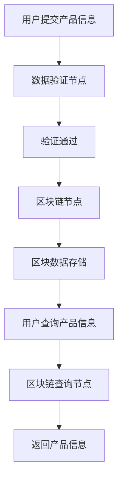
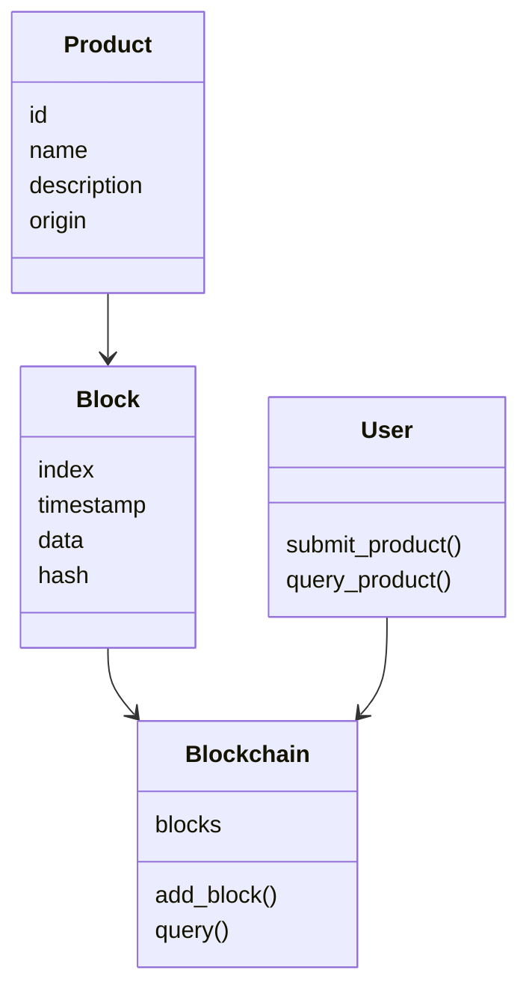
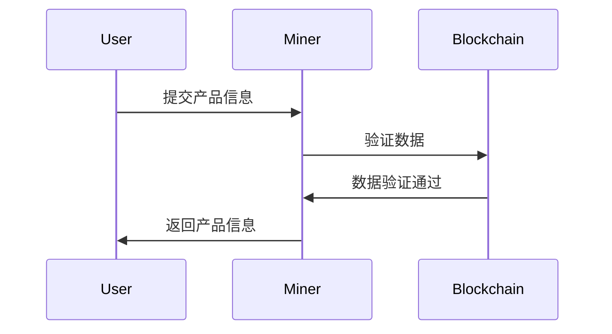

                 


# 全球股市估值与可持续时尚区块链溯源的关联

## 关键词：全球股市估值，可持续时尚，区块链，溯源，投资决策，供应链管理

## 摘要：  
本文探讨了全球股市估值与可持续时尚之间的关联，分析了区块链技术在时尚供应链中的溯源应用及其对股市估值的影响。通过详细阐述区块链技术的核心原理、算法实现和系统架构，本文揭示了区块链如何提升时尚产业的透明度和信任度，进而影响企业的市场估值和投资决策。

---

# 第一部分: 全球股市估值与可持续时尚的背景与关联

## 第1章: 全球股市估值的背景与现状

### 1.1 股票市场估值的基本概念

#### 1.1.1 股票市场的基本定义
股票市场是企业通过发行股票筹集资金的场所，股票价格反映了市场对企业的估值。股市估值的核心是通过财务指标（如市盈率、市净率）和市场情绪来评估企业的内在价值。

#### 1.1.2 市场估值的主要指标
- **市盈率（P/E）**：股价与每股净利润的比值，反映市场对企业盈利能力的预期。
- **市净率（P/B）**：股价与每股净资产的比值，适用于评估资产密集型企业。
- **EV（企业价值）**：公司整体价值的度量，包括股权和债务。

#### 1.1.3 全球股市的分布与特点
全球股市分布呈现多元化，美国股市占据主导地位，新兴市场（如中国、印度）增长迅速。股市估值受宏观经济、行业趋势和企业基本面的影响。

---

### 1.2 可持续投资的兴起

#### 1.2.1 可持续投资的定义与特征
可持续投资注重企业的环境、社会和治理（ESG）表现，强调长期价值创造，而非短期收益。

#### 1.2.2 可持续投资的市场现状
全球可持续投资规模持续增长，投资者 increasingly将ESG因素纳入决策。

#### 1.2.3 可持续投资对股市估值的影响
ESG表现优秀的企业通常享有更高的估值溢价，因为它们的风险更低，长期盈利能力更强。

---

## 第2章: 可持续时尚的背景与发展

### 2.1 时尚产业的现状与问题

#### 2.1.1 时尚产业的规模与结构
时尚产业是全球最大的制造业之一，涵盖服装、鞋类、配饰等多个领域，市场规模庞大。

#### 2.1.2 产业面临的环境与社会挑战
- **环境问题**：快时尚导致资源浪费和环境污染。
- **社会问题**：供应链中的劳工权益问题。

#### 2.1.3 可持续时尚的定义与目标
可持续时尚强调减少环境影响，保障劳工权益，推动循环经济。

---

### 2.2 区块链技术在时尚产业中的应用潜力

#### 2.2.1 区块链技术的基本原理
区块链通过去中心化、不可篡改的特性，实现数据的安全性和透明性。

#### 2.2.2 区块链在溯源中的应用
- **产品溯源**：记录原材料来源、生产过程，确保产品真实性。
- **供应链管理**：优化库存管理，提高效率。

#### 2.2.3 区块链在供应链管理中的作用
区块链技术可以消除信息不对称，提升供应链的透明度和信任度。

---

## 第3章: 全球股市估值与可持续时尚的关联

### 3.1 可持续时尚对股市估值的影响

#### 3.1.1 可持续发展对品牌价值的影响
- 优秀的ESG表现提升品牌声誉，增强消费者忠诚度。

#### 3.1.2 环保与社会责任对投资决策的影响
投资者 increasingly将ESG因素纳入决策，导致ESG表现优秀的企业估值上升。

#### 3.1.3 可持续时尚企业的市场表现分析
数据表明，可持续时尚企业通常具有更高的股价表现和估值溢价。

---

### 3.2 区块链技术如何连接股市估值与可持续时尚

#### 3.2.1 区块链在时尚供应链中的应用
通过区块链实现产品溯源，增强消费者信任，提升品牌价值。

#### 3.2.2 区块链如何提升企业透明度与信任度
- 提供真实的产品信息，增强消费者信任。
- 优化供应链管理，降低运营成本。

#### 3.2.3 区块链对股市估值的潜在影响
- 提高企业的透明度和信任度，提升市场估值。
- 优化企业运营效率，增强盈利能力。

---

# 第二部分: 区块链溯源技术的核心原理与实现

## 第4章: 区块链技术的核心原理

### 4.1 区块链的基本概念与技术特征

#### 4.1.1 区块链的定义与核心要素
- **去中心化**：无须依赖中心机构，数据分布存储。
- **不可篡改性**：数据一旦记录，无法修改。

#### 4.1.2 区块链的去中心化特点
通过分布式账本实现数据的去中心化存储，确保数据的安全性和一致性。

#### 4.1.3 区块链的安全性与不可篡改性
通过密码学算法和共识机制，确保数据的安全性和不可篡改性。

---

### 4.2 区块链的共识机制与激励模型

#### 4.2.1 共识机制的种类与特点
- **工作量证明（PoW）**：比特币采用的机制，通过计算能力决定记账权。
- **权益证明（PoS）**：以太坊采用的机制，通过持有代币数量决定记账权。

#### 4.2.2 激励模型的数学表达与分析
激励模型通常通过代币奖励机制激励节点参与，确保系统正常运行。

#### 4.2.3 共识机制对系统性能的影响
共识机制的选择直接影响系统的交易速度、能耗和安全性。

---

## 第5章: 区块链溯源系统的算法原理

### 5.1 区块链溯源的算法流程

#### 5.1.1 数据录入与验证过程
- 数据录入：将产品信息（如原材料来源、生产日期）写入区块链。
- 数据验证：通过共识机制验证数据的合法性。

#### 5.1.2 数据存储与查询过程
- 数据存储：将验证后的数据以区块形式存储在区块链上。
- 数据查询：通过区块链查询产品信息，确保信息真实可靠。

---

### 5.2 区块链溯源的算法实现

#### 5.2.1 数据录入与验证的代码实现
```python
def add_transaction(blockchain, data):
    # 数据验证
    if not is_valid(data):
        raise ValueError("Invalid data")
    # 数据录入
    blockchain.add_block(data)
```

#### 5.2.2 数据存储与查询的代码实现
```python
def query_data(blockchain, product_id):
    # 查询区块链中与product_id相关的历史记录
    for block in blockchain.blocks:
        if product_id in block.data:
            return block.data[product_id]
    return None
```

---

## 第6章: 区块链溯源系统的算法流程图



---

# 第三部分: 系统分析与架构设计方案

## 第7章: 问题场景介绍

### 7.1 问题背景
- 时尚产业供应链复杂，信息不透明，导致消费者信任度低。
- 企业难以证明其可持续性，影响市场估值。

### 7.2 项目介绍
开发一个基于区块链的时尚产品溯源系统，提升供应链透明度，增强消费者信任。

---

## 第8章: 系统功能设计

### 8.1 领域模型（Mermaid类图）



---

### 8.2 系统架构设计（Mermaid架构图）

```mermaid
rectangle Database {
    Blockchain节点
}
rectangle User {
    提交产品信息
}
rectangle Miner {
    验证交易
}
rectangle Network {
    传输数据
}
Database --> Miner
User --> Network
Miner --> Database
```

---

### 8.3 系统接口设计
- **提交接口**：用户提交产品信息，系统验证后存入区块链。
- **查询接口**：用户查询产品信息，系统返回区块链数据。

---

### 8.4 系统交互（Mermaid序列图）



---

# 第四部分: 项目实战

## 第9章: 环境安装与核心实现

### 9.1 环境安装
- **Python环境**：安装Python 3.8及以上版本。
- **区块链框架**：使用Ethereum的Solidity编写智能合约，或使用fabric等工具。

---

### 9.2 核心代码实现

#### 9.2.1 数据录入与验证
```python
def add_product(blockchain, product_info):
    # 验证产品信息
    if not validate_product(product_info):
        raise ValueError("Invalid product information")
    # 将产品信息写入区块链
    blockchain.add_product(product_info)
```

#### 9.2.2 数据查询
```python
def get_product_info(blockchain, product_id):
    # 查询区块链中的产品信息
    product_info = blockchain.query_product(product_id)
    return product_info
```

---

## 第10章: 案例分析与实际应用

### 10.1 案例分析
- 某服装企业通过区块链记录每件产品的生产信息，消费者可通过扫码查询产品信息，提升品牌信任度，进而提升企业估值。

---

### 10.2 代码应用解读与分析
- 通过代码实现产品信息的录入、验证和查询，展示区块链技术在实际中的应用。

---

## 第11章: 项目小结

### 11.1 项目总结
通过区块链技术实现时尚产品的溯源，提升供应链透明度，增强消费者信任，进而提升企业的市场估值。

---

# 第五部分: 最佳实践与总结

## 第12章: 最佳实践与总结

### 12.1 最佳实践 tips
- 在选择区块链技术时，需根据具体需求选择合适的共识机制。
- 数据录入和查询需确保高效性，优化系统性能。

---

### 12.2 小结
本文通过分析全球股市估值与可持续时尚的关联，展示了区块链技术在时尚供应链中的应用潜力，为企业的可持续发展提供了新的思路。

---

### 12.3 注意事项
- 区块链技术的应用需考虑成本和性能问题。
- 数据隐私和安全问题需高度重视。

---

### 12.4 拓展阅读
- 推荐阅读《区块链：新经济的蓝图》、《可持续时尚：供应链管理与技术创新》。

---

作者：AI天才研究院/AI Genius Institute & 禅与计算机程序设计艺术/Zen And The Art of Computer Programming

