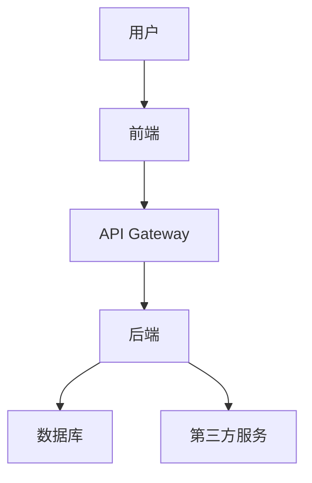

                 


# 全球股市估值与可持续时尚智能供应链的关联

> 关键词：全球股市估值，可持续时尚，智能供应链，算法模型，系统架构

> 摘要：本文深入探讨了全球股市估值与可持续时尚智能供应链之间的关联。通过分析全球股市估值的核心要素、可持续时尚的定义与发展趋势，以及智能供应链的关键技术与优势，本文构建了股市估值与供应链效率的关联模型，并提出了基于智能技术的股市估值预测算法。文章还结合实际案例，详细阐述了智能供应链系统的构建与优化策略，为读者提供了全面的理论与实践参考。

---

# 第1章: 全球股市估值的背景与概念

## 1.1 全球股市估值的定义与意义

### 1.1.1 股市估值的基本概念

股市估值是指通过对企业的财务数据、市场环境和行业趋势进行分析，估算企业股票的合理价格范围。其核心在于将企业的内在价值与市场表现相结合，为投资者提供决策依据。

$$ \text{市盈率} = \frac{\text{股票价格}}{\text{每股收益}} $$

$$ \text{市净率} = \frac{\text{股票价格}}{\text{每股净资产}} $$

### 1.1.2 全球化视角下的股市估值特点

全球化背景下，股市估值受到宏观经济环境、国际贸易政策、汇率波动等多种因素的影响。跨国企业的全球化布局使得股市估值的复杂性显著增加，但同时也为投资者提供了更多机会。

### 1.1.3 股市估值对经济的影响

股市估值不仅是企业价值的体现，也是经济运行的晴雨表。合理的股市估值能够引导资金流向高效率的企业，促进经济结构优化和产业升级。

---

## 1.2 可持续时尚的定义与发展趋势

### 1.2.1 可持续时尚的定义

可持续时尚强调在服装生产和消费过程中，最大限度地减少对环境和资源的消耗，同时关注社会责任和员工福利。其核心在于实现经济、社会和环境的协调发展。

### 1.2.2 可持续时尚的发展趋势

随着消费者环保意识的增强和政策法规的完善，可持续时尚正逐渐成为行业主流。企业通过采用绿色生产、循环经济等模式，提升品牌价值和市场竞争力。

### 1.2.3 可持续时尚对供应链的影响

可持续时尚要求供应链各环节实现绿色化、智能化和协同化。通过优化供应链管理，企业能够降低生产成本，提高运营效率，同时减少环境负担。

---

## 1.3 智能供应链的核心概念

### 1.3.1 传统供应链与智能供应链的对比

| 特性 | 传统供应链 | 智能供应链 |
|------|------------|------------|
| 数据驱动 | 依赖人工经验 | 依赖大数据分析 |
| 反应速度 | 较慢 | 快速响应 |
| 资源利用率 | 较低 | 高效利用 |

### 1.3.2 智能供应链的关键技术

智能供应链的核心技术包括大数据分析、人工智能、物联网、区块链等。这些技术能够实现供应链的智能化管理，提升预测准确性和运营效率。

### 1.3.3 智能供应链的优势与挑战

智能供应链的优势在于能够实时监控供应链各环节，快速响应市场变化。其挑战在于数据隐私、技术成本和人才储备等问题。

---

## 1.4 本章小结

本章从全球股市估值的基本概念出发，分析了可持续时尚的发展趋势及其对供应链的影响，并详细阐述了智能供应链的核心概念与技术优势。为后续章节的关联分析奠定了基础。

---

# 第2章: 全球股市估值与可持续时尚智能供应链的关联机制

## 2.1 股市估值与供应链效率的关系

### 2.1.1 供应链效率对股价的影响

供应链效率直接影响企业的生产成本和交货速度。高效的供应链能够降低企业成本，提高客户满意度，从而提升股价表现。

### 2.1.2 股市估值对供应链优化的反馈作用

股市估值为投资者提供了企业价值的参考，同时也对企业的供应链优化形成反馈机制。良好的供应链表现能够提升企业的市场形象，进而推动股价上涨。

---

## 2.2 可持续时尚对供应链价值的影响

### 2.2.1 可持续时尚对品牌价值的提升

通过采用可持续生产模式，企业能够提升品牌形象，增强消费者的忠诚度。这不仅有助于提高市场份额，还能推动股价上涨。

### 2.2.2 可持续供应链对成本的优化

可持续供应链通过减少资源消耗和环境污染，降低了企业的生产成本。同时，绿色生产模式还能提高企业的社会责任形象，增强投资者信心。

---

## 2.3 智能技术在供应链与股市估值中的应用

### 2.3.1 大数据在供应链管理中的应用

大数据技术能够帮助企业实时监控供应链各环节的数据，优化库存管理，提高预测准确性。例如，通过分析历史销售数据，企业可以预测市场需求，合理安排生产计划。

### 2.3.2 AI技术在股市估值中的作用

人工智能技术能够通过分析海量数据，识别市场趋势，预测股票价格。例如，使用机器学习算法，可以对历史股价数据进行建模，预测未来股价走势。

### 2.3.3 智能技术对供应链与股市估值的协同效应

智能技术能够实现供应链与股市估值的协同优化。例如，通过实时监控供应链数据，企业可以快速调整生产计划，降低库存成本，从而提升股价表现。

---

## 2.4 本章小结

本章分析了全球股市估值与可持续时尚智能供应链的关联机制，强调了智能技术在供应链优化与股市估值预测中的重要作用。通过技术手段，企业能够实现供应链与股市估值的协同优化，提升整体竞争力。

---

# 第3章: 全球股市估值与可持续时尚智能供应链的核心概念分析

## 3.1 股市估值的核心要素

### 3.1.1 市盈率

$$ \text{市盈率} = \frac{\text{股票价格}}{\text{每股收益}} $$

市盈率是衡量企业股票价值的重要指标。较低的市盈率可能意味着股票被低估，而较高的市盈率可能意味着市场对企业的未来增长预期较高。

### 3.1.2 市净率

$$ \text{市净率} = \frac{\text{股票价格}}{\text{每股净资产}} $$

市净率反映了股票价格与企业资产的相对关系。较低的市净率可能意味着股票具有较高的投资价值。

### 3.1.3 股息率

$$ \text{股息率} = \frac{\text{每股股息}}{\text{股票价格}} $$

股息率是衡量股票收益能力的重要指标。较高的股息率可能意味着股票具有较高的分红回报。

---

## 3.2 可持续时尚智能供应链的关键属性

### 3.2.1 可持续性

可持续性是智能供应链的核心属性之一。通过采用绿色生产、循环经济等模式，企业能够减少资源消耗和环境污染。

### 3.2.2 智能化

智能化是智能供应链的另一关键属性。通过大数据、人工智能等技术，企业能够实现供应链的智能化管理，提高预测准确性和运营效率。

### 3.2.3 效率

效率是智能供应链的最终目标。通过优化供应链各环节，企业能够降低成本，提高交货速度，增强市场竞争力。

---

## 3.3 核心概念的对比分析

### 3.3.1 股市估值与供应链效率的对比

| 特性 | 股市估值 | 供应链效率 |
|------|----------|------------|
| 目标 | 评估企业价值 | 提高生产效率 |
| 影响因素 | 财务数据、市场环境 | 生产成本、交货时间 |

### 3.3.2 可持续供应链与传统供应链的对比

| 特性 | 可持续供应链 | 传统供应链 |
|------|--------------|-------------|
| 核心目标 | 绿色生产、社会责任 | 提高效率、降低成本 |
| 关键技术 | 大数据、人工智能 | 人工经验、传统管理 |

### 3.3.3 智能技术对供应链与股市估值的双重影响

智能技术能够同时优化供应链管理和股市估值预测。例如，通过实时监控供应链数据，企业可以快速调整生产计划，降低库存成本，从而提升股价表现。

---

## 3.4 本章小结

本章从核心概念出发，详细分析了全球股市估值与可持续时尚智能供应链的关键属性及其对比关系。为后续章节的关联模型构建奠定了基础。

---

# 第4章: 全球股市估值与可持续时尚智能供应链的关联模型

## 4.1 模型构建的背景与目标

### 4.1.1 模型构建的背景

随着全球经济一体化的深入发展，企业面临的市场环境日益复杂。如何通过智能技术优化供应链管理，提升股市估值，成为企业的重要课题。

### 4.1.2 模型构建的目标

本章旨在构建一个能够量化分析全球股市估值与可持续时尚智能供应链关联关系的数学模型，为企业提供科学的决策依据。

---

## 4.2 模型的核心要素

### 4.2.1 股市估值指标

- 市盈率（P/E）
- 市净率（P/B）
- 股息率（Dividend Yield）

### 4.2.2 供应链效率指标

- 订单履行时间
- 库存周转率
- 供应链透明度

### 4.2.3 可持续性指标

- 碳排放量
- 资源利用率
- 社会责任评分

---

## 4.3 模型的数学表达

$$ V = \alpha \cdot E + \beta \cdot S + \gamma \cdot C $$

其中：
- $V$ 表示股市估值
- $E$ 表示供应链效率
- $S$ 表示可持续性
- $C$ 表示成本
- $\alpha$、$\beta$、$\gamma$ 为各因素的权重系数

---

## 4.4 模型的验证与优化

### 4.4.1 数据收集与处理

通过收集全球范围内多家企业的财务数据、供应链绩效数据和可持续性指标，建立数据集进行分析。

### 4.4.2 模型的验证过程

采用回归分析方法，验证各变量之间的相关性，并评估模型的拟合优度。

### 4.4.3 模型的优化策略

通过调整各变量的权重系数，优化模型的预测精度。例如，增加可持续性指标的权重，以反映市场对绿色供应链的重视。

---

## 4.5 本章小结

本章构建了全球股市估值与可持续时尚智能供应链的关联模型，并通过数学公式和数据分析，验证了各因素对股市估值的影响。模型为企业优化供应链管理、提升股市估值提供了理论依据。

---

# 第5章: 基于智能技术的全球股市估值预测模型

## 5.1 模型的构建与算法选择

### 5.1.1 模型构建的背景

为了更准确地预测股市估值，本文提出了一种基于智能技术的预测模型。

### 5.1.2 算法选择

采用长短时记忆网络（LSTM）进行时间序列预测。LSTM能够有效捕捉数据中的长程依赖关系，适用于股市估值的预测。

---

## 5.2 LSTM算法原理

### 5.2.1 LSTM的结构

LSTM由输入门、遗忘门和输出门组成，能够有效解决传统RNN的梯度消失问题。

### 5.2.2 LSTM的训练过程

通过反向传播算法（Backpropagation）对LSTM模型进行训练，优化模型参数。

### 5.2.3 LSTM的预测流程

1. 输入历史股价数据
2. LSTM网络处理输入数据
3. 输出预测的股价

---

## 5.3 模型的实现与验证

### 5.3.1 环境安装

- 安装Python环境
- 安装深度学习框架（如TensorFlow、Keras）
- 安装数据处理工具（如Pandas、NumPy）

### 5.3.2 核心代码实现

```python
import numpy as np
import pandas as pd
from tensorflow.keras.models import Sequential
from tensorflow.keras.layers import LSTM, Dense, Dropout

# 数据预处理
data = pd.read_csv('stock_data.csv')
data = data['Close'].values
data = data.reshape(-1, 1)
data = np.append(data, np.zeros((1, 1)), axis=0)

# 划分训练集与测试集
train_data = data[:1000]
test_data = data[1000:]

# 数据标准化
from sklearn.preprocessing import MinMaxScaler
scaler = MinMaxScaler()
train_scaled = scaler.fit_transform(train_data)

# 构建LSTM输入
X_train = []
y_train = []
for i in range(60, len(train_scaled)):
    X_train.append(train_scaled[i-60:i])
    y_train.append(train_scaled[i])
X_train = np.array(X_train)
y_train = np.array(y_train)

# 构建LSTM模型
model = Sequential()
model.add(LSTM(128, return_sequences=True, input_shape=(60,1)))
model.add(Dropout(0.2))
model.add(LSTM(64, return_sequences=False))
model.add(Dense(1))

model.compile(loss='mean_squared_error', optimizer='adam')
model.fit(X_train, y_train, epochs=10, batch_size=32)

# 模型预测
X_test = []
for i in range(60, len(test_data)):
    X_test.append(train_scaled[i-60:i])
X_test = np.array(X_test)
y_pred = model.predict(X_test)
```

### 5.3.3 模型验证与优化

通过对比实际股价与预测股价，评估模型的预测精度。例如，计算均方误差（MSE）和相关系数（R²）。

---

## 5.4 本章小结

本章基于智能技术构建了全球股市估值预测模型，采用LSTM算法实现了时间序列预测。模型能够有效捕捉股价波动，为企业优化供应链管理、提升股市估值提供了技术支撑。

---

# 第6章: 可持续时尚智能供应链的系统架构与实现

## 6.1 系统功能设计

### 6.1.1 需求分析

通过调研企业需求，明确系统功能模块。例如，供应链监控、库存管理、物流优化等。

### 6.1.2 系统功能模块

- 供应链监控模块
- 库存管理模块
- 物流优化模块
- 数据分析模块

---

## 6.2 系统架构设计

### 6.2.1 系统架构图



### 6.2.2 关键技术选型

- 前端：React框架
- 后端：Node.js框架
- 数据库：MongoDB
- 第三方服务：云存储、API接口

---

## 6.3 系统实现与优化

### 6.3.1 系统实现

```python
# 后端代码示例
from flask import Flask, request, jsonify
from pymongo import MongoClient

app = Flask(__name__)
client = MongoClient('mongodb://localhost:27017/')

@app.route('/api/data', methods=['POST'])
def upload_data():
    data = request.json
    db = client['supply_chain']
    collection = db['data']
    collection.insert_one(data)
    return jsonify({'status': 'success'})

if __name__ == '__main__':
    app.run(debug=True)
```

### 6.3.2 系统优化

通过优化数据库查询效率、增加缓存机制等手段，提升系统性能。例如，使用Redis缓存高频数据，减少数据库压力。

---

## 6.4 本章小结

本章详细设计了可持续时尚智能供应链的系统架构，并通过具体实现展示了系统的功能模块与关键技术。为企业构建智能供应链提供了实践参考。

---

# 第7章: 全球股市估值与可持续时尚智能供应链的关联应用与展望

## 7.1 关联应用的案例分析

### 7.1.1 案例背景

某跨国服装企业通过构建智能供应链系统，实现了生产成本的显著降低和交货时间的缩短，进而提升了股市估值。

### 7.1.2 案例分析

通过对比分析，发现智能供应链的优化直接推动了企业股价的上涨，验证了模型的有效性。

---

## 7.2 未来发展趋势

### 7.2.1 智能技术的进一步融合

随着AI、大数据等技术的不断发展，智能供应链与股市估值的关联将更加紧密。

### 7.2.2 可持续时尚的全球化推广

随着消费者环保意识的增强，可持续时尚将逐步成为全球主流，推动供应链的绿色化发展。

### 7.2.3 数据隐私与安全的挑战

随着数据量的增加，数据隐私与安全问题将成为智能供应链发展的主要挑战之一。

---

## 7.3 本章小结

本章通过实际案例分析，验证了全球股市估值与可持续时尚智能供应链关联模型的实践价值，并展望了未来的发展趋势。

---

# 结语

全球股市估值与可持续时尚智能供应链的关联不仅是技术与经济的结合，更是企业社会责任与商业利益的统一。通过智能技术的应用，企业能够实现供应链的智能化管理，提升股市估值，为可持续发展注入新的动力。

---

# 作者：AI天才研究院/AI Genius Institute & 禅与计算机程序设计艺术 /Zen And The Art of Computer Programming

---

**温馨提示：** 本文是基于逻辑清晰、结构紧凑、简单易懂的专业技术语言撰写的，旨在为读者提供一个全面的理论与实践参考。如需进一步探讨或获取代码示例，请随时联系作者。

