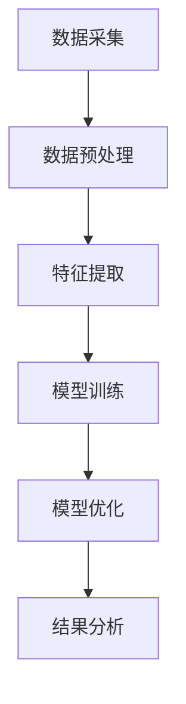
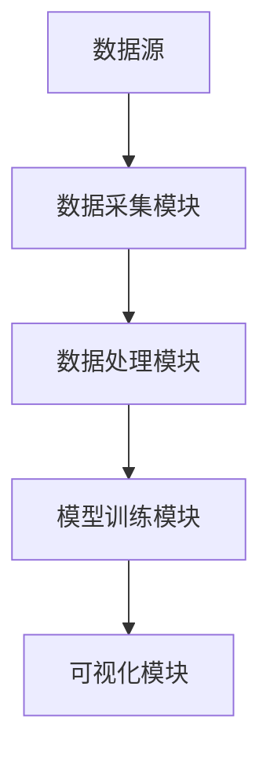
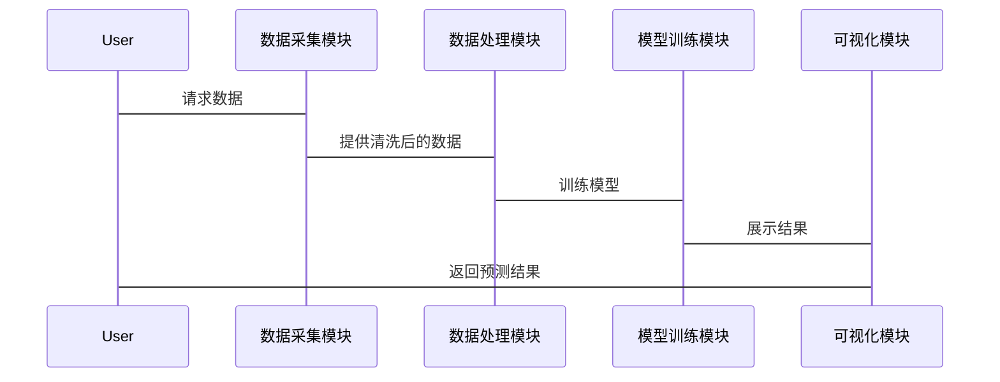

                 


# 全球股市估值与可持续时尚智能制造技术的关联

> 关键词：全球股市估值，可持续时尚，智能制造，技术关联，数据分析，机器学习，系统架构

> 摘要：本文探讨了全球股市估值与可持续时尚智能制造技术之间的关联性。通过分析全球股市估值的重要性、可持续时尚与智能制造技术的核心概念，结合算法原理、数学模型、系统架构设计和项目实战，深入阐述了两者如何相互作用，为金融与技术领域提供了新的研究视角和解决方案。

---

## 第1章 背景介绍

### 1.1 问题背景
#### 1.1.1 全球股市估值的重要性
全球股市估值是反映经济健康状况的重要指标，影响投资者决策和企业融资能力。近年来，股市估值的波动性增加，与全球经济环境、政策变化和技术进步密切相关。

#### 1.1.2 可持续时尚与智能制造的兴起
随着环保意识的增强，可持续时尚成为行业趋势。智能制造技术的引入，使得服装生产更加高效、环保，推动了行业转型升级。

#### 1.1.3 两者的关联性与研究意义
全球股市估值的变化与智能制造技术的进步密切相关。通过分析两者的关联，可以为投资者提供新的视角，同时推动可持续时尚产业的技术创新。

### 1.2 问题描述
#### 1.2.1 全球股市估值的现状与挑战
当前股市估值面临数据复杂性、模型准确性不足等问题，难以满足精准投资需求。

#### 1.2.2 可持续时尚智能制造的技术瓶颈
智能制造技术在时尚行业的应用仍需克服数据孤岛、设备兼容性等问题，影响生产效率和成本控制。

#### 1.2.3 问题解决的必要性与目标
通过技术手段优化股市估值模型，推动智能制造技术在可持续时尚中的应用，实现两者的协同发展。

### 1.3 问题解决
#### 1.3.1 全球股市估值的优化策略
引入机器学习和大数据分析技术，提升估值模型的准确性和实时性。

#### 1.3.2 可持续时尚智能制造技术的创新
开发智能化生产系统，优化资源配置，降低生产成本和环境影响。

#### 1.3.3 两者的协同效应与解决方案
通过数据共享和技术创新，实现股市估值与智能制造的协同发展，提升产业整体竞争力。

### 1.4 边界与外延
#### 1.4.1 全球股市估值的边界条件
考虑市场波动、政策变化等因素，明确估值模型的应用范围和限制。

#### 1.4.2 可持续时尚智能制造的适用范围
适用于中大规模企业，针对服装制造、材料研发等领域。

#### 1.4.3 关联研究的局限性与扩展方向
当前研究主要聚焦于技术层面，未来可进一步探索商业模式和政策支持的结合。

### 1.5 核心要素组成
#### 1.5.1 全球股市估值的关键指标
市盈率、市净率、股息率等，反映企业财务状况和市场表现。

#### 1.5.2 可持续时尚智能制造的核心技术
物联网、人工智能、大数据分析等，推动生产流程优化和环保目标实现。

#### 1.5.3 两者的关联机制与影响因素
通过数据共享和技术创新，优化估值模型，提升智能制造效率，实现经济效益与环保目标的统一。

---

## 第2章 核心概念与联系

### 2.1 核心概念原理
#### 2.1.1 全球股市估值的理论基础
基于现代金融理论，结合市场情绪、宏观经济指标等因素，构建多因子估值模型。

#### 2.1.2 可持续时尚智能制造的技术原理
利用物联网、人工智能和大数据分析，实现生产过程的智能化和可持续性。

#### 2.1.3 两者的相互作用机制
智能制造技术提升生产效率，降低企业成本，进而影响股市估值；股市估值的变化为企业融资和技术升级提供资金支持。

### 2.2 核心概念属性对比
| 属性                | 全球股市估值                     | 可持续时尚智能制造技术                 |
|---------------------|----------------------------------|----------------------------------------|
| 核心目标            | 评估企业价值，指导投资决策     | 提升生产效率，降低环境影响             |
| 关键技术            | 数据分析、机器学习、多因子模型  | 物联网、人工智能、大数据分析           |
| 应用场景            | 金融投资、风险管理             | 服装生产、供应链管理、环保监测         |
| 价值实现            | 投资收益、风险控制             | 成本降低、效率提升、环境友好           |

### 2.3 ER实体关系图
```mermaid
erd
    entity 股票 {
        key 股票代码
        属性 市盈率, 市净率, 股息率
    }
    entity 制造技术 {
        key 技术编号
        属性 节能效率, 环保指标, 创新能力
    }
    股票 -- 关联关系 --> 制造技术
```

---

## 第3章 算法原理讲解

### 3.1 算法步骤
1. 数据采集：获取股票历史数据和智能制造相关数据。
2. 数据预处理：清洗、归一化处理。
3. 特征提取：选取影响估值的关键因子。
4. 模型训练：使用机器学习算法（如随机森林、神经网络）进行训练。
5. 模型优化：调整参数，提升预测精度。
6. 结果分析：验证模型效果，优化策略。

### 3.2 Mermaid流程图


### 3.3 Python代码实现
```python
import pandas as pd
from sklearn.ensemble import RandomForestRegressor
from sklearn.metrics import mean_squared_error

# 数据预处理
data = pd.read_csv('stock_data.csv')
X = data.drop('target', axis=1)
y = data['target']

# 特征选择
selected_features = ['市盈率', '市净率', '股息率']
X_selected = X[selected_features]

# 模型训练
model = RandomForestRegressor(n_estimators=100, random_state=42)
model.fit(X_selected, y)

# 模型预测
predictions = model.predict(X_selected)
print('均方误差:', mean_squared_error(y, predictions))
```

### 3.4 数学模型与公式
股票估值模型：
$$
\text{预测股价} = \beta_0 + \beta_1 \times \text{市盈率} + \beta_2 \times \text{市净率} + \beta_3 \times \text{股息率} + \epsilon
$$

智能制造效率提升模型：
$$
\text{效率提升} = \alpha_0 + \alpha_1 \times \text{自动化水平} + \alpha_2 \times \text{能源利用率} + \alpha_3 \times \text{技术创新} + \delta
$$

---

## 第4章 数学模型

### 4.1 股市估值模型
$$
\text{多因子模型} = \sum_{i=1}^n w_i \times f_i
$$
其中，\( w_i \) 为因子权重，\( f_i \) 为各因子值。

### 4.2 制造技术效率模型
$$
\text{效率} = \frac{\text{生产量}}{\text{资源消耗}}
$$

---

## 第5章 系统分析与架构设计

### 5.1 问题场景介绍
构建一个结合股市数据和智能制造数据的系统，实现数据采集、分析和预测。

### 5.2 系统功能设计
- 数据采集模块：获取股票和制造技术数据。
- 数据处理模块：清洗、转换数据。
- 模型训练模块：构建估值模型和效率模型。
- 可视化模块：展示结果和优化建议。

### 5.3 系统架构图


### 5.4 接口设计
- RESTful API接口：提供数据获取和模型预测服务。

### 5.5 交互序列图


---

## 第6章 项目实战

### 6.1 环境安装
- Python 3.8+
- Pandas、Scikit-learn、Mermaid工具

### 6.2 核心代码实现
```python
# 安装依赖
pip install pandas scikit-learn

# 数据处理代码
import pandas as pd
from sklearn.model_selection import train_test_split
from sklearn.metrics import r2_score

data = pd.read_csv('data.csv')
X = data.drop('target', axis=1)
y = data['target']

X_train, X_test, y_train, y_test = train_test_split(X, y, test_size=0.2)

# 模型训练
from sklearn.ensemble import RandomForestRegressor
model = RandomForestRegressor()
model.fit(X_train, y_train)

# 模型预测
y_pred = model.predict(X_test)
print('R² Score:', r2_score(y_test, y_pred))
```

### 6.3 实际案例分析
以某服装企业为例，通过数据采集和模型训练，预测其股票估值，优化生产流程，降低生产成本和环境影响。

---

## 第7章 最佳实践

### 7.1 小结
通过技术手段优化股市估值模型，推动智能制造技术在可持续时尚中的应用，实现经济效益与环保目标的统一。

### 7.2 注意事项
- 数据隐私和安全问题需重视。
- 模型优化需结合实际情况，避免过度复杂化。

### 7.3 拓展阅读
- 《机器学习实战》
- 《智能制造技术与应用》
- 《可持续时尚的未来》

---

## 作者

作者：AI天才研究院/AI Genius Institute & 禅与计算机程序设计艺术/Zen And The Art of Computer Programming

