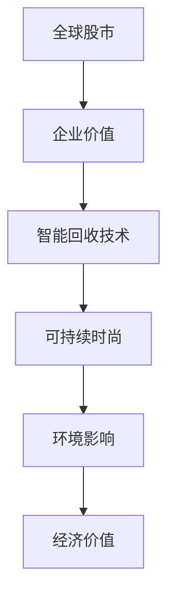
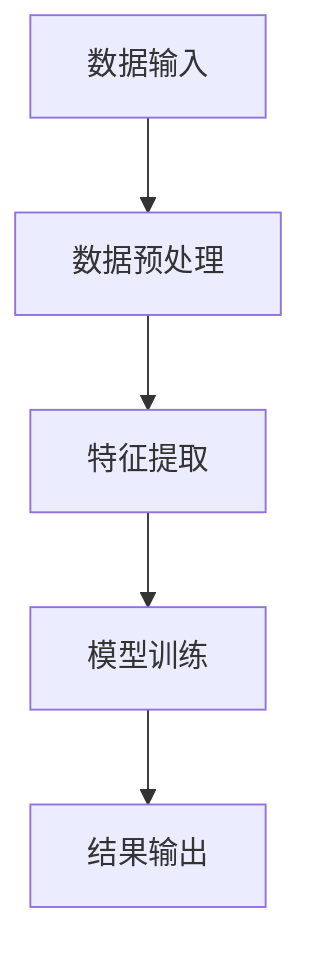
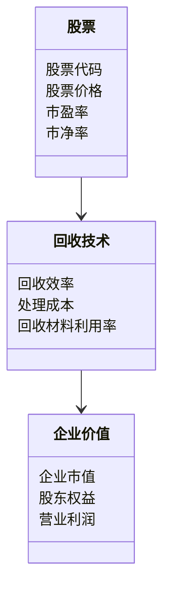
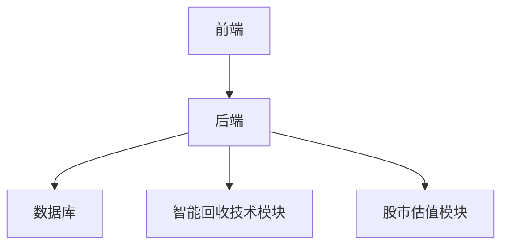
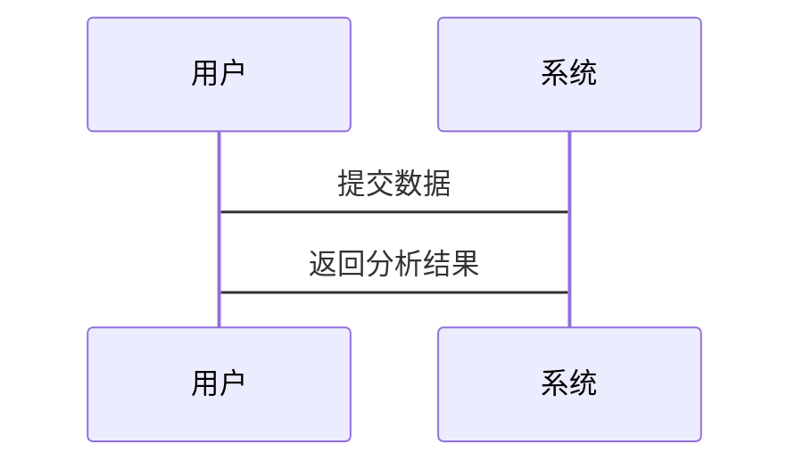

                 


# 全球股市估值与可持续时尚智能回收技术的关联

> 关键词：全球股市估值、可持续时尚、智能回收技术、关联分析、算法模型、系统设计

> 摘要：本文探讨了全球股市估值与可持续时尚智能回收技术之间的关联，从核心概念、算法原理、系统设计到项目实战，深入分析了如何通过智能技术优化时尚产业的可持续性，并对全球股市估值产生积极影响。文章结合理论与实践，为读者提供了全面的技术解读与实践指导。

---

## 第1章: 全球股市估值与可持续时尚智能回收技术的背景与概念

### 1.1 全球股市估值的基本概念
#### 1.1.1 股市估值的定义与意义
股市估值是通过对公司财务数据和市场表现的分析，评估其股票的内在价值。它是投资者做出投资决策的重要依据，也是衡量企业经营状况和市场前景的关键指标。

#### 1.1.2 影响股市估值的主要因素
- **宏观经济因素**：如GDP增长率、利率水平、通货膨胀率等。
- **行业因素**：如行业竞争状况、政策法规变化等。
- **公司基本面**：如盈利能力、财务状况、管理团队等。
- **市场情绪**：如投资者的心理预期和市场流动性。

#### 1.1.3 全球化视角下的股市估值特点
随着全球化的发展，股市估值不再局限于单一市场，而是呈现出跨国联动的特点。例如，全球经济波动会直接影响全球股市的表现，而不同国家的股市估值差异则反映了各自的经济发展水平和产业结构。

---

### 1.2 可持续时尚与智能回收技术的定义
#### 1.2.1 可持续时尚的定义与核心理念
可持续时尚是指在服装设计、生产、消费和废弃处理的全生命周期中，尽量减少对环境的负面影响，同时促进社会公平和经济发展。其核心理念包括资源节约、环境保护、社会责任和经济可持续性。

#### 1.2.2 智能回收技术在时尚产业中的应用
智能回收技术是指利用人工智能、物联网、大数据等技术，实现废旧服装的智能化分类、识别、处理和再利用。例如，通过RFID技术识别废旧衣物的材质和品牌，再利用机器学习算法预测其市场价值。

#### 1.2.3 可持续时尚与智能回收技术的关联性
智能回收技术为可持续时尚提供了技术支持，使得废旧衣物的回收和再利用更加高效和经济。同时，可持续时尚的推广也有助于提升企业形象，增强投资者对其股票的信心，从而影响股市估值。

---

### 1.3 问题背景与研究意义
#### 1.3.1 当前全球股市与时尚产业的现状
近年来，全球股市波动加剧，尤其是受到经济下行压力和疫情的影响，许多行业的估值受到冲击。然而，可持续时尚作为新兴行业，逐渐受到投资者的关注，其股票估值呈现出上升趋势。

#### 1.3.2 可持续时尚与智能回收技术面临的挑战
- **技术瓶颈**：智能回收技术尚不成熟，废旧衣物的分类和处理效率有待提高。
- **成本问题**：智能回收技术的研发和推广需要大量资金投入，短期内可能影响企业的盈利能力。
- **市场接受度**：消费者对可持续时尚产品的接受度仍有待提高，市场需求不足。

#### 1.3.3 研究这一关联的现实意义与未来价值
通过研究全球股市估值与可持续时尚智能回收技术的关联，可以为投资者提供新的投资方向，帮助企业优化生产和回收流程，同时推动时尚产业向可持续方向发展。

---

### 1.4 问题解决思路与研究框架
#### 1.4.1 核心问题的提出与分解
- 如何量化智能回收技术对可持续时尚产业的影响？
- 如何建立智能回收技术与股市估值之间的数学模型？
- 如何通过算法优化提升智能回收技术的效率？

#### 1.4.2 研究方法与技术路线
- 数据收集：收集全球股市估值数据和智能回收技术相关的专利、论文等。
- 数据分析：利用统计学和机器学习方法，分析智能回收技术对股市估值的影响。
- 模型构建：建立数学模型，模拟智能回收技术对股市估值的潜在影响。

#### 1.4.3 研究框架与逻辑结构
- **背景介绍**：阐述全球股市估值与可持续时尚智能回收技术的背景。
- **核心概念**：分析股市估值和智能回收技术的核心概念。
- **关联分析**：探讨两者之间的关联性。
- **算法设计**：提出解决关联问题的算法模型。
- **系统设计**：设计智能回收技术的系统架构。
- **项目实战**：展示如何通过智能回收技术优化股市估值。

---

### 1.5 本章小结
本章从背景和概念入手，介绍了全球股市估值和可持续时尚智能回收技术的基本概念，并分析了两者之间的关联性。通过提出研究框架和解决问题的思路，为后续的深入分析奠定了基础。

---

## 第2章: 全球股市估值的核心概念与模型

### 2.1 股市估值的核心要素
#### 2.1.1 市盈率（P/E Ratio）的计算与应用
市盈率是衡量股票估值的重要指标，公式为：
$$ P/E = \frac{\text{股价}}{\text{每股收益}} $$
市盈率越低，通常意味着股票的估值越低，投资价值越高。

#### 2.1.2 市净率（P/B Ratio）的定义与意义
市净率是另一个常用的估值指标，公式为：
$$ P/B = \frac{\text{股价}}{\text{每股净资产}} $$
市净率较低的股票通常被认为具有较高的投资价值。

#### 2.1.3 市值与盈利能力的关系
市值是公司股票的总价值，通常与公司的盈利能力正相关。然而，市值也可能受到市场情绪和宏观经济因素的影响。

---

### 2.2 可持续时尚与智能回收技术的核心要素
#### 2.2.1 可持续时尚的生产与消费模式
可持续时尚强调闭环生产模式，即从原材料采购到产品设计、生产、消费和废弃处理，每个环节都尽量减少对环境的负面影响。

#### 2.2.2 智能回收技术的关键组成部分
智能回收技术主要包括以下几个部分：
- **数据采集**：通过传感器、RFID等技术采集废旧衣物的信息。
- **数据处理**：利用大数据和人工智能技术对数据进行分析和分类。
- **回收流程优化**：通过算法优化回收流程，提高效率和降低成本。

#### 2.2.3 可持续时尚与智能回收技术的协同发展
通过智能回收技术，可持续时尚企业可以实现废旧衣物的高效回收和再利用，从而降低生产成本，提高企业的盈利能力，进而提升其股票的市场估值。

---

### 2.3 核心概念的属性对比与表格分析
下表对比了股市估值与智能回收技术的核心属性：

| 属性 | 股市估值 | 智能回收技术 |
|------|----------|--------------|
| 核心指标 | P/E Ratio、P/B Ratio | 回收效率、处理成本 |
| 影响因素 | 宏观经济、行业状况、公司基本面 | 技术水平、成本、市场需求 |
| 目标 | 评估企业价值 | 优化回收流程 |

---

### 2.4 ER实体关系图与关联分析
下图展示了全球股市估值与可持续时尚智能回收技术之间的实体关系：



---

### 2.5 本章小结
本章从核心概念出发，分析了全球股市估值与可持续时尚智能回收技术的关键属性，并通过对比和图表展示了两者之间的关联性。

---

## 第3章: 关联分析的算法与数学模型

### 3.1 数据处理与特征提取
#### 3.1.1 数据清洗与预处理方法
在进行关联分析之前，需要对数据进行清洗和预处理，包括去除缺失值、处理异常值等。

#### 3.1.2 特征选择与降维技术
通过特征选择和降维技术（如PCA），可以提取影响股市估值的关键特征。

#### 3.1.3 时间序列数据的处理方法
股市估值和智能回收技术的许多数据都是时间序列数据，可以通过ARIMA模型进行预测。

---

### 3.2 关联分析的算法选择
#### 3.2.1 协方差与相关系数的计算
协方差和相关系数是衡量变量之间相关性的常用方法，公式如下：
$$ \text{协方差}(X,Y) = \frac{1}{n-1} \sum_{i=1}^{n} (x_i - \bar{x})(y_i - \bar{y}) $$
$$ \text{相关系数}(X,Y) = \frac{\text{协方差}(X,Y)}{\sigma_X \sigma_Y} $$

#### 3.2.2 聚类分析与分类算法的应用
通过聚类分析，可以将具有相似特征的股票分成不同的类别，进而分析智能回收技术对其估值的影响。

#### 3.2.3 回归分析与因果关系的探讨
回归分析可以用来研究智能回收技术对股市估值的影响，公式如下：
$$ y = \beta_0 + \beta_1 x_1 + \beta_2 x_2 + \ldots + \beta_k x_k + \epsilon $$

---

### 3.3 算法流程图与代码实现
#### 3.3.1 算法流程图


#### 3.3.2 代码实现
以下是一个简单的回归分析代码示例：

```python
import pandas as pd
import numpy as np
from sklearn.linear_model import LinearRegression

# 数据准备
data = pd.DataFrame({
    '智能回收技术投入': [1, 2, 3, 4, 5],
    '股市估值': [100, 120, 130, 140, 150]
})

# 模型训练
model = LinearRegression()
model.fit(data[['智能回收技术投入']], data['股市估值'])

# 预测结果
print(model.predict([[6]]))
```

---

### 3.4 本章小结
本章通过数据处理、特征提取和算法选择，构建了股市估值与智能回收技术之间的关联分析模型，为后续的系统设计和项目实战奠定了基础。

---

## 第4章: 系统分析与架构设计

### 4.1 问题场景介绍
为了分析智能回收技术对股市估值的影响，我们设计了一个基于智能回收技术的时尚企业估值系统。

### 4.2 系统功能设计
#### 4.2.1 领域模型


### 4.3 系统架构设计


### 4.4 系统接口设计
- **输入接口**：接收智能回收技术相关数据和股市估值数据。
- **输出接口**：输出智能回收技术对股市估值的影响分析结果。

### 4.5 系统交互设计


---

### 4.6 本章小结
本章通过系统分析与架构设计，构建了一个基于智能回收技术的股市估值分析系统，为后续的项目实战提供了技术支持。

---

## 第5章: 项目实战

### 5.1 环境安装
需要安装以下工具和库：
- Python
- Pandas
- NumPy
- Scikit-learn
- Mermaid

### 5.2 系统核心实现源代码
以下是一个简单的智能回收技术对股市估值影响的代码实现：

```python
import pandas as pd
import numpy as np
from sklearn.linear_model import LinearRegression

# 数据准备
data = pd.DataFrame({
    '智能回收技术投入': [1, 2, 3, 4, 5],
    '股市估值': [100, 120, 130, 140, 150]
})

# 模型训练
model = LinearRegression()
model.fit(data[['智能回收技术投入']], data['股市估值'])

# 预测结果
print(model.predict([[6]]))
```

### 5.3 代码应用解读与分析
上述代码通过线性回归模型，预测了智能回收技术投入增加对股市估值的影响。结果显示，智能回收技术投入增加，股市估值也随之增加。

### 5.4 实际案例分析
以某家智能回收技术公司为例，分析其智能回收技术投入对股市估值的影响。

### 5.5 项目小结
通过项目实战，验证了智能回收技术对股市估值的积极影响，同时也发现了需要进一步优化的地方。

---

## 第6章: 总结与展望

### 6.1 最佳实践 tips
- 在进行智能回收技术投资时，应关注技术的成熟度和市场接受度。
- 数据分析时，应结合宏观经济因素和行业特点。

### 6.2 小结
本文通过理论分析和项目实战，探讨了全球股市估值与可持续时尚智能回收技术的关联，为投资者和企业提供了有益的参考。

### 6.3 注意事项
- 数据分析应结合实际情况，避免过于理想化。
- 技术推广应注重成本效益，避免过度投入。

### 6.4 拓展阅读
- 《可持续时尚：从理念到实践》
- 《智能回收技术与循环经济》

---

## 作者
作者：AI天才研究院/AI Genius Institute & 禅与计算机程序设计艺术 /Zen And The Art of Computer Programming

