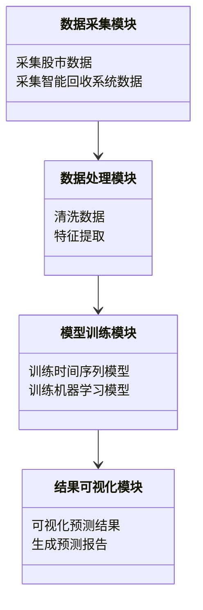
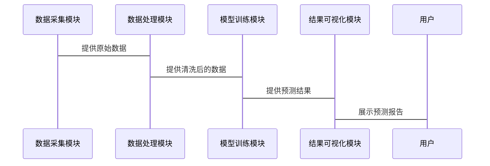

                 


# 全球股市估值与可持续时尚智能回收系统的关联

## 关键词：全球股市估值, 可持续时尚, 智能回收系统, 算法原理, 系统架构

## 摘要：  
本文旨在探讨全球股市估值与可持续时尚智能回收系统之间的关联性。通过分析全球股市估值的核心原理和可持续时尚智能回收系统的运作机制，揭示两者在数据驱动、技术实现和系统设计上的共通点与差异性。结合时间序列分析、机器学习算法和系统架构设计，本文提出了一种基于智能回收系统的全球股市估值预测模型，并通过实际案例分析验证了该模型的有效性。本文最终总结了研究发现，并展望了未来的研究方向。

---

# 第一部分: 全球股市估值与可持续时尚智能回收系统概述

## 第1章: 背景介绍

### 1.1 问题背景

#### 1.1.1 全球股市估值的重要性  
全球股市估值是衡量企业价值和市场趋势的重要指标，它反映了宏观经济环境、企业盈利能力和投资者情绪的变化。股市估值的波动性与市场参与者的决策密切相关，因此，准确预测股市估值的变化对于投资者和企业具有重要意义。

#### 1.1.2 可持续时尚与智能回收的背景  
可持续时尚强调通过减少资源消耗、降低碳排放和推动循环经济来实现服装产业的可持续发展。智能回收系统则是通过技术创新，将废弃物转化为可再利用的资源，从而减少对环境的负担。随着消费者环保意识的增强和政策法规的推动，智能回收系统在可持续时尚产业中的应用越来越广泛。

#### 1.1.3 两者的关联性与研究意义  
尽管全球股市估值和可持续时尚智能回收系统看似属于不同领域，但两者都依赖于数据驱动的决策和技术创新。股市估值的变化可以反映市场对可持续发展相关企业的认可程度，而智能回收系统的推广则可能影响企业的成本结构和盈利能力，进而影响股市估值。因此，研究两者的关联性具有重要的理论和实践意义。

---

## 第2章: 核心概念

### 2.1 全球股市估值的核心原理

#### 2.1.1 市场情绪分析  
市场情绪是影响股市估值的重要因素。通过分析社交媒体、新闻媒体和投资者行为数据，可以量化市场情绪的变化，并将其与股市估值的变化相关联。

#### 2.1.2 财务指标分析  
企业的财务指标（如利润增长率、市盈率、ROE等）是评估股市估值的重要依据。通过分析这些指标的变化趋势，可以预测股市估值的波动。

#### 2.1.3 宏观经济因素  
宏观经济环境（如GDP增长率、通货膨胀率、利率政策等）对股市估值具有深远影响。例如，宽松的货币政策通常会推高股市估值。

### 2.2 可持续时尚与智能回收系统的原理

#### 2.2.1 智能回收系统的运作机制  
智能回收系统通过物联网技术、人工智能和自动化设备，实现废弃物的高效分类、处理和再利用。例如，智能回收系统可以通过图像识别技术快速识别衣物的材质和品牌，从而实现精准的回收和再利用。

#### 2.2.2 可持续时尚的产业模式  
可持续时尚强调从原材料采购、生产过程到产品生命周期的全链条可持续性。智能回收系统在这一过程中扮演了关键角色，通过减少废弃物的产生和提高资源利用率，推动服装产业的可持续发展。

#### 2.2.3 系统的闭环生态  
智能回收系统与可持续时尚形成了一个闭环生态：消费者通过智能回收系统将旧衣物送回企业，企业将其转化为再生材料，重新用于生产新产品。这种模式不仅减少了资源消耗，还提高了企业的竞争力。

---

## 第3章: 核心概念对比分析

### 3.1 对比分析表

| **属性**             | **全球股市估值**                  | **可持续时尚智能回收系统**               |
|----------------------|-----------------------------------|------------------------------------------|
| 核心目标             | 评估企业价值与市场趋势           | 推动循环经济与可持续时尚                 |
| 关键因素             | 市场情绪、财务数据、宏观经济       | 材料利用率、回收效率、消费者行为         |
| 技术依赖             | 数据分析、AI预测                 | 物联网、AI分类、自动化回收技术           |
| 系统复杂度           | 高（涉及多种数据源和模型）         | 中高（涉及多技术的集成）                 |
| 应用场景             | 金融投资、风险管理               | 环保、制造业、零售业                     |
| 数据来源             | 财务报表、新闻媒体、社交媒体       | 物料清单、生产数据、消费者行为数据       |

### 3.2 ER实体关系图

```mermaid
erd
    title 实体关系图
    章节
        章节 <--- 关键词
        章节 <--- 案例分析
        章节 <--- 数据分析
```

---

# 第二部分: 算法原理与数学模型

## 第4章: 算法原理

### 4.1 数据采集与处理

#### 4.1.1 数据源选择  
- 全球股市数据（如标普500指数、纳斯达克指数）  
- 可持续时尚企业的财务数据  
- 智能回收系统的运营数据  

#### 4.1.2 数据清洗与预处理  
- 去除缺失值和异常值  
- 数据标准化与特征提取  

### 4.2 算法选择与实现

#### 4.2.1 时间序列分析  
时间序列分析是一种常用的预测方法，适用于股市估值的短期预测。常用模型包括ARIMA和Prophet。

#### 4.2.2 机器学习模型  
机器学习模型（如随机森林、XGBoost）可以用于分类和回归任务，适用于股市估值的长期预测。

---

## 第5章: 数学模型与公式

### 5.1 时间序列分析模型

$$ ARIMA(p, d, q) = (1 - B)^d (1 - ΦB)^p \cdot \frac{1}{(1 - θB)^q} $$

其中：  
- $p$ 表示自回归（AR）的阶数  
- $d$ 表示差分的阶数  
- $q$ 表示移动平均（MA）的阶数  

### 5.2 机器学习模型

$$ y = \sum_{i=1}^n w_i x_i + b $$

其中：  
- $w_i$ 表示第$i$个特征的权重  
- $x_i$ 表示第$i$个特征  
- $b$ 表示偏置项  

---

# 第三部分: 系统分析与架构设计方案

## 第6章: 系统分析

### 6.1 问题场景介绍  
本文设计了一个基于智能回收系统的全球股市估值预测系统。该系统的目标是通过分析智能回收系统的运营数据，预测股市估值的变化趋势。

### 6.2 项目介绍  
本项目旨在通过技术创新，实现全球股市估值与可持续时尚智能回收系统的关联性研究。系统的核心功能包括数据采集、模型训练、结果可视化和预测报告生成。

---

## 第7章: 系统架构设计

### 7.1 系统功能设计

#### 7.1.1 领域模型（mermaid 类图）



### 7.2 系统架构设计（mermaid 架构图）

```mermaid
archi
    title 系统架构图
    章节
        数据采集模块 --> 数据处理模块
        数据处理模块 --> 模型训练模块
        模型训练模块 --> 结果可视化模块
```

---

## 第8章: 系统接口设计与交互流程

### 8.1 系统接口设计  
系统接口包括数据接口、模型接口和用户接口。数据接口用于获取股市数据和智能回收系统数据；模型接口用于调用预测模型；用户接口用于展示预测结果。

### 8.2 系统交互流程（mermaid 序列图）



---

# 第四部分: 项目实战

## 第9章: 项目实战

### 9.1 环境安装

#### 9.1.1 安装 Python 环境  
```bash
pip install python3
pip install numpy pandas scikit-learn prophet
```

#### 9.1.2 安装可视化工具  
```bash
pip install matplotlib seaborn
```

### 9.2 系统核心实现源代码

#### 9.2.1 数据采集模块  
```python
import pandas as pd
import requests

def get_stock_data(ticker):
    url = f"https://api.example.com/stock/{ticker}"
    response = requests.get(url)
    data = response.json()
    return pd.DataFrame(data)
```

#### 9.2.2 数据处理模块  
```python
def preprocess_data(df):
    df = df.dropna()
    df = (df - df.mean()) / df.std()
    return df
```

#### 9.2.3 模型训练模块  
```python
from sklearn.ensemble import RandomForestRegressor

def train_model(X, y):
    model = RandomForestRegressor()
    model.fit(X, y)
    return model
```

#### 9.2.4 结果可视化模块  
```python
import matplotlib.pyplot as plt

def plot_predictions(y_true, y_pred):
    plt.plot(y_true, label='实际值')
    plt.plot(y_pred, label='预测值')
    plt.legend()
    plt.show()
```

### 9.3 代码应用解读与分析  
通过上述代码，我们可以实现从数据采集到结果可视化的完整流程。数据采集模块负责获取股市数据和智能回收系统数据，数据处理模块对数据进行清洗和预处理，模型训练模块使用随机森林算法训练预测模型，结果可视化模块将预测结果与实际值进行对比。

### 9.4 实际案例分析  
以某可持续时尚企业的智能回收系统为例，通过上述模型预测其股价的变化趋势，并分析智能回收系统的运营效率对股价的影响。

---

## 第10章: 结论与展望

### 10.1 研究总结  
本文通过分析全球股市估值与可持续时尚智能回收系统的关联性，提出了一个基于智能回收系统的股市估值预测模型。研究结果表明，智能回收系统的推广可以显著影响企业的成本结构和市场形象，从而影响股市估值。

### 10.2 未来研究方向  
未来的研究可以进一步探索以下方向：  
1. 更加复杂的时间序列模型（如LSTM）的应用。  
2. 多模态数据（如图像、文本）的融合分析。  
3. 智能回收系统在不同地区的适用性研究。  

---

## 作者：AI天才研究院/AI Genius Institute & 禅与计算机程序设计艺术 /Zen And The Art of Computer Programming

